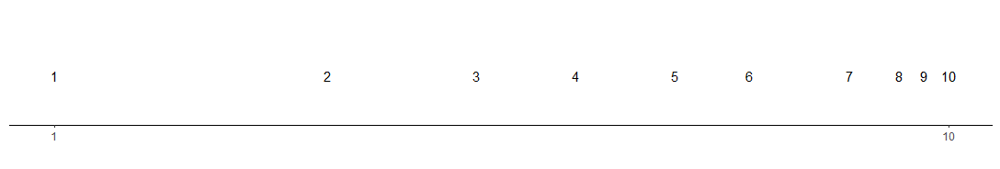

```{r, child = "style.Rmd"}
```


```{r setup, echo = FALSE, message = FALSE, warning = FALSE}

# Packages
library(emo)
library(purrr)
library(tidyverse)
library(gridExtra)
library(nullabor)
library(scales)
library(knitr)
library(kableExtra)
library(RefManageR)
library(iconr)
library(fontawesome)
# download_fontawesome()

# References
bib <- ReadBib("bib/thesis.bib", check = FALSE)
ui <- "- "

# R markdown options
knitr::opts_chunk$set(echo = FALSE, 
                      message = FALSE, 
                      warning = FALSE, 
                      cache = FALSE,
                      dpi = 300)
options(htmltools.dir.version = FALSE)
options(knitr.kable.NA = '')
```

```{r, include = F, eval = T, cache = F}
clean_file_name <- function(x) {
  basename(x) %>% str_remove("\\..*?$") %>% str_remove_all("[^[A-z0-9_]]")
}
img_modal <- function(src, alt = "", id = clean_file_name(src), other = "") {
  
  other_arg <- paste0("'", as.character(other), "'") %>%
    paste(names(other), ., sep = "=") %>%
    paste(collapse = " ")
  
  js <- glue::glue("<script>
        /* Get the modal*/
          var modal{id} = document.getElementById('modal{id}');
        /* Get the image and insert it inside the modal - use its 'alt' text as a caption*/
          var img{id} = document.getElementById('img{id}');
          var modalImg{id} = document.getElementById('imgmodal{id}');
          var captionText{id} = document.getElementById('caption{id}');
          img{id}.onclick = function(){{
            modal{id}.style.display = 'block';
            modalImg{id}.src = this.src;
            captionText{id}.innerHTML = this.alt;
          }}
          /* When the user clicks on the modalImg, close it*/
          modalImg{id}.onclick = function() {{
            modal{id}.style.display = 'none';
          }}
</script>")
  
  html <- glue::glue(
     " <!-- Trigger the Modal -->

<!-- The Modal -->
<div id='modal{id}' class='modal'>
  <!-- Modal Content (The Image) -->
  
  <!-- Modal Caption (Image Text) -->
  <div id='caption{id}' class='modal-caption'></div>
</div>
"
  )
  write(js, file = "js-addins.html", append = T)
  return(html)
}
# Clean the file out at the start of the compilation
write("", file = "js-addins.html")
```

# Motivation

Data visualizations played an important role in during the **COVID-19 pandemic** `r Citep(bib[[c("rost_2020", "romano_scale_2020", "bavel_using_2020")]])`.

.left-col[
Dashboards displayed:
+ case counts. 
+ transmission rates.
+ outbreak regions.

].right-col[
```{r results='asis', echo = F, include = T, cache = F, eval = TRUE}
i1 <- img_modal(src = "images/91divoc-cases-july2021.png", alt = Citep(bib[[c("fagen-ulmschneider_2020")]]), other=list(width="100%"))

c(str_split(i1, "\\n", simplify = T)[1:2],
  str_split(i1, "\\n", simplify = T)[3:9]
  ) %>% paste(collapse = "\n") %>% cat()
``` 
]
???

Data visualizations played an important role in during the COVID-19 pandemic in displaying case counts, transmission rates, and outbreak regions.

+ Mass media routinely showed charts to share information with the public about the progression of the pandemic.
+ Graphics helped guide decision makers to implement policies such as shut-downs or mandated mask wearing.
+ Facilitated communication with the public to increase compliance.  

One of the many dashboards was called 91-DIVOC (COVID-19 backwards!). Gives the viewer choices of what to show: case count, mortality, hospitalizations, standardized to population, geographic regions, scales (log/linear).

Other dashboards showed outbreak regions in the form of maps. 

---
class:primary
# Logarithmic Scales

.center[
```{r results='asis', echo = F, include = T, cache = F, eval = TRUE}
i1 <- img_modal(src = "images/log-scale-example.jpg", alt = " ", other=list(width="60%"))

c(str_split(i1, "\\n", simplify = T)[1:2],
  str_split(i1, "\\n", simplify = T)[3:9]
  ) %>% paste(collapse = "\n") %>% cat()
```
]

Our perception is **logarithmic at first**, but transitions to a **linear scale later** in development `r Citep(bib[[c("dehaene2008log", "siegler_numerical_2017", "varshney_why_2013")]])`.

.center[

]

???

+ **Problem:** Data which sapns several orders of magnitude shown on its original scale compresses the smaller magnitudes into relatively little area.
+ **Solution:** Use of a log scale transformation; alters the contextual appearance of the data.

The usefulness of the log scale in science is illustrated here showing the challenge of displaying the fuel energy density of Uranium along side other sources of fuel due to differences in magnitude of density.

# Logarithmic Perception & Mapping

**Weber’s law** states we do not notice absolute changes in stimuli,
but instead that we notice the relative change `r Citep(bib[[c("fechner1860elemente")]])`. 

**Weber-Fechner law** states the relationship between the perceived intensity is logarithmic to the stimulus intensity when observed above a minimal threshold of perception `r Citep(bib[[c("fechner1860elemente")]])`.

Our perception is **logarithmic at first**, but transitions to a **linear scale later** in development `r Citep(bib[[c("dehaene2008log", "siegler_numerical_2017", "varshney_why_2013")]])`.

Kindergartener number line

**Assumption:** If we perceive logarithmically by default, it is a natural way to display information and should be easy to read and understand/use.


Ernst Weber, an early psychophysics researcher discovered the relationship between the difference threshold (smallest detectable difference between two sensory stimuli) and the magnitude of a stimulus. States we do not notice absolute changes in stimuli, but instead that we notice the relative change.

Gustav Fechner, a founder of psychophysics, provided further extension to Weber’s law by discovering the relationship between the perceived intensity is logarithmic to the stimulus intensity when observed above a minimal threshold of perception.

When we first learn to count, we begin counting by ones, then by tens, and advancing to hundreds, following the base10 order of magnitude system.

Our perception and mapping of numbers to a number line is **logarithmic at first**, but transitions to a **linear scale later** in development, with formal mathematics education.
+ For example: A kindergartner asked to place numbers one through ten along a number line would place three close to the middle, following the logarithmic perspective.

Assuming there is a direct relationship between perceptual and cognitive processes, it is reasonable to assume numerical representations should also be displayed on a nonlinear, compressed number scale. Therefore, if we perceive
logarithmically by default, it is a natural (and presumably low effort) way to display information and should be easy to read and understand/use.

---
class:primary
# Benefits and Pitfalls of Log Scales

.pull-left[

**Benefits** were seen in spring 2020, during the early stages of the COVID-19 pandemic.
.center[
```{r results='asis', echo = F, include = T, cache = F, eval = TRUE}
i1 <- img_modal(src = "images/covid19-FT-03.23.2020-log.png", alt = Citep(bib[[c("burnmurdoch_2020")]]), other=list(width="100%"))

c(str_split(i1, "\\n", simplify = T)[1:2],
  str_split(i1, "\\n", simplify = T)[3:9]
  ) %>% paste(collapse = "\n") %>% cat()
```
]

].pull-right[

**Pitfalls** were exposed as the pandemic evolved, and the case counts were no longer spreading exponentially.

.center[
```{r results='asis', echo = F, include = T, cache = F, eval = TRUE}
i1 <- img_modal(src = "images/covid19-FT-linear.png", alt = Citep(bib[[c("burnmurdoch_2020")]]), other=list(width="80%"))

c(str_split(i1, "\\n", simplify = T)[1:2],
  str_split(i1, "\\n", simplify = T)[3:9]
  ) %>% paste(collapse = "\n") %>% cat()
```

```{r results='asis', echo = F, include = T, cache = F, eval = TRUE}
i1 <- img_modal(src = "images/covid19-FT-log.png", alt = Citep(bib[[c("burnmurdoch_2020")]]), other=list(width="80%"))

c(str_split(i1, "\\n", simplify = T)[1:2],
  str_split(i1, "\\n", simplify = T)[3:9]
  ) %>% paste(collapse = "\n") %>% cat()
```
]
]

???

**Benefits** were seen in spring 2020, during the early stages of the COVID-19 pandemic.

+ Large magnitude discrepancies in case counts at a given time point between different geographic regions.
+ Log scale transformations were usefulness for showing case count curves for areas with few cases and areas with many cases within one chart. 

**Pitfalls** were exposed as the pandemic evolved, and the case counts were no longer spreading exponentially.

+ Graphs with linear scales seemed more effective at spotting early increases in case counts that signaled more localized outbreaks.
+ The effect of the linear scale appears to evoke a stronger reaction from the public than the log scale.

??? 

# Testing Graphics

Evaluate design choices through the use of graphical tests. 

Could ask participants to:

- identify differences in graphs.
- read information off of a chart accurately.
- use data to make correct real-world decisions.
- predict the next few observations.

All of these types of tests require different levels of use and manipulation of the information presented in the chart.

---
class:primary
# Research Objectives

**Big Idea:** Are there benefits to displaying exponentially increasing data on a log scale rather than a linear scale?

1. [Perception of Exponential Growth](https://shiny.srvanderplas.com/log-study/) `r emo::ji("chart increasing")` `r emo::ji("chart increasing")` `r emo::ji("chart increasing")`
2. [Prediction of Exponential Trends](https://shiny.srvanderplas.com/you-draw-it/) `r emo::ji("pencil2")`
3. Estimation by Numerical Translation `r emo::ji("straight_ruler")`

.pull-left[
.center[
```{r results='asis', echo = F, include = T, cache = F, eval = TRUE}
i1 <- img_modal(src = "images/linear-lineup-example.png", alt = " ", other=list(width="80%"))

c(str_split(i1, "\\n", simplify = T)[1:2],
  str_split(i1, "\\n", simplify = T)[3:9]
  ) %>% paste(collapse = "\n") %>% cat()
```
]
].pull-right[
.center[
```{r results='asis', echo = F, include = T, cache = F, eval = TRUE}
i1 <- img_modal(src = "images/exponential_example.gif", alt = " ", other=list(width="80%"))

c(str_split(i1, "\\n", simplify = T)[1:2],
  str_split(i1, "\\n", simplify = T)[3:9]
  ) %>% paste(collapse = "\n") %>% cat()
```
<!--  -->
]
]

???

*View slides from recorded presentation at ...*

**Big Idea:** Are there benefits to displaying exponentially increasing data on a log scale rather than a linear scale?

.pull-left[
1. [Perception of Exponential Growth](https://shiny.srvanderplas.com/log-study/) `r emo::ji("chart increasing")` `r emo::ji("chart increasing")` `r emo::ji("chart increasing")`
  + Utilizes statistical lineups to test an individuals ability to perceptually differentiate exponentially increasing data with differing rates of change on both the linear and log scale.
2. [Prediction of Exponential Trends](https://shiny.srvanderplas.com/you-draw-it/) `r emo::ji("pencil2")`
  + Tests an individuals ability to make predictions for exponentially increasing data with 'You Draw It'
3. Estimation by Numerical Translation `r emo::ji("straight_ruler")`
  + Tests an individuals ability to translate a graph of exponentially increasing data into real value quantities.
