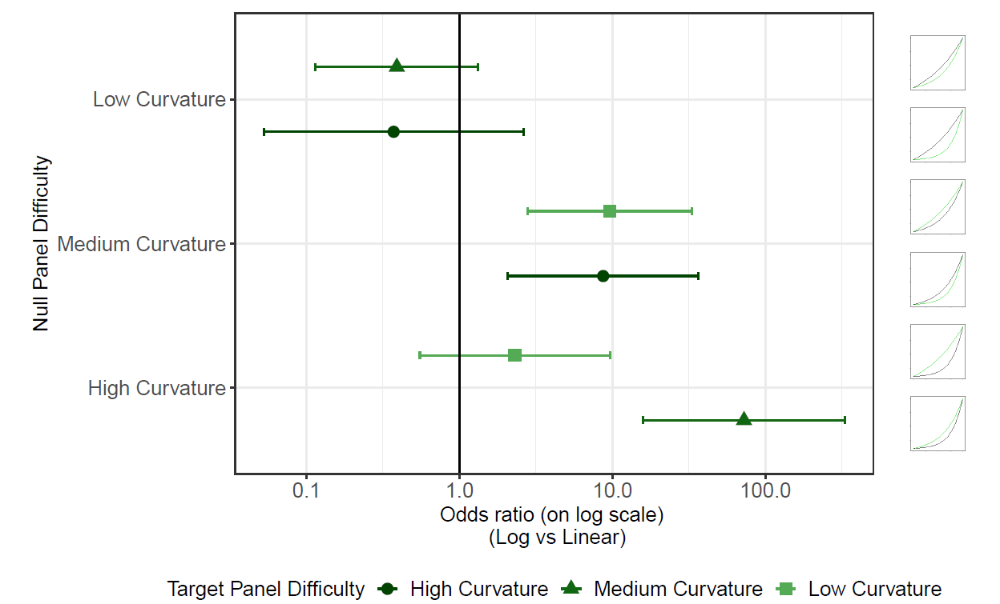
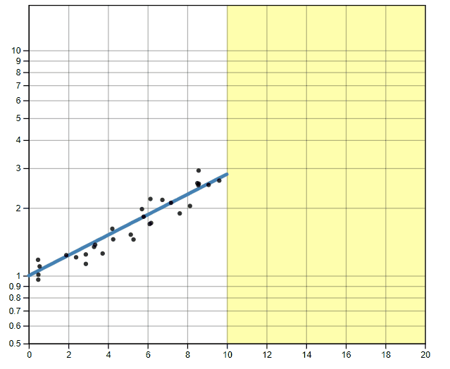

```{r, child = "style.Rmd"}
```


```{r setup, echo = FALSE, message = FALSE, warning = FALSE}

# Packages
library(emo)
library(purrr)
library(tidyverse)
library(gridExtra)
library(nullabor)
library(scales)
library(knitr)
library(kableExtra)
library(RefManageR)
library(iconr)
library(fontawesome)
# download_fontawesome()

# References
bib <- ReadBib("bib/thesis.bib", check = FALSE)
ui <- "- "

# R markdown options
knitr::opts_chunk$set(echo = FALSE, 
                      message = FALSE, 
                      warning = FALSE, 
                      cache = FALSE,
                      dpi = 300)
options(htmltools.dir.version = FALSE)
options(knitr.kable.NA = '')
```

```{r, include = F, eval = T, cache = F}
clean_file_name <- function(x) {
  basename(x) %>% str_remove("\\..*?$") %>% str_remove_all("[^[A-z0-9_]]")
}
img_modal <- function(src, alt = "", id = clean_file_name(src), other = "") {
  
  other_arg <- paste0("'", as.character(other), "'") %>%
    paste(names(other), ., sep = "=") %>%
    paste(collapse = " ")
  
  js <- glue::glue("<script>
        /* Get the modal*/
          var modal{id} = document.getElementById('modal{id}');
        /* Get the image and insert it inside the modal - use its 'alt' text as a caption*/
          var img{id} = document.getElementById('img{id}');
          var modalImg{id} = document.getElementById('imgmodal{id}');
          var captionText{id} = document.getElementById('caption{id}');
          img{id}.onclick = function(){{
            modal{id}.style.display = 'block';
            modalImg{id}.src = this.src;
            captionText{id}.innerHTML = this.alt;
          }}
          /* When the user clicks on the modalImg, close it*/
          modalImg{id}.onclick = function() {{
            modal{id}.style.display = 'none';
          }}
</script>")
  
  html <- glue::glue(
     " <!-- Trigger the Modal -->

<!-- The Modal -->
<div id='modal{id}' class='modal'>
  <!-- Modal Content (The Image) -->
  
  <!-- Modal Caption (Image Text) -->
  <div id='caption{id}' class='modal-caption'></div>
</div>
"
  )
  write(js, file = "js-addins.html", append = T)
  return(html)
}
# Clean the file out at the start of the compilation
write("", file = "js-addins.html")
```

# Outline

1. Introduction to Logarithmic Scales
2. Research Objectives
3. Perception of Exponential Growth
4. Prediction of Exponential Trends
5. Future Work

???

Thank you, everyone for coming! Today, I will be presenting my research on the human perception of exponentially increasing data displayed on a log scale evaluated through experimental graphics tasks as part of my Ph.D. prelims. This work has been conducted under the supervision of Dr. Susan VanderPlas and Dr. Reka Howard. 

First, I will provide some background on graphics and logarithmic scales and give an overview of my research objectives. This presentation will mainly focus on the second graphical task study, Prediction with you draw it and then I will share future work to be done.

---
class:inverse
<br>
<br>
<br>
<br>
<br>
<br>
<br>
<br>
.center[
# Introduction
]

---
class:primary
# Motivation

Data visualizations played an important role in during the **COVID-19 pandemic** `r Citep(bib[[c("rost_2020", "romano_scale_2020", "bavel_using_2020")]])`.

.left-col[
Dashboards displayed:
+ case counts. 
+ transmission rates.
+ outbreak regions.

].right-col[
```{r results='asis', echo = F, include = T, cache = F, eval = TRUE}
i1 <- img_modal(src = "images/91divoc-cases-july2021.png", alt = Citep(bib[[c("fagen-ulmschneider_2020")]]), other=list(width="100%"))

c(str_split(i1, "\\n", simplify = T)[1:2],
  str_split(i1, "\\n", simplify = T)[3:9]
  ) %>% paste(collapse = "\n") %>% cat()
``` 
]
???

Data visualizations played an important role in during the COVID-19 pandemic in displaying case counts, transmission rates, and outbreak regions.

+ Mass media routinely showed charts to share information with the public about the progression of the pandemic.
+ Graphics helped guide decision makers to implement policies such as shut-downs or mandated mask wearing.
+ Facilitated communication with the public to increase compliance.  

One of the many dashboards was called 91-DIVOC (COVID-19 backwards!). Gives the viewer choices of what to show: case count, mortality, hospitalizations, standardized to population, geographic regions, scales (log/linear).

Other dashboards showed outbreak regions in the form of maps. 

---
class:primary
# Logarithmic Scales

.center[
```{r results='asis', echo = F, include = T, cache = F, eval = TRUE}
i1 <- img_modal(src = "images/log-scale-example.jpg", alt = " ", other=list(width="60%"))

c(str_split(i1, "\\n", simplify = T)[1:2],
  str_split(i1, "\\n", simplify = T)[3:9]
  ) %>% paste(collapse = "\n") %>% cat()
```
]

Our perception is **logarithmic at first**, but transitions to a **linear scale later** in development `r Citep(bib[[c("dehaene2008log", "siegler_numerical_2017", "varshney_why_2013")]])`.

.center[

]

???

+ **Problem:** Data which sapns several orders of magnitude shown on its original scale compresses the smaller magnitudes into relatively little area.
+ **Solution:** Use of a log scale transformation; alters the contextual appearance of the data.

The usefulness of the log scale in science is illustrated here showing the challenge of displaying the fuel energy density of Uranium along side other sources of fuel due to differences in magnitude of density.

# Logarithmic Perception & Mapping

**Weber’s law** states we do not notice absolute changes in stimuli,
but instead that we notice the relative change `r Citep(bib[[c("fechner1860elemente")]])`. 

**Weber-Fechner law** states the relationship between the perceived intensity is logarithmic to the stimulus intensity when observed above a minimal threshold of perception `r Citep(bib[[c("fechner1860elemente")]])`.

Our perception is **logarithmic at first**, but transitions to a **linear scale later** in development `r Citep(bib[[c("dehaene2008log", "siegler_numerical_2017", "varshney_why_2013")]])`.

Kindergartener number line

**Assumption:** If we perceive logarithmically by default, it is a natural way to display information and should be easy to read and understand/use.


Ernst Weber, an early psychophysics researcher discovered the relationship between the difference threshold (smallest detectable difference between two sensory stimuli) and the magnitude of a stimulus. States we do not notice absolute changes in stimuli, but instead that we notice the relative change.

Gustav Fechner, a founder of psychophysics, provided further extension to Weber’s law by discovering the relationship between the perceived intensity is logarithmic to the stimulus intensity when observed above a minimal threshold of perception.

When we first learn to count, we begin counting by ones, then by tens, and advancing to hundreds, following the base10 order of magnitude system.

Our perception and mapping of numbers to a number line is **logarithmic at first**, but transitions to a **linear scale later** in development, with formal mathematics education.
+ For example: A kindergartner asked to place numbers one through ten along a number line would place three close to the middle, following the logarithmic perspective.

Assuming there is a direct relationship between perceptual and cognitive processes, it is reasonable to assume numerical representations should also be displayed on a nonlinear, compressed number scale. Therefore, if we perceive
logarithmically by default, it is a natural (and presumably low effort) way to display information and should be easy to read and understand/use.

---
class:primary
# Benefits and Pitfalls of Log Scales

.pull-left[

**Benefits** were seen in spring 2020, during the early stages of the COVID-19 pandemic.
.center[
```{r results='asis', echo = F, include = T, cache = F, eval = TRUE}
i1 <- img_modal(src = "images/covid19-FT-03.23.2020-log.png", alt = Citep(bib[[c("burnmurdoch_2020")]]), other=list(width="100%"))

c(str_split(i1, "\\n", simplify = T)[1:2],
  str_split(i1, "\\n", simplify = T)[3:9]
  ) %>% paste(collapse = "\n") %>% cat()
```
]

].pull-right[

**Pitfalls** were exposed as the pandemic evolved, and the case counts were no longer spreading exponentially.

.center[
```{r results='asis', echo = F, include = T, cache = F, eval = TRUE}
i1 <- img_modal(src = "images/covid19-FT-linear.png", alt = Citep(bib[[c("burnmurdoch_2020")]]), other=list(width="80%"))

c(str_split(i1, "\\n", simplify = T)[1:2],
  str_split(i1, "\\n", simplify = T)[3:9]
  ) %>% paste(collapse = "\n") %>% cat()
```

```{r results='asis', echo = F, include = T, cache = F, eval = TRUE}
i1 <- img_modal(src = "images/covid19-FT-log.png", alt = Citep(bib[[c("burnmurdoch_2020")]]), other=list(width="80%"))

c(str_split(i1, "\\n", simplify = T)[1:2],
  str_split(i1, "\\n", simplify = T)[3:9]
  ) %>% paste(collapse = "\n") %>% cat()
```
]
]

???

**Benefits** were seen in spring 2020, during the early stages of the COVID-19 pandemic.

+ Large magnitude discrepancies in case counts at a given time point between different geographic regions.
+ Log scale transformations were usefulness for showing case count curves for areas with few cases and areas with many cases within one chart. 

**Pitfalls** were exposed as the pandemic evolved, and the case counts were no longer spreading exponentially.

+ Graphs with linear scales seemed more effective at spotting early increases in case counts that signaled more localized outbreaks.
+ The effect of the linear scale appears to evoke a stronger reaction from the public than the log scale.

---
class:primary
# Research Objectives

**Big Idea:** Are there benefits to displaying exponentially increasing data on a log scale rather than a linear scale?

1. [Perception of Exponential Growth](https://shiny.srvanderplas.com/log-study/) `r emo::ji("chart increasing")` `r emo::ji("chart increasing")` `r emo::ji("chart increasing")`

    - Test an individuals ability to perceptually differentiate exponentially increasing data with differing rates of change on both the linear and log scale.
    
2. [Prediction of Exponential Trends](https://shiny.srvanderplas.com/you-draw-it/) `r emo::ji("pencil2")`
    
    - Tests an individuals ability to make predictions for exponentially increasing data.
        
3. Estimation by Numerical Translation `r emo::ji("straight_ruler")`

    - Tests an individuals ability to translate a graph of exponentially increasing data into real value quantities.

???

# Testing Graphics

Evaluate design choices through the use of graphical tests. 

Could ask participants to:

- identify differences in graphs.
- read information off of a chart accurately.
- use data to make correct real-world decisions.
- predict the next few observations.

All of these types of tests require different levels of use and manipulation of the information presented in the chart.
    
---
class:inverse
<br>
<br>
<br>
<br>
<br>
<br>
<br>
<br>
.center[
# Perception of Exponential Growth
]

---
class:primary
# Lineup Experimental Task 

Study Participant Prompt: *Which plot is most different?*

.center[
```{r results='asis', echo = F, include = T, cache = F, eval = TRUE}
i1 <- img_modal(src = "images/linear-lineup-example.png", alt = " ", other=list(width="45%"))
i2 <- img_modal(src = "images/log-lineup-example.png", alt = " ", other=list(width="45%"))

c(str_split(i1, "\\n", simplify = T)[1:2],
  str_split(i2, "\\n", simplify = T)[1:2],
  str_split(i1, "\\n", simplify = T)[3:9],
  str_split(i2, "\\n", simplify = T)[3:9]
  ) %>% paste(collapse = "\n") %>% cat()
```
]

---
class:primary
# Lineup Study Design

**Curvature Levels:**
+ High Curvature
+ Medium  Curvature
+ Low Curvature

**Treatment Design:** Target Panel gets model A and Null Panels get model B. Shown on both the linear and log scales.

```{r results='asis', echo = F, include = T, cache = F, eval = TRUE}
i1 <- img_modal(src = "images/tE_nH.png", alt = "Target - high curvature; Null - low curvature", other=list(width="15%"))
i2 <- img_modal(src = "images/tE_nM.png", alt = "Target - high curvature; Null - medium curvature", other=list(width="15%"))
i3 <- img_modal(src = "images/tM_nH.png", alt = "Target - medium curvature; Null - low curvature", other=list(width="15%"))
i4 <- img_modal(src = "images/tM_nE.png", alt = "Target - medium curvature; Null - high curvature", other=list(width="15%"))
i5 <- img_modal(src = "images/tH_nM.png", alt = "Target - low curvature; Null - medium curvature", other=list(width="15%"))
i6 <- img_modal(src = "images/tH_nE.png", alt = "Target - low curvature; Null - high curvature", other=list(width="15%"))

c(str_split(i1, "\\n", simplify = T)[1:2],
  str_split(i2, "\\n", simplify = T)[1:2],
  str_split(i3, "\\n", simplify = T)[1:2],
  str_split(i4, "\\n", simplify = T)[1:2],
  str_split(i5, "\\n", simplify = T)[1:2],
  str_split(i6, "\\n", simplify = T)[1:2],
  str_split(i1, "\\n", simplify = T)[3:9],
  str_split(i2, "\\n", simplify = T)[3:9],
  str_split(i3, "\\n", simplify = T)[3:9],
  str_split(i4, "\\n", simplify = T)[3:9],
  str_split(i5, "\\n", simplify = T)[3:9],
  str_split(i6, "\\n", simplify = T)[3:9]
  ) %>% paste(collapse = "\n") %>% cat()
```

<!-- $3!\cdot 2!= 6$ curvature combinations -->

<!-- $\times 2$ lineup data sets per combination $=$ **12 test data sets** -->

<!-- $\times 2$ scales (log & linear) $=$ **24 different lineup plots** -->


**Experimental Design:** 12 test lineup plots per participant.

<!-- $6$ test parameter combinations per participant $\times 2$ scales $= 12$ test lineups -->

<!-- $1$ rorschach parameter combination per participant -->

---
class:primary
# Generalized Linear Mixed Model

Define $Y_{ijkl}$ to be the event that participant $l$ correctly identifies the target plot for data set $k$ with curvature $j$ plotted on scale $i$.

$$\text{logit }P(Y_{ijk}) = \eta + \delta_i + \gamma_j + \delta \gamma_{ij} + s_l + d_k$$
where
- $\eta$ is the beaseline average probability of selecting the target plot. 
- $\delta_i$ is the effect of the log/linear scale.
- $\gamma_j$ is the effect of the curvature combination.
- $\delta\gamma_{ij}$is the two-way interaction effect of the scale and curvature.
- $s_l \sim N(0,\sigma^2_\text{participant})$, random effect for participant characteristics.
- $d_k \sim N(0,\sigma^2_{\text{data}})$, random effect for data specific characteristics. 

We assume that random effects for data set and participant are independent.

???
Each lineup plot evaluated was assigned a value based on the participant response (correct = 1, not correct = 0). The binary response was analyzed using generalized linear mixed model following a binomial distribution with a logit link function.

---
class:primary
# Accuracy of Perception Results

.center[

]

???
+ The choice of scale has no impact if curvature differences are
large. 

+ Presenting data on the log scale makes us more sensitive to the the changes when there are only slight changes in curvature.

+ An exception occurs when identifying a plot with more curvature than the surrounding plots, indicating that it is is more difficult to say something has less curvature, but easy to say that something has more curvature `r Citep(bib[[c("best_perception_2007")]])`.

---
class:inverse
<br>
<br>
<br>
<br>
<br>
<br>
<br>
<br>
.center[
# Prediction of Exponential Trends
]

---
class:primary
# Underestimation of Exponential Growth

.center[


`r Citep(bib[[c("vonbergmann_2021")]])`
]

???
Exponential growth is often misjudged:
+ **early stage** appears to have a small growth rate.
+ **middle stage** appears to be growing, but not at an astounding rate, appearing more quadratic.
+ **late stages** exponential growth when it is quite apparent.

This misinterpretation can lead to decisions made under inaccurate understanding causing future consequences.

Estimation and prediction of **exponential growth is underestimated** when presented both numerically and graphically.

+ Numerical estimation is more accurate than graphical estimation for exponential curves.
+ No improvement in estimation found when participants had contextual knowledge or experience with exponential growth.
+ Instruction on exponential growth reduced the underestimation. 
+ Estimation was improved by providing immediate feedback to participants about the accuracy of their current predictions.

**Can log transforming the data help?**

+ Maybe, but are there consequences? 
+ Most readers are not mathematically sophisticated enough to intuitively understand logarithmic math and translate that back into real-world effects.

---
class:primary
# 'You Draw It' Experimental Task

Study Participant Prompt: *Use your mouse to fill in the trend in the yellow box region.*

.pull-left[

].pull-right[

]

???

Here we see an example of a you draw it interactive plot as seen by participants during the study. Participants are prompted to: "Use your mouse to fill in the trend in the yellow box region". The yellow box region moves along as the participant draws their trend-line until the yellow region disappears.

---
class:primary 
# 'You Draw It' Study Design

.pull-left[
**Treatment Design:** 2 x 2 x 2 factorial:
+ **growth rate:** low and high.
+ **points truncated:** $50\%$ and $75\%$ of the domain.
+ **scale:** log and linear.

**Experimental Design:** 8 'You Draw It' interactive task plots per participant.

**Aesthetic design choices:**
+ y-axis extended $50\%$ below and $200\%$ above the simulated data range.
+ participants begin drawing at $50\%$ of the domain.

].pull-right[
.center[
```{r results='asis', echo = F, include = T, cache = F, eval = TRUE}
i1 <- img_modal(src = "images/low-10-linear.png", alt = "Low Growth Rate, 50% Truncation, Linear Scale", other=list(width="30%"))
i2 <- img_modal(src = "images/low-10-log.png", alt = "Low Growth Rate, 50% Truncation, Log Scale", other=list(width="30%"))

c(str_split(i1, "\\n", simplify = T)[1:2],
  str_split(i2, "\\n", simplify = T)[1:2],
  str_split(i1, "\\n", simplify = T)[3:9],
  str_split(i2, "\\n", simplify = T)[3:9]
  ) %>% paste(collapse = "\n") %>% cat()
```

```{r results='asis', echo = F, include = T, cache = F, eval = TRUE}
i1 <- img_modal(src = "images/low-15-linear.png", alt = "Low Growth Rate, 75% Truncation, Linear Scale", other=list(width="30%"))
i2 <- img_modal(src = "images/low-15-log.png", alt = "Low Growth Rate, 75% Truncation, Log Scale", other=list(width="30%"))

c(str_split(i1, "\\n", simplify = T)[1:2],
  str_split(i2, "\\n", simplify = T)[1:2],
  str_split(i1, "\\n", simplify = T)[3:9],
  str_split(i2, "\\n", simplify = T)[3:9]
  ) %>% paste(collapse = "\n") %>% cat()
```

```{r results='asis', echo = F, include = T, cache = F, eval = TRUE}
i1 <- img_modal(src = "images/high-10-linear.png", alt = "High Growth Rate, 50% Truncation, Linear Scale", other=list(width="30%"))
i2 <- img_modal(src = "images/high-10-log.png", alt = "High Growth Rate, 50% Truncation, Log Scale", other=list(width="30%"))

c(str_split(i1, "\\n", simplify = T)[1:2],
  str_split(i2, "\\n", simplify = T)[1:2],
  str_split(i1, "\\n", simplify = T)[3:9],
  str_split(i2, "\\n", simplify = T)[3:9]
  ) %>% paste(collapse = "\n") %>% cat()
```

```{r results='asis', echo = F, include = T, cache = F, eval = TRUE}
i1 <- img_modal(src = "images/high-15-linear.png", alt = "High Growth Rate, 75% Truncation, Linear Scale", other=list(width="30%"))
i2 <- img_modal(src = "images/high-15-log.png", alt = "High Growth Rate, 75% Truncation, Log Scale", other=list(width="30%"))

c(str_split(i1, "\\n", simplify = T)[1:2],
  str_split(i2, "\\n", simplify = T)[1:2],
  str_split(i1, "\\n", simplify = T)[3:9],
  str_split(i2, "\\n", simplify = T)[3:9]
  ) %>% paste(collapse = "\n") %>% cat()
```
]]

---
class:primary 
# Feedback Data

.pull-left[
For each participant, the final data set used for analysis contains:
+ $x_{ijklm}$, $y_{ijklm,drawn}$, and $\hat y_{ijklm,NLS}$  

for:
+ growth rate $i = 1,2$,
+ point truncation $j = 1,2$,
+ scale $k = 1,2$,
+ participant  $l = 1,...N_{participant}$, and 
+ $x_{ijklm}$ value $m = 1, ...,4 x_{max} + 1$.

Vertical residuals between the drawn and fitted values were calculated as: 
+ $e_{ijklm,NLS} = y_{ijklm,drawn} - \hat y_{ijklm,NLS}$.

].pull-right[
```{r results='asis', echo = F, include = T, cache = F, eval = TRUE}
i1 <- img_modal(src = "images/exp-spaghetti-plot.png", alt = " ", other=list(width="100%"))

c(str_split(i1, "\\n", simplify = T)[1:2],
  str_split(i1, "\\n", simplify = T)[3:9]
  ) %>% paste(collapse = "\n") %>% cat()
```
]

---
class:primary 
# Generalized Additive Mixed Model

The GAMM equation for residuals is given by:
\begin{equation}
e_{ijklm,nls} = \tau_{ijk} + s_{ijk}(x_{ijklm}) + p_{l} + s_{l}(x_{ijklm})
\end{equation}

where

+ $e_{ijklm,NLS}$ is the residual between the drawn y-value and fitted y-value for the $l^{th}$ participant, $m^{th}$ increment, and $ijk^{th}$ treatment combination 
+ $\tau_{ijk}$ is the intercept for the $i^{th}$ growth rate, $j^{th}$ point truncation, and $k^{th}$ scale treatment combination
+ $s_{ijk}$ is the smoothing spline for the $ijk^{th}$ treatment combination
+ $x_{ijklm}$ is the x-value for the $l^{th}$ participant, $m^{th}$ increment, and $ijk^{th}$ treatment combination 
+ $p_{l} \sim N(0, \sigma^2_{participant})$ is the error due to the $l^{th}$ participant's characteristics 
+ $s_{l}$ is the random smoothing spline for the $l^{th}$ participant.

???

Allowing for flexibility, the bam function in the mgcv package is used to fit a GAMM to estimate trends of vertical residuals from the participant drawn line in relation to the NLS fitted values.

---
class:primary 
# GAMM Residual Trend Results
.center[

]

???
Predictions made on the **linear scale** (blue) deviate from the  $y=0$ horizontal (dashed) line $\implies$ **underestimation** of exponential growth.

Predictions made on the **log scale** (orange) follow closely to the $y=0$ horizontal (dashed) line $\implies$ **more accurate** than trends predicted on the linear scale.

More prominent in high exponential growth rates.

Underestimation begins after the aid of points is removed.

**Goal:** Test an individual's ability to make predictions for exponentially increasing data.

**Results:**
+ Predictions made on the log scale were more accurate than those made on the linear scale. 
+ Strongly supported for high exponential growth rates.
+ Points shown along the trend improve predictions.
  + Indicated by the discrepancy in results for treatments with points truncated at $50\%$ compared to $75\%$ of the domain. 

**The results of this study suggest that there are cognitive advantages to log scales when making predictions of exponential trends.**

Further investigation is necessary to determine the implications of using log scales when translating exponential graphs to numerical values. 

---
class:inverse
<br>
<br>
<br>
<br>
<br>
<br>
<br>
<br>
.center[
# Future Work
]
---
class:primary
# Future Work

.pull-left[
+ Estimation by Numerical Translation
  + Tests an individuals ability to translate a graph of exponentially increasing data into real value quantities.
+ [Prolific](https://app.prolific.co/studies) data collection.

].pull-right[
.center[


[(Prolific studies)](https://app.prolific.co/studies)
]
]
---
class:primary
# References
<font size="2">
```{r, print_refs1, results='asis', echo=FALSE, warning=FALSE, message=FALSE}
print(bib[[c('aisch_cox_quealy_2015',
'Aisch_NYTimes_presidential_forecast',
'amer2005bias',
'bavel_using_2020',
'best_perception_2007',
'buchanan_park_pearce_2017',
'burnmurdoch_2020',
'carlson2010psychology',
'chandar2012graph',
'dehaene2008log')]], 
      .opts = list(check.entries = FALSE, style = "html", bib.style = "authoryear")
      )
```
</font>

---
class:inverse
<br>
<br>
<br>
<br>
<br>
<br>
<br>
<br>
.center[
# Questions?
]
