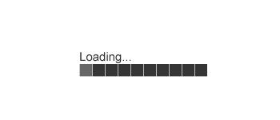

class:title-slide-custom

```{r, child = "style.Rmd"}
```


```{r setup, echo = FALSE, message = FALSE, warning = FALSE}

# Packages
library(emo)
library(purrr)
library(tidyverse)
library(gridExtra)
library(nullabor)
library(scales)
library(knitr)
library(kableExtra)
library(RefManageR)
library(iconr)
library(fontawesome)
# download_fontawesome()

# References
bib <- ReadBib("bib/bibliography.bib", check = FALSE)
ui <- "- "

# R markdown options
knitr::opts_chunk$set(echo = FALSE, 
                      message = FALSE, 
                      warning = FALSE, 
                      cache = FALSE,
                      dpi = 300)
options(htmltools.dir.version = FALSE)
options(knitr.kable.NA = '')
```

```{r, include = F, eval = T, cache = F}
clean_file_name <- function(x) {
  basename(x) %>% str_remove("\\..*?$") %>% str_remove_all("[^[A-z0-9_]]")
}
img_modal <- function(src, alt = "", id = clean_file_name(src), other = "") {
  
  other_arg <- paste0("'", as.character(other), "'") %>%
    paste(names(other), ., sep = "=") %>%
    paste(collapse = " ")
  
  js <- glue::glue("<script>
        /* Get the modal*/
          var modal{id} = document.getElementById('modal{id}');
        /* Get the image and insert it inside the modal - use its 'alt' text as a caption*/
          var img{id} = document.getElementById('img{id}');
          var modalImg{id} = document.getElementById('imgmodal{id}');
          var captionText{id} = document.getElementById('caption{id}');
          img{id}.onclick = function(){{
            modal{id}.style.display = 'block';
            modalImg{id}.src = this.src;
            captionText{id}.innerHTML = this.alt;
          }}
          /* When the user clicks on the modalImg, close it*/
          modalImg{id}.onclick = function() {{
            modal{id}.style.display = 'none';
          }}
</script>")
  
  html <- glue::glue(
     " <!-- Trigger the Modal -->

<!-- The Modal -->
<div id='modal{id}' class='modal'>
  <!-- Modal Content (The Image) -->
  
  <!-- Modal Caption (Image Text) -->
  <div id='caption{id}' class='modal-caption'></div>
</div>
"
  )
  write(js, file = "js-addins.html", append = T)
  return(html)
}
# Clean the file out at the start of the compilation
write("", file = "js-addins.html")
```

<br><br><br>
# Eye Fitting Straight Lines in the Modern Era
## Midwest Women in Science Conference
### September 18, 2021
#### Emily A. Robinson
#### Department of Statistics, University of Nebraska - Lincoln
##### `r fa("envelope", fill = "black")` [emily.robinson@huskers.unl.edu](emily.robinson@huskers.unl.edu)
##### `r fa("home", fill = "black")` [www.emilyarobinson.com](https://www.emilyarobinson.com/)
##### `r fa("github", fill = "black")` [earobinson95](https://github.com/earobinson95)
<br><br>
.medium[*Slides: https://bit.ly/3EgSVU4*]


---
class:primary
# Introduction to Graphics

Data visualization is defined as the art of drawing **graphical charts** in order to display data `r Citep(bib[[c("unwin_why_2020")]])`.

**What are graphics useful for?** `r Citep(bib[[c("lewandowsky1989perception")]])`
+ Data cleaning.
+ Exploring data structure.
+ Communicating information.

**Who uses graphics?**
+ Governments `r Citep(bib[[c("harms1991august", "playfair1801statistical", "walker2013statistical")]])`.
+ Companies `r Citep(bib[[c("chandar2012graph", "yates1985graphs")]])`.
+ News sources and mass media `r Citep(bib[[c("Aisch_NYTimes_presidential_forecast")]])`.
+ Scientific publications `r Citep(bib[[c("gouretski2007much")]])`.

---
class:primary
# Testing Statistical Graphics

Evaluate design choices and understand cognitive biases through the use of **visual tests**. 

Could ask participants to:

- identify differences in graphs.
- read information off of a chart accurately. 
- use data to make correct real-world decisions.
- predict the next few observations.

--

.pull-left[
**Lineup Protocol** introduced in `r Citet(bib[[c("buja2009statistical")]])`.

Embed a *target plot* (actual data) in a set of *null plots* (data generated under the null distribution).

].pull-right[
```{r results='asis', echo = F, include = T, cache = F, eval = TRUE}
i1 <- img_modal(src = "images/lineup-protocol.png", alt = " ", other=list(width="100%"))

c(str_split(i1, "\\n", simplify = T)[1:2],
  str_split(i1, "\\n", simplify = T)[3:9]
  ) %>% paste(collapse = "\n") %>% cat()
```
]

???
Visual evaluation of the lineup is conducted by a person. If the viewers detect the target plot, we can conclude the plots are distinguishable.

---
class:primary
# Fitting Trends by Eye

+ **`r Citet(bib[[c("finney1951subjective")]])`** Scatter-plot sent to participants by mail, asked to "rule two lines."

+ **`r Citet(bib[[c("mosteller1981eye")]])`** Students fitted lines by eye to four sets of points using an 8.5 x 11 inch transparency with a straight line etched across the middle.

+ **`r Citet(bib[[c("ciccione2021can")]])`** Participants used a trackpad to adjust the tilt of a line on screen to report the slope of the best-fitting regression line through a scatter-plot.

+ **New York Times 'You Draw It' Feature** Readers are asked to input their own assumptions about various metrics and compare how these assumptions relate to reality `r Citep(bib[[c("aisch_cox_quealy_2015", "buchanan_park_pearce_2017", "katz_2017")]])`. 

???

`r Citet(bib[[c("ciccione2021can")]])` conducted a comprehensive set of studies investigating human ability to detect trends in graphical representations from a psychophysical approach.

---
class:primary
# Research Objectives

**What:**

1. Establish ‘You Draw It’, adapted from the New York Times feature, as
a tool for graphical testing. 

2. Provide formal testing and support for "ensemble perception", the visual system can compute averages of various features in parallel across the items in a set.


**How:** Replicate the study conducted by Mosteller et al. (1981) using the ‘You Draw It’ method.

.pull-left[
.center[
```{r results='asis', echo = F, include = T, cache = F, eval = TRUE}
i1 <- img_modal(src = "images/nyt-caraccidents-frame4.png", alt = " ", other=list(width="70%"))

c(str_split(i1, "\\n", simplify = T)[1:2],
  str_split(i1, "\\n", simplify = T)[3:9]
  ) %>% paste(collapse = "\n") %>% cat()
```
]].pull-right[
.center[
```{r results='asis', echo = F, include = T, cache = F, eval = TRUE}
i1 <- img_modal(src = "images/eyefitting-straight-lines-plots.png", alt = " ", other=list(width="70%"))

c(str_split(i1, "\\n", simplify = T)[1:2],
  str_split(i1, "\\n", simplify = T)[3:9]
  ) %>% paste(collapse = "\n") %>% cat()
```
]]

---
class:primary
# 'You Draw It' Task

Study Participant Prompt: *Use your mouse to fill in the trend in the yellow box region.*

.center[

]
---
class:primary
# Data Generation

.pull-left[

$N = 30$ points $(x_i, y_i), i = 1,...N$ were generated for $x_i \in [x_{min}, x_{max}]$.

Data were simulated based on linear model with additive errors:
\begin{equation}
y_i = \beta_0 + \beta_1 x_i + e_i
\end{equation}

where $e_i \sim N(0, \sigma^2).$

Parameters $\beta_0$ and $\beta_1$ were selected to reflect the four data sets used in `r Citet(bib[[c("mosteller1981eye")]])`.

].pull-right[
```{r results='asis', echo = F, include = T, cache = F, eval = TRUE}
i1 <- img_modal(src = "images/eyefitting-example-simplot.png", alt = " ", other=list(width="100%"))

c(str_split(i1, "\\n", simplify = T)[1:2],
  str_split(i1, "\\n", simplify = T)[3:9]
  ) %>% paste(collapse = "\n") %>% cat()
```
]

???
+ **S:** positive slope; small variance; $x \in [0, 20]$. 
+ **F:** positive slope; a large variance; $x \in [0, 20]$.  
+ **V:** steep positive slope; small variance; $x \in [4, 16]$. 
+ **N:** negative slope; large variance; $x \in [0, 20]$. 

---
class:primary
# Study Design

+ Participants recruited through Twitter, Reddit, and direct email in May 2021.

+ A total of 35 individuals completed 119 unique you draw it task plots.

+ Data sets were generated randomly, independently for each participant at the start of the experiment.

+ Participants shown 2 practice plots followed by 4 task plots randomly assigned for each individual in a completely randomized design.

+ Experiment conducted and distributed through an RShiny application found [**here**](https://emily-robinson.shinyapps.io/you-draw-it-pilot-app/).

---
class:primary
# Fitted Regression Lines

Compare participant drawn lines to: 

+ Ordinary least squares regression line (OLS). 
+ Regression line based on principal axis (PCA).

.center[

]

???

+ “ensemble perception” the visual system can compute averages of various features in parallel across the items in a set.

---
class:primary
# Model Data

.pull-left[
For each participant, the final data set used for analysis contains:
+ $x_{ijk}$, $y_{ijk,drawn}$, $\hat y_{ijk,OLS}$, $\hat y_{ijk,PCA}$  

for 
+ parameter choice $i = 1,2,3,4$, 
+ participant j = $1,...N_{participant}$
+ $x_{ijk}$ value corresponding to increment $k = 1, ...,4 x_{max} + 1$.

**Vertical residuals** between the drawn and fitted values were calculated as: 
+ $e_{ijk,OLS} = y_{ijk,drawn} - \hat y_{ijk,OLS}$
+ $e_{ijk,PCA} = y_{ijk,drawn} - \hat y_{ijk,PCA}$.

].pull-right[

```{r results='asis', echo = F, include = T, cache = F, eval = TRUE}
i1 <- img_modal(src = "images/eyefitting-trial-plot.png", alt = " ", other=list(width="100%"))

c(str_split(i1, "\\n", simplify = T)[1:2],
  str_split(i1, "\\n", simplify = T)[3:9]
  ) %>% paste(collapse = "\n") %>% cat()
```
]

---
class:primary
# Linear Trend Constraint
The **Linear Mixed Model** equation for each fit (OLS and PCA) residuals is given by:
\begin{equation}
e_{ijk,fit} = \left[\gamma_0 + \alpha_i\right] + \left[\gamma_{1} x_{ijk} + \gamma_{2i} x_{ijk}\right] + p_{j} + \epsilon_{ijk}
\end{equation}
where

+ $e_{ijk,fit}$ is the residual between the drawn and fitted y-values for the $i^{th}$ parameter choice, $j^{th}$ participant, and $k^{th}$ increment of x-value corresponding to either the OLS or PCA fit
+ $\gamma_0$ is the overall intercept
+ $\alpha_i$ is the effect of the $i^{th}$ parameter choice (F, S, V, N) on the intercept
+ $\gamma_1$ is the overall slope for $x$
+ $\gamma_{2i}$ is the effect of the parameter choice on the slope
+ $x_{ijk}$ is the x-value for the $i^{th}$ parameter choice, $j^{th}$ participant, and $k^{th}$ increment
+ $p_{j} \sim N(0, \sigma^2_{participant})$ is the random error due to the $j^{th}$ participant's characteristics
+ $\epsilon_{ijk} \sim N(0, \sigma^2)$ is the residual error.

???

Using the `lmer` function in the lme4 package, a linear mixed model (LMM) is fit separately to the OLS and PCA residuals, constraining the fit to a linear trend. 

---
class:primary
# Linear Trend Constraint

.center[

]

---
class:primary
# Smoothing Spline Trend
The **Generalized Additive Mixed Model** equation for each fit (OLS and PCA) residuals is given by:
\begin{equation}
e_{ijk,fit} = \alpha_i + s_{i}(x_{ijk}) + p_{j} + s_{j}(x_{ijk})
\end{equation}
where 

+ $e_{ijk,fit}$ is the residual between the drawn and fitted y-values for the $i^{th}$ parameter choice, $j^{th}$ participant, and $k^{th}$ increment of x-value corresponding to either the OLS or PCA fit
+ $\alpha_i$ is the intercept for the parameter choice $i$
+ $s_{i}$ is the smoothing spline for the $i^{th}$ parameter choice
+ $x_{ijk}$ is the x-value for the $i^{th}$ parameter choice, $j^{th}$ participant, and $k^{th}$ increment
+ $p_{j} \sim N(0, \sigma^2_{participant})$ is the error due to participant variation
+ $s_{j}$ is the random smoothing spline for each participant.

???

Eliminating the linear trend constraint, the `bam` function in the mgcv package is used to fit a generalized additive mixed model (GAMM) separately to the OLS and PCA residuals to allow for estimation of smoothing splines.

---
class:primary
# Smoothing Spline Trend

.center[

]

---
class:primary
# Conclusion

**Research Objectives:** 

1. Establish 'You Draw It' as a tool for testing graphics.
2. Provide experimental support for “ensemble perception”.

**Results:**
+ Estimated drawn trend-lines followed closer to the regression line based on the principal axes than the OLS regression line.
+ Most prominent in data simulated with large variances.
+ Humans perform “ensemble perception” in a statistical graphic setting.

**The reproducibility of these results serve as validation of the 'You Draw It' tool and method.**

???

Humans perform “ensemble perception” in a statistical graphic setting as participants minimized the distance from the their regression
line over both the x and y axis simultaneously


---
class:primary
# Future Work

.center[

]

`r emo::ji("pencil2")` Implement the 'You Draw It' method in non-linear settings.

`r emo::ji("chart increasing")` Evaluate human ability to extrapolate data from trends.

`r fa("cloud-showers-heavy", fill = "gray")` Use the tool to understand beliefs of real data such as climate change trends. 

`r fa("r-project", fill = "steelblue")` Develop an R package designed for easy implementation of ‘You Draw It’ task plots.

<br>

.right-col[
Gif Source: [photobucket.com](http://s280.photobucket.com/user/ariffisariff/media/animated-loading.gif.html)
]
---
class:primary
# References
<font size="2">
```{r, print_refs1, results='asis', echo=FALSE, warning=FALSE, message=FALSE}
print(bib[[c("aisch_cox_quealy_2015",
"Aisch_NYTimes_presidential_forecast",
"buchanan_park_pearce_2017",
"buja2009statistical",
"carpenter1998model",
"chandar2012graph",
"chong2003representation",
"chong2005statistical",
"ciccione2021can",
"cleveland1984graphical")]], 
      .opts = list(check.entries = FALSE, style = "html", bib.style = "authoryear")
      )
```
</font>

---
class:primary
# References
<font size="2">
```{r, print_refs2, results='asis', echo=FALSE, warning=FALSE, message=FALSE}
print(bib[[c("cleveland1985graphical",
"finney1951subjective",
"gouretski2007much",
"green2009personal",
"harms1991august",
"hofmann2012graphical",
"katz_2017",
"lewandowsky1989perception",
"mosteller1981eye",
"playfair1801statistical")]], 
      .opts = list(check.entries = FALSE, style = "html", bib.style = "authoryear")
      )
```
</font>

---
class:primary
# References
<font size="2">
```{r, print_refs3, results='asis', echo=FALSE, warning=FALSE, message=FALSE}
print(bib[[c("spence1990visual",
"unwin2020data",
"van2011rapid",
"vanderplas2015spatial",
"vanderplas2017clusters",
"vanderplas2020testing",
"walker2013statistical",
"wickham2011ggplot2",
"wilkinson2013grammar",
"yates1985graphs")]], 
      .opts = list(check.entries = FALSE, style = "html", bib.style = "authoryear")
      )
```
</font>


---
class:inverse
<br>
<br>
<br>
<br>
<br>
<br>
.center[
# Thank you!
<br
<br>
`r fa("envelope", fill = "white")` **emily.robinson@huskers.unl.edu**
`r fa("home", fill = "white")` **www.emilyarobinson.com**
`r fa("github", fill = "white")` **earobinson95**
]

