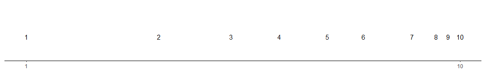
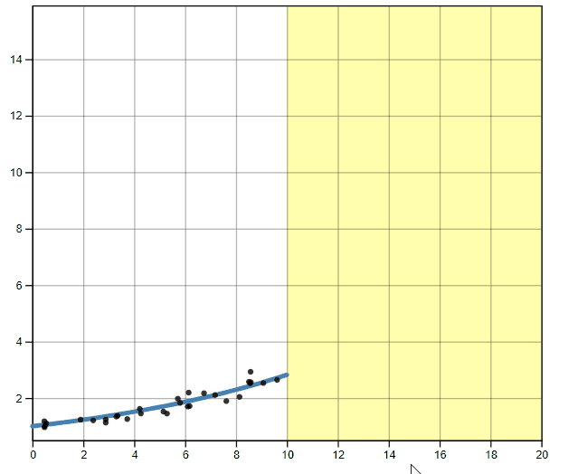
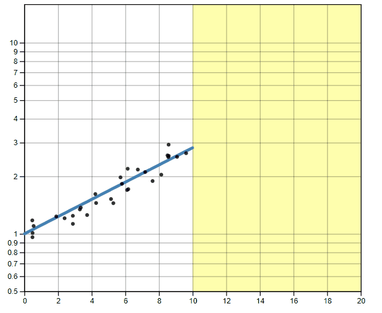

class:title-slide-custom

```{r, child = "style.Rmd"}
```


```{r setup, echo = FALSE, message = FALSE, warning = FALSE}

# Packages
library(emo)
library(purrr)
library(tidyverse)
library(gridExtra)
library(nullabor)
library(scales)
library(knitr)
library(kableExtra)
library(RefManageR)
library(iconr)
library(fontawesome)
# download_fontawesome()

# References
bib <- ReadBib("bib/thesis.bib", check = FALSE)
ui <- "- "

# R markdown options
knitr::opts_chunk$set(echo = FALSE, 
                      message = FALSE, 
                      warning = FALSE, 
                      cache = FALSE,
                      dpi = 300)
options(htmltools.dir.version = FALSE)
options(knitr.kable.NA = '')
```

```{r, include = F, eval = T, cache = F}
clean_file_name <- function(x) {
  basename(x) %>% str_remove("\\..*?$") %>% str_remove_all("[^[A-z0-9_]]")
}
img_modal <- function(src, alt = "", id = clean_file_name(src), other = "") {
  
  other_arg <- paste0("'", as.character(other), "'") %>%
    paste(names(other), ., sep = "=") %>%
    paste(collapse = " ")
  
  js <- glue::glue("<script>
        /* Get the modal*/
          var modal{id} = document.getElementById('modal{id}');
        /* Get the image and insert it inside the modal - use its 'alt' text as a caption*/
          var img{id} = document.getElementById('img{id}');
          var modalImg{id} = document.getElementById('imgmodal{id}');
          var captionText{id} = document.getElementById('caption{id}');
          img{id}.onclick = function(){{
            modal{id}.style.display = 'block';
            modalImg{id}.src = this.src;
            captionText{id}.innerHTML = this.alt;
          }}
          /* When the user clicks on the modalImg, close it*/
          modalImg{id}.onclick = function() {{
            modal{id}.style.display = 'none';
          }}
</script>")
  
  html <- glue::glue(
     " <!-- Trigger the Modal -->

<!-- The Modal -->
<div id='modal{id}' class='modal'>
  <!-- Modal Content (The Image) -->
  
  <!-- Modal Caption (Image Text) -->
  <div id='caption{id}' class='modal-caption'></div>
</div>
"
  )
  write(js, file = "js-addins.html", append = T)
  return(html)
}
# Clean the file out at the start of the compilation
write("", file = "js-addins.html")
```

<br><br><br>
## Pandemic Dilemmas: Human Perception of Exponentially Increasing Data Displayed on a Log Scale Evaluated Through Experimental Graphics Tasks
## Women in Statistics and Data Science (WSDS)
### October 7, 2021
#### Emily A. Robinson, Susan VanderPlas, and Reka Howard 
#### Department of Statistics, University of Nebraska - Lincoln
##### `r fa("envelope", fill = "black")` [emily.robinson@huskers.unl.edu](emily.robinson@huskers.unl.edu)
##### `r fa("home", fill = "black")` [www.emilyarobinson.com](https://www.emilyarobinson.com/)
##### `r fa("github", fill = "black")` [earobinson95](https://github.com/earobinson95)
<!-- <br><br> -->
<!-- .medium[*Slides: https://bit.ly/3EgSVU4*] -->


???

Thank you for listening to my talk! I will be presenting my research on the human perception of exponentially increasing data displayed on a log scale evaluated through experimental graphics tasks as part of my Ph.D. work under the supervision of Dr. Susan VanderPlas and Dr. Reka Howard at the University of Nebraska - Lincoln.

---
class:primary
# Outline

1. Introduction to Logarithmic Scales
2. Research Objectives
3. Perception of Exponential Growth
4. Prediction of Exponential Trends
5. Future Work

???

First, I will provide an introduction to logarithmic scales and give an overview of my research objectives. This presentation will cover the first and second objectives, then I will share future work to be done.

---
class:inverse
<br>
<br>
<br>
<br>
<br>
<br>
<br>
<br>
.center[
# Introduction
]

---
class:primary
# Motivation

Data visualizations played an important role in during the **COVID-19 pandemic** `r Citep(bib[[c("rost_2020", "romano_scale_2020", "bavel_using_2020")]])`.

.pull-left[
Dashboards displayed:
+ case counts. 
+ transmission rates.
+ outbreak regions.

].pull-right[
```{r results='asis', echo = F, include = T, cache = F, eval = TRUE}
i1 <- img_modal(src = "images/91divoc-cases-july2021.png", alt = Citep(bib[[c("fagen-ulmschneider_2020")]]), other=list(width="100%"))

c(str_split(i1, "\\n", simplify = T)[1:2],
  str_split(i1, "\\n", simplify = T)[3:9]
  ) %>% paste(collapse = "\n") %>% cat()
``` 
]
???

We have recently seen data visualizations play an important role in during the COVID-19 pandemic in displaying case counts, transmission rates, and outbreak regions. Mass media routinely showed charts to share information with the public about the progression of the pandemic. Graphics helped guide decision makers to implement policies such as shut-downs or mandated mask wearing. Facilitated communication with the public to increase compliance.  

One of the many dashboards was called 91-DIVOC (COVID-19 backwards!). This dashboard gives the viewer choices of what to show: case count, mortality, hospitalizations, standardized to population, geographic regions, and scales (log/linear).

---
class:primary
# Logarithmic Scales

.center[
```{r results='asis', echo = F, include = T, cache = F, eval = TRUE}
i1 <- img_modal(src = "images/log-scale-example.jpg", alt = " ", other=list(width="60%"))

c(str_split(i1, "\\n", simplify = T)[1:2],
  str_split(i1, "\\n", simplify = T)[3:9]
  ) %>% paste(collapse = "\n") %>% cat()
```
]

Our perception is **logarithmic at first**, but transitions to a **linear scale later** in development `r Citep(bib[[c("dehaene2008log", "siegler_numerical_2017", "varshney_why_2013")]])`.

.center[

]

???

One problem we face is when data spans several orders of magnitude shown on its original scale compresses the smaller magnitudes into relatively little area. We can address this problem through the use of a log scale transformation; however, this alters the contextual appearance of the data.

In fact, past research has found that our perception is **logarithmic at first**, but transitions to a **linear scale later** in development. For example, a kindergartner asked to place numbers one through ten along a number line would place three close to the middle, following the logarithmic perspective. We have all experienced this when making a poster where we misjudged the space needed and end up compressing the last few letters onto the poster board.

Assuming there is a direct relationship between perceptual and cognitive processes, it is reasonable to assume numerical representations should also be displayed on a nonlinear, compressed number scale. Therefore, if we perceive logarithmically by default, it is a natural (and presumably low effort) way to display information and should be easy to read and understand/use.

---
class:primary
# Benefits and Pitfalls of Log Scales

.pull-left[

**Benefits** were seen in spring 2020, during the early stages of the COVID-19 pandemic.
.center[
```{r results='asis', echo = F, include = T, cache = F, eval = TRUE}
i1 <- img_modal(src = "images/covid19-FT-03.23.2020-log.png", alt = Citep(bib[[c("burnmurdoch_2020")]]), other=list(width="100%"))

c(str_split(i1, "\\n", simplify = T)[1:2],
  str_split(i1, "\\n", simplify = T)[3:9]
  ) %>% paste(collapse = "\n") %>% cat()
```
]

].pull-right[

**Pitfalls** were exposed as the pandemic evolved, and the case counts were no longer spreading exponentially.

.center[
```{r results='asis', echo = F, include = T, cache = F, eval = TRUE}
i1 <- img_modal(src = "images/covid19-FT-linear.png", alt = Citep(bib[[c("burnmurdoch_2020")]]), other=list(width="80%"))

c(str_split(i1, "\\n", simplify = T)[1:2],
  str_split(i1, "\\n", simplify = T)[3:9]
  ) %>% paste(collapse = "\n") %>% cat()
```

```{r results='asis', echo = F, include = T, cache = F, eval = TRUE}
i1 <- img_modal(src = "images/covid19-FT-log.png", alt = Citep(bib[[c("burnmurdoch_2020")]]), other=list(width="80%"))

c(str_split(i1, "\\n", simplify = T)[1:2],
  str_split(i1, "\\n", simplify = T)[3:9]
  ) %>% paste(collapse = "\n") %>% cat()
```
]
]

???

Benefits of log scales were seen in spring 2020, during the early stages of the COVID-19 pandemic. During this time, we saw log scale transformations were useful for showing case count curves for areas with few cases and areas with many cases within once chart.

Pitfalls of log scales were exposed as the pandemic evolved, and the case counts were no longer spreading exponentially. During last summer's wave, graphs with a linear scale seemed more effective at spotting early increases in case counts that signaled more localized outbreaks. While we can still see the increase in rate of transimtion on the log scale, the effect of the linear scale appears to evoke a stronger reaction from the public than the log scale.

---
class:primary
# Research Objectives

**Big Idea:** Are there benefits to displaying exponentially increasing data on a log scale rather than a linear scale?

1. [Perception of Exponential Growth](https://shiny.srvanderplas.com/log-study/) `r emo::ji("chart increasing")` `r emo::ji("chart increasing")` `r emo::ji("chart increasing")`

    - Test an individuals ability to perceptually differentiate exponentially increasing data with differing rates of change on both the linear and log scale.
    
2. [Prediction of Exponential Trends](https://shiny.srvanderplas.com/you-draw-it/) `r emo::ji("pencil2")`
    
    - Tests an individuals ability to make predictions for exponentially increasing data.
        
3. Estimation by Numerical Translation `r emo::ji("straight_ruler")`

    - Tests an individuals ability to translate a graph of exponentially increasing data into real value quantities.

???

One way to evaluate design choices is through the use of graphical tests. We could ask participants to identify differences in graphs, read information off of a chart accurately, use data to make correct real-world decisions, or predict the next few observations. All of these types of tests require different levels of use and manipulation of the information presented in the chart.

The main goal of this research is to use graphical tests to determine if there are benefits to displaying exponentially increasing data on a log scale rather than a linear scale. We have developed three graphical tests which address the perception of exponential growth, prediction of exponential growth, and translation from graphical to numerical estimation. 
    
---
class:inverse
<br>
<br>
<br>
<br>
<br>
<br>
<br>
<br>
.center[
# Perception of Exponential Growth
]

???

To lay a foundation for future exploration of the use of log scales, we begin with
the most fundamental ability to identify differences in charts; this does not require
that participants understand exponential growth, identify log scales, or have any
mathematical training. Instead, we are simply testing the change in perceptual
sensitivity resulting from visualization choices.

---
class:primary
# Lineup Experimental Task 

Study Participant Prompt: *Which plot is most different?*

.center[
```{r results='asis', echo = F, include = T, cache = F, eval = TRUE}
i1 <- img_modal(src = "images/linear-lineup-example.png", alt = " ", other=list(width="45%"))
i2 <- img_modal(src = "images/log-lineup-example.png", alt = " ", other=list(width="45%"))

c(str_split(i1, "\\n", simplify = T)[1:2],
  str_split(i2, "\\n", simplify = T)[1:2],
  str_split(i1, "\\n", simplify = T)[3:9],
  str_split(i2, "\\n", simplify = T)[3:9]
  ) %>% paste(collapse = "\n") %>% cat()
```
]

???
This study is conducted through visual inference and the use of statistical lineups to differentiate between exponentially increasing curves with differing levels of curvature, using linear and log scales.

A statistical lineup is a plot consisting of smaller panels; the viewer is asked to identify the panel containing the real data from among a set of decoy null plots. Null plots display data under the assumption there is no relationship and can be generated by permutation or simulation. A statistical lineup typically consists of 20 panels - one target panel and 19 null panels. If the viewer can identify the target panel randomly embedded within the set of null panels, this suggests that the real data is visually distinct from data generated under the null model.

Participants were shown a series of statistical lineups and asked to indicate which plot is most different. On the left, we see data displayed on the linear scale while on the right, the same data is displayed on the log scale. We can identify panel 13 as being most different.

---
class:primary
# Lineup Study Design

**Curvature Levels:**
+ High Curvature
+ Medium  Curvature
+ Low Curvature

**Treatment Design:** Target Panel gets model A and Null Panels get model B. Shown on both the linear and log scales.

```{r results='asis', echo = F, include = T, cache = F, eval = TRUE}
i1 <- img_modal(src = "images/tE_nH.png", alt = "Target - high curvature; Null - low curvature", other=list(width="15%"))
i2 <- img_modal(src = "images/tE_nM.png", alt = "Target - high curvature; Null - medium curvature", other=list(width="15%"))
i3 <- img_modal(src = "images/tM_nH.png", alt = "Target - medium curvature; Null - low curvature", other=list(width="15%"))
i4 <- img_modal(src = "images/tM_nE.png", alt = "Target - medium curvature; Null - high curvature", other=list(width="15%"))
i5 <- img_modal(src = "images/tH_nM.png", alt = "Target - low curvature; Null - medium curvature", other=list(width="15%"))
i6 <- img_modal(src = "images/tH_nE.png", alt = "Target - low curvature; Null - high curvature", other=list(width="15%"))

c(str_split(i1, "\\n", simplify = T)[1:2],
  str_split(i2, "\\n", simplify = T)[1:2],
  str_split(i3, "\\n", simplify = T)[1:2],
  str_split(i4, "\\n", simplify = T)[1:2],
  str_split(i5, "\\n", simplify = T)[1:2],
  str_split(i6, "\\n", simplify = T)[1:2],
  str_split(i1, "\\n", simplify = T)[3:9],
  str_split(i2, "\\n", simplify = T)[3:9],
  str_split(i3, "\\n", simplify = T)[3:9],
  str_split(i4, "\\n", simplify = T)[3:9],
  str_split(i5, "\\n", simplify = T)[3:9],
  str_split(i6, "\\n", simplify = T)[3:9]
  ) %>% paste(collapse = "\n") %>% cat()
```

<!-- $3!\cdot 2!= 6$ curvature combinations -->

<!-- $\times 2$ lineup data sets per combination $=$ **12 test data sets** -->

<!-- $\times 2$ scales (log & linear) $=$ **24 different lineup plots** -->


**Experimental Design:** 12 test lineup plots per participant.

<!-- $6$ test parameter combinations per participant $\times 2$ scales $= 12$ test lineups -->

<!-- $1$ rorschach parameter combination per participant -->

???

The data for both the target and null data sets were generated by simulating data from an exponential model with differing curvature levels as determined by a goldilocks method - low curvature (almost linear), medium curvature (noticable curvature), and high (strong obvious curvature). 

The models differ in the parameters selected for the null and target panels by mapping one simulated data set corresponding to curvature level A to a scatter plot to be identified as the target panel while multiple simulated data sets corresponding to curvature level B were individually mapped to scatter plots for the null panels.

Each participant saw a total of 12 test plots, each of the 6 curvature combinations on both the log and linear scales.

---
class:primary
# Generalized Linear Mixed Model

Define $Y_{ijkl}$ to be the event that participant $l$ correctly identifies the target plot for data set $k$ with curvature $j$ plotted on scale $i$.

$$\text{logit }P(Y_{ijk}) = \eta + \delta_i + \gamma_j + \delta \gamma_{ij} + s_l + d_k$$
where
- $\eta$ is the beaseline average probability of selecting the target plot. 
- $\delta_i$ is the effect of the log/linear scale.
- $\gamma_j$ is the effect of the curvature combination.
- $\delta\gamma_{ij}$is the two-way interaction effect of the scale and curvature.
- $s_l \sim N(0,\sigma^2_\text{participant})$, random effect for participant characteristics.
- $d_k \sim N(0,\sigma^2_{\text{data}})$, random effect for data specific characteristics. 

We assume that random effects for data set and participant are independent.

???

Each lineup plot evaluated was assigned a value based on the participant response (correct = 1, not correct = 0). The binary response was analyzed using generalized linear mixed model following a binomial distribution with a logit link function. Here we account for the effect of scale, curvature combination, and their interaction. We also take into account the random effects for participant and data set characteristics.

---
class:primary
# Accuracy of Perception Results

.center[

] 

???


The figure displays the estimated (log) odds ratio of successfully identifying the target panel on the log scale compared to the linear scale. 

The choice of scale has no impact if curvature differences are large (low curvature and high curvature combinations). However, presenting data on the log scale makes us more sensitive to slight changes in curvature (high curvature target plot embedded in medium curvature null plots; medium curvature target plot embedded in high curvature null plots; low curvature target plots embedded in
medium curvature null plots). An exception occurs when identifying a plot with curvature embedded in null plots close to a linear trend (medium curvature target panel embedded in low curvature null panels), supporting past literature that it is easy to identify a curve in a bunch of lines but much harder to identify a line in a bunch of curves.

The use of visual inference to identify these guidelines suggests that there are perceptual advantages to log scales when differences are subtle. What remains to be seen is whether there are cognitive disadvantages to log scales: do log scales make it harder to make use of graphical information?

---
class:inverse
<br>
<br>
<br>
<br>
<br>
<br>
<br>
<br>
.center[
# Prediction of Exponential Trends
]

???
In order to determine whether there are cognitive disadvantages to log scales, we utilize interactive graphics to test an individual’s ability to make predictions for exponentially increasing data. In this study, participants are asked to draw a line using their computer mouse through the exponentially increasing trend shown on both the log and linear scales.

---
class:primary
# 'You Draw It' Experimental Task

Study Participant Prompt: *Use your mouse to fill in the trend in the yellow box region.*

.pull-left[

].pull-right[

]

???

Here we see an example of the interactive plot as seen by participants during the study - we call this 'You Draw It' based off of a New York Times feature introduced in 2015. Participants are prompted to: "Use your mouse to fill in the trend in the yellow box region". The yellow box region moves along as the participant draws their trend-line until the yellow region disappears.

---
class:primary 
# 'You Draw It' Study Design

.pull-left[
**Treatment Design:** 2 x 2 x 2 factorial:
+ **growth rate:** low and high.
+ **points truncated:** $50\%$ and $75\%$ of the domain.
+ **scale:** log and linear.

**Experimental Design:** 8 'You Draw It' interactive task plots per participant.

**Aesthetic design choices:**
+ y-axis extended $50\%$ below and $200\%$ above the simulated data range.
+ participants begin drawing at $50\%$ of the domain.

].pull-right[
.center[
```{r results='asis', echo = F, include = T, cache = F, eval = TRUE}
i1 <- img_modal(src = "images/low-10-linear.png", alt = "Low Growth Rate, 50% Truncation, Linear Scale", other=list(width="30%"))
i2 <- img_modal(src = "images/low-10-log.png", alt = "Low Growth Rate, 50% Truncation, Log Scale", other=list(width="30%"))

c(str_split(i1, "\\n", simplify = T)[1:2],
  str_split(i2, "\\n", simplify = T)[1:2],
  str_split(i1, "\\n", simplify = T)[3:9],
  str_split(i2, "\\n", simplify = T)[3:9]
  ) %>% paste(collapse = "\n") %>% cat()
```

```{r results='asis', echo = F, include = T, cache = F, eval = TRUE}
i1 <- img_modal(src = "images/low-15-linear.png", alt = "Low Growth Rate, 75% Truncation, Linear Scale", other=list(width="30%"))
i2 <- img_modal(src = "images/low-15-log.png", alt = "Low Growth Rate, 75% Truncation, Log Scale", other=list(width="30%"))

c(str_split(i1, "\\n", simplify = T)[1:2],
  str_split(i2, "\\n", simplify = T)[1:2],
  str_split(i1, "\\n", simplify = T)[3:9],
  str_split(i2, "\\n", simplify = T)[3:9]
  ) %>% paste(collapse = "\n") %>% cat()
```

```{r results='asis', echo = F, include = T, cache = F, eval = TRUE}
i1 <- img_modal(src = "images/high-10-linear.png", alt = "High Growth Rate, 50% Truncation, Linear Scale", other=list(width="30%"))
i2 <- img_modal(src = "images/high-10-log.png", alt = "High Growth Rate, 50% Truncation, Log Scale", other=list(width="30%"))

c(str_split(i1, "\\n", simplify = T)[1:2],
  str_split(i2, "\\n", simplify = T)[1:2],
  str_split(i1, "\\n", simplify = T)[3:9],
  str_split(i2, "\\n", simplify = T)[3:9]
  ) %>% paste(collapse = "\n") %>% cat()
```

```{r results='asis', echo = F, include = T, cache = F, eval = TRUE}
i1 <- img_modal(src = "images/high-15-linear.png", alt = "High Growth Rate, 75% Truncation, Linear Scale", other=list(width="30%"))
i2 <- img_modal(src = "images/high-15-log.png", alt = "High Growth Rate, 75% Truncation, Log Scale", other=list(width="30%"))

c(str_split(i1, "\\n", simplify = T)[1:2],
  str_split(i2, "\\n", simplify = T)[1:2],
  str_split(i1, "\\n", simplify = T)[3:9],
  str_split(i2, "\\n", simplify = T)[3:9]
  ) %>% paste(collapse = "\n") %>% cat()
```
]]

???

This study evaluates 3 treatment factors - growth rate (low / high), points truncated (50% or 75% of the domain), and scale (log / linear) for a total of 8 interactive plots per participant. Data were simulated at the start of the study for each participant giving each participant a unique set of points based on the chosen parameters. We provided participants with a buffer above and below on the y-axis to allow them to draw outside of the data range as well as always asked participants to begin drawing at 50% of the domain.

---
class:primary 
# Feedback Data

.pull-left[
For each participant, the final data set used for analysis contains:
+ $x_{ijklm}$, $y_{ijklm,drawn}$, and $\hat y_{ijklm,NLS}$  

for:
+ growth rate $i = 1,2$,
+ point truncation $j = 1,2$,
+ scale $k = 1,2$,
+ participant  $l = 1,...N_{participant}$, and 
+ $x_{ijklm}$ value $m = 1, ...,4 x_{max} + 1$.

Vertical residuals between the drawn and fitted values were calculated as: 
+ $e_{ijklm,NLS} = y_{ijklm,drawn} - \hat y_{ijklm,NLS}$.

].pull-right[
```{r results='asis', echo = F, include = T, cache = F, eval = TRUE}
i1 <- img_modal(src = "images/exp-spaghetti-plot.png", alt = " ", other=list(width="100%"))

c(str_split(i1, "\\n", simplify = T)[1:2],
  str_split(i1, "\\n", simplify = T)[3:9]
  ) %>% paste(collapse = "\n") %>% cat()
```
]

???

After data collection, for each participant and interactive plot, we saved feedback data which consists of x values at 0.25 increments across the domain along with corresponding participant drawn y-values and fitted y-values based on non-linear least squares.

Here we see the feedback data plotted with a loess smoother over the drawn trends. The black lines indicate the fitted values while the blue indicate the drawn values on the linear scale and the orange indicate the drawn values on the log scale. I want to draw your attention to the bottom left where we can see some clear underestimation occurring on the linear scale. Note on the bottom right that you always have that one person throwing off your data collection.

What we are mainly interested in the deviation between the drawn and fitted values so we calculate the vertical residual to be used as our response.

---
class:primary 
# Generalized Additive Mixed Model

The GAMM equation for residuals is given by:
\begin{equation}
e_{ijklm,nls} = \tau_{ijk} + s_{ijk}(x_{ijklm}) + p_{l} + s_{l}(x_{ijklm})
\end{equation}

where

+ $e_{ijklm,NLS}$ is the residual between the drawn y-value and fitted y-value for the $l^{th}$ participant, $m^{th}$ increment, and $ijk^{th}$ treatment combination 
+ $\tau_{ijk}$ is the intercept for the $i^{th}$ growth rate, $j^{th}$ point truncation, and $k^{th}$ scale treatment combination
+ $s_{ijk}$ is the smoothing spline for the $ijk^{th}$ treatment combination
+ $x_{ijklm}$ is the x-value for the $l^{th}$ participant, $m^{th}$ increment, and $ijk^{th}$ treatment combination 
+ $p_{l} \sim N(0, \sigma^2_{participant})$ is the error due to the $l^{th}$ participant's characteristics 
+ $s_{l}$ is the random smoothing spline for the $l^{th}$ participant.

???

Allowing for flexibility, the bam function in the mgcv package is used to fit a GAMM to estimate trends of vertical residuals from the participant drawn line in relation to the NLS fitted values. We have an intercept for each treatment combination along with a smoothing spline estimate for each combination. We allow for a random effect of participant and a random smoothing spline for each participant.

---
class:primary 
# GAMM Residual Trend Results
.center[

]

???


The plot shows the estimated trends of the residuals (that vertical deviation of
participant drawn points from NLS fitted points) as modeled by the GAMM.

Here we see the estimated trends of residuals for predictions made on the linear scale (blue) appear to deviate from the y = 0 horizontal (dashed) line indicating underestimation of exponential growth. In comparisons, the estimated trends of residuals for predictions made on the log scale (orange) follow closely to the y = 0 horizontal (dashed) line, implying exponential trends predicted on the log scale are more accurate than those predicted on the linear scale. 

In particular, underestimation is more prominent for high exponential growth rates and improvement in predictions are made when points along the exponential trend are shown as indicated by the discrepancy in results for treatments with points truncated at 50% compared to 75% of the domain.

The results of this study suggest that there are cognitive advantages to log scales when making predictions of exponential trends. However, further investigation is necessary to determine the implications of using log scales when translating exponential graphs to numerical values.

---
class:inverse
<br>
<br>
<br>
<br>
<br>
<br>
<br>
<br>
.center[
# Future Work
]
---
class:primary
# Future Work

.pull-left[
+ Estimation by Numerical Translation
  + Tests an individuals ability to translate a graph of exponentially increasing data into real value quantities.
+ [Prolific](https://app.prolific.co/studies) data collection.

].pull-right[
.center[


[(Prolific studies)](https://app.prolific.co/studies)
]
]

???

The data collected in the previous two studies came from a pilot data collection. The third study designed to test an individuals ability to translate a graph of exponentially increasing data into real value quantities is currently under development. After all pilot studies have been conducted, a final data set will be collected via Prolific to allow for a representative sample as well as consistent participants across all three graphical tests. 

---
class:primary
# References
<font size="2">
```{r, print_refs1, results='asis', echo=FALSE, warning=FALSE, message=FALSE}
print(bib[[c("rost_2020", 
"romano_scale_2020", "bavel_using_2020", "dehaene2008log", "siegler_numerical_2017", "varshney_why_2013", 
"burnmurdoch_2020", 
"fagen-ulmschneider_2020",
"vonbergmann_2021")]], 
      .opts = list(check.entries = FALSE, style = "html", bib.style = "authoryear")
      )
```
</font>

---
class:inverse
<br>
<br>
<br>
<br>
<br>
<br>
.center[
# Thank you!
<br
<br>
`r fa("envelope", fill = "white")` **emily.robinson@huskers.unl.edu**
`r fa("home", fill = "white")` **www.emilyarobinson.com**
`r fa("github", fill = "white")` **earobinson95**
]

