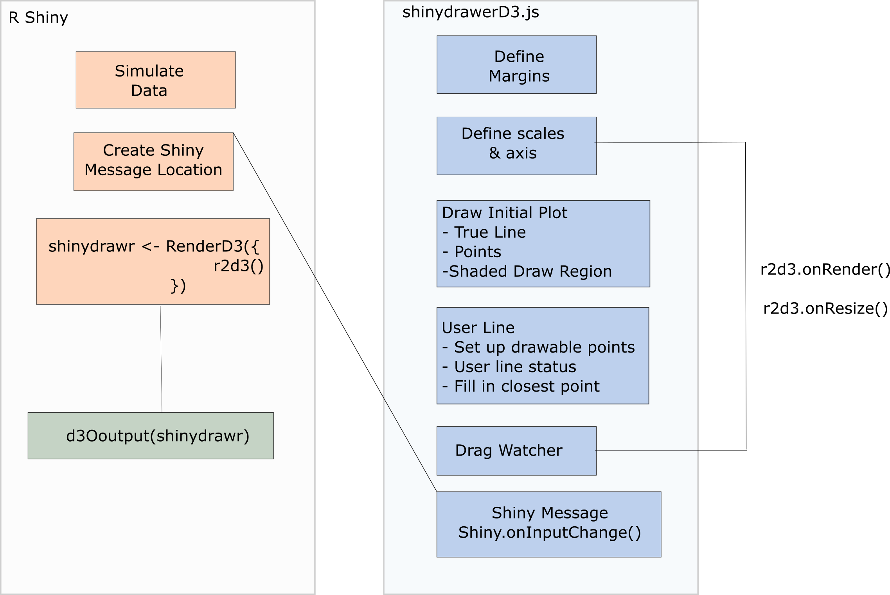

class:title-slide-custom

```{r, child = "style.Rmd"}
```


```{r setup, echo = FALSE, message = FALSE, warning = FALSE}
# Packages
library(emoji)
library(purrr)
library(tidyverse)
library(gridExtra)
library(nullabor)
library(scales)
library(knitr)
library(kableExtra)
library(RefManageR)
library(iconr)
library(fontawesome)
# download_fontawesome()

# References
bib <- ReadBib("bib/references.bib", check = FALSE)
ui <- "- "

# R markdown options
knitr::opts_chunk$set(echo = FALSE, 
                      message = FALSE, 
                      warning = FALSE, 
                      cache = FALSE,
                      dpi = 300)
options(htmltools.dir.version = FALSE)
options(knitr.kable.NA = '')
```

```{r, include = F, eval = T, cache = F}
clean_file_name <- function(x) {
  basename(x) %>% str_remove("\\..*?$") %>% str_remove_all("[^[A-z0-9_]]")
}
img_modal <- function(src, alt = "", id = clean_file_name(src), other = "") {
  
  other_arg <- paste0("'", as.character(other), "'") %>%
    paste(names(other), ., sep = "=") %>%
    paste(collapse = " ")
  
  js <- glue::glue("<script>
        /* Get the modal*/
          var modal{id} = document.getElementById('modal{id}');
        /* Get the image and insert it inside the modal - use its 'alt' text as a caption*/
          var img{id} = document.getElementById('img{id}');
          var modalImg{id} = document.getElementById('imgmodal{id}');
          var captionText{id} = document.getElementById('caption{id}');
          img{id}.onclick = function(){{
            modal{id}.style.display = 'block';
            modalImg{id}.src = this.src;
            captionText{id}.innerHTML = this.alt;
          }}
          /* When the user clicks on the modalImg, close it*/
          modalImg{id}.onclick = function() {{
            modal{id}.style.display = 'none';
          }}
</script>")
  
  html <- glue::glue(
     " <!-- Trigger the Modal -->

<!-- The Modal -->
<div id='modal{id}' class='modal'>
  <!-- Modal Content (The Image) -->
  
  <!-- Modal Caption (Image Text) -->
  <div id='caption{id}' class='modal-caption'></div>
</div>
"
  )
  write(js, file = "js-addins.html", append = T)
  return(html)
}
# Clean the file out at the start of the compilation
write("", file = "js-addins.html")
```

<br><br><br>
## ‘You Draw It’: Implementing human interaction in R shiny with r2d3
### 2022 Appsilon Shiny Conference
#### Emily A. Robinson
#### Department of Statistics, University of Nebraska - Lincoln
##### `r fa("envelope", fill = "black")` [emily.robinson@huskers.unl.edu](emily.robinson@huskers.unl.edu)
##### `r fa("home", fill = "black")` [www.emilyarobinson.com](https://www.emilyarobinson.com/)
##### `r fa("github", fill = "black")` [earobinson95](https://github.com/earobinson95)
<!-- <br><br> -->
<!-- .medium[*Slides: https://bit.ly/3EgSVU4*] -->

---
class:primary
# Outline

`r fa_i("chart-line")` Background of graphical testing and measuring patterns

`r fa_i("js")` `r fa_i("plus")` `r fa_i("r-project")` Integration of D3.js and R Shiny

`r fa_i("pen")` Test your drawing skills!

`r fa_i("check")` Validation and Application

`r fa_i("spinner")` Future Work

---
class:primary
# Background

**Testing statistical graphics**

+ Evaluate design choices and understand cognitive biases through the use of visual tests.
+ Researchers conduct studies in which human subjects are asked to conduct tasks related to the perception of statistical charts such as differentiation, prediction, estimation, and extrapolation. 

--

**Measuring Patterns & Trends**

+ Our visual system is naturally built to look for structure and identify patterns.
+ Physical manipulation: maneuvering a string, black thread, or ruler until the fit is suitable, then drawing the line through the set of points `r Citep(bib[[c("mosteller1981eye", "finney1951subjective")]])`
+ `r Citet(bib[[c("ciccione2021")]])` conducted a comprehensive set of studies based on psychophysical approaches. 

--

**How can we compare our intuitive visual sense of patterns to those determined by statistical methods?**


???

Graphical tests are useful for studying the perception of statistical graphs. Studies might ask participants to
identify differences in graphs, read information off of a chart accurately, use data to make correct real-world decisions, or predict the next few observations. All of these types of tests require different levels of use and manipulation of the information being presented in the chart.

Efforts in the field of statistical graphics have developed graphical testing tools and methods. Through
experimentation, graphical testing methods allow researchers to conduct studies geared at understanding human ability to conduct tasks related to the perception of statistical charts such as differentiation, prediction, estimation, and extrapolation. 

The advancement of graphing software provides the tools necessary to develop new methods of testing statistical graphics.


Our visual system is naturally built to look for structure and identify patterns. For instance, points going down from left to right indicates a negative correlation between the x and y variables. 

Initial studies in the 20th century explored the use of fitting lines by eye through a set of points (Finney,
1951; Mosteller et al., 1981). Common methods of fitting trends by eye involved maneuvering a string, black
thread, or ruler until the fit is suitable, then drawing the line through the set of points. Recently, Ciccione and Dehaene (2021) conducted a comprehensive set of studies investigating human ability to detect trends in graphical representations from a psychophysical approach.


**How can we compare our intuitive visual sense of patterns to those determined by statistical methods?**


---
class:primary
# 'You Draw It' Feature 
## (New York Times, 2015)
.pull-left[

.center[
`r Citep(bib[[c("katz_2017")]])`
]
].pull-right[

Readers are asked to input their own assumptions about various metrics and compare how these assumptions relate to reality.

+ [Family Income affects college chances](https://www.nytimes.com/interactive/2015/05/28/upshot/you-draw-it-how-family-income-affects-childrens-college-chances.html) `r Citep(bib[[c("aisch_cox_quealy_2015")]])`
+ [Just How Bad Is the Drug Overdose Epidemic?](https://www.nytimes.com/interactive/2017/04/14/upshot/drug-overdose-epidemic-you-draw-it.html) `r Citep(bib[[c("katz_2017")]])`
+ [What Got Better or Worse During Obama’s Presidency](https://www.nytimes.com/interactive/2017/01/15/us/politics/you-draw-obama-legacy.html?_r=0) `r Citep(bib[[c("buchanan_park_pearce_2017")]])`
]

--

The New York Times team utilizes **Data Driven Documents (D3)** that allows readers to predict these metrics through the use of drawing a line on their computer screen with their mouse.


???

Readers are asked to input their own assumptions about various metrics and compare how these assumptions relate to reality.

The New York Times team utilizes **Data Driven Documents (D3)** that allows readers to predict these metrics through the use of drawing a line on their computer screen with their mouse.

---
class:primary
# Background of D3

**Who?** [Mike Bostock](https://observablehq.com/@mbostock) created D3 during his time working on graphics at the New York Times.
  
**What?** Open-source JavaScript based graphing framework
+ D3 = "Data Driven Documents"
+ `D3` is to JavaScript as `ggplot2` is to R
+ Framework for binding objects and layers to plotting area
  + framework for movement and user interaction

**When?** D3 v1.0 released in 2011.

**Where?** The internet!

**Why?** Advantages of using D3 include animation and allowing for movement and user interaction.

**How?** `r2d3`!

???

+ Used by major news and research organizations such as the New York Times, FiveThirtyEight, Washington Post, and the Pew Research Center create and customize graphics.
+ `D3` is to JavaScript as `ggplot2` is to R
+ Advantages include animation and allowing for movement and user interaction.

---
class:primary
# Relationship between D3 and R 

.pull-left[
The `r2d3` package `r Citep(bib[[c("r2d3_pkg")]])` in R provides an efficient integration of D3 visuals and R by displaying them in familiar formats:
+ RMarkdown with HTML output
+ Shiny applications (amazing!)

].pull-right[
.center[ 
 
]
]

`r2d3` makes it easy to do your data processing in R, then apply D3.js code to visualize that data!

--
.pull-left[
**How?**
+ Converts data in R to JSON that can be interpreted by JavaScript
+ Sources D3 code library
+ Creates plot container (svg)
+ Renders plot using source code
].right-plot[
```{r r2d3-example, echo = T, eval = F}
r2d3(data = data,
     script = "d3-source-code.js",
     d3_version= "5")
```
]

???

A challenge of working with D3 is the environment necessary to display the graphics and images. 

The `r2d3` package in R provides an efficient integration of D3 visuals and R by displaying them in familiar formats:
+ RMarkdown with HTML output
+ Shiny applications (amazing!)

`r2d3` makes it easy to do your data processing in R, then apply D3.js code to visualize that data!

The example R code illustrates the structure of the r2d3 function which includes specification of a data frame in R (converted to a JSON file), the D3.js source code file, and the D3 version that accompanies the source code.
A default SVG (scalable vector graphic) container for layering elements is then generated by the r2d3 function which renders the plot using the source code.

---
class:primary
# Getting Started with D3

`D3.js` is to JavaScript as `ggplot2` is to R

.pull-left[
`r fa_i("js")` [Codecademy: Introduction to JavaScript](https://www.codecademy.com/learn/introduction-to-javascript)

`r fa_i("image")` Understand [SVG](http://tutorials.jenkov.com/svg/g-element.html) elements: inspect elements in web browser!

`r fa_i("book-open")` Amelia Wattenberger's [Full Stack D3 and Data Visualization Book](https://www.newline.co/fullstack-d3)

`r fa_i("chart-bar")` Build a basic graphic using [r2d3](https://rstudio.github.io/r2d3/articles/introduction.html)

`r fa_i("grimace")` Modify `D3.js` code until it does what you want!
]
.pull-right[
**Additional Resources**

`r fa_i("code")` [How to learn D3 with no coding experience](https://www.heshameissa.com/blog/learn-d3)

`r fa_i("twitter")` Amelia Wattenberger on [Twitter](https://twitter.com/Wattenberger)
]

---
class:primary
# 'You Draw It' Task Plot

Prompt: *Use your mouse to fill in the trend in the yellow box region.*

.pull-left[

].pull-right[

]

**Test out your drawing skills at [emily-robinson.shinyapps.io/can-you-draw-it](https://emily-robinson.shinyapps.io/can-you-draw-it).**

???

Here we see an example of a you draw it interactive plot as seen by participants during the study. Participants are prompted to: "Use your mouse to fill in the trend in the yellow box region". The yellow box region moves along as the participant draws their trend-line until the yellow region disappears.

---
class:primary
# D3.js Source Code

.center[ 
 
]

---
class:primary
# Validation Study

Replicated *Eye Fitting Straight Lines* by `r Citet(bib[[c("mosteller1981eye")]])`

.pull-left[
+ **Big Idea:** Students fitted lines by eye to four sets of points.
+ **Method:** 8.5 x 11 inch transparency with a straight line etched across the middle.
+ **Sample:** 153 graduate students and post docs in Introductory Biostatistics.
+ **Experimental Design:** Latin square.
+ **Findings:** Students tended to fit the slope of the first principal component.
].pull-right[ 

]

--

Experiment conducted and distributed through an RShiny application found at [emily-robinson.shinyapps.io/you-draw-it-validation-applet/](https://emily-robinson.shinyapps.io/you-draw-it-validation-applet/) in May 2021 with 35 paricipants completing 119 unique 'You Draw It' task plots.

???
We conducted a study in order to validate ‘You Draw It’ as a method for graphical testing, comparing results
to the less technological method utilized in Mosteller et al. (1981)

---
class:primary
# Validation Study
 
.pull-left[ 

Compare participant drawn line to **statistical regression results**.

```{r results='asis', echo = F, include = T, cache = F, eval = TRUE}
i1 <- img_modal(src = "images/pca-plot.jpg", alt = " ", other=list(width="100%"))

c(str_split(i1, "\\n", simplify = T)[1:2],
  str_split(i1, "\\n", simplify = T)[3:9]
  ) %>% paste(collapse = "\n") %>% cat()
```

].pull-right[ 

**Vertical residuals** between the drawn and fitted values were calculated as: 

+ $e_{OLS} = y_{drawn} - \hat y_{OLS}$
+ $e_{PCA} = y_{drawn} - \hat y_{PCA}$.

```{r results='asis', echo = F, include = T, cache = F, eval = TRUE}
i1 <- img_modal(src = "images/eyefitting-trial-plot.png", alt = " ", other=list(width="100%"))

c(str_split(i1, "\\n", simplify = T)[1:2],
  str_split(i1, "\\n", simplify = T)[3:9]
  ) %>% paste(collapse = "\n") %>% cat()
```
]

???
We compare the participant drawn line to two regression lines determined by ordinary least squares regression and regression based on the principal axis. The figure illustrates the difference between an OLS regression line which minimizes the vertical distance of points from the line and a regression line based on the principal axis (Principal Component) which minimizes the Euclidean distance of points (orthogonal) from the line.

Here we see an example of the feedback data from one you draw it plot. For 0.25 increments across the domain, we have the participant drawn values, the fitted values from the ordinary least squares regression, and the fitted values from the regression based on the principal axis. 

We are mainly interested in the deviation of the participant drawn line from the fitted regression lines. So while it seems counter-intuitive, the residual actually becomes our response in this case.

Feedback data from conducted studies are collected and stored in a database for analysis. Within the collected
feedback data, we know the simulated data points, the predicted values from the statistical model, and the predicted values from the user drawn line. In our initial studies, a unique data set was simulated independently for each participant. Therefore, we evaluate the accuracy of the user drawn line by observing the deviation, vertical residuals, between the user drawn line and the predicted values from the statistical model. We use a Generalized Additive Mixed Model (GAMM) to model the vertical residuals in order to statistically compare visually fitted trends to actual metrics, simulated data models, or statistical regression results. A benefit of using a GAMM is the estimation of smoothing splines, allowing for flexibility in the residual trend.

---
class:primary
# Validation Study

.pull-left[
**Linear Trend Constraint**

.center[
```{r results='asis', echo = F, include = T, cache = F, eval = TRUE}
i1 <- img_modal(src = "images/eyefitting-lmer-plot.png", alt = " ", other=list(width="110%"))

c(str_split(i1, "\\n", simplify = T)[1:2],
  str_split(i1, "\\n", simplify = T)[3:9]
  ) %>% paste(collapse = "\n") %>% cat()
```
]
].pull-right[

**Generalized Additive Mixed Model (GAMM)**

.center[
```{r results='asis', echo = F, include = T, cache = F, eval = TRUE}
i1 <- img_modal(src = "images/eyefitting-gamm-plot.png", alt = " ", other=list(width="110%"))

c(str_split(i1, "\\n", simplify = T)[1:2],
  str_split(i1, "\\n", simplify = T)[3:9]
  ) %>% paste(collapse = "\n") %>% cat()
```
]
]

---
class:primary
# Coming soon for 'You Draw It'\!

**Software Development**
+ R package designed for easy implementation of ‘You Draw It’ task plots.

**Future Applications**

+ Evaluate human's ability to make future predictions from trends and to fit curved trend lines.
+ Apply 'You Draw It' to other fields in order to evaluate science communication using graphics.

**Publications**
+ [Under Review] Robinson, E. A., VanderPlas, S., Howard, R., (2021) Eye Fitting Straight Lines in the Modern Era. Submitted to *Journal of Computational and Graphical Statistics*. [Access on GitHub.](https://earobinson95.github.io/Eye-Fitting-Straight-Lines-in-the-Modern-Era/Eye-Fitting-Straight-Lines-in-the-Modern-Era.pdf)


???
look at forecasting biases

---
class:primary
# References
<font size="3">
```{r, print_refs1, results='asis', echo=FALSE, warning=FALSE, message=FALSE}
print(bib[[c("finney1951subjective", "mosteller1981eye", "ciccione2021", "r2d3_pkg", "katz_2017", "aisch_cox_quealy_2015", "buchanan_park_pearce_2017")]], 
      .opts = list(check.entries = FALSE, style = "html", bib.style = "authoryear")
      )
```
</font>

---
class:inverse
<br>
<br>
<br>
<br>
<br>
<br>
.center[
# Thank you!
<br
<br>
`r fa("envelope", fill = "white")` **emily.robinson@huskers.unl.edu**
`r fa("home", fill = "white")` **www.emilyarobinson.com**
`r fa("github", fill = "white")` **earobinson95**
]

