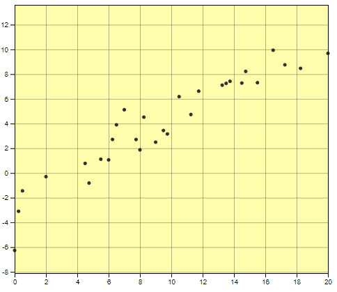

class:title-slide-custom

```{r, child = "style.Rmd"}
```


```{r setup, echo = FALSE, message = FALSE, warning = FALSE}
# Packages
library(emoji)
library(purrr)
library(tidyverse)
library(gridExtra)
library(nullabor)
library(scales)
library(knitr)
library(kableExtra)
library(RefManageR)
library(iconr)
library(fontawesome)
# download_fontawesome()

# References
bib <- ReadBib("bib/references.bib", check = FALSE)
ui <- "- "

# R markdown options
knitr::opts_chunk$set(echo = FALSE, 
                      message = FALSE, 
                      warning = FALSE, 
                      cache = FALSE,
                      dpi = 300)
options(htmltools.dir.version = FALSE)
options(knitr.kable.NA = '')
```

```{r, include = F, eval = T, cache = F}
clean_file_name <- function(x) {
  basename(x) %>% str_remove("\\..*?$") %>% str_remove_all("[^[A-z0-9_]]")
}
img_modal <- function(src, alt = "", id = clean_file_name(src), other = "") {
  
  other_arg <- paste0("'", as.character(other), "'") %>%
    paste(names(other), ., sep = "=") %>%
    paste(collapse = " ")
  
  js <- glue::glue("<script>
        /* Get the modal*/
          var modal{id} = document.getElementById('modal{id}');
        /* Get the image and insert it inside the modal - use its 'alt' text as a caption*/
          var img{id} = document.getElementById('img{id}');
          var modalImg{id} = document.getElementById('imgmodal{id}');
          var captionText{id} = document.getElementById('caption{id}');
          img{id}.onclick = function(){{
            modal{id}.style.display = 'block';
            modalImg{id}.src = this.src;
            captionText{id}.innerHTML = this.alt;
          }}
          /* When the user clicks on the modalImg, close it*/
          modalImg{id}.onclick = function() {{
            modal{id}.style.display = 'none';
          }}
</script>")
  
  html <- glue::glue(
     " <!-- Trigger the Modal -->

<!-- The Modal -->
<div id='modal{id}' class='modal'>
  <!-- Modal Content (The Image) -->
  
  <!-- Modal Caption (Image Text) -->
  <div id='caption{id}' class='modal-caption'></div>
</div>
"
  )
  write(js, file = "js-addins.html", append = T)
  return(html)
}
# Clean the file out at the start of the compilation
write("", file = "js-addins.html")
```

<br><br><br>
## ‘You Draw It’: Implementing human interaction in R shiny with r2d3
### 2022 Appsilon Shiny Conference
#### Emily A. Robinson
#### Department of Statistics, University of Nebraska - Lincoln
##### `r fa("envelope", fill = "black")` [emily.robinson@huskers.unl.edu](emily.robinson@huskers.unl.edu)
##### `r fa("home", fill = "black")` [www.emilyarobinson.com](https://www.emilyarobinson.com/)
##### `r fa("github", fill = "black")` [earobinson95](https://github.com/earobinson95)
<br><br>
.medium[*Slides: https://bit.ly/3ENZmOZ*]

???

Thank you for coming to my talk at whatever time it is where you are joining from. I am going to be sharing some of my work on using R2D3 and Shiny to test statistical graphics.

---
class:primary
# Outline

`r fa_i("chart-line")` Background of graphical testing and measuring patterns

`r fa_i("js")` `r fa_i("plus")` `r fa_i("r-project")` Integration of D3.js and R Shiny

`r fa_i("pen")` Test your drawing skills!

`r fa_i("check")` Validation and Application

`r fa_i("spinner")` Future Work

???

During my talk, I will first provide a brief background on graphical testing and how it relates to detecting trends and patterns in data. Then I will talk about the development process behind the scenes and you will get a chance to test out your drawing skills. Finally, I will share results from the validation study and plans for future work.

---
class:primary
# Background

**Testing statistical graphics**

+ Evaluate design choices and understand cognitive biases through the use of visual tests.
+ Researchers conduct studies in which human subjects are asked to conduct tasks related to the perception of statistical charts such as differentiation, prediction, estimation, and extrapolation. 

???

We all use statistical graphics, but how do we know that the graphics we use are communicating properly? Through experimentation, graphical testing methods allow researchers to conduct studies geared at understanding human ability to conduct tasks related to the perception of statistical charts such as differentiation, prediction, estimation, and extrapolation. Efforts in the field of statistical graphics have developed graphical testing tools and methods and all of these types of tests require different levels of use and manipulation of the information being presented in the chart. With the advancement of graphing software, we have the tools necessary to develop new methods of testing.

--

**Measuring Patterns & Trends**

+ Our visual system is naturally built to look for structure and identify patterns.
+ Physical manipulation: maneuvering a string, black thread, or ruler until the fit is suitable, then drawing the line through the set of points `r Citep(bib[[c("mosteller1981eye", "finney1951subjective")]])`
+ `r Citet(bib[[c("ciccione2021")]])` conducted a comprehensive set of studies based on psychophysical approaches. 

???

One such aspect of interest is the ability to identify and detect trends. Our visual system is naturally built to look for structure and identify patterns. For instance, points going down from left to right indicates a negative correlation between the x and y variables. Initial studies in the 20th century explored the use of fitting lines by eye through a set of points through physical manipulation methods such as maneuvering a string, black thread, or ruler until the fit is suitable, then drawing the line through the set of points. Recently, a study in 2021 conducted a comprehensive set of studies investigating human ability to detect trends in graphical representations from a psychophysical approach.

--

**How can we compare our intuitive visual sense of patterns to those determined by statistical methods?**


???

**How can we compare our intuitive visual sense of patterns to those determined by statistical methods?**

---
class:primary
# 'You Draw It' feature 
## (New York Times, 2015)
.pull-left[

.center[
`r Citep(bib[[c("katz_2017")]])`
]
].pull-right[

Readers are asked to input their own assumptions about various metrics and compare how these assumptions relate to reality.

+ [Family Income affects college chances](https://www.nytimes.com/interactive/2015/05/28/upshot/you-draw-it-how-family-income-affects-childrens-college-chances.html) `r Citep(bib[[c("aisch_cox_quealy_2015")]])`
+ [Just How Bad Is the Drug Overdose Epidemic?](https://www.nytimes.com/interactive/2017/04/14/upshot/drug-overdose-epidemic-you-draw-it.html) `r Citep(bib[[c("katz_2017")]])`
+ [What Got Better or Worse During Obama’s Presidency](https://www.nytimes.com/interactive/2017/01/15/us/politics/you-draw-obama-legacy.html?_r=0) `r Citep(bib[[c("buchanan_park_pearce_2017")]])`
]

???

In 2015, the New York Times introduced an interactive feature, called ‘You Draw It’, where readers input their own assumptions about various metrics and compare how these assumptions relate to reality. The Times team utilizes Data Driven Documents (D3) that allows readers to predict these metrics through the use of drawing a line on their computer screen with their mouse.

--

The New York Times team utilizes **Data Driven Documents (D3)** that allows readers to predict these metrics through the use of drawing a line on their computer screen with their mouse.


???

The goal of this research is to implement ‘You Draw It,’ adapted from the New York Times feature, as a way to measure the patterns we see in data. In the rest of the presentation, I am going to provide a high level overview of the technical details of the software development which utilized interactive graphics in R. I will then share results from a study which validates ‘You Draw It’ as a method for graphical testing and recommend an appropriate data analysis method to the participant data.

---
class:primary
# Background of D3

**Who?** [Mike Bostock](https://observablehq.com/@mbostock) created D3 during his time working on graphics at the New York Times.
  
**What?** Open-source JavaScript based graphing framework
+ D3 = "Data Driven Documents"
+ `D3` is to JavaScript as `ggplot2` is to R
+ Framework for binding objects and layers to plotting area
  + framework for movement and user interaction

**When?** D3 v1.0 released in 2011.

**Where?** The internet!

**Why?** Advantages of using D3 include animation and allowing for movement and user interaction.

**How?** `r2d3`!

???

Data Driven Documents (D3) is a JavaScript-based graphing framework that facilitates user interaction. It is used by major news and research organizations such as the New York Times, FiveThirtyEight, Washington Post, and the Pew Research Center to create and customize graphics.

---
class:primary
# Relationship between D3 and R 

.pull-left[
The `r2d3` package `r Citep(bib[[c("r2d3_pkg")]])` in R provides an efficient integration of D3 visuals and R by displaying them in familiar formats:
+ RMarkdown with HTML output
+ Shiny applications (amazing!)

].pull-right[
.center[ 
 
]
]

`r2d3` makes it easy to do your data processing in R, then apply D3.js code to visualize that data!

???

A challenge of working with D3 is the environment necessary to display the graphics and images. 

The `r2d3` package in R provides an efficient integration of D3 visuals and R by displaying them in familiar formats:
+ RMarkdown with HTML output
+ Shiny applications (amazing!)

`r2d3` makes it easy to do your data processing in R, then apply D3.js code to visualize that data!

--
.pull-left[
**How?**
+ Converts data in R to JSON that can be interpreted by JavaScript
+ Sources D3 code library
+ Creates plot container (svg)
+ Renders plot using source code
].right-plot[
```{r r2d3-example, echo = T, eval = F}
r2d3(data = data,
     script = "d3-source-code.js",
     d3_version= "5")
```
]

???

The example R code illustrates the structure of the r2d3 function which includes specification of a data frame in R (converted to a JSON file), the D3.js source code file, and the D3 version that accompanies the source code. The r2d3 function then renders the plot using the source code.

---
class:primary
# Getting started with D3

`D3.js` is to JavaScript as `ggplot2` is to R

.pull-left[
`r fa_i("js")` [Codecademy: Introduction to JavaScript](https://www.codecademy.com/learn/introduction-to-javascript)

`r fa_i("image")` Understand [SVG](http://tutorials.jenkov.com/svg/g-element.html) elements: inspect elements in web browser!

`r fa_i("book-open")` Amelia Wattenberger's [Full Stack D3 and Data Visualization Book](https://www.newline.co/fullstack-d3)

`r fa_i("chart-bar")` Build a basic graphic using [r2d3](https://rstudio.github.io/r2d3/articles/introduction.html)

`r fa_i("grimace")` Modify `D3.js` code until it does what you want!
]
.pull-right[
**Additional Resources**

`r fa_i("code")` [How to learn D3 with no coding experience](https://www.heshameissa.com/blog/learn-d3)

`r fa_i("twitter")` Amelia Wattenberger on [Twitter](https://twitter.com/Wattenberger)
]

???

When I first started working on this, I was comfortable working with R and Shiny, however, I had almost no experience working with JavaScript. I wanted to share some resources that I found useful in learning to create graphics using D3. One thing to know is that D3 uses SVG's (scalable vector graphics) which preserves shapes rather than pixels and follows a layered element framework. I highly recommend Amelia Wattenberger's Full Stack D3 and Data Visualization book. She does not use R html formats as her environment, but the examples and D3 source code can easily be implemented in any formats you might be familiar with.

---
class:primary
# 'You Draw It' task plot

Prompt: *Use your mouse to fill in the trend in the yellow box region.*

.pull-left[

].pull-right[

]

**Test out your drawing skills at [emily-robinson.shinyapps.io/can-you-draw-it](https://emily-robinson.shinyapps.io/can-you-draw-it).**

???

Here you see an example of 'You Draw It' interactive plots. In graphical testing, participants are prompted to: "Use your mouse to fill in the trend in the yellow box region". The yellow box region then moves along as the participant draws their trend-line until the yellow region disappears.

In the chat, you can follow the link provided to use your mouse and test out your drawing skills.

You can feel free to take a look at the working pieces behind the scenes with showcase display mode and we will talk a little more about this on the next slide as well.

---
class:primary
# Code sketch

<br>
.center[ 
 
]

???

We conduct all data simulation and processing in R and output two data sets - point data and line data -
containing (x, y) coordinates corresponding to either a simulated point or fitted value predicted by a statistical model respectively. Then, the r2d3 package converts the data sets in R to JSON to be interpreted by the D3.js code. We define functions in D3.js to draw the initial plot and set up drawable points for the user drawn line. Drag events in D3.js are utilized to observe and react to user input. Shiny Messages are used to communicate the user interaction between the D3 code and the R environment. The plot is then rendered and updated on user interaction into the R shiny application with the `RenderD3` and `d3Output` functions. Parameters for aesthetic design choices are defined in a list of options and r2d3 passes these to the D3.js code. For instance, we can specify the buffer space allowed for the x and y axes to avoid users to anchor their lines to the axes limits.

---
class:primary
# Validation study

Replicated *Eye Fitting Straight Lines* by `r Citet(bib[[c("mosteller1981eye")]])`

.pull-left[
+ **Big Idea:** Students fitted lines by eye to four sets of points.
+ **Method:** 8.5 x 11 inch transparency with a straight line etched across the middle.
+ **Sample:** 153 graduate students and post docs in Introductory Biostatistics.
+ **Experimental Design:** Latin square.
+ **Findings:** Students tended to fit the slope of the first principal component.
].pull-right[ 

]

???

We conducted a study in order to validate ‘You Draw It’ as a method for graphical testing, comparing results
to the less technological method utilized in Mosteller et al. (1981). In this study, participants were asked to fit lines by eye to four sets of points using an 8.5 x 11 inch transparency. Their results showed that students tended to fit the slope of the first principal component as opposed to the slope of the ordinary least squares regression.

--

Experiment conducted and distributed through an R Shiny application found at [emily-robinson.shinyapps.io/you-draw-it-validation-applet/](https://emily-robinson.shinyapps.io/you-draw-it-validation-applet/) in May 2021 with 35 participants completing 119 unique 'You Draw It' task plots.

???

In our study, participants were asked to draw a line through a set of points with the 'You Draw It' method. We simulated data meant to reflect the four data sets in the 1981 study. This experiment was conducted and distributed through an R Shiny application.

---
class:primary
# Validation study
 
.pull-left[ 

Compare participant drawn line to **statistical regression results**.

```{r results='asis', echo = F, include = T, cache = F, eval = TRUE}
i1 <- img_modal(src = "images/pca-plot.jpg", alt = " ", other=list(width="100%"))

c(str_split(i1, "\\n", simplify = T)[1:2],
  str_split(i1, "\\n", simplify = T)[3:9]
  ) %>% paste(collapse = "\n") %>% cat()
```

].pull-right[ 

Interested in the **vertical residuals** between the drawn and fitted values.

```{r results='asis', echo = F, include = T, cache = F, eval = TRUE}
i1 <- img_modal(src = "images/eyefitting-trial-plot.png", alt = " ", other=list(width="100%"))

c(str_split(i1, "\\n", simplify = T)[1:2],
  str_split(i1, "\\n", simplify = T)[3:9]
  ) %>% paste(collapse = "\n") %>% cat()
```
]

???
We compare the participant drawn line to two regression lines determined by ordinary least squares regression and regression based on the principal axis. This figure illustrates the difference between an OLS regression line which minimizes the vertical distance of points from the line and a regression line based on the principal axis (Principal Component) which minimizes the Euclidean distance of points (orthogonal) from the line, capturing the variability in both the horizontal and vertical directions.

From our study, we collect data on the participant drawn values, the fitted values from the ordinary least squares regression, and the fitted values from the regression based on the principal axis for that unique data set. We are mainly interested in the deviation of the participant drawn line from the fitted regression lines. So while it seems counter-intuitive, the residual actually becomes our response in this case.

---
class:primary
# Validation study

.pull-left[
**Linear Trend Constraint**

.center[
```{r results='asis', echo = F, include = T, cache = F, eval = TRUE}
i1 <- img_modal(src = "images/eyefitting-lmer-plot.png", alt = " ", other=list(width="110%"))

c(str_split(i1, "\\n", simplify = T)[1:2],
  str_split(i1, "\\n", simplify = T)[3:9]
  ) %>% paste(collapse = "\n") %>% cat()
```
]
].pull-right[

**Generalized Additive Mixed Model (GAMM)**

.center[
```{r results='asis', echo = F, include = T, cache = F, eval = TRUE}
i1 <- img_modal(src = "images/eyefitting-gamm-plot.png", alt = " ", other=list(width="110%"))

c(str_split(i1, "\\n", simplify = T)[1:2],
  str_split(i1, "\\n", simplify = T)[3:9]
  ) %>% paste(collapse = "\n") %>% cat()
```
]
]

???

Linear mixed model and a Generalized Additive Mixed Model (GAMM) were used to evaluate the vertical residuals in order to statistically compare visually fitted trends to actual metrics, simulated data models, or statistical regression results. A benefit of using a GAMM is the estimation of smoothing splines, allowing for flexibility in the residual trend.

Results from our study were consistent with those found in the previous study; when shown points
following a linear trend, participants tended to fit the slope of the first principal component over the slope of the least-squares regression line. This trend was most prominent when shown data simulated with larger variances. This study reinforces the differences between intuitive visual model fitting and statistical model fitting, providing information about human perception as it relates to the use of statistical graphics. This also laid the foundation for recommending the use of GAMMS as an analysis method of the collected data.


---
class:primary
# Coming soon for 'You Draw It'\!

**Software Development**

`r fa_i("r-project")` R package designed for easy implementation of ‘You Draw It’ task plots.

**Future Applications**

`r fa_i("chart-line")` Evaluate human's ability to make future predictions from trends and to fit curved trend lines.

`r fa_i("cloud")` Apply 'You Draw It' to other fields in order to evaluate science communication using graphics.

**Publications**

`r fa_i("readme")` [Under Review] Robinson, E. A., VanderPlas, S., Howard, R., (2021) Eye Fitting Straight Lines in the Modern Era. Submitted to *Journal of Computational and Graphical Statistics*. [Access on GitHub.](https://earobinson95.github.io/Eye-Fitting-Straight-Lines-in-the-Modern-Era/Eye-Fitting-Straight-Lines-in-the-Modern-Era.pdf)


???

While some technical details were presented here, I intend to create an R package designed for easy implementation of ‘You Draw It’ task plots in order to make this tool accessible to other researchers. Further investigation is necessary to implement this method with real data in order to facilitate scientific communication and to evaluate the ability to make future predictions and looka t forcasting biases.

---
class:primary
# References
<font size="3">
```{r, print_refs1, results='asis', echo=FALSE, warning=FALSE, message=FALSE}
print(bib[[c("finney1951subjective", "mosteller1981eye", "ciccione2021", "r2d3_pkg", "katz_2017", "aisch_cox_quealy_2015", "buchanan_park_pearce_2017")]], 
      .opts = list(check.entries = FALSE, style = "html", bib.style = "authoryear")
      )
```
</font>

---
class:inverse
<br>
<br>
<br>
.center[
# Thank you! 
### Acknowledgments: Dr. Susan VanderPlas and Dr. Reka Howard
<br>
<br>
`r fa("envelope", fill = "white")` **emily.robinson@huskers.unl.edu**
`r fa("home", fill = "white")` **www.emilyarobinson.com**
`r fa("github", fill = "white")` **earobinson95**
]

???

Big thanks to my advisers at UNL, Dr. Susan VanderPlas and Dr. Reka Howard, for guiding me through this research.