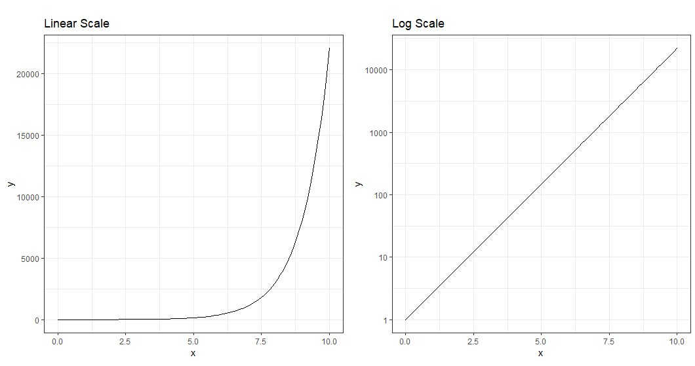
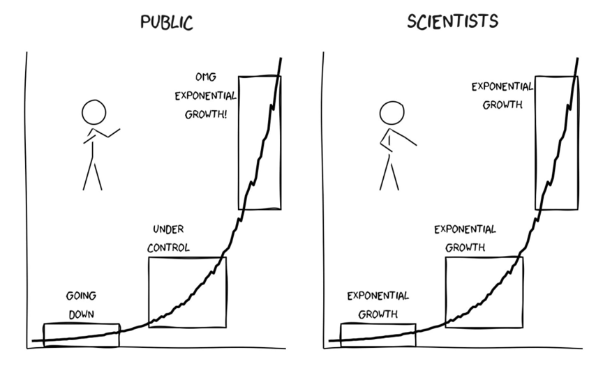

class:title-slide-custom

```{r, child = "style.Rmd"}
```


```{r setup, echo = FALSE, message = FALSE, warning = FALSE}

# Packages
library(emoji)
library(purrr)
library(tidyverse)
library(gridExtra)
library(nullabor)
library(scales)
library(knitr)
library(kableExtra)
library(RefManageR)
library(iconr)
library(fontawesome)
# download_fontawesome()

# References
library(RefManageR)
bib <- ReadBib("bib/thesis.bib", check = FALSE)
ui <- "- "

# R markdown options
knitr::opts_chunk$set(echo = FALSE, 
                      message = FALSE, 
                      warning = FALSE, 
                      cache = FALSE,
                      dpi = 300)
options(htmltools.dir.version = FALSE)
options(knitr.kable.NA = '')
```

```{r, include = F, eval = T, cache = F}
clean_file_name <- function(x) {
  basename(x) %>% str_remove("\\..*?$") %>% str_remove_all("[^[A-z0-9_]]")
}
img_modal <- function(src, alt = "", id = clean_file_name(src), other = "") {
  
  other_arg <- paste0("'", as.character(other), "'") %>%
    paste(names(other), ., sep = "=") %>%
    paste(collapse = " ")
  
  js <- glue::glue("<script>
        /* Get the modal*/
          var modal{id} = document.getElementById('modal{id}');
        /* Get the image and insert it inside the modal - use its 'alt' text as a caption*/
          var img{id} = document.getElementById('img{id}');
          var modalImg{id} = document.getElementById('imgmodal{id}');
          var captionText{id} = document.getElementById('caption{id}');
          img{id}.onclick = function(){{
            modal{id}.style.display = 'block';
            modalImg{id}.src = this.src;
            captionText{id}.innerHTML = this.alt;
          }}
          /* When the user clicks on the modalImg, close it*/
          modalImg{id}.onclick = function() {{
            modal{id}.style.display = 'none';
          }}
</script>")
  
  html <- glue::glue(
     " <!-- Trigger the Modal -->

<!-- The Modal -->
<div id='modal{id}' class='modal'>
  <!-- Modal Content (The Image) -->
  
  <!-- Modal Caption (Image Text) -->
  <div id='caption{id}' class='modal-caption'></div>
</div>
"
  )
  write(js, file = "js-addins.html", append = T)
  return(html)
}
# Clean the file out at the start of the compilation
write("", file = "js-addins.html")
```

<br><br>
# Eye Fitting Straight Lines in the Modern Era
## Joint Statistical Meetings
### August 8, 2022
#### Emily Robinson 
#### Department of Statistics, University of Nebraska - Lincoln 
##### `r fa("envelope", fill = "black")` [emily.robinson@huskers.unl.edu](emily.robinson@huskers.unl.edu) 
##### `r fa("home", fill = "black")` [www.emilyarobinson.com](https://www.emilyarobinson.com/) 
##### `r fa("github", fill = "black")` [earobinson95](https://github.com/earobinson95)

???
Thank you for inviting me for a visit today and for attending my talk.

---
class:primary
# Outline

+ Introduction to Graphical Testing

+ Let's see your drawing skills!

+ Eye Fitting Straight Lines in the Modern Era

+ Logarithmic Perception

+ Prediction of Exponential Growth

+ Future Work

???
In my talk today I am going to introduce graphical testing and give you a chance to participate in a graphical testing task. I will then provide validation for a modern method of fitting visual regression lines. My dissertation work specifically addresses the perception of logarithmic scales and exponential growth. I will then conclude with my future work.

---
class:primary
# Introduction to Graphics

Data visualization is defined as the art of drawing **graphical charts** in order to display data `r Citep(bib[[c("unwin2020data")]])`.

**What are graphics useful for?** `r Citep(bib[[c("lewandowsky1989perception")]])`

`r emoji("graph")` Data cleaning.

`r emoji("magnifying")` Exploring data structure.

`r emoji("bubble")` Communicating information.

**Who uses graphics?**
+ Governments `r Citep(bib[[c("harms1991august", "playfair1801statistical", "walker2013statistical")]])`.
+ Companies `r Citep(bib[[c("chandar2012graph", "yates1985graphs")]])`.
+ News sources and mass media `r Citep(bib[[c("Aisch_NYTimes_presidential_forecast")]])`.
+ Scientific publications `r Citep(bib[[c("gouretski2007much")]])`.

???
To get started, we are first going to lay the foundation of graphics. Data visualization has become central tool in modern data science and statistics. Unwin 2020 defines data visualization as the art of drawing graphical charts in order to display data.

Graphics are useful for data cleaning, exploring data structure, and communicating information.

In the 18th and 19th century, governments began using graphics to understand population and economic interests. In the 20th century, we saw companies using graphics to understand the inner workings of their business and support their business decision. We often see news source displaying graphics of weather forecasts such as hurricane trajectories. Today, we see graphics everywhere from scientific journals to mass media in the newspapers, TV, and internet.

Despite the popularity of graphics, we are too accepting of them as default without asking critical questions about the graphics we create or view (Unwin, 2020). We must begin asking ourselves **How effective is this graph at communicating useful information?**

Higher quality of technology has influenced the creation, replication, and complexity of graphics. We now have an infinitely many number design choices:
+ variables displayed, type of graphic, size of graphic, aspect ratio, colors, symbols, scales, limits, ordering of categorical variables

There is a need for an established set of concepts and terminology to build their graphics from so they can actively choose which of many possible graphics to draw in order to ensure their charts are effective at communicating the intended result.

---
class:primary
# Testing Statistical Graphics

Evaluate design choices and understand cognitive biases through the use of **visual tests**. 

Could ask participants to:

`r emoji("graph")` identify differences in graphs.

`r emoji("book")` read information off of a chart accurately. 

`r emoji("international")` use data to make correct real-world decisions.

`r emoji("pencil2")` predict the next few observations.

???

How do we know graphics work and are effective? 

One way we can evaluate these design choices through the use of graphical tests. 

Could ask participants to:

- identify differences in graphs.
- read information off of a chart accurately.
- use data to make correct real-world decisions.
- predict the next few observations.

All of these types of tests require different levels of use and manipulation of the information presented in the chart.

There are different ways of engaging in graphics and how effective the graphic is depends on how you engage with the chart. 

---
class:primary
# Lineup Protocol (Buja et. al, 2009)

Embed a **target plot** (actual data) in a lineup of **null plots** (randomly permuted data sets).

```{r, echo = F, fig.width = 8, fig.height = 6, out.width = "75%", fig.align='center'}
library(nullabor)
data(banknote, package = "mclust")
lineup(null_permute("Status"), banknote, pos = 8) %>%
ggplot() + 
  geom_jitter(aes(x = Left, y = Right, color = Status), shape = 1) + 
  facet_wrap(~.sample) + 
  coord_fixed() + 
  theme_bw() +
  theme(axis.text = element_blank()) +
  scale_color_manual(values = c("orange", "steelblue"))
```

???

Efforts in the field of graphics have developed graphical testing tools and methods such as the lineup protocol to provide a framework for inferential testing.

Here we see what is called a lineup. The idea is to embed the true data plot (called target plot) into a set of randomly permuted data sets (called null plots).

This is similar to the law-enforcement procedure to line up a suspect among a set of innocents to check if a victim can identify the suspect as the perpetrator of the crime.

Here, visual evaluation of the lineup is conducted by a person. If the viewers detect the target plot, we can conclude the plots are distinguishable.

The lineup protocol is one such example of the development of tools designed for statistical graphical testing. The advancement of graphing software provides the tools necessary to develop new methods of testing graphics.

---
class:inverse
<br>
<br>
<br>
<br>
<br>
<br>
<br>
.center[
# Eye Fitting Straight Lines in the Modern Era
]

---
class:primary
# Linear Regression 

The principle of simple linear regression is to find the line (i.e., determine its equation) which passes as close as possible to the observations, that is, the set of points.

```{r linear-regression, echo = F, fig.width = 6, fig.height = 9/2, out.width = "70%", fig.align='center'}
library(ggplot2)
library(magrittr)
library(plyr)

set.seed(2)
corrCoef = 0.5 # sample from a multivariate normal, 10 datapoints
dat = MASS::mvrnorm(10,c(0,0),Sigma = matrix(c(1,corrCoef,2,corrCoef),2,2))
dat[,1] = dat[,1] - mean(dat[,1]) # it makes life easier for the princomp
dat[,2] = dat[,2] - mean(dat[,2])

dat = data.frame(x1 = dat[,1],x2 = dat[,2])

dat %>%
ggplot(aes(x1,x2))+
  geom_point()+
  coord_equal()+
  scale_x_continuous("x") +
  scale_y_continuous("y") +
  theme_bw(base_size = 14) +
  theme(aspect.ratio = 1,
        legend.position = "none",
        axis.text    = element_text(size = 12),
        axis.title   = element_text(size = 12),
        legend.title = element_blank(),
        legend.key.size = unit(1, "line")
        )
```

???
Linear regression is a statistical approach that allows to assess the linear relationship between two quantitative variables. 

---
class:primary
# Linear Regression

The principle of simple linear regression is to **find the line** (i.e., determine its equation) which passes as close as possible to the observations, that is, the set of points.

```{r linear-regression2, echo=F, fig.align='center', fig.height=9/2, fig.width=6, message=FALSE, warning=FALSE, out.width="70%"}
dat %>%
ggplot(aes(x1,x2))+
  geom_point()+
  geom_abline(intercept = -0.1, slope = 0.8, color = "black", linetype = "solid") +
  geom_abline(intercept = 0, slope = 0.4, color = "black", linetype = "solid") +
  geom_abline(intercept = -0.2, slope = 1.1, color = "black", linetype = "solid") +
  coord_equal()+
  scale_x_continuous("x") +
  scale_y_continuous("y") +
  theme_bw(base_size = 14) +
  theme(aspect.ratio = 1,
        legend.position = "none",
        axis.text    = element_text(size = 12),
        axis.title   = element_text(size = 12),
        legend.title = element_blank(),
        legend.key.size = unit(1, "line")
        )
```

???

The principle of simple linear regression is to **find the line** (i.e., determine its equation) which passes as close as possible to the observations, that is, the set of points.

---
class:primary
# Let's see your drawing skills!

.pull-left[
.center[

]
].pull-right[
.center[

<font size="6">
**SCAN ME**

OR VISIT [bit.ly/3BF56Zj](https://bit.ly/3BF56Zj)
</font>
]
<!-- <a rel='nofollow' href='https://www.qr-code-generator.com' border='0' style='cursor:default'></a> -->
]

---
class:primary
# Did it looks something like this?
.center[

]

---
class:primary
# Linear Regression

The principle of simple linear regression is to **find the line** (i.e., determine its equation) **which passes as close as possible to the observations**, that is, the set of points.

.center[

]

--

**Big Idea:** How do statistical regression results compare to intuitive, visually fitted results?

???
We are going to focus on two regression lines determined by ordinary least squares regression and regression based on the principal axis. The figure illustrates the difference between an OLS regression line which minimizes the vertical distance of points from the line and a regression line based on the principal axis (Principal Component) which minimizes the Euclidean distance of points (orthogonal) from the line. This is what we refer to as “ensemble perception” indicating the visual system can compute averages of various features in parallel across the items in a set (in this case, over the x and y-axes).

**Big Idea:** How do statistical regression results compare to intuitive, visually fitted results?

---
class:primary
# Eye Fitting Straight Lines
## `r Citet(bib[[c("mosteller1981eye")]])`
.pull-left[
+ **Big Idea:** Students fitted lines by eye to four sets of points.
+ **Method:** 8.5 x 11 inch transparency with a straight line etched across the middle.
+ **Sample:** 153 graduate students and post docs in Introductory Biostatistics.
+ **Experimental Design:** Latin square.
+ **Findings:** Students tended to fit the slope of the first principal component.
].pull-right[

]

???

I want to introduce a study conducted in 1981 called Eye Fitting Straight Lines by Mosteller et al. In this study:

+ Students fitted lines by eye to four sets of points.
+ 8.5 x 11 inch transparency with a straight line etched across the middle.
+ 153 graduate students and post docs in Introductory Biostatistics.
+ Latin square.
+ Students tended to fit the slope of the first principal component or major axis (the line that minimizes the sum of squares of perpendicular rather than vertical distances).

In the past -> draw on paper

---
class:primary
# 'You Draw It' Feature 
## (New York Times, 2015)
.pull-left[

.center[
`r Citep(bib[[c("katz_2017")]])`
]
].pull-right[

Readers are asked to input their own assumptions about various metrics and compare how these assumptions relate to reality.

+ [Family Income affects college chances](https://www.nytimes.com/interactive/2015/05/28/upshot/you-draw-it-how-family-income-affects-childrens-college-chances.html) `r Citep(bib[[c("aisch_cox_quealy_2015")]])`
+ [Just How Bad Is the Drug Overdose Epidemic?](https://www.nytimes.com/interactive/2017/04/14/upshot/drug-overdose-epidemic-you-draw-it.html) `r Citep(bib[[c("katz_2017")]])`
+ [What Got Better or Worse During Obama’s Presidency](https://www.nytimes.com/interactive/2017/01/15/us/politics/you-draw-obama-legacy.html?_r=0) `r Citep(bib[[c("buchanan_park_pearce_2017")]])`
]

???

In 2015, the New York Times developed a You Draw it feature where readers are asked to input their own assumptions about various metrics and compare how these assumptions relate to reality.

The New York Times team utilizes **Data Driven Documents (D3)** that allows readers to predict these metrics through the use of drawing a line on their computer screen with their mouse.

---
class:primary
# Research Objectives 

1. Validate ‘You Draw It’ as a method for graphical testing, comparing results to the less technological method utilized in Mosteller et al. (1981). 

2. Extend the study with formal statistical analysis methods in order to better understand the perception of linear regression.

???

The two objectives of my current research are to:

1. Validate ‘You Draw It’ as a method for graphical testing, comparing results to the less technological method utilized in Mosteller et al. (1981). 

2. Extend the study with formal statistical analysis methods in order to better understand the perception of linear regression.

---
class:primary
# 'You Draw It' Task

Study Participant Prompt: *Use your mouse to fill in the trend in the yellow box region.*

.center[

]

???

Here we see an example of a "You Draw It" task plot used in the study. Participants are prompted to "Use your mouse to fill in the trend in the yellow box region. The yellow box region moves along as the participant draws their trend-line until the yellow region disappears." 

Task plots were created using Data Driven Documents (D3), a JavaScript-based graphing framework that facilitates user interaction. We then integrate this into RShiny using the r2d3 package.

---
class:primary
# Data Generation

.pull-left[

$N = 30$ points $(x_i, y_i), i = 1,...N$ were generated for $x_i \in [x_{min}, x_{max}]$.

Data were simulated based on linear model with additive errors:
\begin{equation}
y_i = \beta_0 + \beta_1 x_i + e_i
\end{equation}

where $e_i \sim N(0, \sigma^2).$

Parameters $\beta_0$ and $\beta_1$ were selected to reflect the four data sets used in `r Citet(bib[[c("mosteller1981eye")]])`.

].pull-right[
```{r results='asis', echo = F, include = T, cache = F, eval = TRUE}
i1 <- img_modal(src = "images/eyefitting-example-simplot.png", alt = " ", other=list(width="100%"))

c(str_split(i1, "\\n", simplify = T)[1:2],
  str_split(i1, "\\n", simplify = T)[3:9]
  ) %>% paste(collapse = "\n") %>% cat()
```
]

???

Data were generated following a linear model with additive errors. 

Model equation parameters, $\beta_0$ and $\beta_1$, were selected to reflect the four data sets (F, N, S, and V) used in Mosteller et al. (1981). 

+ **S:** positive slope; small variance; $x \in [0, 20]$. 
+ **F:** positive slope; a large variance; $x \in [0, 20]$.  
+ **V:** steep positive slope; small variance; $x \in [4, 16]$. 
+ **N:** negative slope; large variance; $x \in [0, 20]$. 

---
class:primary
# Study Design

+ Participants recruited through Twitter, Reddit, and direct email in May 2021.

+ A total of 35 individuals completed 119 unique you draw it task plots.

+ Data sets were generated randomly, independently for each participant at the start of the experiment. 

+ Participants shown 2 practice plots followed by 4 task plots randomly assigned for each individual in a completely randomized design.

+ Experiment conducted and distributed through an RShiny application found [**here**](https://emily-robinson.shinyapps.io/you-draw-it-pilot-app/).

???
Participants were recruited through through Twitter, Reddit, and direct email in May 2021. The experiment was conducted and distributed through an RShiny application. Participants were first shown 2 practice plots followed by the 4 You Draw It task plots randomly assigned for each individual in a completely randomized design.

---
class:primary
# Model Data
 
.pull-left[
For each participant, the final data set used for analysis contains:
+ $x_{ijk}$, $y_{ijk,drawn}$, $\hat y_{ijk,OLS}$, $\hat y_{ijk,PCA}$

for 
+ parameter choice $i = 1,2,3,4$, 
+ participant j = $1,...N_{participant}$ 
+ $x_{ijk}$ value corresponding to increment $k = 1, ...,4 x_{max} + 1$.

**Vertical residuals** between the drawn and fitted values were calculated as: 
+ $e_{ijk,OLS} = y_{ijk,drawn} - \hat y_{ijk,OLS}$
+ $e_{ijk,PCA} = y_{ijk,drawn} - \hat y_{ijk,PCA}$.

].pull-right[ 

```{r results='asis', echo = F, include = T, cache = F, eval = TRUE}
i1 <- img_modal(src = "images/eyefitting-trial-plot.png", alt = " ", other=list(width="100%"))

c(str_split(i1, "\\n", simplify = T)[1:2],
  str_split(i1, "\\n", simplify = T)[3:9]
  ) %>% paste(collapse = "\n") %>% cat()
```
]

???
We compare the participant drawn line to two regression lines determined by ordinary least squares regression and regression based on the principal axis. The figure illustrates the difference between an OLS regression line which minimizes the vertical distance of points from the line and a regression line based on the principal axis (Principal Component) which minimizes the Euclidean distance of points (orthogonal) from the line.

Here we see an example of the feedback data from one you draw it plot. For 0.25 increments across the domain, we have the participant drawn values, the fitted values from the ordinary least squares regression, and the fitted values from the regression based on the principal axis. 

We are mainly interested in the deviation of the participant drawn line from the fitted regression lines. So while it seems counter-intuitive, the residual actually becomes our response in this case.

---
class:primary
# Linear Trend Constraint
The **Linear Mixed Model** equation for each fit (OLS and PCA) residuals is given by:
\begin{equation}
e_{ijk,fit} = \left[\gamma_0 + \alpha_i\right] + \left[\gamma_{1} x_{ijk} + \gamma_{2i} x_{ijk}\right] + p_{j} + \epsilon_{ijk}
\end{equation}
where

+ $e_{ijk,fit}$ is the residual between the drawn and fitted y-values for the $i^{th}$ parameter choice, $j^{th}$ participant, and $k^{th}$ increment of x-value corresponding to either the OLS or PCA fit
+ $\gamma_0$ is the overall intercept
+ $\alpha_i$ is the effect of the $i^{th}$ parameter choice (F, S, V, N) on the intercept
+ $\gamma_1$ is the overall slope for $x$
+ $\gamma_{2i}$ is the effect of the parameter choice on the slope
+ $x_{ijk}$ is the x-value for the $i^{th}$ parameter choice, $j^{th}$ participant, and $k^{th}$ increment
+ $p_{j} \sim N(0, \sigma^2_{participant})$ is the random error due to the $j^{th}$ participant's characteristics
+ $\epsilon_{ijk} \sim N(0, \sigma^2)$ is the residual error.

???

Using the `lmer` function in the lme4 package, a linear mixed model (LMM) is fit separately to the OLS and PCA residuals, constraining the fit to a linear trend. 

---
class:primary
# Linear Trend Constraint

.center[

]

???
Results indicate the estimated trends of PCA residuals (orange) appear to align closer to the y = 0 horizontal (dashed) line than the OLS residuals (blue). In particular, this trend is more prominent in parameter choices with large variances (F and N). These results are consistent to those found in Mosteller
et al. (1981) indicating participants fit a trend-line closer to the estimated regression line with the slope of based on the first principal axis than the estimated OLS regression line.

---
class:primary
# Smoothing Spline Trend
The **Generalized Additive Mixed Model** equation for each fit (OLS and PCA) residuals is given by: 
\begin{equation}
e_{ijk,fit} = \alpha_i + s_{i}(x_{ijk}) + p_{j} + s_{j}(x_{ijk})
\end{equation}
where 

+ $e_{ijk,fit}$ is the residual between the drawn and fitted y-values for the $i^{th}$ parameter choice, $j^{th}$ participant, and $k^{th}$ increment of x-value corresponding to either the OLS or PCA fit
+ $\alpha_i$ is the intercept for the parameter choice $i$
+ $s_{i}$ is the smoothing spline for the $i^{th}$ parameter choice
+ $x_{ijk}$ is the x-value for the $i^{th}$ parameter choice, $j^{th}$ participant, and $k^{th}$ increment
+ $p_{j} \sim N(0, \sigma^2_{participant})$ is the error due to participant variation
+ $s_{j}$ is the random smoothing spline for each participant.

???

Eliminating the linear trend constraint, the `bam` function in the mgcv package is used to fit a generalized additive mixed model (GAMM) separately to the OLS and PCA residuals to allow for estimation of smoothing splines.

---
class:primary
# Smoothing Spline Trend

.center[

]

???
The results of the GAMM align with those in the linear constraint trend providing support that for scatter-plots with more noise (F and N), estimated trends of PCA residuals (orange) appear to align closer to the y = 0 horizontal (dashed) line than the OLS residuals (blue). However, By fitting smoothing splines, we can determine whether participants naturally fit a straight trend-line to the set of points or whether they deviate throughout the domain providing us with further insight into the curvature humans perceive in a set of points.

---
class:primary
# Conclusion

**Research Objectives:** 

1. Validate ‘You Draw It’ as a method for graphical testing, comparing results to the less technological method utilized in Mosteller et al. (1981). 

2. Extend the study found in Mosteller et al. (1981) with formal statistical analysis methods for understanding the perception of linear regression.

**Results:**
+ Estimated drawn trend-lines followed closer to the regression line based on the principal axes than the OLS regression line.

+ Most prominent in data simulated with large variances.

+ Humans perform “ensemble perception” in a statistical graphic setting.

**The reproducibility of these results serve as validation of the 'You Draw It' tool and method.**

???


1. Validate ‘You Draw It’ as a method for graphical testing, comparing results to the less technological method utilized in Mosteller et al. (1981). 

2. Extend the study found in Mosteller et al. (1981) with formal statistical analysis methods for understanding the perception of linear regression.

**Results:**
+ Estimated drawn trend-lines followed closer to the principal axes than the OLS regression line.
+ Most prominent in data simulated with large variances.
+ Humans perform “ensemble perception” in a statistical graphic setting as participants minimized the distance from the their regression line over both the x and y axis simultaneously

This study reinforces the differences between intuitive visual model fitting and statistical model fitting, providing information about human perception as it relates to the use of statistical graphics.

**The reproducibility of these results serve as validation of the 'You Draw It' tool and method.**

---
class:inverse
<br>
<br>
<br>
<br>
<br>
<br>
<br>
.center[
# Logarithmic Perception
]

---
class:primary
# Motivation

Data visualizations played an important role in during the **COVID-19 pandemic**.
.center[


`r Citep(bib[[c("fagen-ulmschneider_2020")]])` 
]

???

Data visualizations played an important role in during the COVID-19 pandemic in displaying case counts, transmission rates, and outbreak regions.

+ Mass media routinely showed charts to share information with the public about the progression of the pandemic.
+ Graphics helped guide decision makers to implement policies such as shut-downs or mandated mask wearing.
+ Facilitated communication with the public to increase compliance.  

One of the many dashboards was called 91-DIVOC (COVID-19 backwards!). Gives the viewer choices of what to show: case count, mortality, hospitalizations, standardized to population, geographic regions, scales (log/linear).

Other dashboards showed outbreak regions in the form of maps. 

---
class:primary
# Logarithmic Scales

.center[

]

???

+ **Problem:** Data which sapns several orders of magnitude shown on its original scale compresses the smaller magnitudes into relatively little area.
+ **Solution:** Use of a log scale transformation; alters the contextual appearance of the data.

---
class:primary
# Logarithmic Mapping

Our perception is **logarithmic at first**, but transitions to a **linear scale later** in development.

.center[

]

**Assumption:** If we perceive logarithmically by default, it is a natural way to display information and should be easy to read and understand/use.

???

When we first learn to count, we begin counting by ones, then by tens, and advancing to hundreds, following the base10 order of magnitude system.

Our perception and mapping of numbers to a number line is **logarithmic at first**, but transitions to a **linear scale later** in development, with formal mathematics education.
+ For example: A kindergartner asked to place numbers one through ten along a number line would place three close to the middle, following the logarithmic perspective.

Assuming there is a direct relationship between perceptual and cognitive processes, it is reasonable to assume numerical representations should also be displayed on a nonlinear, compressed number scale. Therefore, if we perceive
logarithmically by default, it is a natural (and presumably low effort) way to display information and should be easy to read and understand/use.

---
class:primary
# Benefits and Pitfalls of Log Scales

.pull-left[

**Benefits** were seen in spring 2020, during the early stages of the COVID-19 pandemic.
.center[
```{r results='asis', echo = F, include = T, cache = F, eval = TRUE}
i1 <- img_modal(src = "images/covid19-FT-03.23.2020-log.png", alt = Citep(bib[[c("burnmurdoch_2020")]]), other=list(width="100%"))

c(str_split(i1, "\\n", simplify = T)[1:2],
  str_split(i1, "\\n", simplify = T)[3:9]
  ) %>% paste(collapse = "\n") %>% cat()
```
]

].pull-right[

**Pitfalls** were exposed as the pandemic evolved, and the case counts were no longer spreading exponentially.

.center[
```{r results='asis', echo = F, include = T, cache = F, eval = TRUE}
i1 <- img_modal(src = "images/covid19-FT-linear.png", alt = Citep(bib[[c("burnmurdoch_2020")]]), other=list(width="80%"))

c(str_split(i1, "\\n", simplify = T)[1:2],
  str_split(i1, "\\n", simplify = T)[3:9]
  ) %>% paste(collapse = "\n") %>% cat()
```

```{r results='asis', echo = F, include = T, cache = F, eval = TRUE}
i1 <- img_modal(src = "images/covid19-FT-log.png", alt = Citep(bib[[c("burnmurdoch_2020")]]), other=list(width="80%"))

c(str_split(i1, "\\n", simplify = T)[1:2],
  str_split(i1, "\\n", simplify = T)[3:9]
  ) %>% paste(collapse = "\n") %>% cat()
```
]
]

???

**Benefits** were seen in spring 2020, during the early stages of the COVID-19 pandemic.

+ Large magnitude discrepancies in case counts at a given time point between different geographic regions.
+ Log scale transformations were usefulness for showing case count curves for areas with few cases and areas with many cases within one chart. 

**Pitfalls** were exposed as the pandemic evolved, and the case counts were no longer spreading exponentially.

+ Graphs with linear scales seemed more effective at spotting early increases in case counts that signaled more localized outbreaks.
+ The effect of the linear scale appears to evoke a stronger reaction from the public than the log scale.

---
class:primary
# Research Objectives

**Big Idea:** Are there benefits to displaying exponentially increasing data on a log scale rather than a linear scale?

1. [Perception of Exponential Growth](https://shiny.srvanderplas.com/log-study/) `r emoji("chart increasing")` `r emoji("chart increasing")` `r emoji("chart increasing")`

    - Test an individuals ability to perceptually differentiate exponentially increasing data with differing rates of change on both the linear and log scale.
    
2. [Prediction of Exponential Trends](https://shiny.srvanderplas.com/you-draw-it/) `r emoji("pencil2")`
    
    - Tests an individuals ability to make predictions for exponentially increasing data.
        
3. Estimation by Numerical Translation `r emoji("straight_ruler")`

    - Tests an individuals ability to translate a graph of exponentially increasing data into real value quantities.

???

When designing graphical tests, you must consider that how effective the graphic is depends on how viewers engage with the chart. There are different ways of knowing if your chart is effective and your tests need to align with this and show these. This is similar to the way you customize your teaching material to your audience.

The main goal of this research is to use graphical tests to determine if there are benefits to displaying exponentially increasing data on a log scale rather than a linear scale. We have developed three graphical tests which address different levels of graphical engagement and cognitive involvement which evaluate the perception of exponential growth, prediction of exponential growth, and translation from graphical to numerical estimation. 

---
class:primary
# Research Objectives

**Big Idea:** Are there benefits to displaying exponentially increasing data on a log scale rather than a linear scale?

1. [Perception of Exponential Growth](https://shiny.srvanderplas.com/log-study/) `r emoji("chart increasing")` `r emoji("chart increasing")` `r emoji("chart increasing")`

    - Test an individuals ability to perceptually differentiate exponentially increasing data with differing rates of change on both the linear and log scale.
    
2. [**Prediction of Exponential Trends**](https://shiny.srvanderplas.com/you-draw-it/) `r emoji("pencil2")`
    
    - **Tests an individuals ability to make predictions for exponentially increasing data.**
        
3. Estimation by Numerical Translation `r emoji("straight_ruler")`

    - Tests an individuals ability to translate a graph of exponentially increasing data into real value quantities.

???

In the rest of this presentation, I will focus on the second study which tests an individuals ability to make predictions for exponentially increasing data by utilizing the 'You Draw It' method previously introduced.

---
class:inverse
<br>
<br>
<br>
<br>
<br>
<br>
<br>
.center[
# Prediction of Exponential Growth
]

---
class:primary
# Stages of Exponential Growth
Estimation and prediction of **exponential growth is underestimated** when presented both numerically and graphically `r Citep(bib[[c("jones1979generalized",       "mackinnon1991feedback", "wagenaar1975misperception")]])`.

.center[


`r Citep(bib[[c("vonbergmann_2021")]])`
]

???
Exponential growth is often misjudged:
+ **early stage** appears to have a small growth rate.
+ **middle stage** appears to be growing, but not at an astounding rate, appearing more quadratic.
+ **late stages** exponential growth when it is quite apparent.

This misinterpretation can lead to decisions made under inaccurate understanding causing future consequences.

---
class:primary
# Data Generation

.pull-left[
$N = 30$ points $(x_i, y_i), i = 1,...N$ were generated for $x_i \in [x_{min}, x_{max}]$.

Data were simulated based on a one parameter exponential model with multiplicative errors:
\begin{equation}
y_i = e^{\beta x_i + e_i}
\end{equation}

for growth rate $\beta$ and $e_i \sim N(0, \sigma^2)$ generated by rejection sampling.

].pull-right[

]

A **nonlinear least squares regression** is then fit to the simulated points:
\begin{equation}
\hat y_{m,NLS} = e^{\hat \beta_{NLS} x_m}
\end{equation}
to obtain fitted values $(x_m, \hat y_{m,NLS})$.

???

$N = 30$ points $(x_i, y_i), i = 1,...N$ were generated for $x_i \in [x_{min}, x_{max}]$.

Data were simulated based on a one parameter exponential model with multiplicative errors:
\begin{equation}
y_i = e^{\beta x_i + e_i}
\end{equation}

for growth rate $\beta$ and $e_i \sim N(0, \sigma^2)$ generated by rejection sampling.

A **nonlinear least squares regression** is then fit to the simulated points:
\begin{equation}
\hat y_{m,NLS} = e^{\hat \beta_{NLS} x_m}
\end{equation}
to obtain fitted values $(x_m, \hat y_{m,NLS})$.

---
class:primary 
# Treatment Design

.pull-left[
2 x 2 x 2 factorial:
+ **growth rate:** low and high.
+ **points truncated:** $50\%$ and $75\%$ of the domain.
+ **scale:** log and linear.

Consistent aesthetic design choices:
+ y-axis extended $50\%$ below and $200\%$ above the simulated data range.
+ participants begin drawing at $50\%$ of the domain.

].pull-right[
.center[
```{r results='asis', echo = F, include = T, cache = F, eval = TRUE}
i1 <- img_modal(src = "images/low-10-linear.png", alt = "Low Growth Rate, 50% Truncation, Linear Scale", other=list(width="30%"))
i2 <- img_modal(src = "images/low-10-log.png", alt = "Low Growth Rate, 50% Truncation, Log Scale", other=list(width="30%"))

c(str_split(i1, "\\n", simplify = T)[1:2],
  str_split(i2, "\\n", simplify = T)[1:2],
  str_split(i1, "\\n", simplify = T)[3:9],
  str_split(i2, "\\n", simplify = T)[3:9]
  ) %>% paste(collapse = "\n") %>% cat()
```

```{r results='asis', echo = F, include = T, cache = F, eval = TRUE}
i1 <- img_modal(src = "images/low-15-linear.png", alt = "Low Growth Rate, 75% Truncation, Linear Scale", other=list(width="30%"))
i2 <- img_modal(src = "images/low-15-log.png", alt = "Low Growth Rate, 75% Truncation, Log Scale", other=list(width="30%"))

c(str_split(i1, "\\n", simplify = T)[1:2],
  str_split(i2, "\\n", simplify = T)[1:2],
  str_split(i1, "\\n", simplify = T)[3:9],
  str_split(i2, "\\n", simplify = T)[3:9]
  ) %>% paste(collapse = "\n") %>% cat()
```

```{r results='asis', echo = F, include = T, cache = F, eval = TRUE}
i1 <- img_modal(src = "images/high-10-linear.png", alt = "High Growth Rate, 50% Truncation, Linear Scale", other=list(width="30%"))
i2 <- img_modal(src = "images/high-10-log.png", alt = "High Growth Rate, 50% Truncation, Log Scale", other=list(width="30%"))

c(str_split(i1, "\\n", simplify = T)[1:2],
  str_split(i2, "\\n", simplify = T)[1:2],
  str_split(i1, "\\n", simplify = T)[3:9],
  str_split(i2, "\\n", simplify = T)[3:9]
  ) %>% paste(collapse = "\n") %>% cat()
```

```{r results='asis', echo = F, include = T, cache = F, eval = TRUE}
i1 <- img_modal(src = "images/high-15-linear.png", alt = "High Growth Rate, 75% Truncation, Linear Scale", other=list(width="30%"))
i2 <- img_modal(src = "images/high-15-log.png", alt = "High Growth Rate, 75% Truncation, Log Scale", other=list(width="30%"))

c(str_split(i1, "\\n", simplify = T)[1:2],
  str_split(i2, "\\n", simplify = T)[1:2],
  str_split(i1, "\\n", simplify = T)[3:9],
  str_split(i2, "\\n", simplify = T)[3:9]
  ) %>% paste(collapse = "\n") %>% cat()
```
]]

---
class:primary
# Study Design

+ Participants recruited through Twitter, Reddit, and direct email in May 2021.

+ A total of 35 individuals completed 280 unique you draw it task plots.

+ Data sets were generated randomly, independently for each participant at the start of the experiment. 

+ Participants shown 2 practice plots followed by 8 task plots randomly assigned for each individual in a completely randomized design.

+ Experiment conducted and distributed through an RShiny application found [**here**](https://emily-robinson.shinyapps.io/you-draw-it-pilot-app/).

???
Participants were recruited through through Twitter, Reddit, and direct email in May 2021. The experiment was conducted and distributed through an RShiny application. Participants were first shown 2 practice plots followed by the 8 You Draw It task plots randomly assigned for each individual in a completely randomized design.

---
class:primary 
# Feedback Data

.pull-left[
For each participant, the final data set used for analysis contains:
+ $x_{ijklm}$, $y_{ijklm,drawn}$, and $\hat y_{ijklm,NLS}$  

for:
+ growth rate $i = 1,2$,
+ point truncation $j = 1,2$,
+ scale $k = 1,2$,
+ participant  $l = 1,...N_{participant}$, and 
+ $x_{ijklm}$ value $m = 1, ...,4 x_{max} + 1$.

Vertical residuals between the drawn and fitted values were calculated as: 
+ $e_{ijklm,NLS} = y_{ijklm,drawn} - \hat y_{ijklm,NLS}$.

].pull-right[
```{r results='asis', echo = F, include = T, cache = F, eval = TRUE}
i1 <- img_modal(src = "images/exp-spaghetti-plot.png", alt = " ", other=list(width="100%"))

c(str_split(i1, "\\n", simplify = T)[1:2],
  str_split(i1, "\\n", simplify = T)[3:9]
  ) %>% paste(collapse = "\n") %>% cat()
```
]

---
class:primary 
# Generalized Additive Mixed Model

The GAMM equation for residuals is given by:
\begin{equation}
e_{ijklm,nls} = \tau_{ijk} + s_{ijk}(x_{ijklm}) + p_{l} + s_{l}(x_{ijklm})
\end{equation}

where

+ $e_{ijklm,NLS}$ is the residual between the drawn y-value and fitted y-value for the $l^{th}$ participant, $m^{th}$ increment, and $ijk^{th}$ treatment combination 
+ $\tau_{ijk}$ is the intercept for the $i^{th}$ growth rate, $j^{th}$ point truncation, and $k^{th}$ scale treatment combination
+ $s_{ijk}$ is the smoothing spline for the $ijk^{th}$ treatment combination
+ $x_{ijklm}$ is the x-value for the $l^{th}$ participant, $m^{th}$ increment, and $ijk^{th}$ treatment combination 
+ $p_{l} \sim N(0, \sigma^2_{participant})$ is the error due to the $l^{th}$ participant's characteristics 
+ $s_{l}$ is the random smoothing spline for the $l^{th}$ participant.

???

Allowing for flexibility, the bam function in the mgcv package is used to fit a GAMM to estimate trends of vertical residuals from the participant drawn line in relation to the NLS fitted values.

---
class:primary 
# GAMM Residual Trend Results
.center[

]

???
Predictions made on the **linear scale** (blue) deviate from the  $y=0$ horizontal (dashed) line $\implies$ **underestimation** of exponential growth.

Predictions made on the **log scale** (orange) follow closely to the $y=0$ horizontal (dashed) line $\implies$ **more accurate** than trends predicted on the linear scale.

More prominent in high exponential growth rates.

Underestimation begins after the aid of points is removed.

???
Indicated by the discrepancy in results for treatments with points truncated at $50\%$ compared to $75\%$ of the domain. 

---
class:primary 
# Conclusion

**Goal:** Test an individual's ability to make predictions for exponentially increasing data.

**Results:**
+ Predictions made on the log scale were more accurate than those made on the linear scale. 

+ Strongly supported for high exponential growth rates.

+ Points shown along the trend improve predictions.

**The results of this study suggest that there are cognitive advantages to log scales when making predictions of exponential trends.**

---
class:inverse
<br>
<br>
<br>
<br>
<br>
<br>
<br>
.center[
# Future Work
]

---
class:primary
# References
<font size="1.5">
```{r, print_refs1, results='asis', echo=FALSE, warning=FALSE, message=FALSE}
print(bib[[c("unwin2020data",
             "lewandowsky1989perception",
             # "harms1991august", 
             # "playfair1801statistical", 
             # "walker2013statistical",
             # "chandar2012graph", 
             # "yates1985graphs",
             # "Aisch_NYTimes_presidential_forecast",
             # "gouretski2007much",
             "buja2009statistical",
             "mosteller1981eye",
             "katz_2017",
             "aisch_cox_quealy_2015",
             "buchanan_park_pearce_2017",
             "fagen-ulmschneider_2020",
             "burnmurdoch_2020",
             "vonbergmann_2021",
             "dehaene2008log", 
             "siegler2017numerical", 
             "varshney2013",
             "jones1979generalized", 
             "mackinnon1991feedback", 
             "wagenaar1975misperception")]], 
      .opts = list(check.entries = FALSE, style = "html", bib.style = "authoryear")
      )
```
</font>

---
class:inverse
<br>
<br>
<br>
<br>
<br>
<br>
.center[
# Thank you!
<br
<br>
`r fa("envelope", fill = "white")` **emily.robinson@huskers.unl.edu**
`r fa("home", fill = "white")` **www.emilyarobinson.com**
`r fa("github", fill = "white")` **earobinson95**
]


---
class:inverse
<br>
<br>
<br>
<br>
<br>
<br>
<br>
<br>
.center[
# Data Driven Documents (D3.js)
]

---
class:primary
# Background of D3

**Who?** [Mike Bostock](https://observablehq.com/@mbostock) created D3 during his time working on graphics at the New York Times.
  
**What?** Open-source JavaScript based graphing framework
+ D3 = "Data Driven Documents"
+ `D3` is to JavaScript as `ggplot2` is to R
+ Framework for binding objects and layers to plotting area
  + framework for movement and user interaction

**When?** D3 v1.0 released in 2011, D3.js recently celebrated it's 10th anniversary!

**Where?** The internet!

**Why?** Advantages of using D3 include animation and allowing for movement and user interaction.

**How?** `r2d3`!

???

+ Used by major news and research organizations such as the New York Times, FiveThirtyEight, Washington Post, and the Pew Research Center create and customize graphics.
+ `D3` is to JavaScript as `ggplot2` is to R
+ Advantages include animation and allowing for movement and user interaction.

---
class:primary
# Relationship between D3 and R 

.pull-left[
The `r2d3` package in R provides an efficient integration of D3 visuals and R by displaying them in familiar formats:
+ RMarkdown with HTML output
+ Shiny applications (amazing!)

].pull-right[
.center[ 
 
]
]

`r2d3` makes it easy to do your data processing in R, then apply D3.js code to visualize that data!

--
.pull-left[
**How?**
+ Converts data in R to JSON that can be interpreted by JavaScript
+ Sources D3 code library
+ Creates plot container (svg)
+ Renders plot using source code
].right-plot[
```{r r2d3-example, echo = T, eval = F}
r2d3(data = data,
     script = "d3-source-code.js",
     d3_version= "5")
```
]

???

A challenge of working with D3 is the environment necessary to display the graphics and images. 

The `r2d3` package in R provides an efficient integration of D3 visuals and R by displaying them in familiar formats:
+ RMarkdown with HTML output
+ Shiny applications (amazing!)

`r2d3` makes it easy to do your data processing in R, then apply D3.js code to visualize that data!

The example R code illustrates the structure of the r2d3 function which includes specification of a data frame in R (converted to a JSON file), the D3.js source code file, and the D3 version that accompanies the source code.
A default SVG (scalable vector graphic) container for layering elements is then generated by the r2d3 function which renders the plot using the source code.

---
class:primary
# Getting Started with D3

`D3.js` is to JavaScript as `ggplot2` is to R

.pull-left[
`r fa_i("js")` [Codecademy: Introduction to JavaScript](https://www.codecademy.com/learn/introduction-to-javascript)

`r fa_i("image")` Understand [SVG](http://tutorials.jenkov.com/svg/g-element.html) elements: inspect elements in web browser!

`r fa_i("book-open")` Amelia Wattenberger's [Full Stack D3 and Data Visualization Book](https://www.newline.co/fullstack-d3)

`r fa_i("chart-bar")` Build a basic graphic using [r2d3](https://rstudio.github.io/r2d3/articles/introduction.html)

`r fa_i("grimace")` Modify `D3.js` code until it does what you want!
]
.pull-right[
**Additional Resources**

`r fa_i("code")` [How to learn D3 with no coding experience](https://www.heshameissa.com/blog/learn-d3)

`r fa_i("twitter")` Amelia Wattenberger on [Twitter](https://twitter.com/Wattenberger)
]

---
class:primary
# r2d3 `r emoji("plus")` R Shiny

.center[

]
???
To distinguish between code that runs at initialization-time only and code that runs when data changes, organize your code so that the code which responds to data changes is contained within the r2d3.onRender()

An explicit resize handler redraws plot as you resize your browser window 

---
class:primary
# r2d3 `r emoji("plus")` R Shiny

```{r data_to_json, include = T, echo = T, eval = F}
data_to_json <- function(data) {
    jsonlite::toJSON(data, 
                     dataframe = "rows", 
                     auto_unbox = FALSE, 
                     rownames = TRUE)
} 
```

```{r r2d3, include = T, echo = T, eval = F}
data <- list(line_data, point_data) # Create a list of simulated point and line data
message_loc <- session$ns("drawr_message") # Create storage for data from d3.js
  r2d3(
    data = data_to_json(data), # Convert data list to a JSON file
    script = "shinydrawr-d3v5.js", # Provide the D3.js code file
    dependencies = c("d3-jetpack"),
    d3_version= "5", # Specify D3 version
    options = list(message_loc,
                   ...) # Communciate parameters from R Shiny to D3.js
  )
```

---
class:primary
# r2d3 `r emoji("plus")` R Shiny

```{r r2d3-draw-true-line, include = T, echo = T, eval = F}
function draw_true_line({svg, line_data, draw_start}, scales){
  var df = line_data.filter(function(d){ return d.x <= draw_start})
  state.svg.selectAppend("path.shown_line")
  .datum(df)
  .at(default_line_attrs)
  .attr("d", scales.line_drawer);
}
```

```{r r2d3-draw-points, include = T, echo = T, eval = F}
function draw_points({svg, point_data, points_end, points}, scales){
  const dots = state.svg.selectAll("circle").data(df)
  dots
    .enter().append("circle")
    .merge(dots)
    .attr("cx", d => scales.x(d.x))
    .attr("cy", d => scales.y(d.y))
    .attr("r", 2)
    .style("fill", "black")
    .style("opacity", 0.8)
    .style("stroke", "black")
}
```

---
class:primary
# r2d3 `r emoji("plus")` R Shiny

```{r r2d3-on-drag, include = T, echo = T, eval = F}
  const on_drag = function(){
    const drag_x = scales.x.invert(d3.event.x);
    const drag_y = scales.y.invert(d3.event.y);
    fill_in_closest_point(state, drag_x, drag_y);
    draw_user_line(state, scales);
    draw_rectangle(state, scales);
  };
```

```{r r2d3-on-end, include = T, echo = T, eval = F}
const on_end = function(){
    const line_status = get_user_line_status(state);
    if(line_status === 'done'){ # User has completed line drawing
      ...
      if(state.shiny_message_loc){ # Make sure shiny is available
        if(typeof Shiny !== 'undefined'){
          Shiny.onInputChange( # Send drawn points off to server
            state.shiny_message_loc,
            state.drawable_points.map(d => d.y)
          );
        ...
  };
```

---
class:primary
# r2d3 `r emoji("plus")` R Shiny

```{r r2d3-draw-watcher, include = T, echo = T, eval = F}
function setup_draw_watcher(svg, scales, on_drag, on_end){
  ...
  .call(
    d3.drag()
    .on("drag", on_drag)
    .on("end", on_end)
  );
}
```

