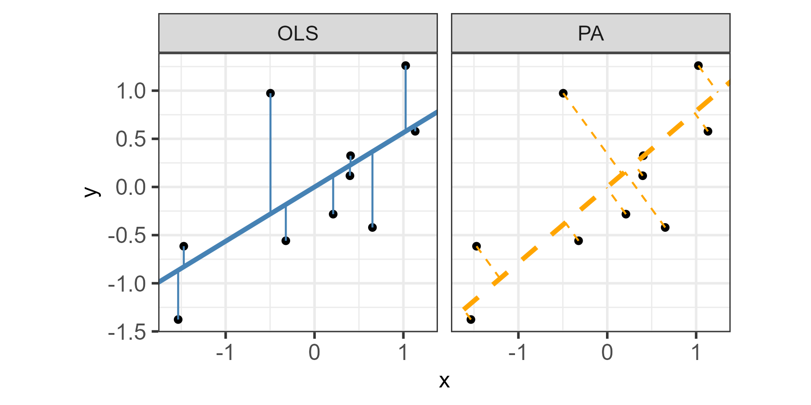

class:title-slide-custom

<style>
p.caption {
  font-size: 0.8em;
}
</style>

```{r, child = "style.Rmd"}
```


```{r setup, echo = FALSE, message = FALSE, warning = FALSE}

# Packages
library(emoji)
library(purrr)
library(tidyverse)
library(gridExtra)
library(nullabor)
library(scales)
library(knitr)
library(kableExtra)
library(RefManageR)
library(iconr)
library(fontawesome)
# download_fontawesome()
library(readr)
library(patchwork)
# library(cowplot)
# library(ggforce)

# References
library(RefManageR)
bib <- ReadBib("bib/thesis.bib", check = FALSE)
ui <- "- "

# R markdown options
knitr::opts_chunk$set(echo = FALSE, 
                      message = FALSE, 
                      warning = FALSE, 
                      cache = FALSE,
                      fig.align = 'center',
                      dpi = 300)
options(htmltools.dir.version = FALSE)
options(knitr.kable.NA = '')
```

```{r, include = F, eval = T, cache = F}
clean_file_name <- function(x) {
  basename(x) %>% str_remove("\\..*?$") %>% str_remove_all("[^[A-z0-9_]]")
}
img_modal <- function(src, alt = "", id = clean_file_name(src), other = "") {
  
  other_arg <- paste0("'", as.character(other), "'") %>%
    paste(names(other), ., sep = "=") %>%
    paste(collapse = " ")
  
  js <- glue::glue("<script>
        /* Get the modal*/
          var modal{id} = document.getElementById('modal{id}');
        /* Get the image and insert it inside the modal - use its 'alt' text as a caption*/
          var img{id} = document.getElementById('img{id}');
          var modalImg{id} = document.getElementById('imgmodal{id}');
          var captionText{id} = document.getElementById('caption{id}');
          img{id}.onclick = function(){{
            modal{id}.style.display = 'block';
            modalImg{id}.src = this.src;
            captionText{id}.innerHTML = this.alt;
          }}
          /* When the user clicks on the modalImg, close it*/
          modalImg{id}.onclick = function() {{
            modal{id}.style.display = 'none';
          }}
</script>")
  
  html <- glue::glue(
     " <!-- Trigger the Modal -->

<!-- The Modal -->
<div id='modal{id}' class='modal'>
  <!-- Modal Content (The Image) -->
  
  <!-- Modal Caption (Image Text) -->
  <div id='caption{id}' class='modal-caption'></div>
</div>
"
  )
  write(js, file = "js-addins.html", append = T)
  return(html)
}
# Clean the file out at the start of the compilation
write("", file = "js-addins.html")
```

<br><br>
# Eye Fitting Straight Lines in the Modern Era
## Joint Statistical Meetings, Washington, D.C.
### August 8, 2022
#### Emily Robinson 
#### Department of Statistics, University of Nebraska - Lincoln 
##### `r fa("envelope", fill = "black")` [erobin17@calpoly.edu](emily.robinson@huskers.unl.edu) 
##### `r fa("home", fill = "black")` [www.emilyarobinson.com](https://www.emilyarobinson.com/) 
##### `r fa("github", fill = "black")` [earobinson95](https://github.com/earobinson95)

---
class:primary
# Outline

`r fa_i("chart-bar")` Introduction to graphical testing

`r fa_i("pen")` Let's see your drawing skills!

`r fa_i("chart-line")` Eye Fitting Straight Lines in the Modern Era

`r fa_i("superscript")` Extension to non-linear setting

`r fa_i("list")` Discussion and limitations

`r fa_i("spinner")` Future work

???

In my talk today I am going to introduce graphical testing and give you a chance to participate in a graphical testing task. I will then provide validation for a modern method of fitting visual regression lines. My dissertation work specifically addresses the perception of logarithmic scales and exponential growth. I will then conclude with my future work.

---
class:primary
# Testing Statistical Graphics

Evaluate design choices and understand cognitive biases through the use of **visual tests** `r Citep(bib[[c("cleveland1984graphical", "lewandowsky1989perception", "spence1990visual", "vanderplas2020testing")]])`.

Could ask participants to:

- identify differences in graphs.
- read information off of a chart accurately.
- use data to make correct real-world decisions.
- predict the next few observations.

All of these types of tests require different levels of use and manipulation of the information presented in the chart.

???

How do we know graphics work and are effective? 

One way we can evaluate these design choices through the use of graphical tests. 

Could ask participants to:

- identify differences in graphs.
- read information off of a chart accurately.
- use data to make correct real-world decisions.
- predict the next few observations.

All of these types of tests require different levels of use and manipulation of the information presented in the chart.

There are different ways of engaging in graphics and how effective the graphic is depends on how you engage with the chart.

---
class:primary
# Fitting Trends by Eye

Initial studies in the 20th century explored the use of fitting lines by eye through a set of points
`r Citep(bib[[c("finney1951subjective", "mosteller1981eye", "unwin1988eyeballing")]])`.

Common methods:
+ maneuvering a string,
+ black thread, or
+ ruler.

Recently, `r Citet(bib[[c("ciccione2021can")]])` conducted a comprehensive set of studies investigating human ability to detect trends in graphical representations using physical adjustment and manipulation methods.

???

Common methods:
+ maneuvering a string,
+ black thread,
+ ruler 

until the fit is suitable, then drawing the line through the set of points. 

In @ciccione2021can, participants were asked to judge trends, estimate slopes, and conduct extrapolation.
To estimate slopes, participants were asked to report the slope of the best-fitting regression line using a track-pad to adjust the tilt of a line on the screen.
Results indicated the slopes participants reported were always in excess of the ideal slopes, both in the positive and in the negative direction, and those biases increase with noise and with number of points. 

---
class:primary
# 'You Draw It' Feature 
## (New York Times, 2015)
.pull-left[

```{r, out.width = "100%"}
knitr::include_graphics("images/nyt-caraccidents-frame4.png")
```
.center[
`r Citep(bib[[c("katz_2017")]])`
]

].pull-right[

Readers are asked to input their own assumptions about various metrics and compare how these assumptions relate to reality.

+ [Family Income affects college chances](https://www.nytimes.com/interactive/2015/05/28/upshot/you-draw-it-how-family-income-affects-childrens-college-chances.html) `r Citep(bib[[c("aisch_cox_quealy_2015")]])`
+ [Just How Bad Is the Drug Overdose Epidemic?](https://www.nytimes.com/interactive/2017/04/14/upshot/drug-overdose-epidemic-you-draw-it.html) `r Citep(bib[[c("katz_2017")]])`
+ [What Got Better or Worse During Obama’s Presidency](https://www.nytimes.com/interactive/2017/01/15/us/politics/you-draw-obama-legacy.html?_r=0) `r Citep(bib[[c("buchanan_park_pearce_2017")]])`
]

???

While not explicitly intended for perceptual testing, in 2015, the New York Times introduced an interactive feature, called 'You Draw It'.
Readers were asked to input their own assumptions about various metrics and compare how these assumptions relate to reality.

The New York Times team utilizes **Data Driven Documents (D3)** that allows readers to predict these metrics through the use of drawing a line on their computer screen with their mouse.

While this interactive feature is designed to get readers to confront their own intuitions about data in the news, we feel that the interactivity of this method may be useful for the purpose of graphical testing and measuring the patterns humans see in data.

---
class:primary
# Research Objectives 

`r fa_i("laptop-code")` **Adapt & Establish**

Establish 'You Draw It', adapted from the New York Times feature, as a new tool for graphical testing.

`r fa_i("check-double")` **Validate**

Validate ‘You Draw It’ as a method by replicating the less technological study conducted in `r Citet(bib[[c("mosteller1981eye")]])`.

`r fa_i("chart-bar")` **Statistically Model**

Introduce a method for statistically modeling the participant drawn lines using generalized additive mixed models (GAMM).


???


+ Adapt and establish 'You Draw It', adapted from the New York Times feature, as a new tool for graphical testing.

+ Validate ‘You Draw It’ as a method by replicating the less technological study conducted in Mosteller et al. (1981). 

+ Extend the study with formal statistical analysis methods in order to better understand the perception of linear regression.

+ Introduce a method for statistically modeling the participant drawn lines using generalized additive mixed models (GAMM).

+ The graphical testing method used in this study differs from prior methods found in @mosteller1981eye and @ciccione2021can by allowing participants to freely draw estimated trend lines - a method which extends nicely to a nonlinear setting.

---
class:primary
# 'You Draw It' Task

Study Participant Prompt: *Use your mouse to fill in the trend in the yellow box region.*

```{r, out.width = "65%"}
knitr::include_graphics("images/eyefitting_example.gif")
```

???

Here we see an example of a "You Draw It" task plot used in the study. Participants are prompted to "Use your mouse to fill in the trend in the yellow box region. The yellow box region moves along as the participant draws their trend-line until the yellow region disappears." 

Task plots were created using Data Driven Documents (D3), a JavaScript-based graphing framework that facilitates user interaction. We then integrate this into RShiny using the r2d3 package.

---
class:primary
# 'You Draw It' Shiny + D3 Code Sketch

<br>

```{r, out.width = "100%"}
knitr::include_graphics("images/code-sketch.png")
```

<br>

See [‘You Draw It’: Implementation of visually fitted trends
with `r2d3`](https://earobinson95.github.io/sdss-2022-you-draw-it-manuscript/2022-sdss-you-draw-it-manuscript.pdf) for details on the adaptation of 'You Draw It'.

---
class:primary
# Let's see your drawing skills!

.pull-left[
.center[
```{r, out.width = "100%"}
knitr::include_graphics("images/eyefitting_example.gif")
```
]
].pull-right[
```{r, out.width = "88%"}
knitr::include_graphics("images/can-you-draw-it-mobile-qrcode.png")
```

.center[
<font size="6">

<b>SCAN ME</b>

<br>
OR VISIT <a href="https://emily-robinson.shinyapps.io/can-you-draw-it/">bit.ly/3BF56Zj</a>

</font>
]

]

---
class:primary
# Did it looks something like this?

```{r, out.width = "60%"}
knitr::include_graphics("images/can-you-draw-it-example.png")
```

---
class:primary
# Fitted Regression Lines

**Big Idea:** How do statistical regression results compare to intuitive, visually fitted results?

```{r, out.width = "80%"}
# fig.cap=" Comparison between an OLS regression line which minimizes the vertical distance of points from the line and a regression line based on the principal axis which minimizes the Euclidean distance of points (orthogonal) from the line."

```

???

The principle of simple linear regression is to find the line (i.e., determine its equation) which passes as close as possible to the observations, that is, the set of points.

We are going to focus on two regression lines determined by ordinary least squares regression and regression based on the principal axis. The figure illustrates the difference between an OLS regression line which minimizes the vertical distance of points from the line and a regression line based on the principal axis (Principal Component) which minimizes the Euclidean distance of points (orthogonal) from the line. This is what we refer to as “ensemble perception” indicating the visual system can compute averages of various features in parallel across the items in a set (in this case, over the x and y-axes).

**Big Idea:** How do statistical regression results compare to intuitive, visually fitted results?

---
class:primary
# Eye Fitting Straight Lines
## `r Citet(bib[[c("mosteller1981eye")]])`

.pull-left[

+ **Big Idea:** Students fitted lines by eye to four sets of points.
+ **Method:** 8.5 x 11 inch transparency with a straight line etched across the middle.
+ **Sample:** 153 graduate students and post docs in Introductory Biostatistics.
+ **Experimental Design:** Latin square.
+ **Findings:** Students tended to fit the slope of the first principal component.

].pull-right[

```{r, out.width = "100%"}
knitr::include_graphics("images/eyefitting-straight-lines-plots.png")
```

]

???

I want to introduce a study conducted in 1981 called Eye Fitting Straight Lines by Mosteller et al. In this study:

+ Students fitted lines by eye to four sets of points.
+ 8.5 x 11 inch transparency with a straight line etched across the middle.
+ 153 graduate students and post docs in Introductory Biostatistics.
+ Latin square.
+ Students tended to fit the slope of the first principal component or major axis (the line that minimizes the sum of squares of perpendicular rather than vertical distances).

In the past -> draw on paper

---
class:primary
# Data Generation

.pull-left[

$N = 30$ points $(x_i, y_i), i = 1,...,N$ were generated for $x_i \in [x_{\text{min}}, x_{\text{max}}]$.

Data were simulated based on the point-slope form of a linear model, $(\bar{x}, y_{\bar{x}})$, with additive errors:
\begin{equation}
y_i = \beta_1(x_i-\bar{x}) + y_{\bar{x}} + e_i
\end{equation}

where $e_i \sim N(0, \sigma^2).$

Parameters $\beta_1$, $y_{\bar{x}}$, and parameter choice letter names (S, F, V, N), were selected to reflect the four data sets used in `r Citet(bib[[c("mosteller1981eye")]])`.

].pull-right[

```{r results='asis', out.width="100%"}
# fig.cap = "Example of simulated data points displayed in a scatterplot illustrating the trends associated with the four selected parameter choices."

i1 <- img_modal(src = "images/eyefitting-example-simplot.png", alt = " ", other=list(width="100%"))

c(str_split(i1, "\\n", simplify = T)[1:2],
  str_split(i1, "\\n", simplify = T)[3:9]
  ) %>% paste(collapse = "\n") %>% cat()
```
]

???

Data were simulated based on the point-slope form of a linear model with additive errors.

Parameters $\beta_1$, $y_{\bar{x}}$, and parameter choice letter names (S, F, V, N), were selected to reflect the four data sets used in `r Citet(bib[[c("mosteller1981eye")]])`.

+ **S:** positive slope; small variance; $x \in [0, 20]$. 
+ **F:** positive slope; a large variance; $x \in [0, 20]$.  
+ **V:** steep positive slope; small variance; $x \in [4, 16]$. 
+ **N:** negative slope; large variance; $x \in [0, 20]$. 

---
class:primary
# Study Design

+ Participants recruited through Twitter, Reddit, and direct email in May 2021.

+ A total of 35 individuals completed 131 unique you draw it task plots.

+ Data sets were generated randomly, independently for each participant at the start of the experiment.

+ Participants shown 2 practice plots followed by each of the 4 task plots (S, F, V, N) randomly assigned for each individual in a completely randomized design.

+ The shiny app used to conduct and distribute the study can be accessed at  [emily-robinson.shinyapps.io/you-draw-it-validation-applet](https://emily-robinson.shinyapps.io/you-draw-it-validation-applet/)

???
Participants were recruited through through Twitter, Reddit, and direct email in May 2021. The experiment was conducted and distributed through an RShiny application. Participants were first shown 2 practice plots followed by the 4 You Draw It task plots randomly assigned for each individual in a completely randomized design.

Participants in the study were shown two 'You Draw It' practice plots in order to train participants in the skills associated with executing the task - in particular, the responsiveness of the applet requires that participants draw a line at a certain speed, ensuring that all of the evenly spaced points along the hand-drawn line are filled in. 
During the practice session, participants were provided with instruction prompts accompanied by a .gif and a practice plot.
Instructions guided participants to start at the edge of the yellow box, to make sure the yellow shaded region was moving along with their mouse as they drew, and that they could draw over their already drawn line.

---
class:primary
# Model Data
 
.pull-left[
For each participant, the final data set used for analysis contains:
+ $x_{ijk}$, $y_{ijk,drawn}$, $\hat y_{ijk,OLS}$, $\hat y_{ijk,PA}$

for 
+ parameter choice $i = 1,2,3,4$, 
+ participant j = $1,...,N_{\text{participant}}$ 
+ $x_{ijk}$ value corresponding to increment $k = 1, ...,4 x_{max} + 1$.

**Vertical residuals** between the drawn and fitted values were calculated as: 
+ $e_{ijk,OLS} = y_{ijk,drawn} - \hat y_{ijk,OLS}$
+ $e_{ijk,PA} = y_{ijk,drawn} - \hat y_{ijk,PA}$.

].pull-right[ 

```{r results='asis', out.width="100%"}
# fig.cap = "Illustrates the data associated with and collected for one `You Draw It' task plot. Trend-lines include the participant drawn line (dashed black), the OLS regression line (solid steelblue) and the PA regression line based on the principal axis (solid orange)."

i1 <- img_modal(src = "images/eyefitting-trial-plot.png", alt = " ", other=list(width="100%"))

c(str_split(i1, "\\n", simplify = T)[1:2],
  str_split(i1, "\\n", simplify = T)[3:9]
  ) %>% paste(collapse = "\n") %>% cat()
```
]

???
We compare the participant drawn line to two regression lines determined by ordinary least squares regression and regression based on the principal axis. The figure illustrates the difference between an OLS regression line which minimizes the vertical distance of points from the line and a regression line based on the principal axis (Principal Component) which minimizes the Euclidean distance of points (orthogonal) from the line.

Here we see an example of the feedback data from one you draw it plot. For 0.25 increments across the domain, we have the participant drawn values, the fitted values from the ordinary least squares regression, and the fitted values from the regression based on the principal axis. 

We are mainly interested in the deviation of the participant drawn line from the fitted regression lines. So while it seems counter-intuitive, the residual actually becomes our response in this case.

---
class:primary
# Linear Trend Constraint
The **Linear Mixed Model** equation for each fit (OLS and PCA) residuals is given by:
\begin{equation}
e_{ijk,fit} = \left[\gamma_0 + \alpha_i\right] + \left[\gamma_{1} x_{ijk} + \gamma_{2i} x_{ijk}\right] + p_{j} + \epsilon_{ijk}
\end{equation}
where

+ $e_{ijk,fit}$ is the residual between the drawn and fitted y-values for the $i^{th}$ parameter choice, $j^{th}$ participant, and $k^{th}$ increment of x-value corresponding to either the OLS or PA fit
+ $\gamma_0$ is the overall intercept
+ $\alpha_i$ is the effect of the $i^{th}$ parameter choice (S, F, V, N) on the intercept
+ $\gamma_1$ is the overall slope for $x$
+ $\gamma_{2i}$ is the effect of the parameter choice on the slope
+ $x_{ijk}$ is the x-value for the $i^{th}$ parameter choice, $j^{th}$ participant, and $k^{th}$ increment
+ $p_{j} \sim N(0, \sigma^2_{participant})$ is the random error due to the $j^{th}$ participant's characteristics
+ $\epsilon_{ijk} \sim N(0, \sigma^2)$ is the residual error.

???


The 'You Draw It' method does not restrict participants to draw a straight line as other methods would, such as using a ruler. Instead, participants are allowed to freely draw a line with potential curvature.
Using the `lmer` function in the lme4 package [@lme4], a linear mixed model (LMM) was fit separately to the OLS residuals and PA residuals, emulating the effect of constraining participants to draw a linear trend.

Both fixed and random parameter estimates in the LMM were determined by optimizing the restricted maximum likelihood (REML) through penalized least squares.
Parameter choice, $x$, and the interaction between $x$ and the parameter choice were treated as fixed effects with a random participant effect included to account for variation due to participant.

---
class:primary
# Linear Trend Constraint

```{r, out.width = "80%"}
# fig.cap = "Estimated trend line of the residuals between the participant drawn points and fitted values for both the OLS (blue) regression line and PA (orange) regression line constrained to a linear fit modeled by a linear mixed model. Estimated residual trends with 95\\% confidence bands are overlaid on the observed individual participant residuals."

```

???
Results indicate the estimated trends of PA residuals (orange) appear to align closer to the y = 0 horizontal (dashed) line than the OLS residuals (blue). In particular, this trend is more prominent in parameter choices with large variances (F and N). These results are consistent to those found in Mosteller
et al. (1981) indicating participants fit a trend-line closer to the estimated regression line with the slope of based on the first principal axis than the estimated OLS regression line.

---
class:primary
# Smoothing Spline Trend
The **Generalized Additive Mixed Model** equation for each fit (OLS and PCA) residuals is given by: 
\begin{equation}
e_{ijk,fit} = \alpha_i + s_{i}(x_{ijk}) + p_{j} + s_{j}(x_{ijk})
\end{equation}
where 

+ $e_{ijk,fit}$ is the residual between the drawn and fitted y-values for the $i^{th}$ parameter choice, $j^{th}$ participant, and $k^{th}$ increment of x-value corresponding to either the OLS or PA fit
+ $\alpha_i$ is the intercept for the parameter choice $i$
+ $s_{i}$ is the smoothing spline for the $i^{th}$ parameter choice
+ $x_{ijk}$ is the x-value for the $i^{th}$ parameter choice, $j^{th}$ participant, and $k^{th}$ increment
+ $p_{j} \sim N(0, \sigma^2_{participant})$ is the error due to participant variation
+ $s_{j}$ is the random smoothing spline for each participant.

???

Eliminating the linear trend constraint, the `bam` function in the mgcv package is used to fit a generalized additive mixed model (GAMM) separately to the OLS and PA residuals to allow for estimation of smoothing splines.

---
class:primary
# Smoothing Spline Trend

```{r, out.width = "80%"}
# fig.cap = "Estimated trend line of the residuals between the participant drawn points and fitted values for both the OLS (blue) regression line and PA (orange) regression line constrained to a linear fit modeled by a linear mixed model. Estimated residual trends with 95\\% confidence bands are overlaid on the observed individual participant residuals."
knitr::include_graphics("images/eyefitting-gamm-plot.png")
```

???
The results of the GAMM align with those in the linear constraint trend providing support that for scatter-plots with more noise (F and N), estimated trends of PA residuals (orange) appear to align closer to the y = 0 horizontal (dashed) line than the OLS residuals (blue). However, By fitting smoothing splines, we can determine whether participants naturally fit a straight trend-line to the set of points or whether they deviate throughout the domain providing us with further insight into the curvature humans perceive in a set of points.

---
class:primary
# Conclusion

+ Estimated drawn trend-lines followed closer to the regression line based on the principal axis than the OLS regression line.

+ GAMM's can be used assess the deviation of the participant drawn lines from the statistically fitted regression lines.

**The reproducibility of these results serve as validation of the 'You Draw It' tool and method.**

???

The intent of this research was to adapt 'You Draw It' from the New York Times feature as a tool and method for testing graphics and introduce a method for statistically modeling the participant drawn lines.
We provided support for the validity of the 'You Draw It' method by replicating the study found in @mosteller1981eye.
Using generalized additive mixed models, we assessed the deviation of the participant drawn lines from the statistically fitted regression lines.
Our results found that when shown points following a linear trend, participants visually fit a regression line that mimics the first principal axis regression as opposed to ordinary least squares regression. 
Data simulated with a larger variance provided strong support for a participants tendency to visually fit the first principal axis regression.
We utilized modern technology to replicate a study conducted 40 years ago, and strengthened the original results with current analysis methods which allow for more flexibility and sophistication.
Our results indicate that participants minimized the distance from their drawn regression line over both the $x$ and $y$ axis simultaneously. 


This study reinforces the differences between intuitive visual model fitting and statistical model fitting, providing information about human perception as it relates to the use of statistical graphics.

**The reproducibility of these results serve as validation of the 'You Draw It' tool and method.**

---
class:primary
# Extension to Non-linear Data

Example from a study examining participants ability to make forecasts for exponentially increasing data on log and linear scales.

```{r results='asis', out.width="100%"}
# fig.cap = "Spaghetti plot of results from a study which asked participants to forecast trends of exponentially increasing data. Participants drawn lines on the linear scale are shown in blue and the log scale are shown in orange. Variability in the statistically fitted regression lines occurred due to a unique data set being simulated for each individual; the gray band shows the range of fitted values from the statistically fitted regression lines."

i1 <- img_modal(src = "images/nonlinear-gamm-plot.png", alt = " ", other=list(width="43%"))
i2 <- img_modal(src = "images/nonlinear-spaghetti-plot.png", alt = " ", other=list(width="50%"))

c(str_split(i1, "\\n", simplify = T)[1:2],
  str_split(i2, "\\n", simplify = T)[1:2],
  str_split(i1, "\\n", simplify = T)[3:9],
  str_split(i2, "\\n", simplify = T)[3:9]
  ) %>% paste(collapse = "\n") %>% cat()
```

The combination of the GAMM analysis and visual display demonstrates the strength of the 'You Draw It' method for testing statistical graphics.

???

The analysis method presented above extends nicely beyond the linear regressions tested in @mosteller1981eye. Here we briefly demonstrate this with an example from a study examining participants ability to make forecasts for exponentially increasing data on log and linear scales. Along with analyzing the feedback data with the GAMM method for flexibility due to non-linear data, we used spaghetti plots to conduct a visual analysis of participant forecasts compared to the non-linear least squares statistical model and make comparisons between two chart design features ([@fig-exponential-spaghetti-plot]). The combination of the GAMM analysis and visual display demonstrates the strength of the 'You Draw It' method for testing statistical graphics.

---
class:primary
# Discussion

Researchers in cognitive and human movement sciences have found that human arm movement is a complex task `r Citep(bib[[c("miall1995curvature", "rousset2015study")]])`.

+ Indirect interaction vs direct interaction

+ Learning curve with completing the task (slow movements, etc.) `r Citep(bib[[c("de1991misdirections")]])`.
+ Some participants may have used a track-pad and results may have been influenced by the pressure placed on their track-pad `r Citep(bib[[c("easton1978finger")]])`.

???

We allowed participants to draw trend lines that deviated from a straight line and gained an insight into the curvature the human eye perceives in a set of points.

The 'You Draw It' method described in this paper uses *indirect interaction* in which the mouse position and resulting visual line on the screen are dissociated.
Therefore, curvature found in participant drawn lines from a straight lines could potentially be explained by the lack of coordination which results from the eye-hand dissociation from indirect drawing and the distortion of visual perception affecting the curvature of movements. `r Citep(bib[[c("miall1995curvature", "rousset2015study")]])`

Additionally, there is a training effect related to the completion of the 'You Draw It' task - the movement of the line must be slow so that the visual representation on the screen can accurately capture each movement. 

+ `r Citet(bib[[c("de1991misdirections")]])` conducted a study in which participants moved their hand slowly from an initial position in front of them to a visual target (movement task); they were then asked to repeat the task using different sizes of pointers (perceptual task). Their results indicated that deviations from the shortest pointers were comparable to those of the movement task, but that bias increased as the length of the pointer increased.

+ While we suggested participants use a mouse to complete the study, we could not require the use; therefore, some participants may have used a track-pad and results may have been influenced by the pressure placed on their track-pad `r Citep(bib[[c("easton1978finger")]])`.

---
class:primary
# Future Work

**Additional method validation**

+ Compare manual adjustment methods such as shifting and rotating a horizontal line
+ Compare the method conducted by direct interaction (digital pen on tablet) to indirect interaction (computer mouse or track-pad)

**Perception of linear regression**

+ Introduce one (or multiple) extreme outliers

**Extensions**

+ Non-linear settings and forecasting trends
+ Real data to facilitate scientific communication

**Software development**

+ Create an R package designed for easy implementation of 'You Draw It'

---
class:primary
# References
<font size="1.5">
```{r, print_refs1, results='asis', echo=FALSE, warning=FALSE, message=FALSE}
print(bib[[c("cleveland1984graphical", 
             "lewandowsky1989perception",
             "spence1990visual",
             "vanderplas2020testing",
             "finney1951subjective",
             "mosteller1981eye",
             "unwin1988eyeballing",
             "ciccione2021can",
             "katz_2017",
             "aisch_cox_quealy_2015",
             "buchanan_park_pearce_2017",
             "miall1995curvature", 
             "rousset2015study",
             "de1991misdirections",
             "easton1978finger"
             )]], 
      .opts = list(check.entries = FALSE, style = "html", bib.style = "authoryear")
      )
```
</font>

---
class:inverse
<br>
<br>
<br>
<br>
<br>
<br>
.center[
# Thank you!
<br
<br>
`r fa("envelope", fill = "white")` **erobin17@calpoly.edu**
`r fa("home", fill = "white")` **www.emilyarobinson.com**
`r fa("github", fill = "white")` **earobinson95**
]

---
class:primary
# Data Generation

```{r eyefitting-parameters}
          data.frame(Parm = c("F", "N", "S", "V"),
                     y_xbar = c(3.9, 4.11, 3.88, 3.89),
                     slope = c(0.66, -0.70, 0.66, 1.98),
                     sigma = c(1.98, 2.5, 1.3, 1.5),
                     x_range = c("(0,20)", "(0,20)", "(0,20)", "(4,16)")
          ) %>%
            mutate(Parm = factor(Parm, levels = c("S", "F", "V", "N"))) %>%
            arrange(Parm) %>%
            knitr::kable(digits = 2, 
                         escape = F, 
                         booktabs = T, 
                         linesep = "", 
                         align = "c", 
                         label = "eyefitting-parameters",
                         col.names = c("Parameter Choice", "$y_{\\bar{x}}$", "$\\beta_1$", "$\\sigma$", "Domain"),
                         caption = "Designated model equation parameters for simulated data.")
```

---
class:inverse
<br>
<br>
<br>
<br>
<br>
<br>
<br>
<br>
.center[
# Data Driven Documents (D3.js)
]

---
class:primary
# Background of D3

**Who?** [Mike Bostock](https://observablehq.com/@mbostock) created D3 during his time working on graphics at the New York Times.
  
**What?** Open-source JavaScript based graphing framework
+ D3 = "Data Driven Documents"
+ `D3` is to JavaScript as `ggplot2` is to R
+ Framework for binding objects and layers to plotting area
  + framework for movement and user interaction

**When?** D3 v1.0 released in 2011, D3.js recently celebrated it's 10th anniversary!

**Where?** The internet!

**Why?** Advantages of using D3 include animation and allowing for movement and user interaction.

**How?** `r2d3`!

???

+ Used by major news and research organizations such as the New York Times, FiveThirtyEight, Washington Post, and the Pew Research Center create and customize graphics.
+ `D3` is to JavaScript as `ggplot2` is to R
+ Advantages include animation and allowing for movement and user interaction.

---
class:primary
# Relationship between D3 and R 

.pull-left[
The `r2d3` package in R provides an efficient integration of D3 visuals and R by displaying them in familiar formats:
+ RMarkdown with HTML output
+ Shiny applications (amazing!)

].pull-right[
.center[ 
 
]
]

`r2d3` makes it easy to do your data processing in R, then apply D3.js code to visualize that data!

--
.pull-left[
**How?**
+ Converts data in R to JSON that can be interpreted by JavaScript
+ Sources D3 code library
+ Creates plot container (svg)
+ Renders plot using source code
].right-plot[
```{r r2d3-example, echo = T, eval = F}
r2d3(data = data,
     script = "d3-source-code.js",
     d3_version= "5")
```
]

???

A challenge of working with D3 is the environment necessary to display the graphics and images. 

The `r2d3` package in R provides an efficient integration of D3 visuals and R by displaying them in familiar formats:
+ RMarkdown with HTML output
+ Shiny applications (amazing!)

`r2d3` makes it easy to do your data processing in R, then apply D3.js code to visualize that data!

The example R code illustrates the structure of the r2d3 function which includes specification of a data frame in R (converted to a JSON file), the D3.js source code file, and the D3 version that accompanies the source code.
A default SVG (scalable vector graphic) container for layering elements is then generated by the r2d3 function which renders the plot using the source code.

---
class:primary
# Getting Started with D3

`D3.js` is to JavaScript as `ggplot2` is to R

.pull-left[
`r fa_i("js")` [Codecademy: Introduction to JavaScript](https://www.codecademy.com/learn/introduction-to-javascript)

`r fa_i("image")` Understand [SVG](http://tutorials.jenkov.com/svg/g-element.html) elements: inspect elements in web browser!

`r fa_i("book-open")` Amelia Wattenberger's [Full Stack D3 and Data Visualization Book](https://www.newline.co/fullstack-d3)

`r fa_i("chart-bar")` Build a basic graphic using [r2d3](https://rstudio.github.io/r2d3/articles/introduction.html)

`r fa_i("grimace")` Modify `D3.js` code until it does what you want!
]
.pull-right[
**Additional Resources**

`r fa_i("code")` [How to learn D3 with no coding experience](https://www.heshameissa.com/blog/learn-d3)

`r fa_i("twitter")` Amelia Wattenberger on [Twitter](https://twitter.com/Wattenberger)
]