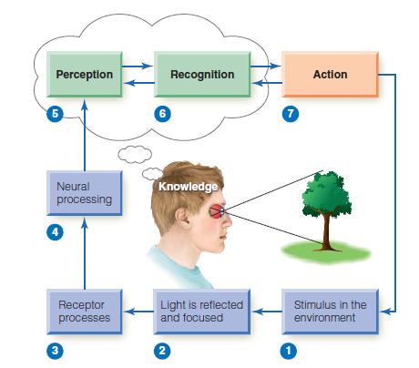
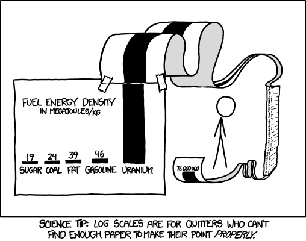

```{r, child = "style.Rmd"}
```


```{r setup, echo = FALSE, message = FALSE, warning = FALSE}

# Packages
library(emo)
library(purrr)
library(tidyverse)
library(gridExtra)
library(nullabor)
library(scales)
library(knitr)
library(kableExtra)
library(RefManageR)
library(iconr)
# download_fontawesome()

# References
bib <- ReadBib("bib/thesis.bib", check = FALSE)
ui <- "- "

# R markdown options
knitr::opts_chunk$set(echo = FALSE, 
                      message = FALSE, 
                      warning = FALSE, 
                      cache = FALSE,
                      dpi = 300)
options(htmltools.dir.version = FALSE)
options(knitr.kable.NA = '')
```

```{r, include = F, eval = T, cache = F}
clean_file_name <- function(x) {
  basename(x) %>% str_remove("\\..*?$") %>% str_remove_all("[^[A-z0-9_]]")
}
img_modal <- function(src, alt = "", id = clean_file_name(src), other = "") {
  
  other_arg <- paste0("'", as.character(other), "'") %>%
    paste(names(other), ., sep = "=") %>%
    paste(collapse = " ")
  
  js <- glue::glue("<script>
        /* Get the modal*/
          var modal{id} = document.getElementById('modal{id}');
        /* Get the image and insert it inside the modal - use its 'alt' text as a caption*/
          var img{id} = document.getElementById('img{id}');
          var modalImg{id} = document.getElementById('imgmodal{id}');
          var captionText{id} = document.getElementById('caption{id}');
          img{id}.onclick = function(){{
            modal{id}.style.display = 'block';
            modalImg{id}.src = this.src;
            captionText{id}.innerHTML = this.alt;
          }}
          /* When the user clicks on the modalImg, close it*/
          modalImg{id}.onclick = function() {{
            modal{id}.style.display = 'none';
          }}
</script>")
  
  html <- glue::glue(
     " <!-- Trigger the Modal -->

<!-- The Modal -->
<div id='modal{id}' class='modal'>
  <!-- Modal Content (The Image) -->
  
  <!-- Modal Caption (Image Text) -->
  <div id='caption{id}' class='modal-caption'></div>
</div>
"
  )
  write(js, file = "js-addins.html", append = T)
  return(html)
}
# Clean the file out at the start of the compilation
write("", file = "js-addins.html")
```

# Outline

1. Related Literature
    + Introduction to Graphics
    + Perception and Psychophysics
    + Testing Graphics
    + Logarithmic Scales and Mapping
    + Underestimation of Exponential Growth
2. Research Objectives
3. Prediction with You Draw It
    + Eye Fitting Straight Lines in the Modern Era
    + Prediction of Exponential Trends
4. Future Work
5. Questions and Discussion

---
class:inverse
<br>
<br>
<br>
<br>
<br>
<br>
<br>
<br>
.center[
# Related Literature
]

---
class:primary
# Introduction to Graphics

+ Graphics are useful for data cleaning, exploring data structure, and have been an essential component in communicating information for the last 200 years (Lewandowsky & Spence, 1989).
+ During the 18th and 19th centuries, governments began using graphics in order to better understand their population and economic interests 
+ In the 20th century, companies began utilizing graphics to understand their mechanics and support business decisions and news sources began displaying graphics of weather forecasts as a means to communicate critical information and aid in decision-making (Chandar, Collier, & Miranti, 2012; Yates, 1985).
+ Today, we encounter data visualizations everywhere; researchers include graphics to communicate their results in scientific publications and mass media present graphics in order to convey news stories to the public through newspapers, TV, and the Web (Aisch et al., 2016; Gouretski & Koltermann, 2007; Silver, 2020).

---
class:primary
# Grammar of Graphics (Wilkinson, 2012)

.pull-left[
+ Graphics are built from the ground up by specifying exactly how to create a particular graph from a given data set. 
+ Visual representations are constructed through the use of “tidy data” (Hadley Wickham & Grolemund, 2016).
+ Graphics are viewed as a mapping from variables in a data set (or statistics computed from the data) to visual attributes such as the axes, colors, shapes, or facets on the canvas in which the chart is displayed.
].pull-right[

(Vanderplas, Cook, & Hofmann, 2020)
]

???

+ The figure illustrates the process of creating a graphic from a data set through the use of variable mapping, data transformations, coordinate systems, and aesthetic features (Vanderplas, Cook, & Hofmann, 2020) 

+ Software, such as Hadley Wickham’s ggplot2 (Hadley Wickham, 2011), aims to implement the framework of creating charts and graphics as the grammar of graphics recommends.

---
class:primary
# Perceptual Process

+ The perceptual process is a sequence of steps used to describe a how a stimulus in the environment leads to our perception of the stimulus and action in response to the stimulus.
.center[

]
???
+ In order to develop guiding principles for generating graphics effective in communication, we must first understand the basic mechanics of the human perceptual system and the biases we are vulnerable to (Goldstein & Brockmole, 2017).

---
class:primary
# Logarithmic Perception

Ernst Weber, an early psychophysics researcher discovered the relationship between the difference threshold (smallest detectable difference between two sensory stimuli; known as the “Just Noticeable Difference”) and the magnitude of a stimulus.

**Weber’s law** states we do not notice absolute changes in stimuli,
but instead that we notice the relative change (Fechner, 1860). Discovered by Ernst Weber, an early psychophysics researcher.

Numerically, Weber’s Law is defined as:

\begin{equation*}
\frac{\Delta S}{S} = K
\end{equation*}

+ $\Delta S$ represents the difference threshold
+ $S$ represents the initial stimulus
+ $K$ is called Weber’s contrast which remains constant as the magnitude
of $S$ changes. 

---
class:primary
# Logarithmic Perception

Gustav Fechner, a founder of psychophysics, provided further
extension to Weber’s law by discovering the relationship between the perceived
intensity is logarithmic to the stimulus intensity when observed above a minimal
threshold of perception (Fechner, 1860).

Formally known as the **Weber-Fechner law**, it is derived from Weber’s law as:
\begin{equation}
P = K \ln \frac{S}{S_0}
\end{equation}
+ $P$ represents the perceived stimulus
+ $K$ represents Weber’s contrast
+ $S$ represents the initial stimulus intensity
+ $S_0$ represents the minimal threshold of perception.

---
class:primary
# Testing Graphics

Evaluate design choices through the use of graphical tests. Could ask participants to:

- identify differences in graphs.
- read information off of a chart accurately.
- use data to make correct real-world decisions.
- predict the next few observations.

All of these types of tests require different levels of use and manipulation of the information presented in the chart.

---
class:primary
# Early Graphics Research

---
class:primary
# Motivation

Data visualizations played an important role in during the COVID-19 pandemic in displaying case counts, transmission rates, and outbreak regions (Rost, 2020).

  + Mass media routinely showed charts to share information with the public about the progression of the pandemic (Romano, Sotis, Dominioni, & Guidi, 2020).
  + Graphics helped guide decision makers to implement policies such as shut-downs or mandated mask wearing.
  + Facilitated communication with the public to increase compliance (Bavel et al., 2020).

.pull-left[


(Fagen-Ulmschneider, 2020)
].pull-right[


(“Risk levels,” 2021).
]

---
class:primary
# Logarithmic Scales

When faced with data which spans several orders of magnitude, we must decide
whether to show the data on its original scale (compressing the smaller magnitudes
into relatively little area) or to transform the scale and alter the contextual
appearance of the data.

One common solution is to use a log scale transformation to display data over several orders of magnitude within one graph.

.pull-left[

] .pull-right[
```{r log-scale-example, eval = T, echo = F, out.width = "100%"}
data <- tibble(x = seq(0,10, by = 0.1), y = exp(x))

linear_scale <- data %>%
  ggplot(aes(x = x, y = y)) +
  geom_line() +
  theme_bw() +
  theme(aspect.ratio = 1) +
  ggtitle("Linear Scale")

log_scale <- data %>%
  ggplot(aes(x = x, y = y)) +
  geom_line() +
  theme_bw() +
  theme(aspect.ratio = 1) +
  scale_y_log10(breaks = trans_breaks("log10", function(x) 10^x)) +
  ggtitle("Log Scale")

grid.arrange(linear_scale,log_scale, ncol = 2)
```
]

---
class:primary
# Logarithmic Mapping

+ When we first learn to count, we begin counting by ones, then by tens, and advancing to hundreds, following the base10 order of magnitude system.

+ Research suggests our perception and mapping of numbers to a number line is logarithmic at first, but transitions to a linear scale later in development, with formal mathematics education (Dehaene, Izard, Spelke, & Pica, 2008; Siegler & Braithwaite, 2017, 2017; Varshney & Sun, 2013).

.center[
```{r log-number-line, fig.height = 1, fig.width = 10, message=FALSE, warning=FALSE, out.width = "100%"}
tibble(x = seq(1,10, 0.25),
       y = 1,
       text = c("1", NA, NA, NA, 
                NA, NA, NA, NA,
                NA, NA, NA, "2",
                NA, NA, NA, NA,
                NA, "3", NA, NA, 
                NA, "4", NA, NA,
                NA, "5", NA, NA,
                "6", NA, NA, NA,
                "7", NA, "8", "9",
                "10")
       ) %>%
  ggplot(aes(x = x, y = y, label = text)) +
  # geom_line() +
  geom_text() + 
  theme_classic() +
  theme(aspect.ratio = 0.1,
        axis.line.y = element_blank(),
        axis.ticks.y = element_blank(),
        axis.text.y = element_blank()
        ) +
  labs(x = NULL,
       y = NULL
       ) +
  scale_x_continuous(breaks = c(1,10))
```
]

+ A kindergartner asked to place numbers one through ten along a number
line would place three close to the middle, following the logarithmic perspective
(Varshney & Sun, 2013)

+ Assuming there is a direct relationship between perceptual and cognitive
processes, it is reasonable to assume numerical representations should also be
displayed on a nonlinear, compressed number scale. Therefore, if we perceive
logarithmically by default, it is a natural (and presumably low effort) way to display
information and should be easy to read and understand/use.

---
class:primary
# Research Objectives

**Big Idea:** Are there benefits to displaying exponentially increasing data on a log scale rather than a linear scale?

1. Perception through Lineups `r emo::ji("chart increasing")` `r emo::ji("chart increasing")` `r emo::ji("chart increasing")`

    - Test an individuals ability to perceptually differentiate exponentially increasing data with differing rates of change on both the linear and log scale.
    
2. Prediction with You Draw It `r emo::ji("pencil2")`
    
    - Tests an individuals ability to make predictions for exponentially increasing data.
        + Eye Fitting Straight Lines in the Modern Era
        + Prediction of Exponentially Increasing Trends
        
3. Estimation by Numerical Translation `r emo::ji("straight_ruler")`

    - Tests an individuals ability to translate a graph of exponentially increasing data into real value quantities.

---
class:primary
# Research Objectives

**Big Idea:** Are there benefits to displaying exponentially increasing data on a log scale rather than a linear scale?

1. Perception through Lineups `r emo::ji("chart increasing")` `r emo::ji("chart increasing")` `r emo::ji("chart increasing")`

    - Test an individuals ability to perceptually differentiate exponentially increasing data with differing rates of change on both the linear and log scale.
    
2. **Prediction with You Draw It** `r emo::ji("pencil2")`
    
    - **Tests an individuals ability to make predictions for exponentially increasing data.**
        + **Eye Fitting Straight Lines in the Modern Era**
        + **Prediction of Exponentially Increasing Trends**
        
3. Estimation by Numerical Translation `r emo::ji("straight_ruler")`

    - Tests an individuals ability to translate a graph of exponentially increasing data into real value quantities.


---
class:primary
# Underestimation of Exponential Growth

.pull-left[
Exponential growth is often misjudged:
+ early stage appears to have a small growth rate
+ middle stage appears to be growing, but not at an astounding rate, appearing more quadratic.
+ late stages exponential growth when it is quite apparent
].pull-right[

]

This misinterpretation can lead to decisions made under inaccurate understanding causing future consequences.

Estimation and prediction of exponential growth and is underestimated when presented both numerically and graphically (Jones, 1977; Mackinnon &
Wearing, 1991; Wagenaar & Sagaria, 1975).

Our inability to accurately predict exponential growth might also be addressed by log transforming the data, however, this transformation introduces new complexities; most readers are not mathematically sophisticated enough to intuitively understand logarithmic math and translate that back into real-world effects.

???
Results indicated that numerical
estimation is more accurate than graphical estimation for exponential curves.
Experimental studies were conducted in order to determine strategies to improve
the accuracy of estimation of exponential growth (Jones, 1977; Mackinnon &
Wearing, 1991; Wagenaar & Sagaria, 1975). There was no improvement in
estimation found when participants had contextual knowledge or experience with
exponential growth, but instruction on exponential growth reduced the
underestimation; participants adjusted their initial starting value but not their
perception of the growth rate (Jones, 1977; Wagenaar & Sagaria, 1975). Mackinnon
& Wearing (1991) found that estimation was improved by providing immediate
feedback to participants about the accuracy of their current predictions.

---
class:inverse
<br>
<br>
<br>
<br>
<br>
<br>
<br>
<br>
.center[
# Prediction with 'You Draw It'
]

---
class:primary
# Subjective Judgment, Finney (1951)

.pull-left[
+ **Big Idea:** Determine the effect of stopping iterative maximum likelihood calculations after one iteration.
+ **Method:** Judge by eye the positions for a pair of *parallel* probit regression lines in a biological assay. Sent out by mail, asked to "rule two lines."
+ **Sample:** 21 scientists
+ **Findings:** One cycle of iteration was sufficient.
].pull-right[

]

???
+ The subjects for this study were deliberately chosen as. having no' experience of probit methods.

---
class:primary
# Scientistis have always had sass!
[(Subjective Judgment in Statistical Analysis: An Experimental Study; 1951; D. J. Finney; *Journal of the Royal Statistical Society*)](https://rss.onlinelibrary.wiley.com/doi/abs/10.1111/j.2517-6161.1951.tb00093.x)
<font size="6">
.small[
+ "No one in their right senses could draw 2 parallel lines through the points in question, but I've done my best to comply with your request as I understand it. **Certainly I did not use my intelligence**". (No. 2.)

+ "Where fact and theory are so at variance one guess is as good as another-so here goes. The job might have been easier if S.E. of individual points was known!" (No. 9.) 

+ "I should-say that the points were not on two parallel straight lines, and that was that!" (No. 11.) 
+ "The line through the x points is of course easy to draw. But I had to overcome considerable intellectual resistance before I could bring myself to draw a parallel line for the 0 points". (No. 14.) 

+ "**What fun! But I don't believe a word of it.** The only thing is either (a) to do the experiment again or (b) revise the theory". (No. 18.) 

+ **"If, as an experimental scientist, an experiment of mine produced a set of data such as you provided I should at once do the experiment again!"** (No. -20-a chemist.) 

+ "What I would really like to draw are 2 lines which are far from parallel!" (No. 21.)
]
</font>

---
class:primary
# Eye Fitting Straight Lines, Mosteller et al. (1981)

.pull-left[
+ **Big Idea:** Students fitted lines by eye to four sets of points.
+ **Method:** 8.5 x 11 inch transparency with a straight line etched completely across the
middle.
+ **Sample:** 153 graduate students and post docs in Introductory Biostatistics.
+ **Experimental Design:** Latin square with packets stapled in four different orders.
+ **Findings:** Students tended to fit the slope of the first principal component.
].pull-right[

]

???
+ Method involves maneuvering a string, black thread, or ruler until the fit seems satisfactory, and then drawing the line.
+ Sample - most had not studied statistics before
+ Method proposed by Tukey
+ Students tended to fit the slope of the first principal component or major axis (the line that minimizes the sum of squares of perpendicular rather than vertical distances).
+ Students had a slight tendency to choose consistently either steeper or shallower slopes for all sets of data.
+ Individual-to-individual variability in slope and in intercept was near the standard error provided by least squares for the four data sets (no theory encourages us to believe in such relations).
+ Found no trend in the differences due to order.

---
class:primary
# New York Times You Draw It Feature (2015)
.pull-left[

<font size="2">Image Source: Katz (2017) </font>
].pull-right[

Readers are asked to input their own assumptions about various metrics and
compare how these assumptions relate to reality.

+ [Family Income affects college chances](https://www.nytimes.com/interactive/2015/05/28/upshot/you-draw-it-how-family-income-affects-childrens-college-chances.html)
+ [Just How Bad Is the Drug Overdose Epidemic?](https://www.nytimes.com/interactive/2017/04/14/upshot/drug-overdose-epidemic-you-draw-it.html)
+ [What Got Better or Worse During Obama’s Presidency](https://www.nytimes.com/interactive/2017/01/15/us/politics/you-draw-obama-legacy.html?_r=0)

The New York Times team utilizes Data Driven Documents (D3) that allows readers to predict these metrics through the use of drawing a line on their computer screen with their computer mouse.
]

---
class:primary
# Data Driven Documents (D3.js)


---
class:primary
# You Draw It Experimental Task

Study Participant Prompt: *Use your mouse to fill in the trend in the yellow box region.*

.pull-left[

].pull-right[

]

---
class:primary
# Study Design

Two sub-studies:

1. **Eye Fitting Straight Lines in the Modern Era**
  + Aims to establish and validate 'you draw it' as a tool for measuring predictions of trends fitted by eye and a method for testing graphics. 
  + Replicated experiment and results found in Mosteller et al. (1981).
2. **Prediction of Exponentially Increasing Trends**
  + Test an individuals' ability to make predictions for exponentially increasing data on both the log and linear scales.

All subjects' participated in both sub-studies at the same time in conjunction with one another.

+ Participants completed the experiment using a RShiny application found [**here.**](https://shiny.srvanderplas.com/you-draw-it/)
+ Participants were recruited through Twitter, Reddit, and direct
email during May 2021 *(you may have been one!* `r emo::ji("smile")`*)*.
+ A total of 39 individuals completed 256 unique you draw it task plots.

---
class:inverse
<br>
<br>
<br>
<br>
<br>
<br>
<br>
<br>
.center[
# Eye Fitting Straight Lines in the Modern Era
]

---
class:primary
# Data Simulation

---
class:primary
# Treatment Design

---
class:primary
# Slope of First Principal Component

---
class:primary
# Model Data

Analyses:
+ Linear Mixed Model 
+ Generalized Additive Mixed Model
+ Sum of Squares Analysis

---
class:primary
# Linear Mixed Model (LMM)

---
class:primary
# Generalized Additive Mixed Model (GAMM)

---
class:primary
# Sum of Squares Analysis

---
class:primary
# Conclusion

---
class:inverse
<br>
<br>
<br>
<br>
<br>
<br>
<br>
<br>
.center[
# Prediction of Exponential Trends
]

---
class:primary
# References

---
class:inverse
<br>
<br>
<br>
<br>
<br>
<br>
<br>
<br>
.center[
# Questions and Discussion
]

