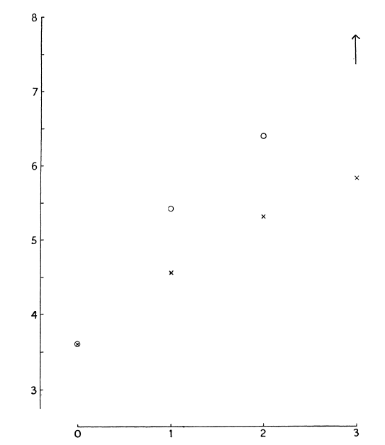
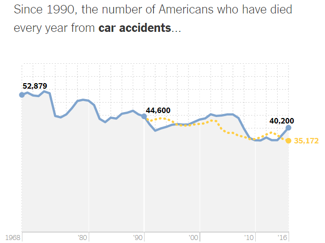

```{r, child = "style.Rmd"}
```


```{r setup, echo = FALSE, message = FALSE, warning = FALSE}

# Packages
library(emo)
library(purrr)
library(tidyverse)
library(gridExtra)
library(nullabor)
library(scales)
library(knitr)
library(kableExtra)
library(RefManageR)
library(iconr)
library(fontawesome)
# download_fontawesome()

# References
bib <- ReadBib("bib/thesis.bib", check = FALSE)
ui <- "- "

# R markdown options
knitr::opts_chunk$set(echo = FALSE, 
                      message = FALSE, 
                      warning = FALSE, 
                      cache = FALSE,
                      dpi = 300)
options(htmltools.dir.version = FALSE)
options(knitr.kable.NA = '')
```

```{r, include = F, eval = T, cache = F}
clean_file_name <- function(x) {
  basename(x) %>% str_remove("\\..*?$") %>% str_remove_all("[^[A-z0-9_]]")
}
img_modal <- function(src, alt = "", id = clean_file_name(src), other = "") {
  
  other_arg <- paste0("'", as.character(other), "'") %>%
    paste(names(other), ., sep = "=") %>%
    paste(collapse = " ")
  
  js <- glue::glue("<script>
        /* Get the modal*/
          var modal{id} = document.getElementById('modal{id}');
        /* Get the image and insert it inside the modal - use its 'alt' text as a caption*/
          var img{id} = document.getElementById('img{id}');
          var modalImg{id} = document.getElementById('imgmodal{id}');
          var captionText{id} = document.getElementById('caption{id}');
          img{id}.onclick = function(){{
            modal{id}.style.display = 'block';
            modalImg{id}.src = this.src;
            captionText{id}.innerHTML = this.alt;
          }}
          /* When the user clicks on the modalImg, close it*/
          modalImg{id}.onclick = function() {{
            modal{id}.style.display = 'none';
          }}
</script>")
  
  html <- glue::glue(
     " <!-- Trigger the Modal -->

<!-- The Modal -->
<div id='modal{id}' class='modal'>
  <!-- Modal Content (The Image) -->
  
  <!-- Modal Caption (Image Text) -->
  <div id='caption{id}' class='modal-caption'></div>
</div>
"
  )
  write(js, file = "js-addins.html", append = T)
  return(html)
}
# Clean the file out at the start of the compilation
write("", file = "js-addins.html")
```

# Outline

1. Related Literature
    + Introduction to Graphics
    + Perception and Psychophysics
    + Testing Graphics
    + Logarithmic Scales and Mapping
    + Underestimation of Exponential Growth
2. Research Objectives
3. Prediction with You Draw It
    + Eye Fitting Straight Lines in the Modern Era
    + Prediction of Exponential Trends
4. Future Work
5. Questions and Discussion

???

Thank you, everyone for coming! Today, I will be presenting my research on the human perception of exponentially increasing data displayed on a log scale evaluated through experimental graphics tasks as part of my Ph.D. prelims. This work has been conducted under the supervision of Dr. Susan VanderPlas and Dr. Reka Howard. 

First, I will provide some background on graphics and logarithmic scales and give an overview of my research objectives. This presentation will mainly focus on the second graphical task study, Prediction with you draw it and then I will share future work to be done.

---
class:inverse
<br>
<br>
<br>
<br>
<br>
<br>
<br>
<br>
.center[
# Related Literature
]

---
class:primary
# Introduction to Graphics

Data visualization is a central tool in modern data science and defined as the art of drawing **graphical charts** in order to display data `r Citep(bib[[c("unwin_why_2020")]])`.

**What are graphics useful for?** `r Citep(bib[[c("lewandowsky_perception_1989")]])`
+ Data cleaning.
+ Exploring data structure.
+ Communicating information.

**Who uses graphics?**
+ Governments use graphics to understand population and economic interests `r Citep(bib[[c("harms1991august", "playfair1801statistical", "walker2013statistical")]])`.
+ Companies use graphics to understand mechanics and support business decisions `r Citep(bib[[c("chandar2012graph", "yates1985graphs")]])`.
+ News sources display graphics of weather forecasts to communicate critical information and aid in decision making.
+ Today, graphics are found in scientific publications and mass media `r Citep(bib[[c("Aisch_NYTimes_presidential_forecast", "gouretski2007much", "silver538_2020")]])`.

???

To get started, we are first going to lay the foundation of graphics. Data visualization has become a pretty key component in data science and statistics. Unwin 2020 defines data visualization as the art of drawing graphical charts in order to display data.

Graphics are useful for data cleaning, exploring data structure, and communicating information. While working at the consulting desk, one of the first things I do when I receive a clients data is to plot the raw data points they have given me. This often leads to the detection of typos when recording data and guides discussion with the client in order to clarify their research questions. After an analysis has been conducted, I then use charts and graphs to display the results and find this is more effective at helping them with interpretation. 

In the 18th and 19th century, governments began using graphics to understand population and economic interests. In the 20th century, we saw companies using graphics to understand the inner workings of their business and support their business decision. We often see news source displaying graphics of weather forecasts such as hurricane trajectories. Today, we see graphics everywhere from scientific journals to mass media in the newspapers, TV, and internet.

---
class:primary
# Introduction to Graphics


Despite the popularity of graphics, we are too accepting of them as default without asking critical questions about the graphics we create or view (Unwin, 2020). 
+ **How effective is this graph at communicating useful information?** (Vanderplas, Cook, & Hofmann, 2020)

Higher quality of technology has influenced the creation, replication, and
complexity of graphics. We now have an infinitely many number design choices:
+ variables displayed, type of graphic, size of graphic, aspect ratio, colors, symbols, scales, limits, ordering of categorical variables
+ increasing number of design choices $\implies$ consistent themes and higher standards.

There is a need for an established set of concepts and terminology to build their graphics from so they can actively choose which of many possible graphics to draw in order to ensure their charts are effective at communicating the intended result.

??? 

An effective graphic accurately shows the data through the appropriate chart selection, axes and scales, and aesthetic design choices in order to successfully communicate the intended result.

---
class:primary
# Grammar of Graphics
.pull-left[
**Big Idea:** Graphics are built from the ground up by specifying exactly how to create a particular graph from a given data set `r Citep(bib[[c("wilkinson2012grammar")]])`.

Graphics are viewed as a mapping
+ **from variables** in the data set (or statistics computed from the data) 
+ **to visual attributes** such as the axes, colors, shapes, or facets on the page/screen
 
].pull-right[

`r Citep(bib[[c("vanderplas2020testing")]])`
]

???

The figure illustrates the process of creating a graphic from a data set through the use of variable mapping, data transformations, coordinate systems, and aesthetic features (Vanderplas, Cook, & Hofmann, 2020) 

Software, such as Hadley Wickham’s ggplot2 (Hadley Wickham, 2011), aims to implement the framework of creating charts and graphics as the grammar of graphics recommends.

---
class:primary
# Perceptual Process

.pull-left[
The **perceptual process** is a sequence of steps used to describe a how a stimulus in the environment leads to our perception of the stimulus and action in response to the stimulus
`r Citep(bib[[c("goldstein2016sensation")]])`.

+ **Sensation:** simple processes that occur right at the beginning of a
sensory system `r Citep(bib[[c("carlson2010psychology")]])`.
+ **Perception:** higher-order mechanisms and identified with more complex processes `r Citep(bib[[c("myers_dewall_2021")]])`.
].pull-right[

.center[`r Citep(bib[[c("goldstein2016sensation")]])`
] 
]

???
+ In order to develop guiding principles for generating graphics effective in communication, we must first understand the basic mechanics of the human perceptual system and the biases we are vulnerable to (Goldstein & Brockmole, 2017).

+ The perceptual process begins when there is a stimulus in the environment and
light is reflected and focused back into the viewer’s eyes. Within the eye, the light
reflected is transformed and focused by the eye’s optical system and an image is
formed on the receptors of the viewer’s retina. It is important to note that
everything a person perceives is based not on direct contact with stimuli but on
representations of stimuli that are formed on the receptors and the resulting activity
in the person’s nervous system. Once light is reflected and focused, our visual
receptors respond to the light and transform the light energy into electrical energy
through a process called transduction. Signals from the receptors are then
transmitted through the retina, to the brain, and then within the brain where
perception (what do you see?) and recognition (what is it called?) occur. After
recognition, viewers take some sort of motor action; for example, the viewer might
move closer to the object. The perceptual process is not direct and instead takes on
more of a cyclic nature where a person may go through many iterations of stimuli,
perception, recognition, and action before the final image is identified and
understood (M. A. Peterson, 1994).

---
class:primary
# Perceptual Process

When perception occurs, we experience:
  + **preattentive stage** in which we observe color, shape, size, and other basic information about the stimuli being perceived.
  + **direct attention** is required for additional processing to allow us to draw connections between components that assist in our interpretation of the stimuli. 

<!-- Graph interpretation involves: (Shah, Mayer, & Hegarty, 1999) -->
<!-- + relatively simple pattern perception and association processes in which viewers can associate graphic patterns to quantitative referents -->
<!-- + more complex and error-prone inferential processes in which viewers must mentally transform data.  -->
.pull-left[
When interacting with charts `r Citep(bib[[c("shah1995conceptual")]])`, a viewer must: 
+ identifying meaningful visual features.
+ classify the quantitative measures and relationships.
+ translate to the variables defined in the data set.
]
.pull-right[
```{r results='asis', echo = F, include = T, cache = F, eval = TRUE}
# decreasing_population <- tibble(Year = seq(1980, 2020, 1),
#                                 Population = 1000 - 10*(Year-1980)) %>%
#   ggplot(aes(x = Year, y = Population)) +
#   geom_line() +
#   theme_bw() +
#   theme(aspect.ratio = 1)
# ggsave(decreasing_population, filename = "images/decreasing-population.png")
i1 <- img_modal(src = "images/decreasing-population.png", alt = " ", other=list(width="80%"))

c(str_split(i1, "\\n", simplify = T)[1:2],
  str_split(i1, "\\n", simplify = T)[3:9]
  ) %>% paste(collapse = "\n") %>% cat()
```
]

???

+ When viewing a chart or graph, most insights we gain are due to the cognitive processes that occur after attention is focused on specific aspects of the graph.

+ Shah & Carpenter (1995) established the process in which viewers interact with charts by first observing the visual features and later translating to cognitive
processing of the information depicted by those features. 

+ The relationship between physiology and perception can provide us information
about how graphics may be understood and interpreted. Through experimentation,
the physiological response (automatic reaction) is related to the behavioral response
(perception, recognition, and action).

---
class:primary
# Logarithmic Perception

**Weber’s law** states we do not notice absolute changes in stimuli,
but instead that we notice the relative change `r Citep(bib[[c("fechner1860elemente")]])`. Discovered by Ernst Weber, an early psychophysics researcher.

Numerically, Weber’s Law is defined as:

\begin{equation*}
\frac{\Delta S}{S} = K
\end{equation*}

+ $\Delta S$ represents the difference threshold
+ $S$ represents the initial stimulus
+ $K$ is called Weber’s contrast which remains constant as the magnitude
of $S$ changes. 

???
Ernst Weber, an early psychophysics researcher discovered the relationship between the difference threshold (smallest detectable difference between two sensory stimuli; known as the “Just Noticeable Difference”) and the magnitude of a stimulus.

---
class:primary
# Logarithmic Perception

Extending Weber's law, Gustav Fechner discovered the relationship between the perceived intensity is logarithmic to the stimulus intensity when observed above a minimal threshold of perception `r Citep(bib[[c("fechner1860elemente")]])`.

Formally known as the **Weber-Fechner law**, it is derived from Weber’s law as:
\begin{equation}
P = K \ln \frac{S}{S_0}
\end{equation}
+ $P$ represents the perceived stimulus
+ $K$ represents Weber’s contrast
+ $S$ represents the initial stimulus intensity
+ $S_0$ represents the minimal threshold of perception.

???
Gustav Fechner, a founder of psychophysics, provided further extension to Weber’s law by discovering the relationship between the perceived intensity is logarithmic to the stimulus intensity when observed above a minimal threshold of perception (Fechner, 1860).

---
class:primary
# Testing Graphics

Evaluate design choices through the use of graphical tests. Could ask participants to:

- identify differences in graphs.
- read information off of a chart accurately.
- use data to make correct real-world decisions.
- predict the next few observations.

All of these types of tests require different levels of use and manipulation of the information presented in the chart.

---
class:primary
# Motivation

Data visualizations played an important role in during the COVID-19 pandemic in displaying case counts, transmission rates, and outbreak regions `r Citep(bib[[c("rost_2020")]])`.

.pull-left[
+ Mass media routinely showed charts to share information with the public about the progression of the pandemic `r Citep(bib[[c("romano_scale_2020")]])`.
+ Graphics helped guide decision makers to implement policies such as shut-downs or mandated mask wearing.
+ Facilitated communication with the public to increase compliance `r Citep(bib[[c("bavel_using_2020")]])`.  

].pull-right[
```{r results='asis', echo = F, include = T, cache = F, eval = TRUE}
i1 <- img_modal(src = "images/91divoc-cases-july2021.png", alt = Citep(bib[[c("fagen-ulmschneider_2020")]]), other=list(width="80%"))

c(str_split(i1, "\\n", simplify = T)[1:2],
  str_split(i1, "\\n", simplify = T)[3:9]
  ) %>% paste(collapse = "\n") %>% cat()
``` 

```{r results='asis', echo = F, include = T, cache = F, eval = TRUE}
i1 <- img_modal(src = "images/covid19-summer2020-risk-map.png", alt = Citep(bib[[c("global_epidemics_2021")]]), other=list(width="80%"))

c(str_split(i1, "\\n", simplify = T)[1:2],
  str_split(i1, "\\n", simplify = T)[3:9]
  ) %>% paste(collapse = "\n") %>% cat()
```
]
---
class:primary
# Logarithmic Scales

.pull-left[
**Problem:** Data which spans several orders of magnitude shown on its original scale compresses the smaller magnitudes into relatively little area.

**Solution:** Use a log scale transformation; alters the contextual appearance of the data.

```{r results='asis', echo = F, include = T, cache = F, eval = TRUE}
i1 <- img_modal(src = "images/log-scale-example.png", alt = " ", other=list(width="100%"))

c(str_split(i1, "\\n", simplify = T)[1:2],
  str_split(i1, "\\n", simplify = T)[3:9]
  ) %>% paste(collapse = "\n") %>% cat()
```

].pull-right[
```{r results='asis', echo = F, include = T, cache = F, eval = TRUE}
i1 <- img_modal(src = "images/log-scale-comic.png", alt = Citep(bib[[c("munroe_2005")]]), other=list(width="100%"))

c(str_split(i1, "\\n", simplify = T)[1:2],
  str_split(i1, "\\n", simplify = T)[3:9]
  ) %>% paste(collapse = "\n") %>% cat()
```
]

```{r log-scale-example, eval = T, echo = F, out.width = "100%"}
# data <- tibble(x = seq(0,10, by = 0.1), y = exp(x))
# 
# linear_scale <- data %>%
#   ggplot(aes(x = x, y = y)) +
#   geom_line() +
#   theme_bw() +
#   theme(aspect.ratio = 1) +
#   ggtitle("Linear Scale")
# 
# log_scale <- data %>%
#   ggplot(aes(x = x, y = y)) +
#   geom_line() +
#   theme_bw() +
#   theme(aspect.ratio = 1) +
#   scale_y_log10(breaks = trans_breaks("log10", function(x) 10^x)) +
#   ggtitle("Log Scale")
# 
# grid.arrange(linear_scale,log_scale, ncol = 2)
```

---
class:primary
# Logarithmic Mapping

+ Research suggests our perception and mapping of numbers to a number line is **logarithmic at first**, but transitions to a **linear scale later** in development, with formal mathematics education `r Citep(bib[[c("dehaene2008log", "siegler_numerical_2017", "varshney_why_2013")]])`.

+ A kindergartner asked to place numbers one through ten along a number
line would place three close to the middle, following the logarithmic perspective
`r Citep(bib[[c("varshney_why_2013")]])`.

.center[

]
```{r log-number-line, fig.height = 1, fig.width = 10, message=FALSE, warning=FALSE, out.width = "100%", eval = F}
# log_numberline <- tibble(x = seq(1,10, 0.25),
#        y = 1,
#        text = c("1", NA, NA, NA, 
#                 NA, NA, NA, NA,
#                 NA, NA, NA, "2",
#                 NA, NA, NA, NA,
#                 NA, "3", NA, NA, 
#                 NA, "4", NA, NA,
#                 NA, "5", NA, NA,
#                 "6", NA, NA, NA,
#                 "7", NA, "8", "9",
#                 "10")
#        ) %>%
#   ggplot(aes(x = x, y = y, label = text)) +
#   # geom_line() +
#   geom_text() + 
#   theme_classic() +
#   theme(aspect.ratio = 0.1,
#         axis.line.y = element_blank(),
#         axis.ticks.y = element_blank(),
#         axis.text.y = element_blank()
#         ) +
#   labs(x = NULL,
#        y = NULL
#        ) +
#   scale_x_continuous(breaks = c(1,10))
```

+ **Assumption:** If we perceive logarithmically by default, it is a natural (and presumably low effort) way to display information and should be easy to read and understand/use.

???

+ When we first learn to count, we begin counting by ones, then by tens, and advancing to hundreds, following the base10 order of magnitude system.

+ Assuming there is a direct relationship between perceptual and cognitive
processes, it is reasonable to assume numerical representations should also be
displayed on a nonlinear, compressed number scale. Therefore, if we perceive
logarithmically by default, it is a natural (and presumably low effort) way to display
information and should be easy to read and understand/use.


---
class:primary
# Benefits and Pitfalls of Log Scales

.pull-left[

**Benefits** were seen in spring 2020, during the early stages of the COVID-19 pandemic.
.center[
```{r results='asis', echo = F, include = T, cache = F, eval = TRUE}
i1 <- img_modal(src = "images/covid19-FT-03.23.2020-log.png", alt = Citep(bib[[c("burnmurdoch_2020")]]), other=list(width="70%"))

c(str_split(i1, "\\n", simplify = T)[1:2],
  str_split(i1, "\\n", simplify = T)[3:9]
  ) %>% paste(collapse = "\n") %>% cat()
```
]

+ Large magnitude discrepancies in case counts at a given time point between different geographic regions.
+ Log scale transformations were usefulness for showing case count curves for areas with few cases and areas with many cases within one chart. 

].pull-right[

**Pitfalls** were exposed as the pandemic evolved, and the case counts were no longer spreading exponentially.

```{r results='asis', echo = F, include = T, cache = F, eval = TRUE}
i1 <- img_modal(src = "images/covid19-FT-case-count-06.30.2020-linear.png", alt = Citep(bib[[c("burnmurdoch_2020")]]), other=list(width="45%"))
i2 <- img_modal(src = "images/covid19-FT-case-count-06.30.2020-log.png", alt = Citep(bib[[c("burnmurdoch_2020")]]), other=list(width="45%"))

c(str_split(i1, "\\n", simplify = T)[1:2],
  str_split(i2, "\\n", simplify = T)[1:2],
  str_split(i1, "\\n", simplify = T)[3:9],
  str_split(i2, "\\n", simplify = T)[3:9]
  ) %>% paste(collapse = "\n") %>% cat()
```

+ Graphs with linear scales seemed more effective at spotting early increases in case counts that signaled more localized outbreaks.
+ The effect of the linear scale appears to evoke a stronger reaction from the public than the log scale.
]

---
class:primary
# Research Objectives

**Big Idea:** Are there benefits to displaying exponentially increasing data on a log scale rather than a linear scale?

1. [Perception through Lineups](https://shiny.srvanderplas.com/log-study/) `r emo::ji("chart increasing")` `r emo::ji("chart increasing")` `r emo::ji("chart increasing")`

    - Test an individuals ability to perceptually differentiate exponentially increasing data with differing rates of change on both the linear and log scale.
    
2. [Prediction with You Draw It](https://shiny.srvanderplas.com/you-draw-it/) `r emo::ji("pencil2")`
    
    - Tests an individuals ability to make predictions for exponentially increasing data.
        + Eye Fitting Straight Lines in the Modern Era
        + Prediction of Exponentially Increasing Trends
        
3. Estimation by Numerical Translation `r emo::ji("straight_ruler")`

    - Tests an individuals ability to translate a graph of exponentially increasing data into real value quantities.

---
class:primary
# Research Objectives

**Big Idea:** Are there benefits to displaying exponentially increasing data on a log scale rather than a linear scale?

1. [Perception through Lineups](https://shiny.srvanderplas.com/log-study/) `r emo::ji("chart increasing")` `r emo::ji("chart increasing")` `r emo::ji("chart increasing")`

    - Test an individuals ability to perceptually differentiate exponentially increasing data with differing rates of change on both the linear and log scale.
    
2. [**Prediction with You Draw It**](https://shiny.srvanderplas.com/you-draw-it/) `r emo::ji("pencil2")`
    
    - **Tests an individuals ability to make predictions for exponentially increasing data.**
        + **Eye Fitting Straight Lines in the Modern Era**
        + **Prediction of Exponentially Increasing Trends**
        
3. Estimation by Numerical Translation `r emo::ji("straight_ruler")`

    - Tests an individuals ability to translate a graph of exponentially increasing data into real value quantities.


---
class:primary
# Underestimation of Exponential Growth

.pull-left[
Exponential growth is often misjudged:
+ **early stage** appears to have a small growth rate.
+ **middle stage** appears to be growing, but not at an astounding rate, appearing more quadratic.
+ **late stages** exponential growth when it is quite apparent.
].pull-right[
```{r results='asis', echo = F, include = T, cache = F, eval = TRUE}
i1 <- img_modal(src = "images/exponential-stages-comic.jpg", alt = Citep(bib[[c("vonbergmann_2021")]]), other=list(width="100%"))

c(str_split(i1, "\\n", simplify = T)[1:2],
  str_split(i1, "\\n", simplify = T)[3:9]
  ) %>% paste(collapse = "\n") %>% cat()
```
]

This misinterpretation can lead to decisions made under inaccurate understanding causing future consequences.

---
class:primary
# Underestimation of Exponential Growth

Estimation and prediction of **exponential growth is underestimated** when presented both numerically and graphically `r Citep(bib[[c("jones_generalized_1979", "mackinnon_feedback_1991", "wagenaar_misperception_1975")]])`.

+ Numerical estimation is more accurate than graphical estimation for exponential curves. 
+ No improvement in estimation found when participants had contextual knowledge or experience with exponential growth.
+ Instruction on exponential growth reduced the underestimation `r Citep(bib[[c("jones_generalized_1979", "wagenaar_misperception_1975")]])`. 
+ Estimation was improved by providing immediate feedback to participants about the accuracy of their current predictions `r Citep(bib[[c("mackinnon_feedback_1991")]])`.

**Can log transforming the data help?**

+ Maybe, but are there consequences? 
+ Most readers are not mathematically sophisticated enough to intuitively understand logarithmic math and translate that back into real-world effects.

???

+ Results indicated that numerical estimation is more accurate than graphical estimation for exponential curves. Experimental studies were conducted in order to determine strategies to improve the accuracy of estimation of exponential growth (Jones, 1977; Mackinnon & Wearing, 1991; Wagenaar & Sagaria, 1975). There was no improvement in estimation found when participants had contextual knowledge or experience with exponential growth, but instruction on exponential growth reduced the
underestimation; participants adjusted their initial starting value but not their
perception of the growth rate (Jones, 1977; Wagenaar & Sagaria, 1975). Mackinnon
& Wearing (1991) found that estimation was improved by providing immediate
feedback to participants about the accuracy of their current predictions.

---
class:inverse
<br>
<br>
<br>
<br>
<br>
<br>
<br>
<br>
.center[
# Prediction with 'You Draw It'
]

---
class:primary
# Subjective Judgment in Statistical Analysis
## `r Citep(bib[[c("finney_subjective_1951")]])`

.pull-left[
+ **Big Idea:** Determine the effect of stopping iterative maximum likelihood calculations after one iteration in the estimation of parameters connected iwth dose-response relationships.
+ **Method:** Judge by eye the positions for a pair of *parallel* probit regression lines in a biological assay. Sent out by mail, asked to "rule two lines."
+ **Sample:** 21 scientists
+ **Findings:** One cycle of iterations for calculating the relative potency was sufficient based on the starting values provided by eye from the participants.
].pull-right[

]

???
+ The subjects for this study were deliberately chosen as. having no' experience of probit methods.

---
class:primary
# Scientistis have always had sass!
## `r Citep(bib[[c("finney_subjective_1951")]])`
<font size="6">
.small[
+ "No one in their right senses could draw 2 parallel lines through the points in question, but I've done my best to comply with your request as I understand it. **Certainly I did not use my intelligence**". (No. 2.)

+ "Where fact and theory are so at variance one guess is as good as another-so here goes. The job might have been easier if S.E. of individual points was known!" (No. 9.) 

+ "I should-say that the points were not on two parallel straight lines, and that was that!" (No. 11.) 
+ "The line through the x points is of course easy to draw. But I had to overcome considerable intellectual resistance before I could bring myself to draw a parallel line for the 0 points". (No. 14.) 

+ "**What fun! But I don't believe a word of it.** The only thing is either (a) to do the experiment again or (b) revise the theory". (No. 18.) 

+ **"If, as an experimental scientist, an experiment of mine produced a set of data such as you provided I should at once do the experiment again!"** (No. -20-a chemist.) 

+ "What I would really like to draw are 2 lines which are far from parallel!" (No. 21.)
]
</font>

---
class:primary
# Eye Fitting Straight Lines
## `r Citep(bib[[c("mosteller_eye_1981")]])`
.pull-left[
+ **Big Idea:** Students fitted lines by eye to four sets of points.
+ **Method:** 8.5 x 11 inch transparency with a straight line etched completely across the
middle.
+ **Sample:** 153 graduate students and post docs in Introductory Biostatistics.
+ **Experimental Design:** Latin square with packets stapled in four different orders.
+ **Findings:** Students tended to fit the slope of the first principal component over the slope of the ordinary least squares regression line.
].pull-right[

]

???
+ Method involves maneuvering a string, black thread, or ruler until the fit seems satisfactory, and then drawing the line.
+ Sample - most had not studied statistics before
+ Method proposed by Tukey
+ Students tended to fit the slope of the first principal component or major axis (the line that minimizes the sum of squares of perpendicular rather than vertical distances).
+ Students had a slight tendency to choose consistently either steeper or shallower slopes for all sets of data.
+ Individual-to-individual variability in slope and in intercept was near the standard error provided by least squares for the four data sets (no theory encourages us to believe in such relations).
+ Found no trend in the differences due to order.

---
class:primary
# You Draw It Feature 
## (New York Times, 2015)
.pull-left[

.center[
`r Citep(bib[[c("katz_2017")]])`
]
].pull-right[

Readers are asked to input their own assumptions about various metrics and
compare how these assumptions relate to reality.

+ [Family Income affects college chances](https://www.nytimes.com/interactive/2015/05/28/upshot/you-draw-it-how-family-income-affects-childrens-college-chances.html) `r Citep(bib[[c("aisch_cox_quealy_2015")]])`
+ [Just How Bad Is the Drug Overdose Epidemic?](https://www.nytimes.com/interactive/2017/04/14/upshot/drug-overdose-epidemic-you-draw-it.html) `r Citep(bib[[c("katz_2017")]])`
+ [What Got Better or Worse During Obama’s Presidency](https://www.nytimes.com/interactive/2017/01/15/us/politics/you-draw-obama-legacy.html?_r=0) `r Citep(bib[[c("buchanan_park_pearce_2017")]])`

The New York Times team utilizes **Data Driven Documents (D3)** that allows readers to predict these metrics through the use of drawing a line on their computer screen with their mouse.
]

---
class:primary
# Background of D3

**Who?** [Mike Bostock](https://observablehq.com/@mbostock) created D3 during his time working on graphics at the New York Times.
  
**What?** Open-source JavaScript based graphing framework
+ D3 = "Data Driven Documents"
+ `D3` is to JavaScript as `ggplot2` is to R
+ Framework for binding objects and layers to plotting area
  + framework for movement and user interaction

**When?** D3 v1.0 released in 2011, D3.js recently celebrated it's 10th anniversary!

**Where?** The internet!

**Why?** Advantages of using D3 include animation and allowing for movement and user interaction such as hovering, clicking, and brushing. 

**How?** `r2d3`!

```{r raster-vs-vector, fig.cap = "SVG vs Raster", out.width="50%"}
# knitr::include_graphics("images/raster-vs-vector.png")
# https://commons.wikimedia.org/wiki/File:Bitmap_VS_SVG.svg
# https://creativecommons.org/licenses/by-sa/2.5/legalcode
```

???

+ Used by major news and research organizations such as the New York Times, FiveThirtyEight, Washington Post, and the Pew Research Center create and customize graphics.
+ In June 2020, the New York Times released a front page displaying figures that represent each of the 100,000 lives lost from the COVID-19 pandemic until this point in time [@NYTrememberinglives]; this visualization was meant to bring about a visceral reaction and resonate with readers. 
+ During 2021 March Madness, FiveThirtyEight created a roster-shuffling machine which allowed readers to build their own NBA contender through interactivity [@ryanabest_2021].
+ Similar to geometric objects and style choices in ggplot2, the grammar of D3 also includes elements such as circles, paths, and rectangles with choices of attributes and styles such as color and size.

---
class:primary
# Relationship between D3 and R 

.pull-left[
The `r2d3` package `r Citep(bib[[c("luraschi_r2d3")]])` in R provides an efficient integration of D3 visuals and R by displaying them in familiar formats:
+ RMarkdown with HTML output
+ Shiny applications (amazing!)

].pull-right[
.center[ 
 
]
]

`r2d3` makes it easy to do your data processing in R, then apply D3.js code to visualize that data!

--
<!-- The example R code illustrates the structure of the r2d3 function which includes specification of a data frame in R (converted to a JSON file), the D3.js source code file, and the D3 version that accompanies the source code. -->
<!-- A default SVG container for layering elements is then generated by the r2d3 function which renders the plot using the source code.  -->
.pull-left[
**How?**
+ Converts data in R to JSON that can be interpreted by JavaScript
+ Sources D3 code library
+ Creates plot container (svg)
+ Renders plot using source code
].right-plot[
```{r r2d3-example, echo = T, eval = F}
r2d3(data = data,
     script = "d3-source-code.js",
     d3_version= "5")
```
]

???
A challenge of working with D3 is the environment necessary to display the graphics and images. 

+ Converts data in R to JSON that can be interpreted by JavaScript
  + Object is named 'data'
  + Columns can be accessed
+ Sources D3 code library
  + Grabs version specified in function
+ Creates plot container (svg is default)
  + Or different container if specified
  + specifies width and height of plot container
+ Renders plot object using JavaScript and CSS files called in r2d3 call

---
class:primary
# Getting Started with D3

`D3.js` is to JavaScript as `ggplot2` is to R

.pull-left[
`r fa_i("js")` [Codecademy: Introduction to JavaScript](https://www.codecademy.com/learn/introduction-to-javascript)

`r fa_i("image")` Understand [SVG](http://tutorials.jenkov.com/svg/g-element.html) elements: inspect elements in web browser!

`r fa_i("book-open")` Amelia Wattenberger's [Full Stack D3 and Data Visualization Book](https://www.newline.co/fullstack-d3)

`r fa_i("chart-bar")` Build a basic graphic using [r2d3](https://rstudio.github.io/r2d3/articles/introduction.html)

`r fa_i("grimace")` Modify `D3.js` code until it does what you want!
]
.pull-right[
**Additional Resources**

`r fa_i("code")` [How to learn D3 with no coding experience](https://www.heshameissa.com/blog/learn-d3)

`r fa_i("twitter")` Amelia Wattenberger on [Twitter](https://twitter.com/Wattenberger)
]

---
class:primary
# You Draw It Experimental Task

Study Participant Prompt: *Use your mouse to fill in the trend in the yellow box region.*

.pull-left[

].pull-right[

]

???
Example of a you draw it interactive plot as seen by participants during the study. 
The first frame shows what the participant sees along with the prompt, "Use your mouse to fill in the trend in the yellow box region". 
Next, the yellow box region moves along as the participant draws their trend-line until the yellow region disappears, indicating the participant has filled in the entire domain.

---
class:primary
# Study Design

Two sub-studies:

1. **Eye Fitting Straight Lines in the Modern Era**
  + Aims to establish and validate 'you draw it' as a tool for measuring predictions of trends fitted by eye and a method for testing graphics. 
  + Replicated experiment and results found in Mosteller et al. (1981).
2. **Prediction of Exponentially Increasing Trends**
  + Test an individuals' ability to make predictions for exponentially increasing data on both the log and linear scales.

All subjects' participated in both sub-studies at the same time in conjunction with one another.

+ Participants completed the experiment using a RShiny application found [**here.**](https://shiny.srvanderplas.com/you-draw-it/)
+ Participants were recruited through Twitter, Reddit, and direct
email during May 2021 *(you may have been one!* `r emo::ji("smile")`*)*.
+ A total of 39 individuals completed 256 unique you draw it task plots.

---
class:inverse
<br>
<br>
<br>
<br>
<br>
<br>
<br>
<br>
.center[
# Eye Fitting Straight Lines in the Modern Era
]

```{r eyefitting-plots}
eyefitting_model_data <- read.csv("data/youdrawit/youdrawit-eyefitting-model-data.csv") %>%
  dplyr::rename(`Parameter Choice` = parm_id)
```

---
class:primary
# Data Simulation

**Point data:** $N = 30$ points $(x_i, y_i), i = 1,...N$ were generated for $x_i \in [x_{min}, x_{max}]$.

Data were simulated based on linear model with additive errors:
\begin{equation}
y_i = \beta_0 + \beta_1 x_i + e_i
\end{equation}

where $e_i \sim N(0, \sigma^2).$

**Line data:** $k = 1,....4x_{max} + 1$ fitted values in 0.25 increments across the domain, $(x_k, \hat y_{k,OLS})$

An ordinary least squares regression is then fit to the simulated points:
\begin{equation}
\hat y_{k,OLS} = \hat\beta_{0,OLS} + \hat\beta_{1,OLS} x_k
\end{equation}

Outputs a list of point data and line data both indicating the parameter identification, x-value, and corresponding simulated or fitted y value.

---
class:primary
# Treatment Design
.pull-left[
Replicated the data sets from Mosteller et al. (1981).
+ **F:** positive slope; a large variance; $x \in [0, 20]$. 
+ **N:** negative slope; large variance; $x \in [0, 20]$. 
+ **S:** positive slope; small variance; $x \in [0, 20]$. 
+ **V:** steep positive slope; small variance; $x \in [4, 16]$. 

Consistent aesthetic design choices:
+ aspect ratio set to one.
+ y-range extended $10\%$ beyond the range of the simulated data points.
].pull-right[

```{r results='asis', echo = F, include = T, cache = F, eval = TRUE}
i1 <- img_modal(src = "images/eyefitting-example-simplot.png", alt = " ", other=list(width="100%"))

c(str_split(i1, "\\n", simplify = T)[1:2],
  str_split(i1, "\\n", simplify = T)[3:9]
  ) %>% paste(collapse = "\n") %>% cat()
```

```{r eyefitting-simplot, out.width="100%", eval = F}
# eyefitting_example_sim <- read.csv("data/youdrawit/youdrawit-eyefitting-simdata-example.csv")
# eyefitting_example_simplot <- eyefitting_example_sim %>%
#   filter(data == "point_data") %>%
#   filter(dataset %in% c("F", "N", "S") | (x < 16 & x > 4)) %>%
#   mutate(dataset = factor(dataset, levels = c("S", "F", "V", "N"))) %>%
#   dplyr::rename(`Parameter Choice` = dataset) %>%
#   ggplot(aes(x = x, y = y)) +
#   geom_point(size = 1) +
#   facet_wrap(~`Parameter Choice`, labeller = labeller(`Parameter Choice` = label_both), ncol = 2) +
#   theme_bw(base_size = 14) +
#   theme(aspect.ratio = 1,
#         legend.position = "none",
#         plot.title   = element_text(size = 12, hjust = 0),
#         axis.text    = element_text(size = 12),
#         axis.title   = element_text(size = 12),
#         legend.title = element_text(size = 12),
#         legend.text  = element_text(size = 12),
#         # strip.text = element_text(size = 5, margin = margin(0.05,0,0.05,0, "cm")),
#         # strip.background = element_rect(size = 0.5),
#         legend.key.size = unit(1, "line")
#         )
# 
# eyefitting_example_simplot
# ggsave(eyefitting_example_simplot, filename = "images/eyefitting-example-simplot.png")
```
]

---
class:primary
# Slope of First Principal Component

.pull-left[

Fitted points, $(x_k, \hat y_{k,PCA})$ are calculated every 0.25 increment across the domain from the PCA regression equation:
\begin{equation}
\hat y_{k,PCA} = \hat\beta_{0,PCA} + \hat\beta_{1,PCA} x_k
\end{equation}

where
+ rotation of coordinate axes from `princomp`
+ $\hat\beta_{1,PCA} = \frac{\text{PC1 Rotation in y-axis}}{\text{PC1 Rotation in x-axis}}$
+ $\hat\beta_{0,PCA}$ calculated by the point-slope equation of a line using the mean of of the simulated points, $(\bar x_i, \bar y_i)$.

].pull-right[
```{r results='asis', echo = F, include = T, cache = F, eval = TRUE}
i1 <- img_modal(src = "images/pca-plot.png", alt = " ", other=list(width="100%"))

c(str_split(i1, "\\n", simplify = T)[1:2],
  str_split(i1, "\\n", simplify = T)[3:9]
  ) %>% paste(collapse = "\n") %>% cat()
```

]

```{r ols-vs-pca-example, eval = F, fig.width = 8, fig.height = 4, message=FALSE, warning=FALSE, out.width="50%"}
# library(ggplot2)
# library(magrittr)
# library(plyr)
# 
# set.seed(2)
# corrCoef = 0.5 # sample from a multivariate normal, 10 datapoints
# dat = MASS::mvrnorm(10,c(0,0),Sigma = matrix(c(1,corrCoef,2,corrCoef),2,2))
# dat[,1] = dat[,1] - mean(dat[,1]) # it makes life easier for the princomp
# dat[,2] = dat[,2] - mean(dat[,2])
# 
# dat = data.frame(x1 = dat[,1],x2 = dat[,2])
# 
# # Calculate the first principle component
# # see http://stats.stackexchange.com/questions/13152/how-to-perform-orthogonal-regression-total-least-squares-via-pca
# v = dat%>%prcomp%$%rotation
# x1x2cor = bCor = v[2,1]/v[1,1]
# 
# x1tox2 = coef(lm(x1~x2,dat))
# x2tox1 = coef(lm(x2~x1,dat))
# slopeData = data.frame(slope = c(x1x2cor,x2tox1[2]),
#                        type=c("Principal Component", "Ordinary Least Squares"))
# 
# # We want this to draw the neat orthogonal lines.
# pointOnLine = function(inp){
#   # y = a*x + c (c=0)
#   # yOrth = -(1/a)*x + d
#   # yOrth = b*x + d
#   x0 = inp[1] 
#   y0 = inp[2] 
#   a = x1x2cor
#   b = -(1/a)
#   c = 0
#   d = y0 - b*x0
#   x = (d-c)/(a-b)
#   y = -(1/a)*x+d
#   return(c(x,y))
# }
# 
# points = apply(dat,1,FUN=pointOnLine)
# 
# segmeData = rbind(data.frame(x=dat[,1],y=dat[,2],xend=points[1,],yend=points[2,],type = "Principal Component"),
#                   data.frame(x=dat[,1],y=dat[,2],yend=dat[,1]*x2tox1[2],xend=dat[,1],type="Ordinary Least Squares"))
# 
# pca_plot <- dat %>%
# ggplot(aes(x1,x2))+
#   geom_point()+
#   geom_abline(data=slopeData,aes(slope = slope,intercept=0,color=type, linetype=type), size = 1.2)+
#   geom_segment(data=segmeData,aes(x=x,y=y,xend=xend,yend=yend,color=type, linetype=type))+
#   facet_grid(.~type)+
#   coord_equal()+
#   scale_x_continuous("x") +
#   scale_y_continuous("y") +
#   theme_bw(base_size = 14) +
#   theme(aspect.ratio = 1,
#         legend.position = "none",
#         axis.text    = element_text(size = 12),
#         axis.title   = element_text(size = 12),
#         legend.title = element_blank(),
#         # legend.text  = element_text(size = 10),
#         # strip.text = element_text(size = 8, margin = margin(0.1,0,0.1,0, "cm")),
#         # strip.background = element_rect(size = 0.8),
#         legend.key.size = unit(1, "line")
#         ) +
#   scale_color_manual(values = c("steelblue", "orange"), labels = c("OLS", "PCA")) +
#   scale_linetype_manual(values = c("solid", "dashed"), labels = c("OLS", "PCA"))
# pca_plot
# ggsave(pca_plot, filename = "images/pca-plot.png")
```

???

---
class:primary
# Model Data

.pull-left[
For each participant, the final data set used for analysis contains:
+ $x_{ijk}$, $y_{ijk,drawn}$, $\hat y_{ijk,OLS}$, $\hat y_{ijk,PCA}$  

for parameter choice $i = 1,2,3,4$, j = $1,...N_{participant}$, and $x_{ijk}$ value $k = 1, ...,4 x_{max} + 1$.

Vertical residuals between the drawn and fitted values were calculated as: 
+ $e_{ijk,OLS} = y_{ijk,drawn} - \hat y_{ijk,OLS}$
+ $e_{ijk,PCA} = y_{ijk,drawn} - \hat y_{ijk,PCA}$.

].pull-right[

```{r results='asis', echo = F, include = T, cache = F, eval = TRUE}
i1 <- img_modal(src = "images/eyefitting-trial-plot.png", alt = " ", other=list(width="100%"))

c(str_split(i1, "\\n", simplify = T)[1:2],
  str_split(i1, "\\n", simplify = T)[3:9]
  ) %>% paste(collapse = "\n") %>% cat()
```

```{r eyefitting-example-plot, fig.height = 4, fig.width = 4, out.width="100%"}
# trial.feedback <- read.csv("data/youdrawit/youdrawit-eyefitting-example-feedback.csv") %>%
#     mutate(`Parameter Choice` = "F")
# trial.sim <- read.csv("data/youdrawit/youdrawit-eyefitting-example-simulated.csv") %>%
#     mutate(`Parameter Choice` = "F")
#     
# trial_feedback_plot <- trial.feedback %>%
#   ggplot(aes(x = x)) +
#   geom_line(aes(y = y, color = "OLS", linetype = "OLS")) +
#   geom_line(aes(y = ypca, color = "PCA", linetype = "PCA")) +
#   geom_line(aes(y = ydrawn, color = "Drawn", linetype = "Drawn")) +
#   geom_point(data = trial.sim, aes(y = y)) +
#   facet_wrap(~`Parameter Choice`, labeller = labeller(`Parameter Choice` = label_both)) +
#   theme_bw(base_size = 14) +
#   theme(aspect.ratio = 1,
#         legend.position = "bottom",
#         axis.text    = element_text(size = 12),
#         axis.title   = element_text(size = 12),
#         legend.title = element_text(size = 12),
#         legend.text  = element_text(size = 12),
#         # strip.text = element_text(size = 8, margin = margin(0.1,0,0.1,0, "cm")),
#         # strip.background = element_rect(size = 0.8),
#         legend.key.size = unit(1, "line")
#         ) +
#   scale_x_continuous(limits = c(0,20)) +
#   scale_color_manual("", values = c("black", "steelblue", "orange")) +
#   scale_linetype_manual("", values = c("dashed", "solid", "solid"))
# ggsave(trial_feedback_plot, filename = "images/eyefitting-trial-plot.png")
```
]

???
Analyses:
+ Linear Mixed Model
+ Generalized Additive Mixed Model
+ Sum of Squares Analysis
---
class:primary
# Linear Mixed Model
Using the `lmer` function in the lme4 package, a linear mixed model (LMM) is fit separately to the OLS and PCA residuals, constraining the fit to a linear trend. 

The LMM equation for each fit (OLS and PCA) residuals is given by:
\begin{equation}
e_{ijk,fit} = \left[\gamma_0 + \alpha_i\right] + \left[\gamma_{1} x_{ijk} + \gamma_{2i} x_{ijk}\right] + p_{j} + \epsilon_{ijk}
\end{equation}
where

+ $e_{ijk,fit}$ is the residual between the drawn and fitted y-values for the $i^{th}$ parameter choice, $j^{th}$ participant, and $k^{th}$ increment of x-value corresponding to either the OLS or PCA fit
+ $\gamma_0$ is the overall intercept
+ $\alpha_i$ is the effect of the $i^{th}$ parameter choice (F, S, V, N) on the intercept
+ $\gamma_1$ is the overall slope for $x$
+ $\gamma_{2i}$ is the effect of the parameter choice on the slope
+ $x_{ijk}$ is the x-value for the $i^{th}$ parameter choice, $j^{th}$ participant, and $k^{th}$ increment
+ $p_{j} \sim N(0, \sigma^2_{participant})$ is the random error due to the $j^{th}$ participant's characteristics
+ $\epsilon_{ijk} \sim N(0, \sigma^2)$ is the residual error.
---
class:primary
# Generalized Additive Mixed Model
Eliminating the linear trend constraint, the `bam` function in the mgcv package is used to fit a generalized additive mixed model (GAMM) separately to the OLS and PCA residuals to allow for estimation of smoothing splines.

The GAMM equation for each fit (OLS and PCA) residuals is given by:
\begin{equation}
e_{ijk,fit} = \alpha_i + s_{i}(x_{ijk}) + p_{j} + s_{j}(x_{ijk})
\end{equation}
where

+ $e_{ijk,fit}$ is the residual between the drawn and fitted y-values for the $i^{th}$ parameter choice, $j^{th}$ participant, and $k^{th}$ increment of x-value corresponding to either the OLS or PCA fit
+ $\alpha_i$ is the intercept for the parameter choice $i$
+ $s_{i}$ is the smoothing spline for the $i^{th}$ parameter choice
+ $x_{ijk}$ is the x-value for the $i^{th}$ parameter choice, $j^{th}$ participant, and $k^{th}$ increment
+ $p_{j} \sim N(0, \sigma^2_{participant})$ is the error due to participant variation
+ $s_{j}$ is the random smoothing spline for each participant.

---
class:primary
# Results

.center[
```{r results='asis', echo = F, include = T, cache = F, eval = TRUE}
i1 <- img_modal(src = "images/eyefitting-lmer-plot.png", alt = " ", other=list(width="45%"))
i2 <- img_modal(src = "images/eyefitting-gamm-plot.png", alt = " ", other=list(width="45%"))

c(str_split(i1, "\\n", simplify = T)[1:2],
  str_split(i2, "\\n", simplify = T)[1:2],
  str_split(i1, "\\n", simplify = T)[3:9],
  str_split(i2, "\\n", simplify = T)[3:9]
  ) %>% paste(collapse = "\n") %>% cat()
```
]

+ Estimated trends from PCA residuals (orange) appear to align closer to the $y=0$ horizontal (dashed) line than the OLS residuals (blue). 
+ More prominent in parameter choices with large variances (F and N).
+ Consistent to results found in Mosteller et al. (1981).

```{r eyefitting-lmer-residualplots, eval = F, fig.height = 8, fig.width = 8, out.width = "70%", fig.cap = "Eye Fitting Straight Lines in the Modern Era LMM results"}
# eyefitting.preds.lmer <- read.csv("data/youdrawit/youdrawit-eyefitting-lmerpred-data.csv")
# # Plot Predictions
# eyefitting.lmer.plot <- eyefitting.preds.lmer %>%
#   filter((parm_id %in% c("F", "N", "S") | (x <= 16 & x >= 4))) %>%
#   mutate(parm_id = factor(parm_id, levels = c("S", "F", "V", "N"))) %>%
#   dplyr::rename(`Parameter Choice` = parm_id) %>%
#   ggplot(aes(x = x)) +
#   geom_line(data = eyefitting_model_data, aes(x = x, y = residualols, group = plotID, color = "OLS"), alpha = 0.1) +
#   geom_line(data = eyefitting_model_data, aes(x = x, y = residualpca, group = plotID, color = "PCA"), alpha = 0.1) +
#   geom_ribbon(aes(ymin = asymp.LCL.ols, ymax = asymp.UCL.ols, fill = "OLS"), color = NA, alpha = 0.7) +
#   geom_line(aes(y = emmean.ols, color = "OLS")) +
#   geom_ribbon(aes(ymin = asymp.LCL.pca, ymax = asymp.UCL.pca, fill = "PCA"), color = NA, alpha = 0.7) +
#   geom_line(aes(y = emmean.pca, color = "PCA")) +
#   geom_hline(yintercept = 0, linetype = "dashed", alpha = 0.5) +
#   facet_wrap(~`Parameter Choice`, labeller = labeller(`Parameter Choice` = label_both), scales = "free") +
#   theme_bw(base_size = 14) +
#   theme(aspect.ratio = 1,
#         legend.position = "right",
#         plot.title   = element_text(size = 12, hjust = 0),
#         axis.text    = element_text(size = 12),
#         axis.title   = element_text(size = 12),
#         legend.title = element_text(size = 12),
#         legend.text  = element_text(size = 12),
#         # strip.text = element_text(size = 5, margin = margin(0.05,0,0.05,0, "cm")),
#         # strip.background = element_rect(size = 0.5),
#         legend.key.size = unit(1, "line")
#         ) +
#   scale_y_continuous("Residual") +
#   scale_color_manual("Individual participant \nresiduals", values = c("steelblue", "orange"), labels = c("OLS", "PCA")) +
#   scale_fill_manual("LMER fitted trend", values = c("steelblue", "orange"), labels = c("OLS", "PCA")) 
# 
# eyefitting.lmer.plot
# ggsave(eyefitting.lmer.plot, filename = "images/eyefitting-lmer-plot.png")
```

```{r eyefitting-gamm-residualplots, eval = F, fig.height = 8, fig.width = 8, out.width = "70%", fig.cap = "Eye Fitting Straight Lines in the Modern Era GAMM results"}
# eyefitting.grid.gamm <- read.csv("data/youdrawit/youdrawit-eyefitting-gammpred-data.csv")
# eyefitting.gamm.plot <- eyefitting.grid.gamm %>%
#   filter((parm_id %in% c("F", "N", "S") | (x <= 16 & x >= 4))) %>%
#   mutate(parm_id = factor(parm_id, levels = c("S", "F", "V", "N"))) %>%
#   dplyr::rename(`Parameter Choice` = parm_id) %>%
#   ggplot(aes(x = x)) +
#   geom_line(data = eyefitting_model_data, aes(x = x, y = residualols, group = plotID, color = "OLS"), alpha = 0.1) +
#   geom_line(data = eyefitting_model_data, aes(x = x, y = residualpca, group = plotID, color = "PCA"), alpha = 0.1) +
#   geom_ribbon(aes(ymin = ols.lower, ymax = ols.upper, fill = "OLS"), color = NA, alpha = 0.5) +
#   geom_line(aes(y = ols.pred, color = "OLS")) +
#   geom_ribbon(aes(ymin = pca.lower, ymax = pca.upper, fill = "PCA"), color = NA, alpha = 0.5) +
#   geom_line(aes(y = pca.pred, color = "PCA")) +
#   geom_hline(yintercept = 0, linetype = "dashed", alpha = 0.5) +
#   facet_wrap(~`Parameter Choice`, labeller = labeller(`Parameter Choice` = label_both), scales = "free") +
#   theme_bw(base_size = 14) +
#   theme(aspect.ratio = 1,
#         legend.position = "right",
#         plot.title   = element_text(size = 12, hjust = 0),
#         axis.text    = element_text(size = 12),
#         axis.title   = element_text(size = 12),
#         legend.title = element_text(size = 12),
#         legend.text  = element_text(size = 12),
#         # strip.text = element_text(size = 5, margin = margin(0.05,0,0.05,0, "cm")),
#         # strip.background = element_rect(size = 0.5),
#         legend.key.size = unit(1, "line")
#         ) +
#   scale_y_continuous("Residual") +
#   scale_color_manual("Individual participant \nresiduals", values = c("steelblue", "orange"), labels = c("OLS", "PCA")) +
#   scale_fill_manual("GAMM fitted trend", values = c("steelblue", "orange"), labels = c("OLS", "PCA")) 
# eyefitting.gamm.plot
# ggsave(eyefitting.gamm.plot, filename = "images/eyefitting-gamm-plot.png")
```
---
class:primary
# Sum of Squares Analysis

Sums of squares between the OLS residuals and PCA residuals were compared using the lmer function in the `lme4` package in R to run a linear mixed model (LMM) with a log transformation.

Define $SS_{ijk}$ as the sums of squares for parameter choice $i = 1,2,3,4$, fit $j=1,2$, and participant $k = 1,...,N_{participant}$.

The LMM equation is given by: 
<!-- \rh{in equation 3.4, have epsilon ijk, and on page 56 too.} -->
\begin{equation}
\log\left(SS_{ijk}\right) = \alpha_i + \beta_j + \alpha\beta_{ij} + p_{j} + \epsilon_{ijk}
\end{equation}

+ $\alpha_i$ denotes the effect of the $i^{th}$ parameter choice
+ $\beta_j$ denotes the effect of the $j^{th}$ fit
+ $\alpha\beta_{ij}$ denotes the interaction between the $i^{th}$ parameter choice and $j^{th}$ fit
+ $p_{j} \sim N(0, \sigma^2_{participant})$ is the random error due to the $k^{th}$ participant's characteristics
+ $\epsilon_{ijk} \sim N(0, \sigma^2)$ is the residual error.


---
class:primary 
# Sum of Squares Results

+ No significant effect of fit for any parameter choices.
+ Indication of the trend previously shown in the residual LMM and GAMM; not enough power to detect.
.center[
```{r results='asis', echo = F, include = T, cache = F, eval = TRUE}
i1 <- img_modal(src = "images/eyefitting-ss-plot.jpg", alt = " ", other=list(width="80%"))

c(str_split(i1, "\\n", simplify = T)[1:2],
  str_split(i1, "\\n", simplify = T)[3:9]
  ) %>% paste(collapse = "\n") %>% cat()
```
]

```{r eyefitting-ss-oddsratio, eval = F, out.width="75%"}
# ss.slicediffs <- read.csv("data/youdrawit/youdrawit-ssSlicediffs-lmer.csv")
# eyefitting_ss_plot <- ss.slicediffs %>%
#   ggplot(aes(x = ratio, y = parm_id)) +
#   geom_point() +
#   geom_errorbar(aes(xmin = lower.CL, xmax = upper.CL), width = 0.5) +
#   geom_vline(xintercept = 1, linetype = "dashed") +
#   theme_bw(base_size = 14) +
#   theme(aspect.ratio = 0.5,
#         axis.text    = element_text(size = 12),
#         axis.title   = element_text(size = 12),
#         legend.title = element_text(size = 12),
#         legend.text  = element_text(size = 12)
#         ) +
#   scale_x_continuous("Sum of Squares Odds Ratio \n (OLS vs PCA)", limits = c(0,2.5), breaks = seq(0,2.5,0.5)) +
#   scale_y_discrete("Data Set")
# eyefitting_ss_plot
# ggsave(eyefitting_ss_plot, filename = "images/eyefitting-ss-plot.png")
```

---
class:primary
# Conclusion

**Goal:** Establish you draw it as a tool for testing graphics.
+ Replicate results found in Eye Fitting Straight Lines (Mosteller et al., 1981). 

**Results:**
+ Estimated drawn trend-lines by participants followed closer to the regression line based on the slope of the first principle component than that of the ordinary least squares regression.
+ Most prominent in parameter choices with large variances.
+ Consistent to those found in the previous study, indicating participants fit a trend line closer to the estimated regression line with the slope of the first principal component than the estimated OLS regression line.

**The reproducibility of these results serve as evidence of the reliability of the you draw it method.**

---
class:inverse
<br>
<br>
<br>
<br>
<br>
<br>
<br>
<br>
.center[
# Prediction of Exponential Trends
]

---
class:primary 
# Data Simulation

**Point data:** $N = 30$ points $(x_i, y_i), i = 1,...N$ were generated for $x_i \in [x_{min}, x_{max}]$.

Data were simulated based on a one parameter exponential model with multiplicative errors:
\begin{equation}
y_i = e^{\beta x_i + e_i}
\end{equation}

where $\beta$, determines the rate of exponential growth, and $e_i \sim N(0, \sigma^2)$ are generated by rejection sampling in order to guarantee the points shown align with that of the fitted line displayed in the initial plot frame.

**Line data:** $m = 1,....4x_{max} + 1$ fitted values in 0.25 increments across the domain, $(x_m, \hat y_{m,NLS})$

A nonlinear least squares regression is then fit to the simulated points:
\begin{equation}
\hat y_{m,NLS} = e^{\hat \beta_{NLS} x_m}
\end{equation}

Outputs a list of point data and line data both indicating the parameter identification, x-value, and corresponding simulated or fitted y value.

---
class:primary 
# Treatment Design

.pull-left[
Total of eight interactive plots:
+ each **growth rate** parameter (low and high) was used to simulate data for $x\in [0,20]$ then plotted with,
+ **points truncated** at $50%$ and $75%$ of the domain and
+ log and linear **scale**.

Consistent aesthetic design choices:
+ aspect ratio of one
+ y-axis extended $50\%$ below and $200\%$ above the simulated data range
+ participants begin drawing at $50%$ of the domain
+ y-axis displayed on either the linear scale or log scale.

].pull-right[
.center[
```{r results='asis', echo = F, include = T, cache = F, eval = TRUE}
i1 <- img_modal(src = "images/low-10-linear.png", alt = "Low Growth Rate, 50% Truncation, Linear Scale", other=list(width="30%"))
i2 <- img_modal(src = "images/low-10-log.png", alt = "Low Growth Rate, 50% Truncation, Log Scale", other=list(width="30%"))

c(str_split(i1, "\\n", simplify = T)[1:2],
  str_split(i2, "\\n", simplify = T)[1:2],
  str_split(i1, "\\n", simplify = T)[3:9],
  str_split(i2, "\\n", simplify = T)[3:9]
  ) %>% paste(collapse = "\n") %>% cat()
```

```{r results='asis', echo = F, include = T, cache = F, eval = TRUE}
i1 <- img_modal(src = "images/low-15-linear.png", alt = "Low Growth Rate, 75% Truncation, Linear Scale", other=list(width="30%"))
i2 <- img_modal(src = "images/low-15-log.png", alt = "Low Growth Rate, 75% Truncation, Log Scale", other=list(width="30%"))

c(str_split(i1, "\\n", simplify = T)[1:2],
  str_split(i2, "\\n", simplify = T)[1:2],
  str_split(i1, "\\n", simplify = T)[3:9],
  str_split(i2, "\\n", simplify = T)[3:9]
  ) %>% paste(collapse = "\n") %>% cat()
```

```{r results='asis', echo = F, include = T, cache = F, eval = TRUE}
i1 <- img_modal(src = "images/high-10-linear.png", alt = "High Growth Rate, 50% Truncation, Linear Scale", other=list(width="30%"))
i2 <- img_modal(src = "images/high-10-log.png", alt = "High Growth Rate, 50% Truncation, Log Scale", other=list(width="30%"))

c(str_split(i1, "\\n", simplify = T)[1:2],
  str_split(i2, "\\n", simplify = T)[1:2],
  str_split(i1, "\\n", simplify = T)[3:9],
  str_split(i2, "\\n", simplify = T)[3:9]
  ) %>% paste(collapse = "\n") %>% cat()
```

```{r results='asis', echo = F, include = T, cache = F, eval = TRUE}
i1 <- img_modal(src = "images/high-15-linear.png", alt = "High Growth Rate, 75% Truncation, Linear Scale", other=list(width="30%"))
i2 <- img_modal(src = "images/high-15-log.png", alt = "High Growth Rate, 75% Truncation, Log Scale", other=list(width="30%"))

c(str_split(i1, "\\n", simplify = T)[1:2],
  str_split(i2, "\\n", simplify = T)[1:2],
  str_split(i1, "\\n", simplify = T)[3:9],
  str_split(i2, "\\n", simplify = T)[3:9]
  ) %>% paste(collapse = "\n") %>% cat()
```
]]

---
class:primary 
# Feedback Data

.pull-left[
For each participant, the final data set used for analysis contains:
+ $x_{ijklm}$, $y_{ijklm,drawn}$, and $\hat y_{ijklm,NLS}$  

for:
+ growth rate $i = 1,2$,
+ point truncation $j = 1,2$,
+ scale $k = 1,2$,
+ participant  $l = 1,...N_{participant}$, and 
+ $x_{ijklm}$ value $m = 1, ...,4 x_{max} + 1$.

Vertical residuals between the drawn and fitted values were calculated as: 
+ $e_{ijklm,NLS} = y_{ijklm,drawn} - \hat y_{ijklm,NLS}$.

].pull-right[
```{r results='asis', echo = F, include = T, cache = F, eval = TRUE}
i1 <- img_modal(src = "images/exp-spaghetti-plot.png", alt = " ", other=list(width="100%"))

c(str_split(i1, "\\n", simplify = T)[1:2],
  str_split(i1, "\\n", simplify = T)[3:9]
  ) %>% paste(collapse = "\n") %>% cat()
```
]

```{r exponential-yloess-spaghetti-plot, eval = F, fig.height = 8, fig.width = 8, out.width = "70%", fig.cap = "Exponential Prediction Spaghetti Plot"}
# exp_data <- read.csv("data/youdrawit/youdrawit-exponential-prediction-model-data.csv") %>%
#   mutate(`Points Truncated` = ifelse(points_end == 10, "50%", "75%")) %>%
#   mutate(`Growth Rate` = ifelse(beta == 0.1, "Low", "High")) %>%
#   mutate(`Growth Rate` = factor(`Growth Rate`, levels = c("Low", "High")))
# 
# exp_spaghetti_plot <- exp_data %>%
#   ggplot(aes(x = x)) +
#   geom_line(aes(y = yloess, group = plotID, color = scale), alpha = 0.5) +
#   geom_line(alpha = 0.1, aes(y = y, group = participantID, color = "Fitted NLS")) +
#   facet_grid(`Growth Rate` ~ `Points Truncated`, scales = "free", labeller = labeller(`Growth Rate` = label_both, `Points Truncated` = label_both)) +
#   theme_bw() +
#   theme(aspect.ratio = 1,
#         legend.position = "bottom"
#         ) +
#   scale_color_manual("", values = c("black", "steelblue", "orange"), labels = c("Fitted \n (NLS)", "Linear Scale \n (drawn, loess)", "Log Scale \n (drawn, loess)")) +
#   scale_x_continuous(limits = c(10, 20)) +
#   scale_y_continuous("y")
# ggsave(exp_spaghetti_plot, filename = "images/exp-spaghetti-plot.png")
```
---
class:primary 
# Generalized Additive Mixed Model

Allowing for flexibility, the bam function in the `mgcv` package is used to fit a GAMM to estimate trends of vertical residuals from the participant drawn line in relation to the NLS fitted values.

The GAMM equation for residuals is given by:
\begin{equation}
e_{ijklm,nls} = \tau_{ijk} + s_{ijk}(x_{ijklm}) + p_{l} + s_{l}(x_{ijklm})
\end{equation}

where

+ $e_{ijklm,NLS}$ is the residual between the drawn y-value and fitted y-value for the $l^{th}$ participant, $m^{th}$ increment, and $ijk^{th}$ treatment combination 
+ $\tau_{ijk}$ is the intercept for the $i^{th}$ growth rate, $j^{th}$ point truncation, and $k^{th}$ scale treatment combination
+ $s_{ijk}$ is the smoothing spline for the $ijk^{th}$ treatment combination
+ $x_{ijklm}$ is the x-value for the $l^{th}$ participant, $m^{th}$ increment, and $ijk^{th}$ treatment combination 
+ $p_{l} \sim N(0, \sigma^2_{participant})$ is the error due to the $l^{th}$ participant's characteristics 
+ $s_{l}$ is the random smoothing spline for the $l^{th}$ participant.

---
class:primary 
# GAMM Results

.pull-left[
Predictions made on the **linear scale** (blue) deviate from the  $y=0$ horizontal (dashed) line $\implies$ **underestimation** of exponential growth.

Predictions made on the **log scale** (orange) follow closely to the $y=0$ horizontal (dashed) line $\implies$ **more accurate** than trends predicted on the linear scale.

More prominent in high exponential growth rates.

Underestimation begins after the aid of points is removed.

].pull-right[
```{r results='asis', echo = F, include = T, cache = F, eval = TRUE}
i1 <- img_modal(src = "images/exp-gamm-plot.png", alt = " ", other=list(width="100%"))

c(str_split(i1, "\\n", simplify = T)[1:2],
  str_split(i1, "\\n", simplify = T)[3:9]
  ) %>% paste(collapse = "\n") %>% cat()
```
]

```{r exponential-prediction-gamm-preds, eval = F, fig.height = 8, fig.width = 8, out.width = "90%", fig.cap = "Exponential Prediction GAMM Results"}
# grid_data.exp.reduced <- read.csv(file = "data/youdrawit/youdrawit-exponential-prediction-gamm-preds.csv")
# 
# exp_gamm_plot <- grid_data.exp.reduced %>%
#   mutate(`Points Truncated` = ifelse(points_end == 10, "50%", "75%")) %>%
#   mutate(`Growth Rate` = ifelse(beta == 0.1, "Low", "High")) %>%
#   mutate(`Growth Rate` = factor(`Growth Rate`, levels = c("Low", "High"))) %>%
#   ggplot(aes(x = x, y = estimate, group = scale, color = scale, fill = scale)) +
#   geom_line(data = exp_data, aes(x = x, y = residualdrawn, group = plotID), alpha = 0.1) +
#   geom_ribbon(aes(ymin = lower, ymax = upper), color = NA, alpha = 0.5) +
#   geom_line() +
#   geom_hline(yintercept = 0, linetype = "dashed") +
#   facet_grid(`Growth Rate` ~ `Points Truncated`, scales = "free", labeller = labeller(`Growth Rate` = label_both, `Points Truncated` = label_both)) +
#   theme_bw() +
#   theme(aspect.ratio = 1) +
#   scale_y_continuous("Residual \n (ydrawn - ynls)") +
#   scale_color_manual("Individual participant \nresiduals", values = c("steelblue", "orange"), labels = c("Linear scale", "Log scale")) +
#   scale_fill_manual("GAMM fitted trend", values = c("steelblue", "orange"), labels = c("Linear scale", "Log scale"))
# ggsave(exp_gamm_plot, filename = "images/exp-gamm-plot.png")
```

---
class:primary 
# Conclusion

**Goal:** Using the 'You Draw It' method, test an individual's ability to make predictions for exponentially increasing data.

**Results:**
+ Improvement in predictions were made for trends when participants were asked to draw a trend line on the log scale compared to the linear scale. 
+ Strongly supported for high exponential growth rates.
+ Improvement in predictions are made when points along the exponential trend are shown
  + Indicated by the discrepancy in results for treatments with points truncated at $50\%$ compared to $75\%$ of the domain. 

**The results of this study suggest that there are cognitive advantages to log scales when making predictions of exponential trends.**

Further investigation is necessary to determine the implications of using log scales when translating exponential graphs to numerical values. 

---
class:inverse
<br>
<br>
<br>
<br>
<br>
<br>
<br>
<br>
.center[
# Future Work
]

---
class:primary
# Research Objectives

**Big Idea:** Are there benefits to displaying exponentially increasing data on a log scale rather than a linear scale?

1. [Perception through Lineups](https://shiny.srvanderplas.com/log-study/) `r emo::ji("chart increasing")` `r emo::ji("chart increasing")` `r emo::ji("chart increasing")`

    - Test an individuals ability to perceptually differentiate exponentially increasing data with differing rates of change on both the linear and log scale.
    
2. [Prediction with You Draw It](https://shiny.srvanderplas.com/you-draw-it/) `r emo::ji("pencil2")`
    
    - Tests an individuals ability to make predictions for exponentially increasing data.
        + Eye Fitting Straight Lines in the Modern Era
        + Prediction of Exponentially Increasing Trends
        
3. **Estimation by Numerical Translation** `r emo::ji("straight_ruler")`

    - **Tests an individuals ability to translate a graph of exponentially increasing data into real value quantities.**
    
---
class:primary
# Phrasing of Estimation Questions

`r Citet(bib[[c("spence_visual_1990")]])` presents four example questions for comparing the sizes of individual graphical elements:
+ **How much greater** was the rainfall in September than May? 
  + $\implies$ *estimate numeric change*
+ Is the price of oil in constant dollars **increasing or decreasing** from year to year? 
  + $\implies$ *determine increasing or decreasing*
+ **Do more** people subscribe **to** Time **than** Newsweek? 
  + $\implies$ *determine yes or no*
+ **Did** the ABC Corporation pay the largest dividends last year, **or** did XYZ? 
  + $\implies$ *determine ABC or XYZ*

---
class:primary
# Phrasing of Estimation Questions

.pull-left[
`r Citet(bib[[c("amer2005bias")]])` demonstrates that visual illusion may bias decision making and graph comprehension, even if the graphs are constructed according to best practice.

Participants were presented a cost volume profit graph with two crossing lines (revenue and cost) and asked to **estimate** three values: 
].pull-right[
.center[
```{r results='asis', echo = F, include = T, cache = F, eval = TRUE}
i1 <- img_modal(src = "images/amer-poggendorff-illusion.png", alt = Citep(bib[[c("amer2005bias")]]), other=list(width="80%"))

c(str_split(i1, "\\n", simplify = T)[1:2],
  str_split(i1, "\\n", simplify = T)[3:9]
  ) %>% paste(collapse = "\n") %>% cat()
```
]
]
+ the **amount** of total revenues on the ordinate **corresponding to the endpoint** of the total-revenue line plotted on the graph. 
  + $\implies$ *estimate numeric value for a given x-value*.
+ the **amount** of total costs on the ordinate **corresponding to the endpoint** of the total-cost line plotted on the graph.
  + $\implies$ *estimate numeric value for a given x-value*.
+ the **amount** of costs/revenues on the ordinate at the **break even point**—the point where the two lines cross.
  + $\implies$ *estimate numeric value based on a visual cue (lines crossing)*.

---
class:primary
# Phrasing of Estimation Questions
`r Citet(bib[[c("dunn1988framed")]])` assessed the relative accuracy with which quantitative information is extracted from both types of charts. Participants were:
+ informed that the experiment was designed to test the ability of individuals to "read" or "decode" statistical maps.
+ shown two maps, an unclassed choropleth map and a framed rectangle chart, indicating the murder rate of each US state.
+ asked to **write down their estimate** of the murder rate as accurately as possible beside the 24 named states. 
  + $\implies$ *judge color shade or component part to estimate numeric value.*

.center[
```{r results='asis', echo = F, include = T, cache = F, eval = TRUE}
i1 <- img_modal(src = "images/framed-murder-rate-map.png", alt = Citep(bib[[c("dunn1988framed")]]), other=list(width="60%"))

c(str_split(i1, "\\n", simplify = T)[1:2],
  str_split(i1, "\\n", simplify = T)[3:9]
  ) %>% paste(collapse = "\n") %>% cat()
```
]

---
class:primary
# Prolific Data Collection

1. Develop and complete the pilot study for estimation task.
2. Make any necessary adjustments to the experimental tasks based on pilot studies.
3. Collect final data via [Prolific](https://app.prolific.co/studies) *(a crowd sourcing website similar to Amazon Turk)* for:
  + a representative sample.
  + consistency in participants across all studies.
3. Analyze final data sets of all three studies.

.center[

<font size="2">
Image source: https://coreyegbert.com/
</font>
]

---
class:primary
# References
<font size="2">
```{r, print_refs1, results='asis', echo=FALSE, warning=FALSE, message=FALSE}
print(bib[[c('aisch_cox_quealy_2015',
'Aisch_NYTimes_presidential_forecast',
'amer2005bias',
'bavel_using_2020',
'best_perception_2007',
'buchanan_park_pearce_2017',
'burnmurdoch_2020',
'carlson2010psychology',
'chandar2012graph',
'dehaene2008log')]], 
      .opts = list(check.entries = FALSE, style = "html", bib.style = "authoryear")
      )
```
</font>

---
class:primary
# References
<font size="2">
```{r, print_refs2, results='asis', echo=FALSE, warning=FALSE, message=FALSE}
print(bib[[c('dunn1988framed',
'fagen-ulmschneider_2020',
'fechner1860elemente',
'finney_subjective_1951',
'global_epidemics_2021',
'goldstein2016sensation',
'gouretski2007much',
'harms1991august',
'jones_generalized_1979',
'katz_2017',
'lewandowsky_perception_1989')]], 
      .opts = list(check.entries = FALSE, style = "html", bib.style = "authoryear")
      )
```
</font>

---
class:primary
# References
<font size="2">
```{r, print_refs3, results='asis', echo=FALSE, warning=FALSE, message=FALSE}
print(bib[[c('luraschi_r2d3',
'mackinnon_feedback_1991',
'mosteller_eye_1981',
'munroe_2005',
'myers_dewall_2021',
'playfair1801statistical',
'romano_scale_2020',
'rost_2020',
'shah1995conceptual',
'siegler_numerical_2017')]], 
      .opts = list(check.entries = FALSE, style = "html", bib.style = "authoryear")
      )
```
</font>

---
class:primary
# References
<font size="2">
```{r, print_refs4, results='asis', echo=FALSE, warning=FALSE, message=FALSE}
print(bib[[c('silver538_2020',
'spence_visual_1990',
'unwin_why_2020',
'vanderplas2020testing',
'varshney_why_2013',
'vonbergmann_2021',
'wagenaar_misperception_1975',
'walker2013statistical',
'wilkinson2012grammar',
'yates1985graphs')]], 
      .opts = list(check.entries = FALSE, style = "html", bib.style = "authoryear")
      )
```
</font>

---
class:inverse
<br>
<br>
<br>
<br>
<br>
<br>
<br>
<br>
.center[
# Questions and Discussion
]

---
class:primary
# Research Objectives

**Big Idea:** Are there benefits to displaying exponentially increasing data on a log scale rather than a linear scale?

1. [**Perception through Lineups**](https://shiny.srvanderplas.com/log-study/) `r emo::ji("chart increasing")` `r emo::ji("chart increasing")` `r emo::ji("chart increasing")`

    - **Test an individuals ability to perceptually differentiate exponentially increasing data with differing rates of change on both the linear and log scale.**
    
2. [Prediction with You Draw It](https://shiny.srvanderplas.com/you-draw-it/) `r emo::ji("pencil2")`
    
    - Tests an individuals ability to make predictions for exponentially increasing data.
        + Eye Fitting Straight Lines in the Modern Era
        + Prediction of Exponentially Increasing Trends
        
3. Estimation by Numerical Translation `r emo::ji("straight_ruler")`

    - Tests an individuals ability to translate a graph of exponentially increasing data into real value quantities.
    
---
class:inverse
<br>
<br>
<br>
<br>
<br>
<br>
<br>
<br>
.center[
# Perception through lineups
]

---
class:primary
# Lineup Experimental Task 

Study Participant Prompt: *Which plot is most different?*

.center[
```{r results='asis', echo = F, include = T, cache = F, eval = TRUE}
i1 <- img_modal(src = "images/linear-lineup-example.png", alt = " ", other=list(width="45%"))
i2 <- img_modal(src = "images/log-lineup-example.png", alt = " ", other=list(width="45%"))

c(str_split(i1, "\\n", simplify = T)[1:2],
  str_split(i2, "\\n", simplify = T)[1:2],
  str_split(i1, "\\n", simplify = T)[3:9],
  str_split(i2, "\\n", simplify = T)[3:9]
  ) %>% paste(collapse = "\n") %>% cat()
```
]


---
class:primary
# Study Design

**Curvature:**
+ High Curvature
+ Medium  Curvature
+  Low Curvature

**Treatment Design:** Target Panel gets model A and Null Panels get model B

$3!\cdot 2!= 6$ curvature combinations

$\times 2$ lineup data sets per combination $=$ **12 test data sets**

$\times 2$ scales (log & linear) $=$ **24 different lineup plots**

**Experimental Design:** 13 lineup plots per participant

$6$ test parameter combinations per participant $\times 2$ scales $= 12$ test lineups

$1$ rorschach parameter combination per participant

---
class:primary
# Generalized Linear Mixed Model

Each lineup plot evaluated was assigned a value based on the participant response (correct = 1, not correct = 0). The binary response was analyzed using generalized linear mixed model following a binomial distribution with a logit link function.

Define $Y_{ijkl}$ to be the event that participant $l$ correctly identifies the target plot for data set $k$ with curvature $j$ plotted on scale $i$.

$$\text{logit }P(Y_{ijk}) = \eta + \delta_i + \gamma_j + \delta \gamma_{ij} + s_l + d_k$$
where
- $\eta$ is the beaseline average probability of selecting the target plot. 
- $\delta_i$ is the effect of the log/linear scale.
- $\gamma_j$ is the effect of the curvature combination.
- $\delta\gamma_{ij}$is the two-way interaction effect of the scale and curvature.
- $s_l \sim N(0,\sigma^2_\text{participant})$, random effect for participant characteristics.
- $d_k \sim N(0,\sigma^2_{\text{data}})$, random effect for data specific characteristics. 

We assume that random effects for data set and participant are independent.

---
class:primary
# Results

.pull-left[
+ The choice of scale has no impact if curvature differences are
large. 

+ Presenting data on the log scale makes us more sensitive to the the changes when there are only slight changes in curvature.

+ An exception occurs when identifying a plot with more curvature than the surrounding plots, indicating that it is is more difficult to say something has less curvature, but easy to say that something has more curvature `r Citep(bib[[c("best_perception_2007")]])`.
]
.pull-right[
```{r results='asis', echo = F, include = T, cache = F, eval = TRUE}
i1 <- img_modal(src = "images/lineup-results.png", alt = " ", other=list(width="100%"))

c(str_split(i1, "\\n", simplify = T)[1:2],
  str_split(i1, "\\n", simplify = T)[3:9]
  ) %>% paste(collapse = "\n") %>% cat()
```
]