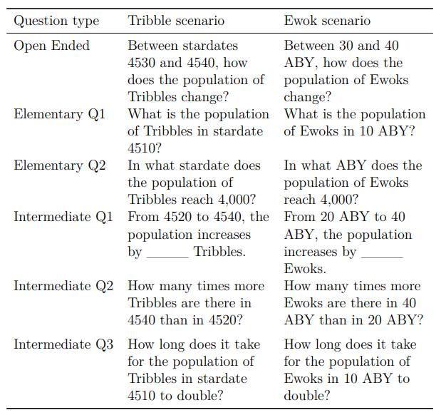

class:title-slide-custom

```{r, child = "style.Rmd"}
```


```{r setup, echo = FALSE, message = FALSE, warning = FALSE}
# Packages
library(emoji)
library(purrr)
library(tidyverse)
library(gridExtra)
library(nullabor)
library(scales)
library(knitr)
library(kableExtra)
library(RefManageR)
library(iconr)
library(fontawesome)
library(shiny)
# download_fontawesome()

# References
bib <- ReadBib("bib/thesis.bib", check = FALSE)
ui <- "- "

# R markdown options
knitr::opts_chunk$set(echo = FALSE, 
                      message = FALSE, 
                      warning = FALSE, 
                      cache = TRUE,
                      dpi = 300)
options(htmltools.dir.version = FALSE)
options(knitr.kable.NA = '')
```

```{r, include = F, eval = T, cache = T}
clean_file_name <- function(x) {
  basename(x) %>% str_remove("\\..*?$") %>% str_remove_all("[^[A-z0-9_]]")
}
img_modal <- function(src, alt = "", id = clean_file_name(src), other = "") {
  
  other_arg <- paste0("'", as.character(other), "'") %>%
    paste(names(other), ., sep = "=") %>%
    paste(collapse = " ")
  
  js <- glue::glue("<script>
        /* Get the modal*/
          var modal{id} = document.getElementById('modal{id}');
        /* Get the image and insert it inside the modal - use its 'alt' text as a caption*/
          var img{id} = document.getElementById('img{id}');
          var modalImg{id} = document.getElementById('imgmodal{id}');
          var captionText{id} = document.getElementById('caption{id}');
          img{id}.onclick = function(){{
            modal{id}.style.display = 'block';
            modalImg{id}.src = this.src;
            captionText{id}.innerHTML = this.alt;
          }}
          /* When the user clicks on the modalImg, close it*/
          modalImg{id}.onclick = function() {{
            modal{id}.style.display = 'none';
          }}
</script>")
  
  html <- glue::glue(
     " <!-- Trigger the Modal -->

<!-- The Modal -->
<div id='modal{id}' class='modal'>
  <!-- Modal Content (The Image) -->
  
  <!-- Modal Caption (Image Text) -->
  <div id='caption{id}' class='modal-caption'></div>
</div>
"
  )
  write(js, file = "js-addins.html", append = T)
  return(html)
}
# Clean the file out at the start of the compilation
write("", file = "js-addins.html")
```

<br><br><br>
## Human Perception of Exponentially Increasing Data Displayed on a Log Scale Evaluated Through Experimental Graphics Tasks
### Ph.D. Final Exmaination
#### Emily A. Robinson
#### Department of Statistics, University of Nebraska - Lincoln
<!-- ##### `r fa("envelope", fill = "black")` [emily.robinson@huskers.unl.edu](emily.robinson@huskers.unl.edu) -->
<!-- ##### `r fa("home", fill = "black")` [www.emilyarobinson.com](https://www.emilyarobinson.com/) -->
<!-- ##### `r fa("github", fill = "black")` [earobinson95](https://github.com/earobinson95) -->
<!-- <br><br> -->
<!-- .medium[*Slides: https://bit.ly/3ENZmOZ*] -->

---
class:primary
# Outline

`r fa_i("chart-bar")` Motivation and Background

`r fa_i("list")` Research Objectives

`r fa_i("chart-line")` Perception through Lineups

`r fa_i("pen")` Prediction with 'You Draw It'

`r fa_i("ruler")` Numerical Translation and Estimation

`r fa_i("check-double")` Overall conclusion

`r fa_i("spinner")` Future Work

---
class:inverse
<br>
<br>
<br>
<br>
<br>
<br>
<br>
<br>
.center[
# Motivation and Background
]

---
class:primary
# Motivation

Data visualizations played an important role in during the **COVID-19 pandemic** `r Citep(bib[[c("rost_2020", "romano_scale_2020", "bavel_using_2020")]])`.

Dashboards displayed: case counts, transmission rates, outbreak regions. 

.center[
```{r, out.width = "75%"}
knitr::include_graphics("images/91divoc-cases-july2021.png")
```

`r Citep(bib[[c("fagen-ulmschneider_2020")]])`
]

???

Many of these graphics helped guide decision makers to implement policies such as shut-downs or mandated mask wearing, as well as facilitated communication with the public to increase compliance (Bavel et al., 2020). 

As graphics began to play an important role in sharing information with the public, creators of graphics were faced with design choices in order to ensure their charts were effective at accurately communicating the current status of the pandemic. 

In order to make educated decisions when designing a chart, we need guidelines as established through experimentation to ensure the graphic is effective at communicating the intended results

---
class:primary
# Graphics: the 'good' and the 'bad'


---
class:primary
# Testing statistical graphics

Evaluate design choices and understand cognitive biases through the use of visual tests `r Citep(bib[[c("cleveland_graphical_1984", "lewandowsky_perception_1989", "spence_visual_1990", "vanderplas_testing_2020")]])`.

Could ask participants to:

- identify differences in graphs.
- read information off of a chart accurately.
- use data to make correct real-world decisions.
- predict the next few observations.

All of these types of tests require different levels of use and manipulation of the information presented in the chart.

???

Carpenter & Shah (1998) identifies pattern recognition, interpretative processes, and integrative processes as strategies and processes required to complete tasks of varying degrees of complexity.

---
class:primary
# Logarithmic scales

.center[
```{r, out.width = "90%"}
knitr::include_graphics("images/log-scales-1.png")
```
]

???

+ **Problem:** Data which spans several orders of magnitude shown on its original scale compresses the smaller magnitudes into relatively little area.
+ **Solution:** Use of a log scale transformation; alters the contextual appearance of the data.

The usefulness of the log scale in science is illustrated here showing the challenge of displaying the fuel energy density of Uranium along side other sources of fuel due to differences in magnitude of density.

---
class:primary
# Benefits and pitfalls of log scales

.pull-left[

**Benefits** were seen in spring 2020, during the early stages of the COVID-19 pandemic.
.center[
```{r results='asis', echo = F, include = T, cache = T, eval = TRUE}
i1 <- img_modal(src = "images/covid19-FT-03.23.2020-log.png", alt = Citep(bib[[c("burnmurdoch_2020")]]), other=list(width="100%"))

c(str_split(i1, "\\n", simplify = T)[1:2],
  str_split(i1, "\\n", simplify = T)[3:9]
  ) %>% paste(collapse = "\n") %>% cat()
```
]

].pull-right[

**Pitfalls** were exposed as the pandemic evolved, and the case counts were no longer spreading exponentially. 

.center[
```{r results='asis', echo = F, include = T, cache = T, eval = TRUE}
i1 <- img_modal(src = "images/covid19-FT-linear.png", alt = Citep(bib[[c("burnmurdoch_2020")]]), other=list(width="80%"))

c(str_split(i1, "\\n", simplify = T)[1:2],
  str_split(i1, "\\n", simplify = T)[3:9]
  ) %>% paste(collapse = "\n") %>% cat()
```

```{r results='asis', echo = F, include = T, cache = T, eval = TRUE}
i1 <- img_modal(src = "images/covid19-FT-log.png", alt = Citep(bib[[c("burnmurdoch_2020")]]), other=list(width="80%"))

c(str_split(i1, "\\n", simplify = T)[1:2],
  str_split(i1, "\\n", simplify = T)[3:9]
  ) %>% paste(collapse = "\n") %>% cat()
```
]
]

---
class:primary
# Logarithmic mapping

Our perception is **logarithmic at first**, but transitions to a **linear scale later** in development `r Citep(bib[[c("dehaene2008log", "siegler_numerical_2017", "varshney_why_2013")]])`.

.center[
```{r, out.width = "80%"}
knitr::include_graphics("images/log-number-line-1.png")
```
]

**Assumption:** If we perceive logarithmically by default, it is a natural way to display information and should be easy to read and understand/use.

???

When we first learn to count, we begin counting by ones, then by tens, and advancing to hundreds, following the base10 order of magnitude system.

Our perception and mapping of numbers to a number line is **logarithmic at first**, but transitions to a **linear scale later** in development, with formal mathematics education.
+ For example: A kindergartner asked to place numbers one through ten along a number line would place three close to the middle, following the logarithmic perspective.

Assuming there is a direct relationship between perceptual and cognitive processes, it is reasonable to assume numerical representations should also be displayed on a nonlinear, compressed number scale. Therefore, if we perceive
logarithmically by default, it is a natural (and presumably low effort) way to display information and should be easy to read and understand/use.

---
class:primary
# Exponential growth
.center[
```{r, out.width = "65%"}
knitr::include_graphics("images/exponential-stages-comic.jpg")
```

`r Citep(bib[[c("vonbergmann_2021")]])`
]

Estimation and prediction of **exponential growth is underestimated** when presented both numerically and graphically `r Citep(bib[[c("jones_generalized_1979", "mackinnon_feedback_1991", "wagenaar_misperception_1975")]])`.

???

**Can log transforming the data help?**

+ Maybe, but are there consequences? 
+ Most readers are not mathematically sophisticated enough to intuitively understand logarithmic math and translate that back into real-world effects.

---
class:inverse
<br>
<br>
<br>
<br>
<br>
<br>
<br>
<br>
.center[
# Comprehensive graphical studies
]

---
class:primary
# Task complexity

`r Citep(bib[[c("carpenter1998model")]])` identifies pattern recognition, interpretative processes, and integrative processes as strategies and processes required to complete tasks of varying degrees of complexity. 

+ **Pattern recognition** requires the viewer to encode graphic patterns.

+ **Interpretive processes** operate on those patterns to construct meaning.

+ **Integrative processes** then relate the meanings to the contextual scenario as inferred from labels and titles.

---
class:primary
# Research objectives

**Big Idea:** Are there benefits to displaying exponentially increasing data on a log scale rather than a linear scale?

1. Perception through Lineups `r fa_i("chart-line")` `r fa_i("chart-line")` `r fa_i("chart-bar")`

    - Test an individuals ability to perceptually differentiate exponentially increasing data with differing rates of change on both the linear and log scale.
    
2. Prediction with You Draw It `r fa_i("pen")`
    
    - Tests an individuals ability to make predictions for exponentially increasing data.
        
3. Estimation by Numerical Translation `r fa_i("ruler")`

    - Tests an individuals ability to translate a graph of exponentially increasing data into real value quantities.

---
class:primary
# Prolific data collection

+ About 300 participants were recruited via Prolific in March 2022.
+ The series of graphical tests were conducted through an RShiny application found [here](https://shiny.srvanderplas.com/perception-of-statistical-graphics/).


.center[
```{r, out.width = "100%"}
knitr::include_graphics("images/final-study-app-screenshot.png")
```
]

---
class:inverse
<br>
<br>
<br>
<br>
<br>
<br>
<br>
<br>
.center[
# Perception through Lineups
]

---
class:primary
# Lineup experimental task 

Study Participant Prompt: *Which plot is most different?*

.center[
```{r results='asis', echo = F, include = T, cache = T, eval = TRUE}
i1 <- img_modal(src = "images/linear-lineup-example.png", alt = " ", other=list(width="45%"))
i2 <- img_modal(src = "images/log-lineup-example.png", alt = " ", other=list(width="45%"))

c(str_split(i1, "\\n", simplify = T)[1:2],
  str_split(i2, "\\n", simplify = T)[1:2],
  str_split(i1, "\\n", simplify = T)[3:9],
  str_split(i2, "\\n", simplify = T)[3:9]
  ) %>% paste(collapse = "\n") %>% cat()
```
]

---
class:primary
# Lineup study design

.pull-left[
**Curvature:**
+ High Curvature
+ Medium  Curvature
+ Low Curvature
].pull-right[

```{r results='asis', echo = F, include = T, cache = T, eval = TRUE}
i1 <- img_modal(src = "images/curvature-combination-example-1.png", alt = " ", other=list(width="100%"))

c(str_split(i1, "\\n", simplify = T)[1:2],
  str_split(i1, "\\n", simplify = T)[3:9]
  ) %>% paste(collapse = "\n") %>% cat()
```
]
**Treatment Design:** Target Panel gets model A and Null Panels get model B

$3!\cdot 2!= 6$ curvature combinations

$\times 2$ lineup data sets per combination $=$ **12 test data sets**

$\times 2$ scales (log & linear) $=$ **24 different lineup plots**

**Experimental Design:** 12 lineup plots per participant

$6$ test parameter combinations per participant $\times 2$ scales $= 12$ test lineups

---
class:primary
# Generalized Linear Mixed Model

Define $Y_{ijkl}$ to be the event that participant $l$ correctly identifies the target plot for data set $k$ with curvature $j$ plotted on scale $i$.

$$\text{logit }P(Y_{ijk}) = \eta + \delta_i + \gamma_j + \delta \gamma_{ij} + s_l + d_k$$
where
- $\eta$ is the beaseline average probability of selecting the target plot. 
- $\delta_i$ is the effect of the log/linear scale.
- $\gamma_j$ is the effect of the curvature combination.
- $\delta\gamma_{ij}$is the two-way interaction effect of the scale and curvature.
- $s_l \sim N(0,\sigma^2_\text{participant})$, random effect for participant characteristics.
- $d_k \sim N(0,\sigma^2_{\text{data}})$, random effect for data specific characteristics. 

We assume that random effects for data set and participant are independent.

???
Each lineup plot evaluated was assigned a value based on the participant response (correct = 1, not correct = 0). The binary response was analyzed using generalized linear mixed model following a binomial distribution with a logit link function.

---
class:primary
# Lineup results

.center[
```{r, out.width = "90%"}
knitr::include_graphics("images/odds-ratio-plot-1.png")
```
]

---
class:inverse
<br>
<br>
<br>
<br>
<br>
<br>
<br>
<br>
.center[
# Prediction through 'You Draw It'
]

---
class:primary
# 'You Draw It' experimental task

Study Participant Prompt: *Use your mouse to fill in the trend in the yellow box region.*

.center[
```{r, out.width = "45%"}
knitr::include_graphics("images/exponential_example.gif")
```
]

--

A sub-study validated a new method, 'You Draw It', as a tool for graphical testing statistical graphics and introduced an appropriate statistical analysis method for comparing visually fitted trend lines to statistical regression results [(Eye Fitting Straight Lines in the Modern Era)](https://earobinson95.github.io/Eye-Fitting-Straight-Lines-in-the-Modern-Era/Eye-Fitting-Straight-Lines-in-the-Modern-Era.pdf).

???

Here we see an example of a you draw it interactive plot as seen by participants during the study. Participants are prompted to: "Use your mouse to fill in the trend in the yellow box region". The yellow box region moves along as the participant draws their trend-line until the yellow region disappears.

---
class:primary 
# Treatment design

.pull-left[
2 x 2 x 2 factorial:
+ **growth rate:** low and high.
+ **points truncated:** $50\%$ and $75\%$ of the domain.
+ **scale:** log and linear.

].pull-right[
.center[
```{r results='asis', echo = F, include = T, cache = T, eval = TRUE}
i1 <- img_modal(src = "images/low-10-linear.png", alt = "Low Growth Rate, 50% Truncation, Linear Scale", other=list(width="30%"))
i2 <- img_modal(src = "images/low-10-log.png", alt = "Low Growth Rate, 50% Truncation, Log Scale", other=list(width="30%"))

c(str_split(i1, "\\n", simplify = T)[1:2],
  str_split(i2, "\\n", simplify = T)[1:2],
  str_split(i1, "\\n", simplify = T)[3:9],
  str_split(i2, "\\n", simplify = T)[3:9]
  ) %>% paste(collapse = "\n") %>% cat()
```

```{r results='asis', echo = F, include = T, cache = T, eval = TRUE}
i1 <- img_modal(src = "images/low-15-linear.png", alt = "Low Growth Rate, 75% Truncation, Linear Scale", other=list(width="30%"))
i2 <- img_modal(src = "images/low-15-log.png", alt = "Low Growth Rate, 75% Truncation, Log Scale", other=list(width="30%"))

c(str_split(i1, "\\n", simplify = T)[1:2],
  str_split(i2, "\\n", simplify = T)[1:2],
  str_split(i1, "\\n", simplify = T)[3:9],
  str_split(i2, "\\n", simplify = T)[3:9]
  ) %>% paste(collapse = "\n") %>% cat()
```

```{r results='asis', echo = F, include = T, cache = T, eval = TRUE}
i1 <- img_modal(src = "images/high-10-linear.png", alt = "High Growth Rate, 50% Truncation, Linear Scale", other=list(width="30%"))
i2 <- img_modal(src = "images/high-10-log.png", alt = "High Growth Rate, 50% Truncation, Log Scale", other=list(width="30%"))

c(str_split(i1, "\\n", simplify = T)[1:2],
  str_split(i2, "\\n", simplify = T)[1:2],
  str_split(i1, "\\n", simplify = T)[3:9],
  str_split(i2, "\\n", simplify = T)[3:9]
  ) %>% paste(collapse = "\n") %>% cat()
```

```{r results='asis', echo = F, include = T, cache = T, eval = TRUE}
i1 <- img_modal(src = "images/high-15-linear.png", alt = "High Growth Rate, 75% Truncation, Linear Scale", other=list(width="30%"))
i2 <- img_modal(src = "images/high-15-log.png", alt = "High Growth Rate, 75% Truncation, Log Scale", other=list(width="30%"))

c(str_split(i1, "\\n", simplify = T)[1:2],
  str_split(i2, "\\n", simplify = T)[1:2],
  str_split(i1, "\\n", simplify = T)[3:9],
  str_split(i2, "\\n", simplify = T)[3:9]
  ) %>% paste(collapse = "\n") %>% cat()
```
]]

---
class:primary 
# Feedback data

.pull-left[
For each participant, the final data set used for analysis contains:
+ $x_{ijklm}$, $y_{ijklm,drawn}$, and $\hat y_{ijklm,NLS}$  

for:
+ growth rate $i = 1,2$,
+ point truncation $j = 1,2$,
+ scale $k = 1,2$,
+ participant  $l = 1,...N_{participant}$, and 
+ $x_{ijklm}$ value $m = 1, ...,4 x_{max} + 1$.

Vertical residuals between the drawn and fitted values were calculated as: 
+ $e_{ijklm,NLS} = y_{ijklm,drawn} - \hat y_{ijklm,NLS}$.

].pull-right[
```{r results='asis', echo = F, include = T, cache = T, eval = TRUE}
i1 <- img_modal(src = "images/exponential-yloess-spaghetti-plot-1.png", alt = " ", other=list(width="100%"))

c(str_split(i1, "\\n", simplify = T)[1:2],
  str_split(i1, "\\n", simplify = T)[3:9]
  ) %>% paste(collapse = "\n") %>% cat()
```
]

---
class:primary 
# Generalized Additive Mixed Model

The GAMM equation for residuals is given by:
\begin{equation}
e_{ijklm,nls} = \tau_{ijk} + s_{ijk}(x_{ijklm}) + p_{l} + s_{l}(x_{ijklm})
\end{equation}

where

+ $e_{ijklm,NLS}$ is the residual between the drawn y-value and fitted y-value for the $l^{th}$ participant, $m^{th}$ increment, and $ijk^{th}$ treatment combination 
+ $\tau_{ijk}$ is the intercept for the $i^{th}$ growth rate, $j^{th}$ point truncation, and $k^{th}$ scale treatment combination
+ $s_{ijk}$ is the smoothing spline for the $ijk^{th}$ treatment combination
+ $x_{ijklm}$ is the x-value for the $l^{th}$ participant, $m^{th}$ increment, and $ijk^{th}$ treatment combination 
+ $p_{l} \sim N(0, \sigma^2_{participant})$ is the error due to the $l^{th}$ participant's characteristics 
+ $s_{l}$ is the random smoothing spline for the $l^{th}$ participant.

???

Allowing for flexibility, the bam function in the mgcv package is used to fit a GAMM to estimate trends of vertical residuals from the participant drawn line in relation to the NLS fitted values.


---
class:primary
# GAMM results

.center[
```{r, out.width = "64%"}
knitr::include_graphics("images/exponential-prediction-gamm-preds-1.png")
```
]

---
class:inverse
<br>
<br>
<br>
<br>
<br>
<br>
<br>
<br>
.center[
# Numerical Translation and Estimation
]

---
class:primary
# Integrative processes

**Graph Comprehension**

The three behaviors related to graph comprehension involve `r Citep(bib[[c("curcio1987comprehension", "friel2001making", "glazer2011challenges", "jolliffe1991assessment", "wood1968objectives")]])`.

1. literal reading of the data (elementary level)
2. reading between the data (intermediate level)
3. reading beyond the data (advanced level).

**Estimation Biases**

+ Anchoring `r Citep(bib[[c("tan1990processing")]])` and rounding to multiples of five or ten `r Citep(bib[[c("myers1954accuracy")]])` arise in open-ended estimation tasks.
+ Scale and axis labels are other critical factors in estimation accuracy `r Citep(bib[[c("dunham1991learning", "beeby1973well", "leinhardt1990functions")]])`.  

???

Integrative processes requires viewers to translate the visual features into conceptual relations by interpreting titles, labels, and scales.

An important consideration in understanding graph comprehension is the
questions being asked of the viewer (Graesser, Swamer, Baggett, & Sell, 2014). 

Anchoring bias refers to an individual using easily
observed visual cues such as grid lines or “anchors” when extracting information
such as the x or y value on a chart (Tan, 1994 ; Godlonton, Hernandez, & Murphy,
2018)

Beeby & Taylor (1973) found that when asked to read data from line graphs, viewers consistently misread the y-axis scale; when alternate grid lines were labeled, the unlabeled grid lines were read as halves. 

The choice of scale can change the shape of a graph, thus creating a conceptual
demand for the viewer when constructing a mental image of the graph (Leinhardt,
Zaslavsky, & Stein, 1990)

---
class:primary
# Scenarios

.pull-left[
**Tribble scenario** 

Hi, we’re Tribbles! We were taken from our native planet, Iota Germinorum IV, and brought abroad Starfleet in stardate 4500. A Starfleet scientist, Edward Larkin, genetically engineered us to increase our reproductive rate in an attempt to solve a planetary food shortage. The Tribble population on Starfleet over the next 50 Stardates (equivalent to 1 week universe time) is illustrated in the graph. We need your help answering a few questions regarding the population of Tribbles.

].pull-right[

**Ewok scenario**

Hi, we’re Ewoks! We are native to the forest moon of Endor. After the Galactic Civil War, some Ewoks traveled offworld to help Rebel veterans as ’therapy Ewoks’ and began to repopulate. The Ewok population After the Battle of Yavin (ABY) is illustrated in the graph. We need your help answering a few questions regarding the population of Ewoks offworld.


]

*Fictional illustrations of the figures were modified from artwork
by Allison Horst (2021) and included on the main page for each scenario.*

---
class:primary
# Questioning

.center[
```{r, out.width = "65%"}

```
]


---
class:primary
# Data and plot generation

.pull-left[

Two unique data sets were simulated based on a three parameter exponential model with multiplicative errors:

$y_i=\alpha e^{\beta x_i + \epsilon_i} + \theta$ with $\epsilon_i \sim N(0, \sigma^2)$

for 

+ $x_i \in [0:50]$, 
+ $\alpha = 130$, 
+ $\beta = 0.12$, 
+ $\theta = 50$, and 
+ $\sigma = 1.5$.

].pull-right[
```{r results='asis', echo = F, include = T, cache = T, eval = TRUE}
i1 <- img_modal(src = "images/estimation-simulated-data-1.png", other=list(width="100%"))

c(str_split(i1, "\\n", simplify = T)[1:2],
  str_split(i1, "\\n", simplify = T)[3:9]
  ) %>% paste(collapse = "\n") %>% cat()
```
]

The time unit labels on the x-axis reflected 0 to 50 ABY (After Battle of Yavin) for the Ewok scenario and were adjusted to 4500 to 4550 Stardates for the Tribble Scenario to align with the associated popular media depiction of each figure.

???

The time unit labels on the x-axis reflected 0 to 50 ABY (After Battle of Yavin) for the Ewok scenario and were adjusted to 4500 to 4550 Stardates for the Tribble Scenario to align with the associated popular media depiction of each figure as well as disguise the use of the same underlying data simulation model and estimation questions across both scenarios.

---
class:primary
# Study design

+ Participants were shown two examples with associated sketches (available throghout study).

+ The **scale** of the graphic and **data set** displayed was randomly assigned to scenarios for each individual.

+ The order in which the participant saw the scenario, scale, and data set combination was randomly selected.

+ Questioning: 

    + participants were first asked an open ended question
    + followed by a random order of two elementary level questions and three intermediate level questions.
    
---
class:primary
# Estimation strategy

.pull-left[
.center[
```{r, out.width = "100%"}
knitr::include_graphics("images/estimation-scratchwork-app.png")
```
]
].pull-right[
We recorded the inputted and evaluated calculations and scratch work of each participant in order to better understand participant strategies for estimation.
]

???
For instance, a participant may have seen a scatter plot of data set two
displayed on the linear scale paired with the Ewok scenario text and a scatter plot
of data set one displayed on the log scale paired with the Tribble scenario text. The
order of the two scenarios and their assigned data set and scale was randomly
assigned to each individual.

Participants were shown the graphic of both data sets on either the linear or log
scale with labels adjusted to reflect the associated scenario context and scale.

---
class:primary
# Open ended 

*"Between year 30 and 40, how does the population of [creatures] change?"*

.center[
```{r, out.width = "55%"}
knitr::include_graphics("images/estimation-word-cloud-1.png")
```
]

---
class:primary
# Estimation of population
### Elementary Q1

*"What is the population in year 10?"* 

.pull-left[

```{r results='asis', echo = F, include = T, cache = T, eval = TRUE}
i1 <- img_modal(src = "images/qe1-sketch.png", other=list(width="100%"))

c(str_split(i1, "\\n", simplify = T)[1:2],
  str_split(i1, "\\n", simplify = T)[3:9]
  ) %>% paste(collapse = "\n") %>% cat()
```

].pull-right[

```{r results='asis', echo = F, include = T, cache = T, eval = TRUE}
i1 <- img_modal(src = "images/qe1-density-plot-10-all-1.png", other=list(width="100%"))

c(str_split(i1, "\\n", simplify = T)[1:2],
  str_split(i1, "\\n", simplify = T)[3:9]
  ) %>% paste(collapse = "\n") %>% cat()
```
]

---
class:primary
# Estimation of population
### First level estimates

.pull-left[

```{r results='asis', echo = F, include = T, cache = T, eval = TRUE}
i1 <- img_modal(src = "images/qi1-sketch.png", other=list(width="100%"))

c(str_split(i1, "\\n", simplify = T)[1:2],
  str_split(i1, "\\n", simplify = T)[3:9]
  ) %>% paste(collapse = "\n") %>% cat()
```

].pull-right[
.center[
```{r results='asis', echo = F, include = T, cache = T, eval = TRUE}
i1 <- img_modal(src = "images/spaghetti-dataset1-1.png", other=list(width="85%"))

c(str_split(i1, "\\n", simplify = T)[1:2],
  str_split(i1, "\\n", simplify = T)[3:9]
  ) %>% paste(collapse = "\n") %>% cat()
```

```{r results='asis', echo = F, include = T, cache = T, eval = TRUE}
i1 <- img_modal(src = "images/spaghetti-dataset2-1.png", other=list(width="85%"))

c(str_split(i1, "\\n", simplify = T)[1:2],
  str_split(i1, "\\n", simplify = T)[3:9]
  ) %>% paste(collapse = "\n") %>% cat()
```
]]

---
class:primary
# Estimation of population
### Scratchwork

Participant calculations and scratch work provides support that participants equated halfway spatially as halfway numerically.

.pull-left[
2048 − 1024 = 1024

1024/2 = 512

512 + 1024 = 1536
].pull-right[
32768 − 16384 = 16384

32768 − 16384 = 16384

16384 ∗ 2 = 32768

16384/2 = 8192

8192 + 16384 = 24576.
]

---
class:primary
# Estimation of time
### Elementary Q2

*"In what year does the population reach 4,000?"*

.pull-left[
```{r results='asis', echo = F, include = T, cache = T, eval = TRUE}
i1 <- img_modal(src = "images/qe2-sketch.png", other=list(width="100%"))

c(str_split(i1, "\\n", simplify = T)[1:2],
  str_split(i1, "\\n", simplify = T)[3:9]
  ) %>% paste(collapse = "\n") %>% cat()
```
].pull-right[
```{r results='asis', echo = F, include = T, cache = T, eval = TRUE}
i1 <- img_modal(src = "images/qe2-density-plot-1.png", other=list(width="100%"))

c(str_split(i1, "\\n", simplify = T)[1:2],
  str_split(i1, "\\n", simplify = T)[3:9]
  ) %>% paste(collapse = "\n") %>% cat()
```
]

---
class:primary
# Additive increase in population
### Intermediate Q1

*From 20 to 40, the population increases by ____ [creatures].*

.pull-left[
```{r results='asis', echo = F, include = T, cache = T, eval = TRUE}
i1 <- img_modal(src = "images/qi1-density-1-2.png", other=list(width="100%"))

c(str_split(i1, "\\n", simplify = T)[1:2],
  str_split(i1, "\\n", simplify = T)[3:9]
  ) %>% paste(collapse = "\n") %>% cat()
```
].pull-right[
```{r results='asis', echo = F, include = T, cache = T, eval = TRUE}
i1 <- img_modal(src = "images/qi1-density-2-2.png", other=list(width="100%"))

c(str_split(i1, "\\n", simplify = T)[1:2],
  str_split(i1, "\\n", simplify = T)[3:9]
  ) %>% paste(collapse = "\n") %>% cat()
```
]

---
class:primary
# Multiplicative change in population
### Intermediate Q2

*How many times more [creatures] are there in 40 than in 20?*

.pull-left[
```{r results='asis', echo = F, include = T, cache = T, eval = TRUE}
i1 <- img_modal(src = "images/qi2-sketch.png", other=list(width="100%"))

c(str_split(i1, "\\n", simplify = T)[1:2],
  str_split(i1, "\\n", simplify = T)[3:9]
  ) %>% paste(collapse = "\n") %>% cat()
```
].pull-right[

```{r results='asis', echo = F, include = T, cache = T, eval = TRUE}
i1 <- img_modal(src = "images/qi2-density-1.png", other=list(width="100%"))

c(str_split(i1, "\\n", simplify = T)[1:2],
  str_split(i1, "\\n", simplify = T)[3:9]
  ) %>% paste(collapse = "\n") %>% cat()
```
]

---
class:primary
# Misunderstanding of log logic
### Misinterpretation and miscalculations in Intermediate Q1 and Q2

Further investigation is necessary to determine if the misunderstanding occurs due to the ambiguity of language or scale.

---
class:primary
# Time until population doubles
### Intermediate Q3
*How long does it take for the population in year 10 to double?*

.pull-left[
```{r results='asis', echo = F, include = T, cache = T, eval = TRUE}
i1 <- img_modal(src = "images/qi3-sketch.png", other=list(width="100%"))

c(str_split(i1, "\\n", simplify = T)[1:2],
  str_split(i1, "\\n", simplify = T)[3:9]
  ) %>% paste(collapse = "\n") %>% cat()
```
].pull-right[

```{r results='asis', echo = F, include = T, cache = T, eval = TRUE}
i1 <- img_modal(src = "images/qi3-density-1.png", other=list(width="100%"))

c(str_split(i1, "\\n", simplify = T)[1:2],
  str_split(i1, "\\n", simplify = T)[3:9]
  ) %>% paste(collapse = "\n") %>% cat()
```
]

---
class:primary
# Main take-aways

---
class:inverse
<br>
<br>
<br>
<br>
<br>
<br>
<br>
<br>
.center[
# Conclusion and Discussion
]

---
class:primary
# Conclusions

**Perception**

**Prediction**

**Estimation**

**Overall**

The studies conducted in this research relied on graphical tasks of varying
complexity in order to help us understand the perceptual and cognitive advantages
and disadvantages of displaying exponentially increasing data on the log scale. Our
results showed there are perceptual advantages of the use of log scales due to the
change in contextual appearance; however, our understanding of log logic is flawed
when translating the information into context. We recommend consideration of
both user needs and graph specific tasks when presenting data on the log scale;
caution should be taken when interpretation of large magnitudes is required, but
advantages may appear when it is necessary to visually identify and interpret small
magnitudes on the chart. 

---
class:primary
# Challenges

---
class:primary
# Future work

+ Potential follow-up studies:
    + Providing users the ability to interact with the graph with visual aids in order to better understand strategies of estimation.
    + Additional study which focuses on how we make decisions based on data displayed on a log scale in order to evaluate the effect of scale on risk adversity.

+ Expand the use of log scales to data which does not follow an exponential trend, but where log scales are otherwise appropriate.

+ Evaluate the implications of transforming or displaying the x-axis on a log scale.

+ More widespread use of comprehensive graphical studies conducted on the same type of data and plot.

???

+ This research stands as a model for conducting an extensive series of graphical tasks on the same type of data and plot in order to gain a comprehensive understanding of both the perceptual and cognitive implications of the design choices.

---
class:primary
# References
<font size="2">
```{r, print_refs1, results='asis', echo=FALSE, warning=FALSE, message=FALSE}
print(bib[[c("vonbergmann_2021", "dehaene2008log", "siegler_numerical_2017", "varshney_why_2013", "jones_generalized_1979", "mackinnon_feedback_1991", "wagenaar_misperception_1975", "curcio1987comprehension", "friel2001making", "glazer2011challenges", "jolliffe1991assessment", "wood1968objectives")]], 
      .opts = list(check.entries = FALSE, style = "html", bib.style = "authoryear")
      )
```
</font>

---
class:primary
# Acknowledgements

+ Advisors: Dr. Susan VanderPlas and Dr. Reka Howard

---
class:inverse
<br>
<br>
<br>
<br>
<br>
<br>
<br>
<br>
.center[
# Questions?
<!-- <br> -->
<!-- <br> -->
<!-- `r fa("envelope", fill = "white")` **emily.robinson@huskers.unl.edu** -->
<!-- `r fa("home", fill = "white")` **www.emilyarobinson.com** -->
<!-- `r fa("github", fill = "white")` **earobinson95** -->
]
