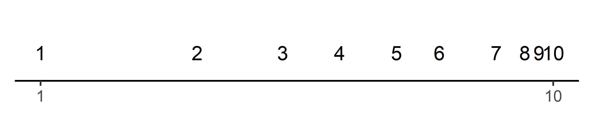
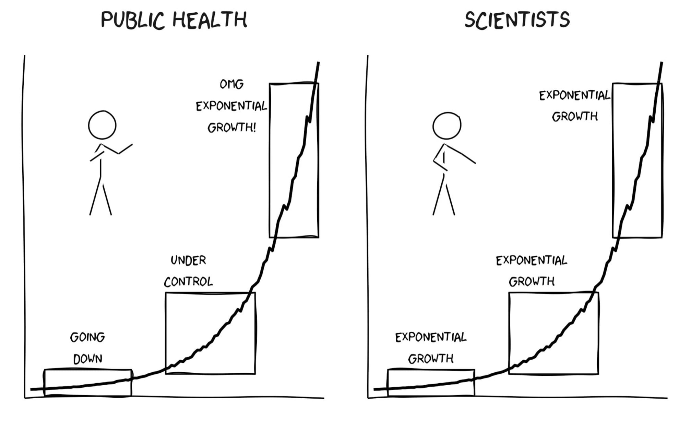
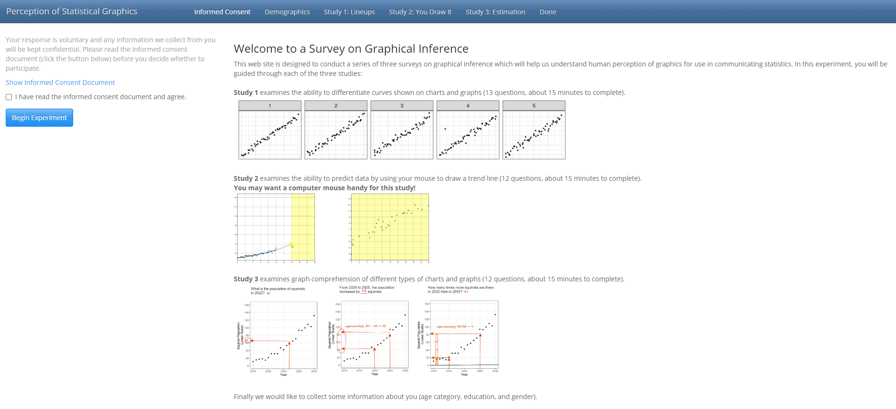
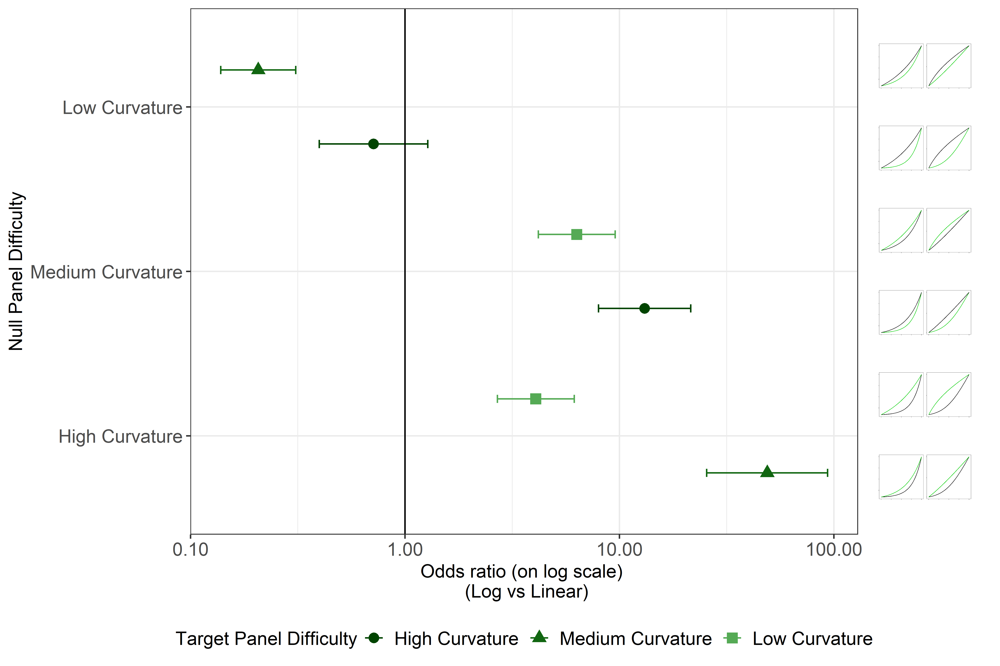

class:title-slide-custom

```{r, child = "style.Rmd"}
```


```{r setup, echo = FALSE, message = FALSE, warning = FALSE}
# Packages
library(emoji)
library(purrr)
library(tidyverse)
library(gridExtra)
library(nullabor)
library(scales)
library(knitr)
library(kableExtra)
library(RefManageR)
library(iconr)
library(fontawesome)
library(shiny)
# download_fontawesome()

# References
bib <- ReadBib("bib/thesis.bib", check = FALSE)
ui <- "- "

# R markdown options
knitr::opts_chunk$set(echo = FALSE, 
                      message = FALSE, 
                      warning = FALSE, 
                      cache = TRUE,
                      dpi = 300)
options(htmltools.dir.version = FALSE)
options(knitr.kable.NA = '')
```

```{r, include = F, eval = T, cache = T}
clean_file_name <- function(x) {
  basename(x) %>% str_remove("\\..*?$") %>% str_remove_all("[^[A-z0-9_]]")
}
img_modal <- function(src, alt = "", id = clean_file_name(src), other = "") {
  
  other_arg <- paste0("'", as.character(other), "'") %>%
    paste(names(other), ., sep = "=") %>%
    paste(collapse = " ")
  
  js <- glue::glue("<script>
        /* Get the modal*/
          var modal{id} = document.getElementById('modal{id}');
        /* Get the image and insert it inside the modal - use its 'alt' text as a caption*/
          var img{id} = document.getElementById('img{id}');
          var modalImg{id} = document.getElementById('imgmodal{id}');
          var captionText{id} = document.getElementById('caption{id}');
          img{id}.onclick = function(){{
            modal{id}.style.display = 'block';
            modalImg{id}.src = this.src;
            captionText{id}.innerHTML = this.alt;
          }}
          /* When the user clicks on the modalImg, close it*/
          modalImg{id}.onclick = function() {{
            modal{id}.style.display = 'none';
          }}
</script>")
  
  html <- glue::glue(
     " <!-- Trigger the Modal -->

<!-- The Modal -->
<div id='modal{id}' class='modal'>
  <!-- Modal Content (The Image) -->
  
  <!-- Modal Caption (Image Text) -->
  <div id='caption{id}' class='modal-caption'></div>
</div>
"
  )
  write(js, file = "js-addins.html", append = T)
  return(html)
}
# Clean the file out at the start of the compilation
write("", file = "js-addins.html")
```

<br><br><br>
## Human Perception of Exponentially Increasing Data Displayed on a Log Scale Evaluated Through Experimental Graphics Tasks
### Ph.D. Final Exmaination
#### Emily A. Robinson
#### Department of Statistics, University of Nebraska - Lincoln
<!-- ##### `r fa("envelope", fill = "black")` [emily.robinson@huskers.unl.edu](emily.robinson@huskers.unl.edu) -->
<!-- ##### `r fa("home", fill = "black")` [www.emilyarobinson.com](https://www.emilyarobinson.com/) -->
<!-- ##### `r fa("github", fill = "black")` [earobinson95](https://github.com/earobinson95) -->
<!-- <br><br> -->
<!-- .medium[*Slides: https://bit.ly/3ENZmOZ*] -->

???

Thank you to everyone who is attending this morning both in person and online. I will be sharing my Ph.D. work on the human perception of exponentially increasing data displayed on a log scale evaluated through experimental graphics tasks.

---
class:primary
# Outline

`r fa_i("chart-bar")` Motivation and Background

`r fa_i("list")` Research Objectives

`r fa_i("chart-line")` Perception through Lineups

`r fa_i("pen")` Prediction with 'You Draw It'

`r fa_i("ruler")` Numerical Translation and Estimation

`r fa_i("check-double")` Overall conclusion

`r fa_i("spinner")` Future Work

???

I will first start with the motivation and background of this work and I will introduce the research objectives. Next, I will give a high level overview of the two studies related to perception and prediction as I have previously shared work related to these two chapters. Then I will discuss the development and results from the last study as it relates to estimation and graph comprehension. Lastly, I will provide an overall conclusion and discuss future directions for this work.

---
class:inverse
<br>
<br>
<br>
<br>
<br>
<br>
<br>
<br>
.center[
# Motivation and Background
]

---
class:primary
# Motivation

Data visualizations played an important role in during the **COVID-19 pandemic** `r Citep(bib[[c("rost_2020", "romano_scale_2020", "bavel_using_2020")]])`.

Dashboards displayed: case counts, transmission rates, outbreak regions. 

.center[
```{r, out.width = "75%"}
knitr::include_graphics("images/91divoc-cases-july2021.png")
```

`r Citep(bib[[c("fagen-ulmschneider_2020")]])`
]

???

The motivation for this work came from the large impact graphics and charts have had during the COVID-19 pandemic. Many of these graphics helped guide decision makers to implement policies such as shut-downs or mandated mask wearing, as well as facilitated communication with the public to increase compliance. 

As graphics began to play an important role in sharing information with the public, it was crucial to start asking what made some of these charts better than others? Creators of the graphics were faced with many design choices in order to ensure their charts were effective at accurately communicating the current status of the pandemic.

In order to make educated decisions when designing a chart, we need to establish guidelines through experimentation in order to ensure the graphic is effective at communicating the intended results.

---
class:primary
# Graphics: the 'good' and the 'bad'

.pull-left[
**Misleading Graphics**
+ Bad Form
+ "Chartjunk"
+ Bad axes

**Graphical Guidelines** 
`r Citep(bib[[c("wickham2013graphical", "andrews_2022")]])`
+ Keep symbols to a minimum; `r Citep(bib[[c("tufte1985visual")]])` coins the term “chartjunk”.
+ Use of lengths over areas or volumes. `r Citep(bib[[c("cleveland1987graphical")]])`
+ Proper use of scales such as arrangements, labels, and baselines.
].pull-right[

```{r results='asis', echo = F, include = T, cache = T, eval = TRUE}
i1 <- img_modal(src = "images/misleading-graphics-bad-form-supercomputers.png", alt = Citep(bib[[c("dongarra1997top500")]]), other=list(width="45%"))
i2 <- img_modal(src = "images/misleading-graphics-bad-axes-rouble-to-dollar.jpg", alt = Citep(bib[[c("villa_2022")]]), other=list(width="45%"))

c(str_split(i1, "\\n", simplify = T)[1:2],
  str_split(i2, "\\n", simplify = T)[1:2],
  str_split(i1, "\\n", simplify = T)[3:9],
  str_split(i2, "\\n", simplify = T)[3:9]
  ) %>% paste(collapse = "\n") %>% cat()
```

```{r results='asis', echo = F, include = T, cache = T, eval = TRUE}
i1 <- img_modal(src = "images/standards-of-graphics-log-scale.jpg", alt = Citep(bib[[c("andrews_2022")]]), other=list(width="100%"))

c(str_split(i1, "\\n", simplify = T)[1:2],
  str_split(i1, "\\n", simplify = T)[3:9]
  ) %>% paste(collapse = "\n") %>% cat()
```

]
???

In order to ensure your chart is effective, it is important to first understand the many ways in which plots may inaccurately display the data and be ineffective or misleading in sharing information and results. A few ways a chart may be ineffective are by selecting **bad form** (such as a 3D pie chart), **including too much clutter or chartjunk**, or by selecting **bad axes**. This might be by the baseline selected, as shown here, which changes the perceptual interpretation of the chart or by the scale selected to be used on the axes.

Recommendations and guidelines emerged in the early 1900s to help improve the overall quality of graphics. 

+ **Wickham (2013)** gives a review and critique of the first formal advice for creating good graphics presented by **The International Institute of Statistics in 1901**.
+ **Andrews (2022)** recalls seventeen general suggestions for the visualization of statistical and quantitative data published by **The American Society of Mechanical Engineers (ASME) in 1915**. 

What is interesting about some of these guidelines, is that even though they were stated in the early 20th century, it took, in some cases, over 100 years to establish and ground these guiding principles through experimentation. A few recommendations made include to keep the symbols to a minimum (avoiding chartjunk), using lengths over areas over volumes (we all may have previously heard that bar charts are better than pie charts), and use proper scales. Here, the ASME advocated for careful consideration of the limiting lines for curves drawn on logarithmic coordinates. 

I also want to draw your attention to the minor grid line breaks here drawn at 2 million, 3 million, 4 million, etc. but since they are displayed on the log scale, they visually appear unequal in spacial distance although they are equally spaced numerically.

---
class:primary
# Testing statistical graphics

Evaluate design choices and understand cognitive biases through the use of visual tests `r Citep(bib[[c("cleveland_graphical_1984", "lewandowsky_perception_1989", "spence_visual_1990", "vanderplas_testing_2020")]])`.

Could ask participants to:

- identify differences in graphs.
- read information off of a chart accurately.
- use data to make correct real-world decisions.
- predict the next few observations.

All of these types of tests require different levels of use and manipulation of the information presented in the chart.

???

One way in which we establish guidelines is through the use of graphical testing methods. This allows researchers to conduct studies geared at understanding human ability to conduct tasks related to the perception of statistical charts. These tests may take many forms such as identifying differences in graphs, accurately reading information off a chart, using data to make correct real-world decisions, or predicting the next few observations. All of these types of tests require different levels of use and manipulation of the information presented in the chart.

---
class:primary
# Logarithmic scales

.center[
```{r, out.width = "90%"}
knitr::include_graphics("images/log-scales-1.png")
```
]

???

A major issue we encountered in the creation of COVID-19 plots was how to display data from a wide range of values.

+ **Problem:** Data which spans several orders of magnitude shown on its original scale compresses the smaller magnitudes into relatively little area.
+ **Solution:** Use of a log scale transformation; alters the contextual appearance of the data.

---
class:primary
# Benefits and pitfalls of log scales

.pull-left[

**Benefits** were seen in spring 2020, during the early stages of the COVID-19 pandemic.
.center[
```{r results='asis', echo = F, include = T, cache = T, eval = TRUE}
i1 <- img_modal(src = "images/covid19-FT-03.23.2020-log.png", alt = Citep(bib[[c("burnmurdoch_2020")]]), other=list(width="100%"))

c(str_split(i1, "\\n", simplify = T)[1:2],
  str_split(i1, "\\n", simplify = T)[3:9]
  ) %>% paste(collapse = "\n") %>% cat()
```
]

].pull-right[

**Pitfalls** were exposed as the pandemic evolved, and the case counts were no longer spreading exponentially. 

.center[
```{r results='asis', echo = F, include = T, cache = T, eval = TRUE}
i1 <- img_modal(src = "images/covid19-FT-linear.png", alt = Citep(bib[[c("burnmurdoch_2020")]]), other=list(width="80%"))

c(str_split(i1, "\\n", simplify = T)[1:2],
  str_split(i1, "\\n", simplify = T)[3:9]
  ) %>% paste(collapse = "\n") %>% cat()
```

```{r results='asis', echo = F, include = T, cache = T, eval = TRUE}
i1 <- img_modal(src = "images/covid19-FT-log.png", alt = Citep(bib[[c("burnmurdoch_2020")]]), other=list(width="80%"))

c(str_split(i1, "\\n", simplify = T)[1:2],
  str_split(i1, "\\n", simplify = T)[3:9]
  ) %>% paste(collapse = "\n") %>% cat()
```
]
]

???

**Benefits** were seen in spring 2020, during the early stages of the COVID-19 pandemic.

+ Large magnitude discrepancies in case counts at a given time point between different geographic regions.
+ Log scale transformations were usefulness for showing case count curves for areas with few cases and areas with many cases within one chart.

**Pitfalls** were exposed as the pandemic evolved, and the case counts were no longer spreading exponentially.

+ Graphs with linear scales seemed more effective at spotting early increases in case counts that signaled more localized outbreaks.
+ The effect of the linear scale appears to evoke a stronger reaction from the public than the log scale.

While this is one such example, there is a long history of using log scales to display results in ecology, psychophysics, engineering, and physics. Given the widespread use of logarithmic scales, it is important to understand the implications of their use in order to provide guidelines for best use.

---
class:primary
# Logarithmic mapping

Our perception is **logarithmic at first**, but transitions to a **linear scale later** in development `r Citep(bib[[c("dehaene2008log", "siegler_numerical_2017", "varshney_why_2013")]])`.

.center[
```{r, out.width = "80%"}

```
]

**Assumption:** If we perceive logarithmically by default, it is a natural way to display information and should be easy to read and understand/use.

???

When we first learn to count, we begin counting by ones, then by tens, and advancing to hundreds, following the base10 order of magnitude system.

Research shows our perception and mapping of numbers to a number line is **logarithmic at first**, but transitions to a **linear scale later** in development, with formal mathematics education.
+ For example: A kindergartner asked to place numbers one through ten along a number line would place three close to the middle, following the logarithmic perspective.

Regardless of training, we also know our visual system is vulnerable to biases related to different stimuli such as weight, light, or sound. Weber's law established that we do not notice absolute changes in stimuli, but instead, we notice the relative change. For example, if the volume of a speaker is set quiet and you turn it up slightly, you are going to think the change was large compared to if the volume of the speaker was already blasting and you turned it up the same amount as when it was quiet. The Weber-Fechner law extended this discovery and stated that the relationship between the perceived intensity (as sensed by the person) is logarithmic to the stimulus intensity (as outputted by the object source) when observed above a minimal threshold of perception.

Assuming there is a direct relationship between perceptual and cognitive processes, it is reasonable to assume numerical representations should also be displayed on a nonlinear, compressed number scale. Therefore, if we perceive logarithmically by default, it is a natural (and presumably low effort) way to display information and should be easy to read and understand/use.

---
class:primary
# Exponential growth
.center[
```{r, out.width = "65%"}

```

`r Citep(bib[[c("vonbergmann_2021")]])`
]

Estimation and prediction of **exponential growth is underestimated** when presented both numerically and graphically `r Citep(bib[[c("jones_generalized_1979", "mackinnon_feedback_1991", "wagenaar_misperception_1975")]])`.

???

In addition to biases which result from the use of log scales, there is a **general misinterpretation of exponential growth**. This visual illustrates how individuals in public health interpret exponential growth distinctly different from scientists during early, middle, and late stages of growth. 

Early studies explored the estimation and prediction of exponential growth and found that *growth is underestimated** when presented both numerically and graphically `r Citep(bib[[c("jones_generalized_1979", "mackinnon_feedback_1991", "wagenaar_misperception_1975")]])`.

**Can log transforming the data help?**

+ Maybe, but are there consequences? 
+ Most readers are not mathematically sophisticated enough to intuitively understand logarithmic math and translate that back into real-world effects.

---
class:inverse
<br>
<br>
<br>
<br>
<br>
<br>
<br>
<br>
.center[
# Comprehensive graphical studies
]

???
In this section, we will take a look at how different graphical tasks are related to different levels of cognition and how that relates to my research objectives.

---
class:primary
# Task complexity

`r Citep(bib[[c("carpenter1998model")]])` identifies pattern recognition, interpretative processes, and integrative processes as strategies and processes required to complete tasks of varying degrees of complexity. 

+ **Pattern recognition** requires the viewer to encode graphic patterns.

+ **Interpretive processes** operate on those patterns to construct meaning.

+ **Integrative processes** then relate the meanings to the contextual scenario as inferred from labels and titles.

???

In order to understand how our visual system perceives statistical charts, we must first consider the complexity of the graphic and how viewers are interacting with the data and information being displayed. Pattern recognition requires the viewer to encode graphic patterns while interpretive processes operate on those patterns to construct meaning. Integrative processes then relate the meanings to the contextual scenario as inferred from labels and titles. We will see how these three levels of task complexity relate to the research objectives of our study.

---
class:primary
# Research objectives

**Big Idea:** Are there benefits to displaying exponentially increasing data on a log scale rather than a linear scale?

1. Perception through Lineups `r fa_i("chart-line")` `r fa_i("chart-line")` `r fa_i("chart-bar")`

    - Test an individual's ability to perceptually differentiate exponentially increasing data with differing rates of change on both the linear and log scale.
    
2. Prediction with You Draw It `r fa_i("pen")`
    
    - Tests an individual's ability to make predictions for exponentially increasing data.
        
3. Estimation by Numerical Translation `r fa_i("ruler")`

    - Tests an individual's ability to translate a graph of exponentially increasing data into real value quantities.
    
???
In this research, we conducted a series of three graphical studies to evaluate the impact displaying data on the log scale has on human perception of exponentially increasing trends compared to displaying data on the linear scale. Each study was related to a different graphical task, each requiring a different level of interaction and cognitive use of the data being presented. 

1. The first experiment evaluated whether our ability to perceptually notice differences in exponentially increasing trends is impacted by the choice of scale. These perceptual differences are identified through pattern recognition.
2. The second study tested an individuals ability to make predictions for exponentially increasing data and required integrative processes by operate on the patterns to construct meaning.
3. The last and third study tested an individual's ability to translate a graph of exponentially increasing data into real value quantitites and extend these estmiates by making comparisons.

Combined, the three studies provide a comprehensive evaluation of the impact of displaying exponentially increasing data on a log scale as it relates to perception, prediction, and estimation. The results of these studies help us make recommendations and provide guidelines for the use of log scales.

---
class:primary
# Prolific data collection

+ About 300 participants were recruited via Prolific in March 2022.
+ The series of graphical tests were conducted through an RShiny application found [here](https://shiny.srvanderplas.com/perception-of-statistical-graphics/).


.center[
```{r, out.width = "100%"}

```
]

???
Pilot studies have been conducted throughout this research to test out the studies. Many of you were participants in some of these pilot studies. 

The final participant recruitment and study deployment were conducted via Prolific, a crowd sourcing website, in March 2022. Participants were provided a link to an R Shiny application that asked them demographic information and then guided them through all three studies. For the final data collection, we collected data for about 300 participants for each study; this was the final data set used for analysis in my research.

---
class:inverse
<br>
<br>
<br>
<br>
<br>
<br>
<br>
<br>
.center[
# Perception through Lineups
]

???
I previously presented development processes and pilot study results for the first two chapters so I am going to briefly share a high level overview of the study and final data set results for these.

---
class:primary
# Lineup experimental task 

Study Participant Prompt: *Which plot is most different?*

.center[
```{r results='asis', echo = F, include = T, cache = T, eval = TRUE}
i1 <- img_modal(src = "images/linear-lineup-example.png", alt = " ", other=list(width="45%"))
i2 <- img_modal(src = "images/log-lineup-example.png", alt = " ", other=list(width="45%"))

c(str_split(i1, "\\n", simplify = T)[1:2],
  str_split(i2, "\\n", simplify = T)[1:2],
  str_split(i1, "\\n", simplify = T)[3:9],
  str_split(i2, "\\n", simplify = T)[3:9]
  ) %>% paste(collapse = "\n") %>% cat()
```
]

???
We used statistical lineups to test participants perception of exponentially increasing data. 'Lineups' are named after the 'police lineup' of criminal investigations where witnesses are asked to identify the criminal from a set of individuals. Similarly, a statistical lineup is a plot consisting of smaller panels where the viewer is asked to identify the panel containing the real data from among a set of decoy null plots. 

Here we see an example of statistical lineups as shown in the first study. Notice how it is much easier to pick out panel 13 as being most different when displayed on the log scale (right) than on the linear scale (left).

---
class:primary
# Lineup study design

.pull-left[
**Curvature:**
+ High Curvature
+ Medium  Curvature
+ Low Curvature
].pull-right[

```{r results='asis', echo = F, include = T, cache = T, eval = TRUE}
i1 <- img_modal(src = "images/curvature-combination-example-1.png", alt = " ", other=list(width="100%"))

c(str_split(i1, "\\n", simplify = T)[1:2],
  str_split(i1, "\\n", simplify = T)[3:9]
  ) %>% paste(collapse = "\n") %>% cat()
```
]
**Treatment Design:** Target Panel gets model A and Null Panels get model B

$3!\cdot 2!= 6$ curvature combinations
 
$\times 2$ lineup data sets per combination $=$ **12 test data sets**

$\times 2$ scales (log & linear) $=$ **24 different lineup plots**

**Experimental Design:** 12 lineup plots per participant

$6$ test parameter combinations per participant $\times 2$ scales $= 12$ test lineups

???

We used a 'goldilocks' type of approach to select coefficients related to three levels of curvature (low, medium, and high) for our data simulation. 

The lineups were then created by looking at combinations of each of these curvature levels where the data in the target panel was simulated with equation A and the data in the null panels were simulated with equation B for a total of 6 curvature combinations.

We simulated 2 replicate data sets of each curvature combinations and each data set was plotted on botht he log and linear scales for a total of 24 different lineup plots to select from. Each participant ended up evaluating 12 lineup plots and ideally saw one of each of the 6 curvature combinations on both scales.

---
class:primary
# Generalized Linear Mixed Model

Define $Y_{ijkl}$ to be the event that participant $l$ correctly identifies the target plot for data set $k$ with curvature $j$ plotted on scale $i$.

$$\text{logit }P(Y_{ijk}) = \eta + \delta_i + \gamma_j + \delta \gamma_{ij} + s_l + d_k$$
where
- $\eta$ is the baseline average probability of selecting the target plot. 
- $\delta_i$ is the effect of the log/linear scale.
- $\gamma_j$ is the effect of the curvature combination.
- $\delta\gamma_{ij}$is the two-way interaction effect of the scale and curvature.
- $s_l \sim N(0,\sigma^2_\text{participant})$, random effect for participant characteristics.
- $d_k \sim N(0,\sigma^2_{\text{data}})$, random effect for data specific characteristics.

We assume that random effects for data set and participant are independent.

???

Each lineup plot evaluated was assigned a value based on the participant response (correct = 1, not correct = 0). The binary response was analyzed using generalized linear mixed model following a binomial distribution with a logit link function. Here we included both main effects and interactions for the curvature combination and scale while account for the participant and data specific characteristics with random effects.

---
class:primary
# Lineup results

.center[
```{r, out.width = "90%"}

```
]

???
Estimated (log) odds ratio of successfully identifying the target panel on the log scale compared to the linear scale. The y-axis indicates the the model parameters used to simulate the null plots with the target plot model parameter selection designated by shape and shade of green. The thumbnail figures on the right display the curvature combination as shown previously on both scales (linear - left, log - right).

The results indicated the choice of scale changes the contextual appearance of the data leading to slight perceptual advantages for both scales depending on the curvatures of the trend lines being compared.

---
class:inverse
<br>
<br>
<br>
<br>
<br>
<br>
<br>
<br>
.center[
# Prediction through 'You Draw It'
]

???
The second study evaluated participants ability to make forecast predictions of exponentially increasing data.

---
class:primary
# 'You Draw It' experimental task

Study Participant Prompt: *Use your mouse to fill in the trend in the yellow box region.*

.center[
```{r, out.width = "45%"}
knitr::include_graphics("images/exponential_example.gif")
```
]

???

In 2015, the New York Times introduced an interactive feature, called ‘You Draw It’, where readers input their own assumptions about various metrics and compare how these assumptions relate to reality. The Times team utilizes Data Driven Documents (D3) that allows readers to predict these metrics through the use of drawing a line on their computer screen with their mouse. We adapted this feature as a way to measure the patterns we see in data and compare intuitive visual model fitting and statistical model fitting. In the study, participants were shown a series of 'You Draw It' interactive task plots and asked to "Use your mouse to fill in the trend in the yellow box region." The yellow box region moves along as the participant draws their trend-line until the yellow region disappears, providing a visual cue for the task.

--

A sub-study validated a new method, 'You Draw It', as a tool for graphical testing statistical graphics and introduced an appropriate statistical analysis method for comparing visually fitted trend lines to statistical regression results [(Eye Fitting Straight Lines in the Modern Era)](https://earobinson95.github.io/Eye-Fitting-Straight-Lines-in-the-Modern-Era/Eye-Fitting-Straight-Lines-in-the-Modern-Era.pdf).

???


A sub-study validated a new method, 'You Draw It', as a tool for graphical testing statistical graphics and introduced an appropriate statistical analysis method for comparing visually fitted trend lines to statistical regression results. We are working on revisions for the manuscript related to this sub-study.

---
class:primary 
# Treatment design

.pull-left[

Data were simulated based on a one-parameter exponential model: $N = 30$ points $(x_i,y_i), i = 1,...,N$ where 
$$y_i = e^{\beta x_i + e_i}$$
with $e_i \sim N(0,\sigma^2)$.

2 x 2 x 2 factorial:
+ **growth rate:** low and high.
+ **points truncated:** $50\%$ and $75\%$ of the domain.
+ **scale:** log and linear.

].pull-right[
.center[
```{r results='asis', echo = F, include = T, cache = T, eval = TRUE}
i1 <- img_modal(src = "images/low-10-linear.png", alt = "Low Growth Rate, 50% Truncation, Linear Scale", other=list(width="30%"))
i2 <- img_modal(src = "images/low-10-log.png", alt = "Low Growth Rate, 50% Truncation, Log Scale", other=list(width="30%"))

c(str_split(i1, "\\n", simplify = T)[1:2],
  str_split(i2, "\\n", simplify = T)[1:2],
  str_split(i1, "\\n", simplify = T)[3:9],
  str_split(i2, "\\n", simplify = T)[3:9]
  ) %>% paste(collapse = "\n") %>% cat()
```

```{r results='asis', echo = F, include = T, cache = T, eval = TRUE}
i1 <- img_modal(src = "images/low-15-linear.png", alt = "Low Growth Rate, 75% Truncation, Linear Scale", other=list(width="30%"))
i2 <- img_modal(src = "images/low-15-log.png", alt = "Low Growth Rate, 75% Truncation, Log Scale", other=list(width="30%"))

c(str_split(i1, "\\n", simplify = T)[1:2],
  str_split(i2, "\\n", simplify = T)[1:2],
  str_split(i1, "\\n", simplify = T)[3:9],
  str_split(i2, "\\n", simplify = T)[3:9]
  ) %>% paste(collapse = "\n") %>% cat()
```

```{r results='asis', echo = F, include = T, cache = T, eval = TRUE}
i1 <- img_modal(src = "images/high-10-linear.png", alt = "High Growth Rate, 50% Truncation, Linear Scale", other=list(width="30%"))
i2 <- img_modal(src = "images/high-10-log.png", alt = "High Growth Rate, 50% Truncation, Log Scale", other=list(width="30%"))

c(str_split(i1, "\\n", simplify = T)[1:2],
  str_split(i2, "\\n", simplify = T)[1:2],
  str_split(i1, "\\n", simplify = T)[3:9],
  str_split(i2, "\\n", simplify = T)[3:9]
  ) %>% paste(collapse = "\n") %>% cat()
```

```{r results='asis', echo = F, include = T, cache = T, eval = TRUE}
i1 <- img_modal(src = "images/high-15-linear.png", alt = "High Growth Rate, 75% Truncation, Linear Scale", other=list(width="30%"))
i2 <- img_modal(src = "images/high-15-log.png", alt = "High Growth Rate, 75% Truncation, Log Scale", other=list(width="30%"))

c(str_split(i1, "\\n", simplify = T)[1:2],
  str_split(i2, "\\n", simplify = T)[1:2],
  str_split(i1, "\\n", simplify = T)[3:9],
  str_split(i2, "\\n", simplify = T)[3:9]
  ) %>% paste(collapse = "\n") %>% cat()
```
]]

???
For this study, data were simulated based on a one-parameter exponential model. We designed a 2x2x2 factorial treatment design where we are looking at the effect of growth rate, having the aid of points, and of course the effect of scale. This creates a total of 8 treatment combinations for 'You Draw It' plots in which participants were shown in random order.


---
class:primary 
# Feedback data

.pull-left[
For each participant, the final data set used for analysis contains:
+ $x_{ijklm}$, $y_{ijklm,drawn}$, and $\hat y_{ijklm,NLS}$  

for:
+ growth rate $i = 1,2$,
+ point truncation $j = 1,2$,
+ scale $k = 1,2$,
+ participant  $l = 1,...N_{participant}$, and 
+ $x_{ijklm}$ value $m = 1, ...,4 x_{max} + 1$. 

Vertical residuals between the drawn and fitted values were calculated as: 
+ $e_{ijklm,NLS} = y_{ijklm,drawn} - \hat y_{ijklm,NLS}$.

].pull-right[
```{r results='asis', echo = F, include = T, cache = T, eval = TRUE}
i1 <- img_modal(src = "images/exponential-yloess-spaghetti-plot-1.png", alt = " ", other=list(width="100%"))

c(str_split(i1, "\\n", simplify = T)[1:2],
  str_split(i1, "\\n", simplify = T)[3:9]
  ) %>% paste(collapse = "\n") %>% cat()
```
]

???
Out of the study, we save the participant feedback data to a data base for analysis. Here we see a spaghetti plots of results. Participants drawn lines on the linear scale are shown in blue and the log scale are shown in orange. Variability in the statistically fitted regression lines occurred due to a unique data set being simulated for each individual; the gray band shows the range fitted values from the statistically fitted regression lines. Here we can see a strong underestimation on the linear scale (blue lines).

---
class:primary 
# Generalized Additive Mixed Model

Fit separate for each growth rate $i=1,2$, the GAMM equation for residuals is given by:
\begin{equation}
e_{ijklm,NLS} = \tau_{ijk} + s_{ijk}(x_{ijklm}) + p_{l} + s_{l}(x_{ijklm})
\end{equation}

where

+ $e_{ijklm,NLS}$ is the residual between the drawn $y$-value and fitted $y$-value for the $l^{th}$ participant, $m^{th}$ increment, and $ijk^{th}$ treatment combination 
+ $\tau_{ijk}$ is the intercept for the $i^{th}$ growth rate, $j^{th}$ point truncation, and $k^{th}$ scale treatment combination
+ $s_{ijk}$ is the smoothing spline for the $ijk^{th}$ treatment combination
+ $x_{ijklm}$ is the $x$-value for the $l^{th}$ participant, $m^{th}$ increment, and $ijk^{th}$ treatment combination 
+ $p_{l} \sim N(0, \sigma^2_\text{participant})$ is the error due to the $l^{th}$ participant's characteristics 
+ $s_{l}$ is the random smoothing spline for the $l^{th}$ participant.

???

Allowing for flexibility, the we fit a Generalized Additive Mixed Model to estimate smoothing splines for the vertical residuals from the participant drawn line in relation to the NLS fitted values. We included an intercept related to each treatment combination along with a smoothing spline adjustment for each treatment combination. We accounted for participant variability with random intercept and random spline effects.

---
class:primary
# GAMM results

.center[
```{r results='asis', echo = F, include = T, cache = T, eval = TRUE}
i1 <- img_modal(src = "images/exponential-prediction-gamm-preds-2.png", alt = " ", other=list(width="64%"))

c(str_split(i1, "\\n", simplify = T)[1:2],
  str_split(i1, "\\n", simplify = T)[3:9]
  ) %>% paste(collapse = "\n") %>% cat()
```

```{r results='asis', echo = F, include = T, cache = T, eval = TRUE}
i1 <- img_modal(src = "images/exponential-prediction-gamm-preds-3.png", alt = " ", other=list(width="64%"))

c(str_split(i1, "\\n", simplify = T)[1:2],
  str_split(i1, "\\n", simplify = T)[3:9]
  ) %>% paste(collapse = "\n") %>% cat()
```
]

???
The results from the analysis showed a clear underestimation of forecasting trends with high exponential growth rates when participants were asked to make predictions on the linear scale.

---
class:inverse
<br>
<br>
<br>
<br>
<br>
<br>
<br>
<br>
.center[
# Numerical Translation and Estimation
]

???
The previous two studies explored the use of log scales through differentiation and visual prediction of trends. These did not depend on context and instead focused on how our visual system percieves and identifies patterns in exponential growth.

In order to understand the cognitive implications of displaying exponentially increasing data on a log scale, we evaluated graph comprehension as it relates to the contextual scenario of the data shown.

---
class:primary
# Integrative processes

**Graph Comprehension**

The three behaviors related to graph comprehension involve `r Citep(bib[[c("curcio1987comprehension", "friel2001making", "glazer2011challenges", "jolliffe1991assessment", "wood1968objectives")]])`.

1. literal reading of the data (elementary level)
2. reading between the data (intermediate level)
3. reading beyond the data (advanced level).

**Estimation Biases**

+ Anchoring `r Citep(bib[[c("tan1990processing")]])` and rounding to multiples of five or ten `r Citep(bib[[c("myers1954accuracy")]])` arise in open-ended estimation tasks.
+ Scale and axis labels are other critical factors in estimation accuracy `r Citep(bib[[c("dunham1991learning", "beeby1973well", "leinhardt1990functions")]])`.  

???

This study involved integrative processes which required viewers to translate the visual features into conceptual relations by interpreting titles, labels, and scales.

An important consideration in understanding graph comprehension is the questions being asked of the viewer. Three levels of graph comprehension have emerged from mathematics education research: literal reading of the data (elementary level), reading between the data (intermediate level), and reading beyond the data (advanced level).

While not exclusive to extracting numerical values from charts, mathematics education also places an emphasis on quantitative estimation skills such as providing an estimated length of a string or weight of a box.

With open ended estimation tasks, certain biases including anchoring and rounding to multiples of five or ten arise. 

+ Beeby & Taylor (1973) found that when asked to read data from line graphs, viewers consistently misread the y-axis scale; when alternate grid lines were labeled, the unlabeled grid lines were read as halves. 
+ The choice of scale can change the shape of a graph, thus creating a conceptual
demand for the viewer when constructing a mental image of the graph (Leinhardt,
Zaslavsky, & Stein, 1990)

---
class:primary
# Questioning

.center[
```{r, out.width = "65%"}
estimation_questions <- read_csv("data/estimation-questions.csv")
estimation_questions %>%
  filter(q_id != "scenario") %>%
  pivot_wider(id_cols = "q_id",
              names_from = "creature",
              values_from = "qtext") %>%
  mutate(q_id = c("Open Ended", "Elementary Q1", "Elementary Q2", "Intermediate Q1", "Intermediate Q2", "Intermediate Q3")) %>%
  kableExtra::kable("html", booktabs = T, col.names = c("Question type", "Tribble scenario", "Ewok scenario"))  %>%
  kableExtra::column_spec(2:3, width = "16em")
```
]

???
We selected two scenarios and provided text to participants describing a context in which populations of fuzzy fictional characters from star trek and star wars are growing exponentially over periods of time. We wanted to go with a fun context to avoid any personal opinions or biases affecting the results.

We then selected 6 questions related to each scenario. The open ended question was meant to prompt the participants to take time to inspect the graph while the two intermediate questions are related to the literal reading and estimation of population and year respectively. There were three intermediate questions selected to address the additive increase in population between two years, the multiplicative change in population between two years, and the amount of time it took the population to double from a certain year.

We did not focus on advanced level questioning since extrapolation and interpolation were addressed in the second study.

Each of these questions will again be presented in the following slides of results.

---
class:primary
# Data and plot generation

.pull-left[

Two unique data sets were simulated based on a three parameter exponential model with multiplicative errors:

$y_i=\alpha e^{\beta x_i + \epsilon_i} + \theta$ with $\epsilon_i \sim N(0, \sigma^2)$

for 

+ $x_i \in [0:50]$, 
+ $\alpha = 130$,
+ $\beta = 0.12$,
+ $\theta = 50$, and
+ $\sigma = 1.5$.

].pull-right[
```{r results='asis', echo = F, include = T, cache = T, eval = TRUE}
i1 <- img_modal(src = "images/estimation-simulated-data-1.png", other=list(width="100%"))

c(str_split(i1, "\\n", simplify = T)[1:2],
  str_split(i1, "\\n", simplify = T)[3:9]
  ) %>% paste(collapse = "\n") %>% cat()
```
]

The time unit labels on the x-axis reflected 0 to 50 ABY (After Battle of Yavin) for the Ewok scenario and were adjusted to 4500 to 4550 stardates for the Tribble Scenario to align with the associated popular media depiction of each figure.

???

Two unique data sets were generated with the same underlying parameter coefficients, but different errors randomly generated from the same error distribution. Notice in particular that some of the simulated points fall farther from the "true value" or underlying curve. *For example, year 40 in data set 2.*

This figure displays scatter plots of the two unique data sets on both the linear and log base two scales. A log base two was selected in order to aid in participants estimation of time until the population doubled in the third intermediate question. 

I will refer to the time unit as year, but during the study, the time unit labels on the x-axis aligned with the associated popular media depiction of each figure. This was also meant to disguise the use of the same underlying data simulation model and estimation questions across both scenarios.

---
class:primary
# Study design

+ Participants were shown two examples with associated sketches (available throughout study).

+ The **scale** of the graphic and **data set** displayed was randomly assigned to scenarios for each individual.

+ The order in which the participant saw the scenario, scale, and data set combination was randomly selected.

+ Questioning: 

    + participants were first asked the open ended question first
    + followed by a random order of the two elementary level questions and three intermediate level questions.
    
???
During the study, participants were first shown two examples with associated sketches that were available to them throughout the study.

The scale of the graphic and data set displayed was randomly assigned to scenarios for each individual. 
+ For instance, a participant may have seen a scatter plot of data set two displayed on the linear scale paired with the Ewok scenario text and a scatter plot of data set one displayed on the log scale paired with the Tribble scenario text. 

The order of the two scenarios and their assigned data set and scale was randomly assigned to each individual.

In each scenario, participants were first asked an open ended question, which required them to spend time exploring the data displayed in the graphic, followed by a random order of two elementary level questions and three intermediate level questions.
    
---
class:primary
# Estimation strategy

.pull-left[
.center[
```{r, out.width = "100%"}

```
]
].pull-right[
We recorded the inputted and evaluated calculations and scratch work of each participant in order to better understand participant strategies for estimation.
]

???

For quantitative estimation questions, we provided basic calculator and scratch pad resources for participants to use. We recorded the inputted and evaluated calculations and scratch work of each participant in order to better understand participant strategies for estimation.

---
class:inverse
<br>
<br>
<br>
<br>
<br>
<br>
<br>
<br>
.center[
# Estimation results
]

???
The data set used for analysis contained the unique participant identification and indicated the scenario, scale, data set, and estimation question along with the participant text response or quantitative estimate, calculation input and evaluation, and associated scratch work.

An array of graphical displays allow for visual inspection of participant responses and provide suggestions about the cognitive implications of displaying exponentially increasing data on the log scale.

I am now going to present results from the study as they relate to each of the six questions asked.

---
class:primary
# Open ended 

*"Between year 30 and 40, how does the population of [creatures] change?"*

.center[
```{r, out.width = "55%"}
knitr::include_graphics("images/estimation-word-cloud-1.png")
```
]

???
Before participants were asked to estimate numeric quantities, they were asked to provide an open ended response and describe how the population changed over between year 30 and 40. We used a comparison word cloud to illustrates the general terminology participants used when describing the scatter-plots shown on each scale.

Participants more frequently referred to terms such as ‘exponential’ and ‘rapid’ when shown the scatter plot on the linear scale while ‘double’ and ‘quadruple’ were often used to describe the graphic when shown on the log scale; indicating participants read the y-axis labels and noticed the doubling grid lines.

---
class:primary
# Estimation of population
### Elementary Q1

*"What is the population in year 10?"* 

.pull-left[

```{r results='asis', echo = F, include = T, cache = T, eval = TRUE}
i1 <- img_modal(src = "images/qe1-sketch.png", other=list(width="100%"))

c(str_split(i1, "\\n", simplify = T)[1:2],
  str_split(i1, "\\n", simplify = T)[3:9]
  ) %>% paste(collapse = "\n") %>% cat()
```

].pull-right[

```{r results='asis', echo = F, include = T, cache = T, eval = TRUE}
i1 <- img_modal(src = "images/qe1-density-plot-10-all-1.png", other=list(width="100%"))

c(str_split(i1, "\\n", simplify = T)[1:2],
  str_split(i1, "\\n", simplify = T)[3:9]
  ) %>% paste(collapse = "\n") %>% cat()
```
]

???
In order to examine the effect of scale on literal reading of the data, participants were asked, “What is the population in year 10?”

Here we see a sketch of the estimation procedure. Participants first locate 10 along the x-axis and move upward until they believe they have found the correct location on the curve; then participants look to the y-axis for their estimated population.

We used density plots were to illustrate the distribution of the quantitative estimates for the population in year 10 provided by participants. The colors are associated to the scale - linear (blue) and log (orange) - and vertical lines indicate the true value based on the underlying model equation (black solid), closest point value based on the simulated data set (black dashed), and grid lines shown on the graphs (blue/orange dotted). A jittered rug plot along the x-axis shows where participant estimates were made. The two unique data sets are shown separately.


The figure reveals a larger variance in quantitative population estimates made on the linear scale compared to the log scale. As expected, it is clear that participants were anchoring to grid lines and base ten values as highlighted by the high density of estimates at 512 and 500 on the log scale as well as local maximums near multiples of ten such as 500 and 1,000.

One such explanation for this difference might be the location of year 10 along the x-axis. This year corresponds to a low magnitude where the population is condensed in a small region on the linear scale as opposed to later in time when larger magnitudes in population can be seen. Thus, it is important to evaluate the accuracy of estiamtes along the full domain.

---
class:primary
# Estimation of population
### First level estimates

.pull-left[

```{r results='asis', echo = F, include = T, cache = T, eval = TRUE}
i1 <- img_modal(src = "images/qi1-sketch.png", other=list(width="100%"))

c(str_split(i1, "\\n", simplify = T)[1:2],
  str_split(i1, "\\n", simplify = T)[3:9]
  ) %>% paste(collapse = "\n") %>% cat()
```

].pull-right[
.center[
```{r results='asis', echo = F, include = T, cache = T, eval = TRUE}
i1 <- img_modal(src = "images/spaghetti-dataset1-1.png", other=list(width="85%"))

c(str_split(i1, "\\n", simplify = T)[1:2],
  str_split(i1, "\\n", simplify = T)[3:9]
  ) %>% paste(collapse = "\n") %>% cat()
```

```{r results='asis', echo = F, include = T, cache = T, eval = TRUE}
i1 <- img_modal(src = "images/spaghetti-dataset2-1.png", other=list(width="85%"))

c(str_split(i1, "\\n", simplify = T)[1:2],
  str_split(i1, "\\n", simplify = T)[3:9]
  ) %>% paste(collapse = "\n") %>% cat()
```
]]

???
In two estimation questions related to intermediate level reading between the data, participants are asked to provide an increase and change in population between years 20 and 40, thus requiring participants to make first-level estimates at these locations. To understand the effect of the location along the domain and in turn the magnitude of the population being estimated, we extracted first-level estimates for years 20 and 40 from participant calculations and scratch work.


These figures show evaluations of participants estimates of the population at years 10,
20, and 40 for each data set separately. Spaghetti plots are displayed on the linear scale (top) and log scale (bottom) with both scale estimates shown on each - linear (blue), log (orange). The year was calculated from the underlying model equation based on the population estimate provided by the participant. Gray arrows indicate the true value and closest point value as demonstrated in the sketch.

As the year increases, we observe an increased accuracy in estimates made on the linear scale while estimates made on the log scale suffer in accuracy due to strong anchoring to grid lines and the larger quantitative difference between grid lines as population magnitudes increase.
+ For instance, on the log scale, there was a tendency to overestimate the population for year 20 from data set one, underestimate the population for year 20 from data set two, and overestimate the population for year 40 from data set two. This provides argument that estimates are highly subjective to the particular data set.

This is important to recognize becuase inaccurate first-level estimations can lead to consequences in estimations which require participants to make comparisons between two points (e.g. Intermediate Q1 and Q2).


---
class:primary
# Estimation of population
### Scratchwork

Participant calculations and scratch work provides support that participants equated halfway spatially as halfway numerically.

.pull-left[
2048 − 1024 = 1024

1024/2 = 512

512 + 1024 = 1536
].pull-right[
32768 − 16384 = 16384

32768 − 16384 = 16384

16384 ∗ 2 = 32768

16384/2 = 8192

8192 + 16384 = 24576.
]

???

In extracting participant first-level estimates from their calculation and scratch work, we observed participants were resistant to estimating between grid lines and had a greater tendency to anchor their estimates to the grid line estimates on the log scale. When estimates between grid lines were made, participant calculations and scratch work revealed a lack of understanding of logarithmic mapping due to considering spatial distance as indicative of numerical distance.

---
class:primary
# Estimation of time
### Elementary Q2

*"In what year does the population reach 4,000?"*

.pull-left[
```{r results='asis', echo = F, include = T, cache = T, eval = TRUE}
i1 <- img_modal(src = "images/qe2-sketch.png", other=list(width="100%"))

c(str_split(i1, "\\n", simplify = T)[1:2],
  str_split(i1, "\\n", simplify = T)[3:9]
  ) %>% paste(collapse = "\n") %>% cat()
```
].pull-right[
```{r results='asis', echo = F, include = T, cache = T, eval = TRUE}
i1 <- img_modal(src = "images/qe2-density-plot-1.png", other=list(width="100%"))

c(str_split(i1, "\\n", simplify = T)[1:2],
  str_split(i1, "\\n", simplify = T)[3:9]
  ) %>% paste(collapse = "\n") %>% cat()
```
]

???

In addition to estimating the population from a given year, participants were asked, “In what year does the population reach 4,000?” Participants first located 4000 along the y-axis and move to the right until they believe they have found the correct location on the curve; then participants look down to the x-axis for their estimated year.

The density plot shows anchoring occurred to the closest point as shown by an increase in density around the dashed lines as opposed to the solid black line. We also saw density peaks occur at whole values indicating rounding errors.

---
class:primary
# Additive increase in population
### Intermediate Q1

*From 20 to 40, the population increases by ____ [creatures].*

.pull-left[
```{r results='asis', echo = F, include = T, cache = T, eval = TRUE}
i1 <- img_modal(src = "images/qi1-density-1-2.png", other=list(width="100%"))

c(str_split(i1, "\\n", simplify = T)[1:2],
  str_split(i1, "\\n", simplify = T)[3:9]
  ) %>% paste(collapse = "\n") %>% cat()
```
].pull-right[
```{r results='asis', echo = F, include = T, cache = T, eval = TRUE}
i1 <- img_modal(src = "images/qi1-density-2-2.png", other=list(width="100%"))

c(str_split(i1, "\\n", simplify = T)[1:2],
  str_split(i1, "\\n", simplify = T)[3:9]
  ) %>% paste(collapse = "\n") %>% cat()
```
]

???

Intermediate level questions required participants to read between the data and make comparisons between points. Participants were asked, “From 20 to 40, the population increases by _______ [creatures].” (Fig. 4.10). The questioning was selected carefully to prompt participants to make an additive comparison of populations between two years.

We saw during the sketch on the previous slide for first level estimates that this procedure required participants to make first-level population estimates at years 20 and 40, then calculate the difference between the two values by subtraction.

These two figures display the density for estimated increases in population as made by participants for data set one and two respectively. 
+ There were a considerable amount of estimated increases near zero indicating that some
participants were misinterpreting the value they were asked to estimate.
+ Estimates for the increase in population between year 20 and year 40 was distinctly more accurate for estimates made on the linear scale as indicated by the peak density occurring near the closest point and true value vertical lines. 
+ The slight shifts in the density on the log scale suggest participants are making inaccurate first-level estimates. One explanation might be that participants were
anchoring to the grid lines much stronger on the log scale as opposed to being more
likely to adjust their estimates between grid lines on the linear scale.

Here we also see the subjectivity of results due to the unique data points as the point associated with year 40 appears much further from the underlying data trend for data set 2 than it does for data set 1.

---
class:primary
# Multiplicative change in population
### Intermediate Q2

*How many times more [creatures] are there in 40 than in 20?*

.pull-left[
```{r results='asis', echo = F, include = T, cache = T, eval = TRUE}
i1 <- img_modal(src = "images/qi2-sketch.png", other=list(width="100%"))

c(str_split(i1, "\\n", simplify = T)[1:2],
  str_split(i1, "\\n", simplify = T)[3:9]
  ) %>% paste(collapse = "\n") %>% cat()
```
].pull-right[

```{r results='asis', echo = F, include = T, cache = T, eval = TRUE}
i1 <- img_modal(src = "images/qi2-density-1.png", other=list(width="100%"))

c(str_split(i1, "\\n", simplify = T)[1:2],
  str_split(i1, "\\n", simplify = T)[3:9]
  ) %>% paste(collapse = "\n") %>% cat()
```
]

???
Participants were asked, “How many times more [creatures] are there in 40 than in 20?” The questioning was selected carefully to prompt participants to make a multiplicative comparison between two years.

Here we see a similar sketch as before where participants make first-level population estimates at years 20 and 40, but then calculate the ratio between the two values rather than the difference.

The density plots shown for each data set separately, show participants tended to be make more accurate and less variable estimates on the log scale than on the linear scale. Evaluating some of the scratch-work for this question, it was interesting to see how many participants used a "guess-and-check" sort of method of multiplying their population estimate from year 20 by different multipliers until they felt the result matched the population at year 40.

---
class:primary
# Misunderstanding of log logic
### Misinterpretation and miscalculations in Intermediate Q1 and Q2

.pull-left[
```{r results='asis', echo = F, include = T, cache = T, eval = TRUE}
i1 <- img_modal(src = "images/qi2-plots-1.png", alt = 'Observed estimated change in population for Intermediate Q2.', other=list(width="90%"))

c(str_split(i1, "\\n", simplify = T)[1:2],
  str_split(i1, "\\n", simplify = T)[3:9]
  ) %>% paste(collapse = "\n") %>% cat()
```
].pull-right[

**Additive Increase Incorrect Logic**

2048 − 1024 = 1024

1024 + 512 = 1536

16384 − 1536 = 14848

14848/1536 = 9.67.

**Multiplicative Change Incorrect Logic**

16384 − 1536 = 14848

]

???

Overall, there seemed to be misunderstanding of log logic as demonstrated by misinterpretations and miscalculations of the previous two questions. 

This figure displays the observed estimated change in population for Intermediate Q2.The plot shows a substantial number of participants provided estimates that more closely reflected that of the additive increase in population rather than the multiplicative change. We can also see scratch work providing support that miscalculations were made.

However, further investigation is necessary to determine if the misunderstanding occurs due to the ambiguity of language or scale.

---
class:primary
# Time until population doubles
### Intermediate Q3
*How long does it take for the population in year 10 to double?*

.pull-left[
```{r results='asis', echo = F, include = T, cache = T, eval = TRUE}
i1 <- img_modal(src = "images/qi3-sketch.png", other=list(width="100%"))

c(str_split(i1, "\\n", simplify = T)[1:2],
  str_split(i1, "\\n", simplify = T)[3:9]
  ) %>% paste(collapse = "\n") %>% cat()
```
].pull-right[

```{r results='asis', echo = F, include = T, cache = T, eval = TRUE}
i1 <- img_modal(src = "images/qi3-density-1.png", other=list(width="100%"))

c(str_split(i1, "\\n", simplify = T)[1:2],
  str_split(i1, "\\n", simplify = T)[3:9]
  ) %>% paste(collapse = "\n") %>% cat()
```
]

???
An alternative multiplicative comparison between two points was to determine the amount of time it took for a value to double. Participants were asked, “How long does it take for the population in year 10 to double?” 

This required participants to make a first-level population estimate at year 10, then double this population and estimate the year in which that occurs. Lastly, participants subtracted year 10 to determine how long it took for the population to double. Another estimation strategy could involve participants spatially judging the double of population on the log base2 scale; however, examining the scratch-work revealed most participants took the first approach to estimation.

The estimated number of years until the population doubled from a reference year of 10 resulted in lower variability on the log scale as opposed to a larger variability on the linear scale. One explanation might be the low magnitude of population in year 10 and further exploration would be needed to justify for other reference years. Common responses strongly suggest participants were anchoring to multiples of 5 years.

---
class:primary
# Main take-aways

+ Understanding log logic is difficult.

+ Accuracy greatly depends on the location of the value being estimated in relation to the magnitude.

+ Strong anchoring and rounding effects.

  + Participants were resistance to estimate between grid lines on the log scale.
  
  + Inaccurate representation of equating spatial distance to quantitative difference. 
  
+  Inaccurate first level estimations can lead to consequences in estimations which require participants to make comparisons between two points.

+ Estimates were subjective to the simulated data set.

???


This study was intended to aid in understanding the cognitive implications of
displaying exponentially increasing data on a log scale.

Some of the main take aways from this study are shown here. Overall, we provide argument that understanding log logic is difficult and that the accuracy greatly depends on the location of the value being estimated in relation to the magnitude. 

We found biases related to strong anchoring and rounding effects as participants were resistant to estimate between grid lines on the log scale and had inaccurate representations of equating that spatial distance to the quantitative difference.

This inaccuracy in first-level estimations showed a clear consequence in estimations which required participants to make comparisons between two points. 

The use of two unique data sets allowed us to look at how estimates are very subjective to the simulated data set as some participants are actually reading the data off of the plot and not basing estimates off the underlying trend.

---
class:inverse
<br>
<br>
<br>
<br>
<br>
<br>
<br>
<br>
.center[
# Conclusion and Discussion
]

---
class:primary
# Conclusions

**Perception** `r fa_i("chart-line")` `r fa_i("chart-line")` `r fa_i("chart-bar")`

+ Perceptual differences result from the contextual appearance (depends on choice of scale) of the trends.

**Prediction** `r fa_i("pen")`

+ Clear underestimation of forecasting trends with high exponential growth rates when participants were asked to make predictions on the linear scale.


**Estimation** `r fa_i("ruler")`

+ Log logic is difficult and that we often misinterpret and miscalculate multiplicative reasoning.
+ Estimation accuracy for small magnitudes was improved by the use of the log scale, but sacrifices in accuracy on the log scale became apparent as magnitudes increased leading to advantages on the linear scale.

???

This research evaluated the use of log scales to display exponentially increasing data from three different angles and levels of complexity: perception, prediction, and estimation. Each study provided us insight into the advantages and disadvantages of displaying exponentially increasing data on a log scale and in what context each choice of scale might be more appropriate.

The first study laid the foundation for the future studies. Results from this study indicated the choice of scale changes the contextual appearance of the data leading to slight perceptual advantages for both scales depending on the curvatures of the trend lines being compared.

The second study tested participant’s abilities to make forecast predictions for exponentially increasing trends on both scales. The results from the analysis showed a clear underestimation of forecasting trends with high exponential growth rates when participants were asked to make predictions on the linear scale and improvements in forecasts were made when participants were asked to make predictions on the log scale.

The third study evaluated graph comprehension as it relates to the contextual scenario of the data shown. Overall, our results suggested that log logic is difficult and that anchoring and rounding biases result in a sacrifice in accuracy in estimates made on the log scale for large magnitudes.

---
class:primary
# Overall Recommendations

`r fa_i("eye")` Perceptual advantages of the use of log scales due to the change in contextual appearance.

`r fa_i("brain")` Our understanding of log logic is flawed when translating the information into context. 

`r fa_i("list")` We recommend consideration of both user needs and graph specific tasks when presenting data on the log scale.

`r fa_i("exclamation")` Caution should be taken when interpretation of large magnitudes is required, but advantages may appear when it is necessary to visually identify and interpret small magnitudes on the chart. 

???
This research evaluated the use of log scales to display exponentially increasing
data from three different angles and levels of complexity: perception, prediction,
and estimation. Each study provided us insight into the advantages and
disadvantages of displaying exponentially increasing data on a log scale and in what
context each choice of scale might be more appropriate.

The results are instrumental in establishing guidelines for making design choices about scale which result in data visualizations effective at communicating the intended results.

We recommend understanding the contextual appearance log scales have on the data being displayed and the perceptual advantages and disadvantages that come with each. It is also important to recognize that our understanding of log logic is flawed when translating this information into context.

In general, it is important to consideration of both user needs and graph specific tasks when presenting data on the log scale. Caution should be taken when interpretation of large magnitudes is required, but advantages may appear when it is necessary to visually identify and interpret small magnitudes on the chart. 

---
class:primary
# Future work

+ Potential follow-up studies:
    + Providing users the ability to interact with the graph with visual aids in order to better understand strategies of estimation.
    + Additional study which focuses on how we make decisions based on data displayed on a log scale in order to evaluate the effect of scale on risk adversity.

+ Expand the use of log scales to data which does not follow an exponential trend, but where log scales are otherwise appropriate.

+ Evaluate the implications of transforming or displaying the $x$-axis on a log scale.

+ More widespread use of comprehensive graphical studies conducted on the same type of data and plot.

???

Follow-up studies for this research could provide further insight into the strategies of estimation by providing users the ability to interact with the graph with visual aids such as the arrows shown in sketches from the estimation study and how we make decisions based on data displayed on a log scale to evaluate the effect of scale on risk adversity.

This research stands as a model for conducting an extensive series of graphical tasks on the same type of data and plot in order to gain a comprehensive understanding of both the perceptual and cognitive implications of the design choices.

---
class:primary
# References
<font size="1">
```{r, print_refs1, results='asis', echo=FALSE, warning=FALSE, message=FALSE}
print(bib[[c("vonbergmann_2021", "dehaene2008log", "siegler_numerical_2017", "varshney_why_2013", "jones_generalized_1979", "mackinnon_feedback_1991", "wagenaar_misperception_1975", "curcio1987comprehension", "friel2001making", "glazer2011challenges", "jolliffe1991assessment", "wood1968objectives", "wickham2013graphical", "andrews_2022", "tufte1985visual", "dongarra1997top500", "villa_2022", "andrews_2022")]], 
      .opts = list(check.entries = FALSE, style = "html", bib.style = "authoryear")
      )
```
</font>

---
class:primary
# Acknowledgements

**Advisors**

+ Dr. Susan VanderPlas
+ Dr. Reka Howard

**Committee Members**

+ Dr. Erin Blankenship
+ Dr. Heather Akin

**Other**
+ Mentors during graduate school
+ Professors from Winona State University
+ Graduate school friends and peers
+ Family

---
class:inverse
<br>
<br>
<br>
<br>
<br>
<br>
<br>
<br>
.center[
# Questions?
<!-- <br> -->
<!-- <br> -->
<!-- `r fa("envelope", fill = "white")` **emily.robinson@huskers.unl.edu** -->
<!-- `r fa("home", fill = "white")` **www.emilyarobinson.com** -->
<!-- `r fa("github", fill = "white")` **earobinson95** -->
]

---
class:primary
# Scenarios

.pull-left[
**Tribble scenario** 

Hi, we’re Tribbles! We were taken from our native planet, Iota Germinorum IV, and brought abroad Starfleet in stardate 4500. A Starfleet scientist, Edward Larkin, genetically engineered us to increase our reproductive rate in an attempt to solve a planetary food shortage. The Tribble population on Starfleet over the next 50 stardates (equivalent to 1 week universe time) is illustrated in the graph. We need your help answering a few questions regarding the population of Tribbles.

].pull-right[

**Ewok scenario**

Hi, we’re Ewoks! We are native to the forest moon of Endor. After the Galactic Civil War, some Ewoks traveled offworld to help Rebel veterans as `therapy Ewoks’ and began to repopulate. The Ewok population After the Battle of Yavin (ABY) is illustrated in the graph. We need your help answering a few questions regarding the population of Ewoks offworld.


]

*Fictional illustrations of the figures were modified from artwork
by Allison Horst (2021) and included on the main page for each scenario.*
