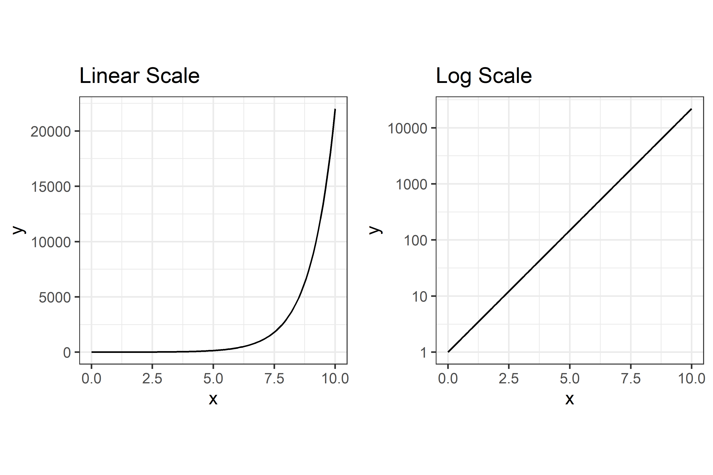

class:title-slide-custom

```{r, child = "style.Rmd"}
```


```{r setup, echo = FALSE, message = FALSE, warning = FALSE}
# Packages
library(emoji)
library(purrr)
library(tidyverse)
library(gridExtra)
library(nullabor)
library(scales)
library(knitr)
library(kableExtra)
library(RefManageR)
library(iconr)
library(fontawesome)
library(shiny)
# download_fontawesome()

# References
bib <- ReadBib("bib/thesis.bib", check = FALSE)
ui <- "- "

# R markdown options
knitr::opts_chunk$set(echo = FALSE, 
                      message = FALSE, 
                      warning = FALSE, 
                      cache = FALSE,
                      dpi = 300)
options(htmltools.dir.version = FALSE)
options(knitr.kable.NA = '')
```

```{r, include = F, eval = T, cache = F}
clean_file_name <- function(x) {
  basename(x) %>% str_remove("\\..*?$") %>% str_remove_all("[^[A-z0-9_]]")
}
img_modal <- function(src, alt = "", id = clean_file_name(src), other = "") {
  
  other_arg <- paste0("'", as.character(other), "'") %>%
    paste(names(other), ., sep = "=") %>%
    paste(collapse = " ")
  
  js <- glue::glue("<script>
        /* Get the modal*/
          var modal{id} = document.getElementById('modal{id}');
        /* Get the image and insert it inside the modal - use its 'alt' text as a caption*/
          var img{id} = document.getElementById('img{id}');
          var modalImg{id} = document.getElementById('imgmodal{id}');
          var captionText{id} = document.getElementById('caption{id}');
          img{id}.onclick = function(){{
            modal{id}.style.display = 'block';
            modalImg{id}.src = this.src;
            captionText{id}.innerHTML = this.alt;
          }}
          /* When the user clicks on the modalImg, close it*/
          modalImg{id}.onclick = function() {{
            modal{id}.style.display = 'none';
          }}
</script>")
  
  html <- glue::glue(
     " <!-- Trigger the Modal -->

<!-- The Modal -->
<div id='modal{id}' class='modal'>
  <!-- Modal Content (The Image) -->
  
  <!-- Modal Caption (Image Text) -->
  <div id='caption{id}' class='modal-caption'></div>
</div>
"
  )
  write(js, file = "js-addins.html", append = T)
  return(html)
}
# Clean the file out at the start of the compilation
write("", file = "js-addins.html")
```

<br><br><br>
## Human Perception of Exponentially Increasing Data Displayed on a Log Scale Evaluated Through Experimental Graphics Tasks
### Ph.D. Final Exmaination
#### Emily A. Robinson
#### Department of Statistics, University of Nebraska - Lincoln
<!-- ##### `r fa("envelope", fill = "black")` [emily.robinson@huskers.unl.edu](emily.robinson@huskers.unl.edu) -->
<!-- ##### `r fa("home", fill = "black")` [www.emilyarobinson.com](https://www.emilyarobinson.com/) -->
<!-- ##### `r fa("github", fill = "black")` [earobinson95](https://github.com/earobinson95) -->
<!-- <br><br> -->
<!-- .medium[*Slides: https://bit.ly/3ENZmOZ*] -->

---
class:primary
# Outline

`r fa_i("chart-bar")` Motivation and Background

`r fa_i("list")` Research Objectives

`r fa_i("chart-line")` Perception through Lineups

`r fa_i("pen")` Prediction with 'You Draw It'

`r fa_i("ruler")` Numerical Translation and Estimation

`r fa_i("check-double")` Overall conclusion

`r fa_i("spinner")` Future Work

---
class:inverse
<br>
<br>
<br>
<br>
<br>
<br>
<br>
<br>
.center[
# Motivation and Background
]


---
class:primary
# Motivation

---
class:primary
# Graphics: the 'good' and the 'bad'

---
class:primary
# Testing statistical graphics

---
class:primary
# Task Complexity

---
class:primary
# Graph comprehension

---
class:primary
# Logarithmic Scales

.center[
```{r, out.width = "90%"}

```
]

???

+ **Problem:** Data which spans several orders of magnitude shown on its original scale compresses the smaller magnitudes into relatively little area.
+ **Solution:** Use of a log scale transformation; alters the contextual appearance of the data.

The usefulness of the log scale in science is illustrated here showing the challenge of displaying the fuel energy density of Uranium along side other sources of fuel due to differences in magnitude of density.

---
class:primary
# Benefits and Pitfalls of Log Scales

.pull-left[

**Benefits** were seen in spring 2020, during the early stages of the COVID-19 pandemic.
.center[
```{r results='asis', echo = F, include = T, cache = F, eval = TRUE}
i1 <- img_modal(src = "images/covid19-FT-03.23.2020-log.png", alt = Citep(bib[[c("burnmurdoch_2020")]]), other=list(width="100%"))

c(str_split(i1, "\\n", simplify = T)[1:2],
  str_split(i1, "\\n", simplify = T)[3:9]
  ) %>% paste(collapse = "\n") %>% cat()
```
]

].pull-right[

**Pitfalls** were exposed as the pandemic evolved, and the case counts were no longer spreading exponentially. 

.center[
```{r results='asis', echo = F, include = T, cache = F, eval = TRUE}
i1 <- img_modal(src = "images/covid19-FT-linear.png", alt = Citep(bib[[c("burnmurdoch_2020")]]), other=list(width="80%"))

c(str_split(i1, "\\n", simplify = T)[1:2],
  str_split(i1, "\\n", simplify = T)[3:9]
  ) %>% paste(collapse = "\n") %>% cat()
```

```{r results='asis', echo = F, include = T, cache = F, eval = TRUE}
i1 <- img_modal(src = "images/covid19-FT-log.png", alt = Citep(bib[[c("burnmurdoch_2020")]]), other=list(width="80%"))

c(str_split(i1, "\\n", simplify = T)[1:2],
  str_split(i1, "\\n", simplify = T)[3:9]
  ) %>% paste(collapse = "\n") %>% cat()
```
]
]

---
class:primary
# Logarithmic Mapping

Our perception is **logarithmic at first**, but transitions to a **linear scale later** in development `r Citep(bib[[c("dehaene2008log", "siegler_numerical_2017", "varshney_why_2013")]])`.

.center[
```{r, out.width = "100%"}

```
]

**Assumption:** If we perceive logarithmically by default, it is a natural way to display information and should be easy to read and understand/use.

???

When we first learn to count, we begin counting by ones, then by tens, and advancing to hundreds, following the base10 order of magnitude system.

Our perception and mapping of numbers to a number line is **logarithmic at first**, but transitions to a **linear scale later** in development, with formal mathematics education.
+ For example: A kindergartner asked to place numbers one through ten along a number line would place three close to the middle, following the logarithmic perspective.

Assuming there is a direct relationship between perceptual and cognitive processes, it is reasonable to assume numerical representations should also be displayed on a nonlinear, compressed number scale. Therefore, if we perceive
logarithmically by default, it is a natural (and presumably low effort) way to display information and should be easy to read and understand/use.

---
class:primary
# Exponential growth
<br>
<br>
.center[
```{r, out.width = "75%"}
knitr::include_graphics("images/exponential-stages-comic.jpg")
```

`r Citep(bib[[c("vonbergmann_2021")]])`
]

---
class:inverse
<br>
<br>
<br>
<br>
<br>
<br>
<br>
<br>
.center[
# Comprehensive graphical studies
]
---
class:primary
# Research objectives

**Big Idea:** Are there benefits to displaying exponentially increasing data on a log scale rather than a linear scale?

1. Perception through Lineups `r fa_i("chart-line")` `r fa_i("chart-line")` `r fa_i("chart-bar")`

    - Test an individuals ability to perceptually differentiate exponentially increasing data with differing rates of change on both the linear and log scale.
    
2. Prediction with You Draw It `r fa_i("pen")`
    
    - Tests an individuals ability to make predictions for exponentially increasing data.
        
3. Estimation by Numerical Translation `r fa_i("ruler")`

    - Tests an individuals ability to translate a graph of exponentially increasing data into real value quantities.

---
class:primary
# Prolific data collection

+ About 300 participants were recruited via Prolific in March 2022.
+ The series of graphical tests were conducted through an RShiny application found [here](https://shiny.srvanderplas.com/perception-of-statistical-graphics/).


.center[
```{r, out.width = "100%"}

```
]

---
class:inverse
<br>
<br>
<br>
<br>
<br>
<br>
<br>
<br>
.center[
# Perception through Lineups
]

---
class:primary
# Lineup Experimental Task 

Study Participant Prompt: *Which plot is most different?*

.center[
```{r results='asis', echo = F, include = T, cache = F, eval = TRUE}
i1 <- img_modal(src = "images/linear-lineup-example.png", alt = " ", other=list(width="45%"))
i2 <- img_modal(src = "images/log-lineup-example.png", alt = " ", other=list(width="45%"))

c(str_split(i1, "\\n", simplify = T)[1:2],
  str_split(i2, "\\n", simplify = T)[1:2],
  str_split(i1, "\\n", simplify = T)[3:9],
  str_split(i2, "\\n", simplify = T)[3:9]
  ) %>% paste(collapse = "\n") %>% cat()
```
]

---
class:primary
# Lineup Study Design

.pull-left[
**Curvature:**
+ High Curvature
+ Medium  Curvature
+ Low Curvature
].pull-right[

```{r results='asis', echo = F, include = T, cache = F, eval = TRUE}
i1 <- img_modal(src = "images/curvature-combination-example-1.png", alt = " ", other=list(width="100%"))

c(str_split(i1, "\\n", simplify = T)[1:2],
  str_split(i1, "\\n", simplify = T)[3:9]
  ) %>% paste(collapse = "\n") %>% cat()
```
]
**Treatment Design:** Target Panel gets model A and Null Panels get model B

$3!\cdot 2!= 6$ curvature combinations

$\times 2$ lineup data sets per combination $=$ **12 test data sets**

$\times 2$ scales (log & linear) $=$ **24 different lineup plots**

**Experimental Design:** 12 lineup plots per participant

$6$ test parameter combinations per participant $\times 2$ scales $= 12$ test lineups

---
class:primary
# Generalized Linear Mixed Model

Define $Y_{ijkl}$ to be the event that participant $l$ correctly identifies the target plot for data set $k$ with curvature $j$ plotted on scale $i$.

$$\text{logit }P(Y_{ijk}) = \eta + \delta_i + \gamma_j + \delta \gamma_{ij} + s_l + d_k$$
where
- $\eta$ is the beaseline average probability of selecting the target plot. 
- $\delta_i$ is the effect of the log/linear scale.
- $\gamma_j$ is the effect of the curvature combination.
- $\delta\gamma_{ij}$is the two-way interaction effect of the scale and curvature.
- $s_l \sim N(0,\sigma^2_\text{participant})$, random effect for participant characteristics.
- $d_k \sim N(0,\sigma^2_{\text{data}})$, random effect for data specific characteristics. 

We assume that random effects for data set and participant are independent.

???
Each lineup plot evaluated was assigned a value based on the participant response (correct = 1, not correct = 0). The binary response was analyzed using generalized linear mixed model following a binomial distribution with a logit link function.

---
class:primary
# Lineup Results

.center[
```{r, out.width = "90%"}
knitr::include_graphics("images/odds-ratio-plot-1.png")
```
]

---
class:inverse
<br>
<br>
<br>
<br>
<br>
<br>
<br>
<br>
.center[
# Prediction through 'You Draw It'
]

---
class:primary
# You Draw It Experimental Task

Study Participant Prompt: *Use your mouse to fill in the trend in the yellow box region.*

.center[
```{r, out.width = "45%"}
knitr::include_graphics("images/exponential_example.gif")
```
]

--

A sub-study validated a new method, 'You Draw It', as a tool for graphical testing statistical graphics and introduced an appropriate statistical analysis method for comparing visually fitted trend lines to statistical regression results [(Eye Fitting Straight Lines in the Modern Era)](https://earobinson95.github.io/Eye-Fitting-Straight-Lines-in-the-Modern-Era/Eye-Fitting-Straight-Lines-in-the-Modern-Era.pdf).

???

Here we see an example of a you draw it interactive plot as seen by participants during the study. Participants are prompted to: "Use your mouse to fill in the trend in the yellow box region". The yellow box region moves along as the participant draws their trend-line until the yellow region disappears.

---
class:primary 
# Treatment Design

.pull-left[
2 x 2 x 2 factorial:
+ **growth rate:** low and high.
+ **points truncated:** $50\%$ and $75\%$ of the domain.
+ **scale:** log and linear.

].pull-right[
.center[
```{r results='asis', echo = F, include = T, cache = F, eval = TRUE}
i1 <- img_modal(src = "images/low-10-linear.png", alt = "Low Growth Rate, 50% Truncation, Linear Scale", other=list(width="30%"))
i2 <- img_modal(src = "images/low-10-log.png", alt = "Low Growth Rate, 50% Truncation, Log Scale", other=list(width="30%"))

c(str_split(i1, "\\n", simplify = T)[1:2],
  str_split(i2, "\\n", simplify = T)[1:2],
  str_split(i1, "\\n", simplify = T)[3:9],
  str_split(i2, "\\n", simplify = T)[3:9]
  ) %>% paste(collapse = "\n") %>% cat()
```

```{r results='asis', echo = F, include = T, cache = F, eval = TRUE}
i1 <- img_modal(src = "images/low-15-linear.png", alt = "Low Growth Rate, 75% Truncation, Linear Scale", other=list(width="30%"))
i2 <- img_modal(src = "images/low-15-log.png", alt = "Low Growth Rate, 75% Truncation, Log Scale", other=list(width="30%"))

c(str_split(i1, "\\n", simplify = T)[1:2],
  str_split(i2, "\\n", simplify = T)[1:2],
  str_split(i1, "\\n", simplify = T)[3:9],
  str_split(i2, "\\n", simplify = T)[3:9]
  ) %>% paste(collapse = "\n") %>% cat()
```

```{r results='asis', echo = F, include = T, cache = F, eval = TRUE}
i1 <- img_modal(src = "images/high-10-linear.png", alt = "High Growth Rate, 50% Truncation, Linear Scale", other=list(width="30%"))
i2 <- img_modal(src = "images/high-10-log.png", alt = "High Growth Rate, 50% Truncation, Log Scale", other=list(width="30%"))

c(str_split(i1, "\\n", simplify = T)[1:2],
  str_split(i2, "\\n", simplify = T)[1:2],
  str_split(i1, "\\n", simplify = T)[3:9],
  str_split(i2, "\\n", simplify = T)[3:9]
  ) %>% paste(collapse = "\n") %>% cat()
```

```{r results='asis', echo = F, include = T, cache = F, eval = TRUE}
i1 <- img_modal(src = "images/high-15-linear.png", alt = "High Growth Rate, 75% Truncation, Linear Scale", other=list(width="30%"))
i2 <- img_modal(src = "images/high-15-log.png", alt = "High Growth Rate, 75% Truncation, Log Scale", other=list(width="30%"))

c(str_split(i1, "\\n", simplify = T)[1:2],
  str_split(i2, "\\n", simplify = T)[1:2],
  str_split(i1, "\\n", simplify = T)[3:9],
  str_split(i2, "\\n", simplify = T)[3:9]
  ) %>% paste(collapse = "\n") %>% cat()
```
]]

---
class:primary 
# Feedback Data

.pull-left[
For each participant, the final data set used for analysis contains:
+ $x_{ijklm}$, $y_{ijklm,drawn}$, and $\hat y_{ijklm,NLS}$  

for:
+ growth rate $i = 1,2$,
+ point truncation $j = 1,2$,
+ scale $k = 1,2$,
+ participant  $l = 1,...N_{participant}$, and 
+ $x_{ijklm}$ value $m = 1, ...,4 x_{max} + 1$.

Vertical residuals between the drawn and fitted values were calculated as: 
+ $e_{ijklm,NLS} = y_{ijklm,drawn} - \hat y_{ijklm,NLS}$.

].pull-right[
```{r results='asis', echo = F, include = T, cache = F, eval = TRUE}
i1 <- img_modal(src = "images/exponential-yloess-spaghetti-plot-1.png", alt = " ", other=list(width="100%"))

c(str_split(i1, "\\n", simplify = T)[1:2],
  str_split(i1, "\\n", simplify = T)[3:9]
  ) %>% paste(collapse = "\n") %>% cat()
```
]

---
class:primary 
# Generalized Additive Mixed Model

The GAMM equation for residuals is given by:
\begin{equation}
e_{ijklm,nls} = \tau_{ijk} + s_{ijk}(x_{ijklm}) + p_{l} + s_{l}(x_{ijklm})
\end{equation}

where

+ $e_{ijklm,NLS}$ is the residual between the drawn y-value and fitted y-value for the $l^{th}$ participant, $m^{th}$ increment, and $ijk^{th}$ treatment combination 
+ $\tau_{ijk}$ is the intercept for the $i^{th}$ growth rate, $j^{th}$ point truncation, and $k^{th}$ scale treatment combination
+ $s_{ijk}$ is the smoothing spline for the $ijk^{th}$ treatment combination
+ $x_{ijklm}$ is the x-value for the $l^{th}$ participant, $m^{th}$ increment, and $ijk^{th}$ treatment combination 
+ $p_{l} \sim N(0, \sigma^2_{participant})$ is the error due to the $l^{th}$ participant's characteristics 
+ $s_{l}$ is the random smoothing spline for the $l^{th}$ participant.

???

Allowing for flexibility, the bam function in the mgcv package is used to fit a GAMM to estimate trends of vertical residuals from the participant drawn line in relation to the NLS fitted values.


---
class:primary
# GAMM Results

.center[
```{r, out.width = "64%"}

```
]

---
class:inverse
<br>
<br>
<br>
<br>
<br>
<br>
<br>
<br>
.center[
# Numerical Translation and Estimation
]

---
class:primary
# Integrative processes

**Graph Comprehension**

**Estimation Biases**

---
class:primary
# Study design: scenarios

---
class:primary
# Study design: questions

---
class:primary
# Data and plot generation

---
class:primary
# Open ended

*"Between year 30 and 40, how does the population of [creatures] change?"*

.center[
```{r, out.width = "64%"}
knitr::include_graphics("images/estimation-word-cloud-1.png")
```
]

---
class:primary
# Estimation of population
### Elementary Q1
---
class:primary
# Estimation of population
### First level estimates

---
class:primary
# Estimation of time
### Elementary Q2

---
class:primary
# Additive increase in population
### Intermediate Q1

---
class:primary
# Multiplicative change in population
### Intermediate Q2


---
class:primary
# Time until population doubles
### Intermediate Q3

---
class:primary
# Main take-aways

---
class:inverse
<br>
<br>
<br>
<br>
<br>
<br>
<br>
<br>
.center[
# Conclusion and Discussion
]

---
class:primary
# Conclusions

**Perception**

**Prediction**

**Estimation**

**Overall**

---
class:primary
# Future work

---
class:primary
# References
<font size="3">
```{r, print_refs1, results='asis', echo=FALSE, warning=FALSE, message=FALSE}
print(bib[[c("vonbergmann_2021", "dehaene2008log", "siegler_numerical_2017", "varshney_why_2013")]], 
      .opts = list(check.entries = FALSE, style = "html", bib.style = "authoryear")
      )
```
</font>

---
class:primary
# Acknowledgements

+ Advisors: Dr. Susan VanderPlas and Dr. Reka Howard

---
class:inverse
<br>
<br>
<br>
<br>
<br>
<br>
<br>
<br>
.center[
# Questions?
<!-- <br> -->
<!-- <br> -->
<!-- `r fa("envelope", fill = "white")` **emily.robinson@huskers.unl.edu** -->
<!-- `r fa("home", fill = "white")` **www.emilyarobinson.com** -->
<!-- `r fa("github", fill = "white")` **earobinson95** -->
]
