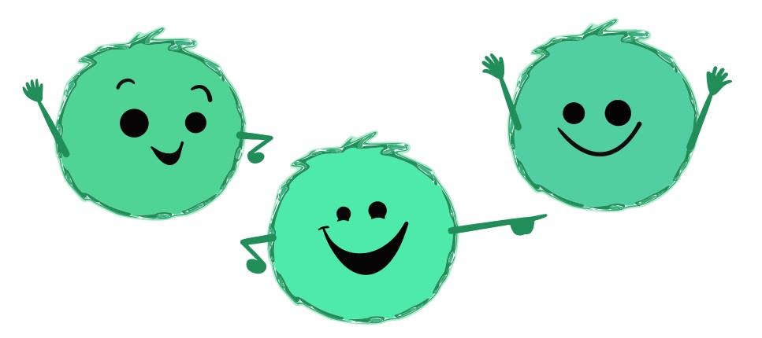
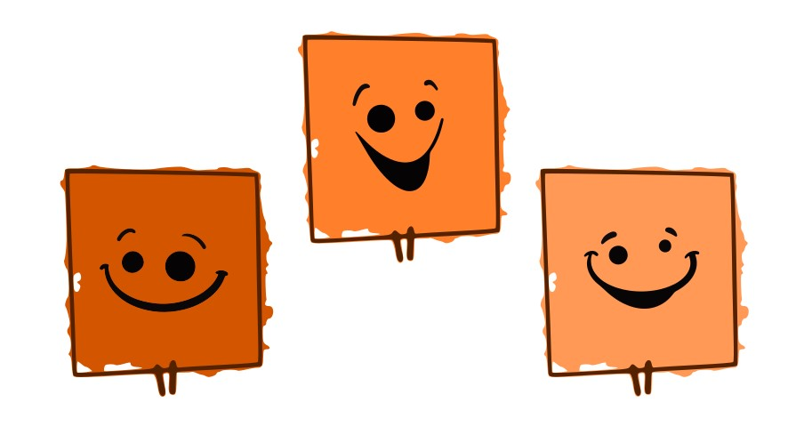
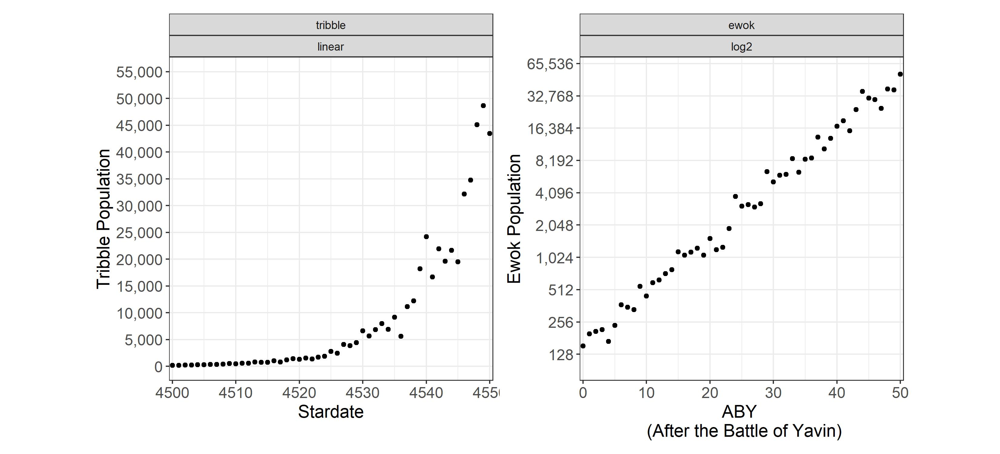

class:title-slide-custom

```{r, child = "style.Rmd"}
```


```{r setup, echo = FALSE, message = FALSE, warning = FALSE}

# Packages
library(tidyverse)
library(scales)
library(knitr)
library(iconr)
library(emoji)
library(fontawesome)

# References
# library(RefManageR)
# bib <- ReadBib("bib/thesis.bib", check = FALSE)
# ui <- "- "

# R markdown options
knitr::opts_chunk$set(echo = FALSE, 
                      message = FALSE, 
                      warning = FALSE, 
                      cache = FALSE,
                      dpi = 300)
options(htmltools.dir.version = FALSE)
options(knitr.kable.NA = '')
```

```{r, include = F, eval = T, cache = F}
clean_file_name <- function(x) {
  basename(x) %>% str_remove("\\..*?$") %>% str_remove_all("[^[A-z0-9_]]")
}
img_modal <- function(src, alt = "", id = clean_file_name(src), other = "") {
  
  other_arg <- paste0("'", as.character(other), "'") %>%
    paste(names(other), ., sep = "=") %>%
    paste(collapse = " ")
  
  js <- glue::glue("<script>
        /* Get the modal*/
          var modal{id} = document.getElementById('modal{id}');
        /* Get the image and insert it inside the modal - use its 'alt' text as a caption*/
          var img{id} = document.getElementById('img{id}');
          var modalImg{id} = document.getElementById('imgmodal{id}');
          var captionText{id} = document.getElementById('caption{id}');
          img{id}.onclick = function(){{
            modal{id}.style.display = 'block';
            modalImg{id}.src = this.src;
            captionText{id}.innerHTML = this.alt;
          }}
          /* When the user clicks on the modalImg, close it*/
          modalImg{id}.onclick = function() {{
            modal{id}.style.display = 'none';
          }}
</script>")
  
  html <- glue::glue(
     " <!-- Trigger the Modal -->

<!-- The Modal -->
<div id='modal{id}' class='modal'>
  <!-- Modal Content (The Image) -->
  
  <!-- Modal Caption (Image Text) -->
  <div id='caption{id}' class='modal-caption'></div>
</div>
"
  )
  write(js, file = "js-addins.html", append = T)
  return(html)
}
# Clean the file out at the start of the compilation
write("", file = "js-addins.html")
```

<br><br><br><br><br>
# Intergalactic Time Travel: Estimation Pilot Study
## ISU Graphics Group
## February 17, 2022
## Emily Robinson 

---
class:primary
# Estimation Pilot Study 

`r emoji("straight_ruler")` Take 15 minutes to participate in the pilot study at [https://shiny.srvanderplas.com/estimation/](https://shiny.srvanderplas.com/estimation/).

`r emoji("speech")` Please share any feedback or comments you have during the study.

`r emoji("speech")` We will also go through the questions from the study afterwards.

.center[

]

---
class:primary
# Intergalactic Populations: Tribbles

[YouTube: Star Trek The Trouble With Tribbles Clip](https://www.youtube.com/watch?v=p4wM5KvUGEc)

Hi, we're Tribbles! We were taken from our native planet, Iota Germinorum IV, and brought abroad Starfleet in stardate 4500. A Starfleet scientist, Edward Larkin, genetically engineered us to increase our reproductive rate in an attempt to solve a planetary food shortage. 
<br> <br> 
The Tribble population on Starfleet over the next 50 Stardates (equivalent to 1 week universe time) is illustrated in the graph. We need your help answering a few questions regarding the population of Tribbles.

.center[

]

---
class:primary
# Intergalactic Populations: Ewoks

Hi, we're Ewoks! We are native to the forest moon of Endor. After the Galactic Civil War, some Ewoks traveled offworld to help Rebel veterens as 'therapy Ewoks' and began to repopulate. 
<br> <br> 
The Ewok population After the Battle of Yavin (ABY) is illustrated in the graph. We need your help answering a few questions regarding the population of Ewoks offworld.

.center[

]

---
class:primary
# Time Travel

Original data were simulated from $x \in (3000, 3050)$.

**[Tribbles from Startrek](https://trekguide.com/Stardates.htm)**

+ Trouble with Tribbles occured on stardate 4523.3 (universe year = Fri Jan 11 2267 21:58:18)
+ 1 week span: Jan 11, 2267 (4516.69) to Jan 18, 2267 (4567.19) = 50.5 stardates
+ 4516.69 stardate - 3000 date of simulated data (+ 1516.69)
+ Conversion: round to 4500 (+ 1500)

**[Ewoks from Star Wars](https://starwars.fandom.com/wiki/Timeline_of_galactic_history)**

+ The Galactic Civil War occurred in 0 - 5 After the Battle of Yavin (ABY)
+ Conversion: start at 0 ABY (- 3000)

---
class:primary
# Data Plots
<br>
.center[

]

---
class:primary
# Graph Comprehension

Questioning is an important aspect of comprehension (Friel et al., 2001). Three levels of graph comprehension have emerged (NCTM, 2000):
+ **Elementary level:** focused on extracting data from a graph (literal reading of the data)

+ **Intermediate level:** characterized by interpolating and finding relationships in the data as shown on the graph (reading between the data)

+ **Advanced level:** requires extrapolating from the data and analyzing the relationships implicit in the graph (reading beyond the data)

???

+ 2 literal items (requiring a literal reading of the data, title, or axis label)
    + What does this graph tell you?
    + How tall was xxx?
+ 2 comparison items (requiring comparisons and the use of mathematical concepts and skills to “read between the data)
    + Who was the tallest?
    + How much taller was x than y?
+ 2 extension items (requiring an extension, prediction, or inference to “read beyond the data”)
    + If x grows 5 centimeters and y grows 10 centimeters by Sept. 1981, who will be taller, and by how much?
    + If z is 5 years old, which of the following is a correct statement?

**Other considerations**
+ Beeby and Taylor (cited in MacDonald-Ross, 1977) found that in reading data from line graphs, people persistently misread the scale on the vertical axis; when only alternate lines were numbered, the unnumbered lines were read as halves.
+ Leinhardt, Zaslavsky, and Stein (1990) noted that the shape of a graph changes depending on the scale; this change may create a “conceptual demand” (p.17) that affects the mental image a graph user is able to construct.
+ Open-ended estimation tasks elicit certain well-known biases such as the tendency to round to multiples of 5 or 10.
+ Long-term interaction with a complex graph or chart showing multiple layers of data is generally not ideal within this paradigm, which requires a fixed set of numerical assessments that do not accurately represent how we explore a new, complex graphic.

---
class:primary
# Elementary Questions

**Open Ended**
+ Between stardates 4530 and 4540, how does the population of Tribbles change?
+ Between 30 ABY and 40 ABY, how does the population of Ewoks change?

**Numerical Translation**
+ What is the population of Tribbles in stardate 4510?
+ What is the population of Ewoks in 10 ABY?


+ At what stardate does the population of Tribbles reach 4,000?
+ In what ABY does the population of Ewoks reach 4,000?

.center[
```{r results='asis', echo = F, include = T, cache = F, eval = TRUE}
i1 <- img_modal(src = "images/simulated-data-plot.jpg", alt = " ", other=list(width="55%"))

c(str_split(i1, "\\n", simplify = T)[1:2],
  str_split(i1, "\\n", simplify = T)[3:9]
  ) %>% paste(collapse = "\n") %>% cat()
```
]

---
class:primary
# Intermediate Questions

**Additive Comparisons**

+ From 4520 to 4540, the population increases by ____ Tribbles.
+ From 20 ABY to 40 ABY, the population increases by ____ Ewoks.

**Multiplicative Comparisons**

+ How many times more Tribbles are there in 4540 than in 4520?
+ How many times more Ewoks are there in 40 ABY than in 20 ABY?


+ How long does it take for the population of Tribbles in stardate 4510 to double?
+ How long does it take for the population of Ewoks in 10 ABY to double?

.center[
```{r results='asis', echo = F, include = T, cache = F, eval = TRUE}
i1 <- img_modal(src = "images/simulated-data-plot.jpg", alt = " ", other=list(width="55%"))

c(str_split(i1, "\\n", simplify = T)[1:2],
  str_split(i1, "\\n", simplify = T)[3:9]
  ) %>% paste(collapse = "\n") %>% cat()
```
]
---
class:inverse
<br>
<br>
<br>
<br>
<br>
<br>
<br>
.center[
# Additional Suggestions or Considerations?
]

---
class:primary
# Group Discussion
## [International Day of Women and Girls in Science](https://www.un.org/en/observances/women-and-girls-in-science-day)

.center[

]

