```{r, include = F, eval = T}
knitr::opts_chunk$set(echo = F, dpi = 300, message = F, warning = F, cache = T)
options(htmltools.dir.version = FALSE)
library(emo)
library(tidyverse)
```

```{r, include = F, eval = T, cache = F}
clean_file_name <- function(x) {
  basename(x) %>% str_remove("\\..*?$") %>% str_remove_all("[^[A-z0-9_]]")
}
img_modal <- function(src, alt = "", id = clean_file_name(src), other = "") {
  
  other_arg <- paste0("'", as.character(other), "'") %>%
    paste(names(other), ., sep = "=") %>%
    paste(collapse = " ")
  
  js <- glue::glue("<script>
        /* Get the modal*/
          var modal{id} = document.getElementById('modal{id}');
        /* Get the image and insert it inside the modal - use its 'alt' text as a caption*/
          var img{id} = document.getElementById('img{id}');
          var modalImg{id} = document.getElementById('imgmodal{id}');
          var captionText{id} = document.getElementById('caption{id}');
          img{id}.onclick = function(){{
            modal{id}.style.display = 'block';
            modalImg{id}.src = this.src;
            captionText{id}.innerHTML = this.alt;
          }}
          /* When the user clicks on the modalImg, close it*/
          modalImg{id}.onclick = function() {{
            modal{id}.style.display = 'none';
          }}
</script>")
  
  html <- glue::glue(
     " <!-- Trigger the Modal -->

<!-- The Modal -->
<div id='modal{id}' class='modal'>
  <!-- Modal Content (The Image) -->
  
  <!-- Modal Caption (Image Text) -->
  <div id='caption{id}' class='modal-caption'></div>
</div>
"
  )
  write(js, file = "js-addins.html", append = T)
  return(html)
}
# Clean the file out at the start of the compilation
write("", file = "js-addins.html")
```

class:inverse,middle,center
# Covid-19 Graphics: <br/> The good, the bad, and the somewhat useful
## Emily Robinson and Susan Vanderplas<br/>May 15, 2020

---
class:primary
## Data Visualizations Breakthrough Moment

.pull-left[
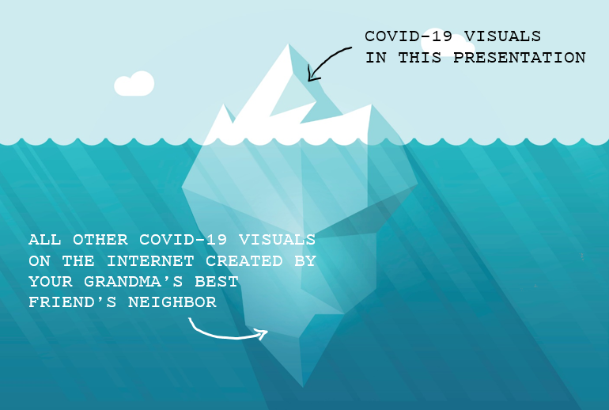

*“The complexity and importance of COVID-19 has put **data visualization center stage** in worldwide discussions.”*
-Ben Shneiderman, Nightingale

].pull-right[

- During the 1854 cholera epidemic in London, John Snow drew a map showing deaths in the Broad Street area, revealing a concentration around the local water pump.

- Being able to understand and communicate information about data, models, and outcomes is important for informing the public and guiding decision-makers

- The early academic research on data visualization triggered a growing number of commercial successes.
]

---
class:primary
## "Flatten the Curve"
.pull-left[
What made this illistration (aka cartoon) so popular?

- Clear and straightforward message
- Foundation on Science
- Clear tagline, *actionable*
- Enough visual elements to be informative without getting overwhelming
].pull-right[

]

--


Check out this [flatten the curve simulation](https://www.washingtonpost.com/graphics/2020/world/corona-simulator/) by the Washington Post.

---
class:primary
## This Isn’t the Flattened Curve We Were Promised
.pull-left[
<blockquote class="twitter-tweet"><p lang="en" dir="ltr">These charts suggested that the &quot;flattened&quot; curve would last longer—that after a few months the flattened curve would have more daily infections than the unflattened curve would have. They implicitly assume that everyone is going to get infected, it&#39;s just a question of when.</p>&mdash; Timothy B. Lee (@binarybits) <a href="https://twitter.com/binarybits/status/1259553070968721410?ref_src=twsrc%5Etfw">May 10, 2020</a></blockquote> <script async src="https://platform.twitter.com/widgets.js" charset="utf-5"></script>
].pull-right[

*"They’re all symmetrical, indicating that once a population has reached the peak, the disease will taper away just as quickly as it grew."*

by [Bloomberg Opinion](https://www.bloomberg.com/opinion/articles/2020-04-16/coronavirus-this-isn-t-the-flattened-curve-we-were-promised/) April 16, 2020

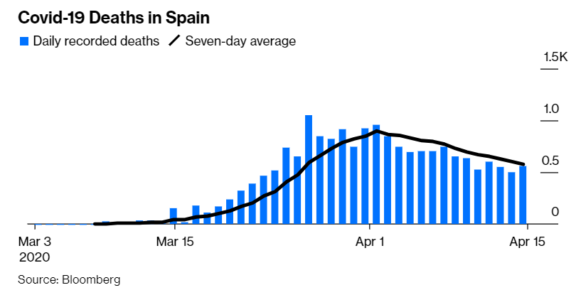


Check out the post, [Don’t “Flatten the Curve,” squash it!](https://medium.com/@joschabach/flattening-the-curve-is-a-deadly-delusion-eea324fe9727)
]

---
class:primary
## Case Counts
.center[
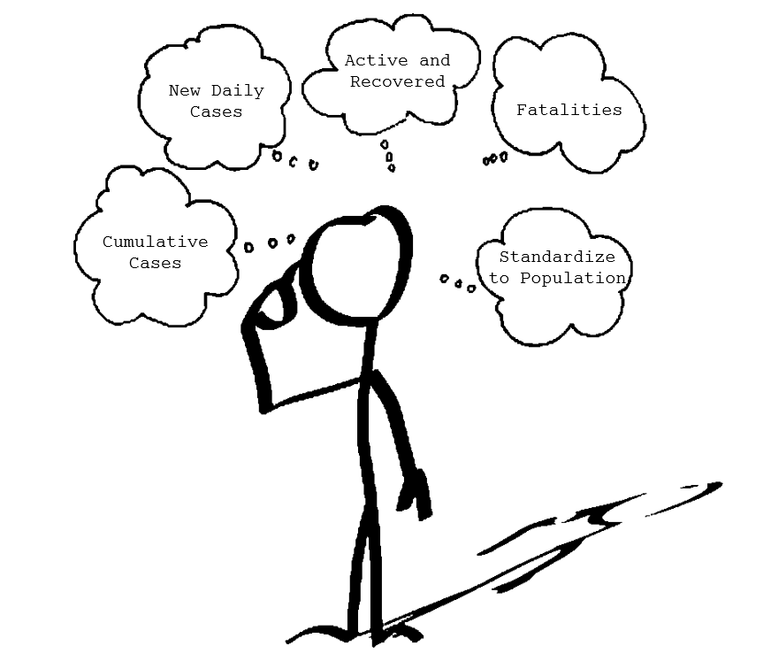
]
---
class:primary
## Leading visuals

- [John Burn-Murdoch Data Viz with the Financial Times](https://www.ft.com/content/a26fbf7e-48f8-11ea-aeb3-955839e06441)
- [91-DOVIC](http://91-divoc.com/pages/covid-visualization/)
- [Our World in Data](https://slides.ourworldindata.org/2020_pandemic/2020_pandemic#/title-slide)

.pull-left[
```{r results='asis', echo = F, include = T, cache = F, eval = TRUE}
i1 <- img_modal(src = "images/FinancialTimes-CumulativeCases-Linear.PNG", alt = "Raw Linear", other=list(width="45%"))
i2 <- img_modal(src = "images/FinancialTimes-CumulativeCases-Log.PNG", alt = "Raw Log", other=list(width="45%"))
i3 <- img_modal(src = "images/FinancialTimes-CumulativeCases-perMillion-Linear.PNG", alt = "Per Million Linear", other=list(width="45%"))
i4 <- img_modal(src = "images/FinancialTimes-CumulativeCases-perMillion-Log.PNG", alt = "Per Million Log", other=list(width="45%"))
c(str_split(i1, "\\n", simplify = T)[1:2],
  str_split(i2, "\\n", simplify = T)[1:2],
  str_split(i3, "\\n", simplify = T)[1:2],
  str_split(i4, "\\n", simplify = T)[1:2],
  str_split(i1, "\\n", simplify = T)[3:9],
  str_split(i2, "\\n", simplify = T)[3:9],
  str_split(i3, "\\n", simplify = T)[3:9],
  str_split(i4, "\\n", simplify = T)[3:9]
  ) %>% paste(collapse = "\n") %>% cat()
```
].pull-right[
Nice interactive features of these graphics.
- Toggle between linear and log scales
-	Population standardizing

Other nice design features
- Aligned x-axis to be number of days since a specified number of cases or deaths
- Rolling 3 day or 7 day averages
  - Cases are not being logged on the weekends
]

---
class:primary
## Probably not leading visuals

.pull-left[
```{r results='asis', echo = F, include = T, cache = F, eval = TRUE}
i1 <- img_modal(src = "images/WeirdAndOriginal2.png", alt = " ", other=list(width="100%"))
i2 <- img_modal(src = "images/ScatterBubbleChart.png", alt = " ", other=list(width="100%"))
c(str_split(i1, "\\n", simplify = T)[1:2],
  str_split(i2, "\\n", simplify = T)[1:2],
  str_split(i1, "\\n", simplify = T)[3:9],
  str_split(i2, "\\n", simplify = T)[3:9]
  ) %>% paste(collapse = "\n") %>% cat()
```
].pull-right[
<blockquote class="twitter-tweet"><p lang="en" dir="ltr">Hard agree. There&#39;s a subculture in the dataviz community that loves dunking on anything that goes against dataviz dogma and I really dislike it. <br><br>Not every experiment will be a homerun, but at least it&#39;s pushing things forward. Keep an open mind and keep criticism constructive. <a href="https://t.co/vtXq4uwCbP">https://t.co/vtXq4uwCbP</a></p>&mdash; Will Chase (@W_R_Chase) <a href="https://twitter.com/W_R_Chase/status/1255299978903334913?ref_src=twsrc%5Etfw">April 29, 2020</a></blockquote> <script async src="https://platform.twitter.com/widgets.js" charset="utf-8"></script>
]

---
class:primary
## Trendlines
.center[

]

---
class:primary
## Trajectory

.pull-left[
```{r results='asis', echo = F, include = T, cache = F, eval = TRUE}
i1 <- img_modal(src = "images/Trajectory-Cases-PerMillion-Log.GIF", alt = "Case Growth", other=list(width="100%"))
c(str_split(i1, "\\n", simplify = T)[1:2],
  str_split(i1, "\\n", simplify = T)[3:9]
  ) %>% paste(collapse = "\n") %>% cat()
```
].pull-right[
Watch [How coronavirus charts can mislead us](https://ourworldindata.org/how-to-read-the-famous-coronavirus-trajectory-chart-video-explainer) by Our World in Data.

1) Only showing us confirmed cases, **not** all coronavirus cases.
  - Hidden variable: Testing
  
2) Logaraithmic Scale
<!-- - No fixed space on chart for a certain number of cases. -->
<!-- - Shows the virus is spreading at a slower rate than before. -->

3) Adjusting for population size.
<!-- - Moves larger countries down and smaller countries up. -->

4) x-axis plots by number of days since country recorded X number of cases, not by date. 
]
---
class:primary
## Trajectory

.center[

]

- Maybe not super useful.
- It's a lot of fun to watch though!

---
class:primary
## Case Growth

.pull-left[
```{r results='asis', echo = F, include = T, cache = F, eval = TRUE}
i1 <- img_modal(src = "images/CaseGrowth-Sample.png", alt = "Case Growth", other=list(width="100%"))
i2 <- img_modal(src = "images/CaseGrowth-Ames.png", alt = "Story County Case Growth", other=list(width="100%"))
i3 <- img_modal(src = "images/CaseGrowth-Nebraska.png", alt = "Lancaster County Case Growth", other=list(width="100%"))
c(str_split(i1, "\\n", simplify = T)[1:2],
  str_split(i2, "\\n", simplify = T)[1:2],
  str_split(i3, "\\n", simplify = T)[1:2],
  str_split(i1, "\\n", simplify = T)[3:9],
  str_split(i2, "\\n", simplify = T)[3:9],
  str_split(i3, "\\n", simplify = T)[3:9]
  ) %>% paste(collapse = "\n") %>% cat()
```
].pull-right[

Published by [New York Times](https://www.nytimes.com/interactive/2020/us/coronavirus-us-cases.html)
- Less confusing than bar charts.
- Focus on growth rate over nominal case count.
- Implicitly shows the ebb and flow of cases, without requiring the cognitive load of interpreting log graphs, etc.
]

---
class:primary
## Exponential Growth

What is it?

```{r results='asis', echo = F, include = T, cache = F, eval = TRUE}
i1 <- img_modal(src = "images/ExponentialGrowth-Linear.png", alt = "Linear Scale", other=list(width="15%"))
i2 <- img_modal(src = "images/ExponentialGrowth-Log.png", alt = "Log Scale", other=list(width="15%"))
i3 <- img_modal(src = "images/ExponentialGrowth-DoublingTimes.png", alt = "Log Scale", other=list(width="15%"))
i4 <- img_modal(src = "images/ExponentialGrowth-Example.png", alt = "Log Scale", other=list(width="15%"))
i5 <- img_modal(src = "images/ExponentialGrowth-PiecewiseLinear.png", alt = "Log Scale", other=list(width="15%"))
c(str_split(i1, "\\n", simplify = T)[1:2],
  str_split(i2, "\\n", simplify = T)[1:2],
  str_split(i3, "\\n", simplify = T)[1:2],
  str_split(i4, "\\n", simplify = T)[1:2],
  str_split(i5, "\\n", simplify = T)[1:2],
  str_split(i1, "\\n", simplify = T)[3:9],
  str_split(i2, "\\n", simplify = T)[3:9],
  str_split(i3, "\\n", simplify = T)[3:9],
  str_split(i4, "\\n", simplify = T)[3:9],
  str_split(i5, "\\n", simplify = T)[3:9]
  ) %>% paste(collapse = "\n") %>% cat()
```

--
Why is it a problem

On the linear scale:
- Makes some countries look way worse.

On the log scale:
- No fixed space on chart for a certain number of cases.
- Shows the virus is spreading at a slower rate than before.

--

What can we do to mitigate it?
- Toggle between log/linear scales
- Add trendlines

---
class:primary
## Visualizing $R_t$

.center[

```{r results='asis', echo = F, include = T, cache = F, eval = TRUE}
i1 <- img_modal(src = "images/VisualizingRt-Iowa.png", alt = " ", other=list(width="30%"))
i2 <- img_modal(src = "images/VisualizingRt-Nebraska.png", alt = " ", other=list(width="30%"))
c(str_split(i1, "\\n", simplify = T)[1:2],
  str_split(i2, "\\n", simplify = T)[1:2],
  str_split(i1, "\\n", simplify = T)[3:9],
  str_split(i2, "\\n", simplify = T)[3:9]
  ) %>% paste(collapse = "\n") %>% cat()
```
]
---
class:primary
## Visualizing $R_0$, this is really pretty
.center[
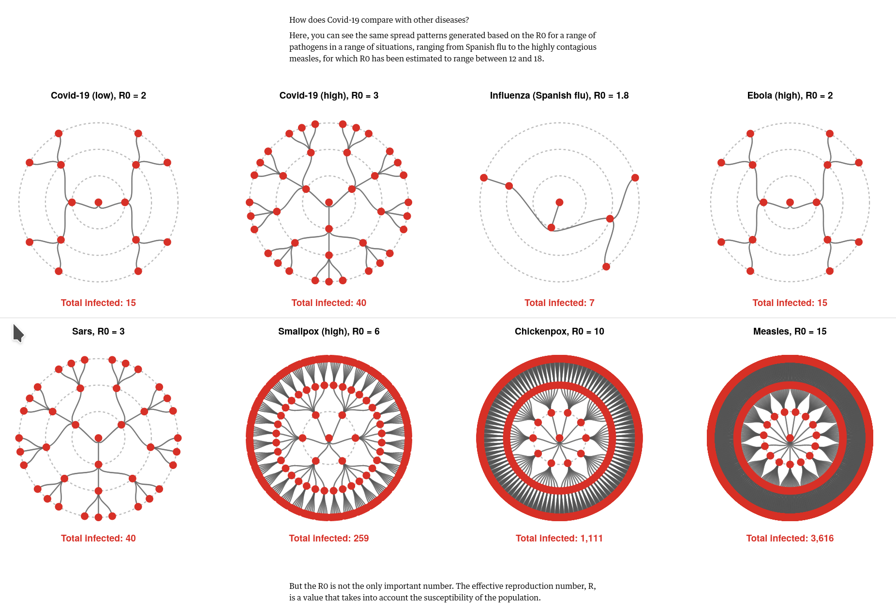
]

---
class:primary

.center[

]

---
class:primary
## Excess Death
.center[
```{r results='asis', echo = F, include = T, cache = F, eval = TRUE}
i1 <- img_modal(src = "images/ExcessDeaths.jpg", alt = " ", other=list(width="45%"))
i2 <- img_modal(src = "images/ExcessDeaths2.jpg", alt = " ", other=list(width="45%"))
c(str_split(i1, "\\n", simplify = T)[1:2],
  str_split(i2, "\\n", simplify = T)[1:2],
  str_split(i1, "\\n", simplify = T)[3:9],
  str_split(i2, "\\n", simplify = T)[3:9]
  ) %>% paste(collapse = "\n") %>% cat()
```
]

---
class:primary
## Mapping COVID-19

Read [Evan M Peck's Twitter Thread](https://twitter.com/EvanMPeck/status/1235568532840120321) discussing the problems of creating data-driven maps of COVID-19.

1) What do you do when your numbers probably don't reflect reality?

2) How do you make small numbers seem meaningful?

3) People beleive the story of the viz they see.

4) Tensions in audiences (local vs global maps).

5) We are going to see many out-of-date vis about COVID19 from people who grabbed a static snapshot of the data X days ago. 

---
class:primary
## Chloropleth Maps

.center[
```{r results='asis', echo = F, include = T, cache = F, eval = TRUE}
i1 <- img_modal(src = "images/ChinaMap-Red.png", alt = " ", other=list(width="45%"))
i2 <- img_modal(src = "images/ChinaMap-Blue.png", alt = " ", other=list(width="45%"))

c(str_split(i1, "\\n", simplify = T)[1:2],
  str_split(i2, "\\n", simplify = T)[1:2],
  str_split(i1, "\\n", simplify = T)[3:9],
  str_split(i2, "\\n", simplify = T)[3:9]
  ) %>% paste(collapse = "\n") %>% cat()
```
]
- You cannot map **totals** using a choropleth thematic mapping technique. Standardize to population.
- Color matters! Don't scare people

---
class:primary
## Stay away from the stoplights `r emo::ji("traffic")`

.center[
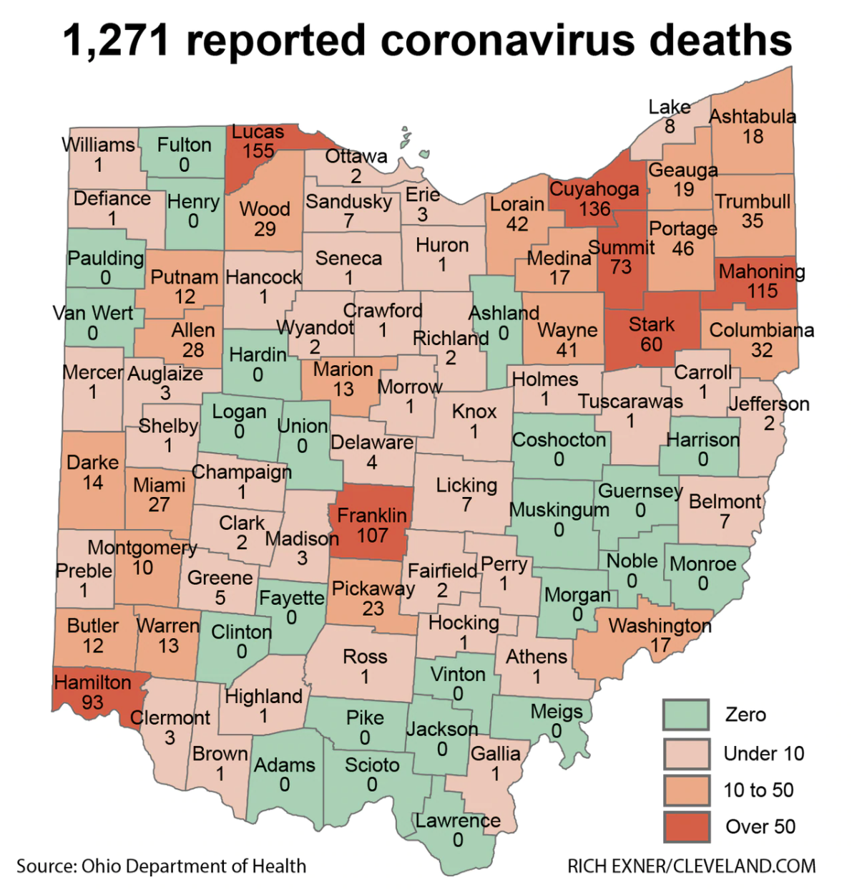
]

---
class:primary
## That's a lot of...pink. 
.center[
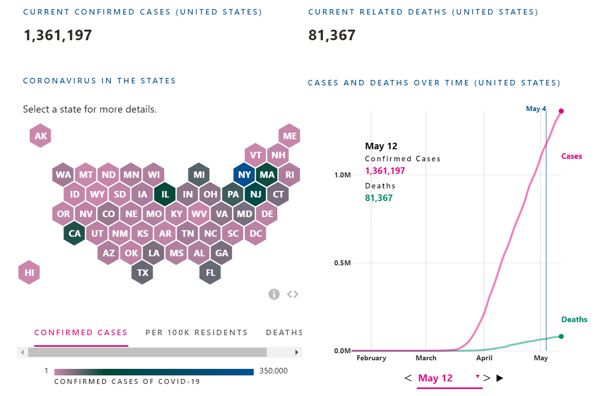
]

---
class:primary
## Symbol Maps


.center[
```{r results='asis', echo = F, include = T, cache = F, eval = TRUE}
i1 <- img_modal(src = "images/ChinaMap-Symbol-LinearScale.png", alt = "Linear Scale", other=list(width="45%"))
i2 <- img_modal(src = "images/ChinaMap-Symbol-LogScale.png", alt = "Log Scale", other=list(width="45%"))

c(str_split(i1, "\\n", simplify = T)[1:2],
  str_split(i2, "\\n", simplify = T)[1:2],
  str_split(i1, "\\n", simplify = T)[3:9],
  str_split(i2, "\\n", simplify = T)[3:9]
  ) %>% paste(collapse = "\n") %>% cat()
```
]
---
class:primary
## Pay attention to your legend

.center[
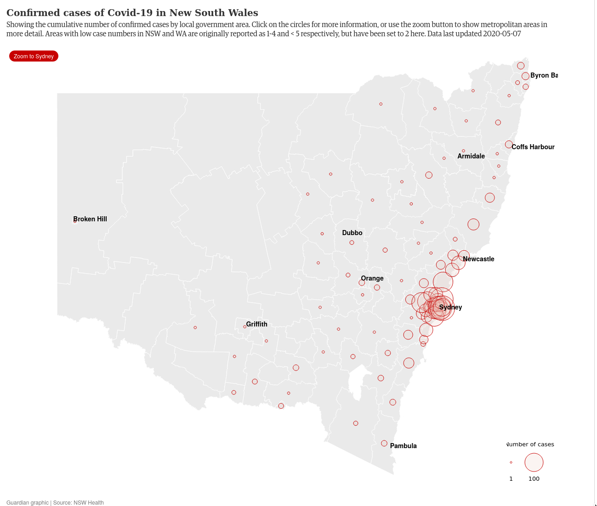
]

---
class:primary:
## Dot Maps
.pull-left[
```{r results='asis', echo = F, include = T, cache = F, eval = TRUE}
i1 <- img_modal(src = "images/ChinaMap-Dotmap.png", alt = " ", other=list(width="100%"))

c(str_split(i1, "\\n", simplify = T)[1:2],
  str_split(i1, "\\n", simplify = T)[3:9]
  ) %>% paste(collapse = "\n") %>% cat()
```
].pull-right[
The Good
- Dots are positioned randomly and it emphasizes the large outlier in Hubei.


The Bad
- Some might infer a dot locates an individual case. 
- Consider restricting the zoom scale
]

---
class:primary
## Heat Map..please don't.

.pull-left[

]
--
.pull-right[

]

---
class:primary
## Interactive vs Static Graphics

---
class:primary
## Visualizing Uncertainty

---
class:primary
## Forecasting `r emo::ji("crystal")`

.pull-left[
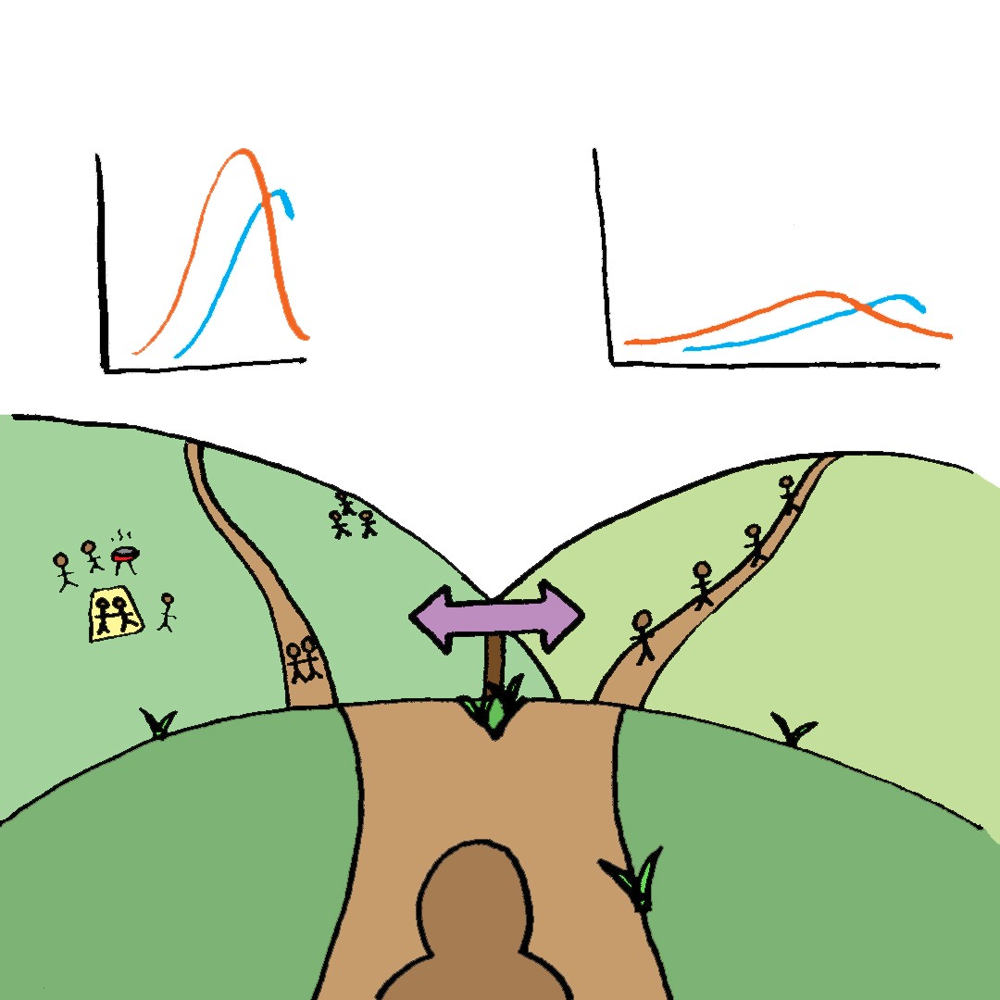
].pull-right[
*"Instead of thinking about projections that show us our destiny, we can consider them as a way to see our **potential futures** ahead of time, and how that interacts with the choices we make today."*

-Dr. Zeynep Tufekci

]

<!-- --- -->
<!-- class:primary -->
<!-- ## Other things to visualize besides case counts -->

<!-- Based on the [Nightengale blog post](https://medium.com/nightingale/thirteen-things-to-visualize-about-covid-19-besides-case-loads-581fa90348dd) -->

<!-- - Emotional well being -->
<!-- - Lifestyle changes  -->
<!-- - Routine health care `r emo::ji("health")` -->
<!-- - Jobs/industries `r emo::ji("worker")` `r emo::ji("nurse")` -->
<!-- - Educational impact `r emo::ji("electricity")` -->
<!-- - Utility usage `r emo::ji("house")` `r emo::ji("electricity")` -->
<!-- - Internet infrastructure -->
<!-- - Environmental factors `r emo::ji("tree")` `r emo::ji("flower")` -->
<!-- - Traffic patterns `r emo::ji("traffic")` -->
<!-- - What we eat and how we eat (e.g. have you noticed everyone is baking bread? `r emo::ji("bread")`) -->
<!-- - Mobility `r emo::ji("car")` `r emo::ji("bike")` -->
<!-- - Local support systems (e.g. food banks) -->
<!-- - Supplies of products `r emo::ji("toilet")` -->

---
class:primary
## Testing Covid

.center[
```{r results='asis', echo = F, include = T, cache = F, eval = TRUE}
i1 <- img_modal(src = "images/States-ReccommendedTestingLevel.png", alt = " ", other=list(width="45%"))
i2 <- img_modal(src = "images/TestingRates.png", alt = " ", other=list(width="45%"))

c(str_split(i1, "\\n", simplify = T)[1:2],
  str_split(i2, "\\n", simplify = T)[1:2],
  str_split(i1, "\\n", simplify = T)[3:9],
  str_split(i2, "\\n", simplify = T)[3:9]
  ) %>% paste(collapse = "\n") %>% cat()
```
]

---
class:primary
## Governent Resitrictions

.center[
```{r results='asis', echo = F, include = T, cache = F, eval = TRUE}
i1 <- img_modal(src = "images/LockdownsAroundTheWorld-Simulation.gif", alt = " ", other=list(width="45%"))
i2 <- img_modal(src = "images/GovernmentResponse-StringencyIndex.png", alt = " ", other=list(width="45%"))
i3 <- img_modal(src = "images/StayAtHome-MapLattice.png", alt = " ", other=list(width="45%"))

c(str_split(i1, "\\n", simplify = T)[1:2],
  str_split(i2, "\\n", simplify = T)[1:2],
  str_split(i3, "\\n", simplify = T)[1:2],
  str_split(i1, "\\n", simplify = T)[3:9],
  str_split(i2, "\\n", simplify = T)[3:9],
  str_split(i3, "\\n", simplify = T)[3:9]
  ) %>% paste(collapse = "\n") %>% cat()
```
]

---
### Covid Masks

.pull-left[
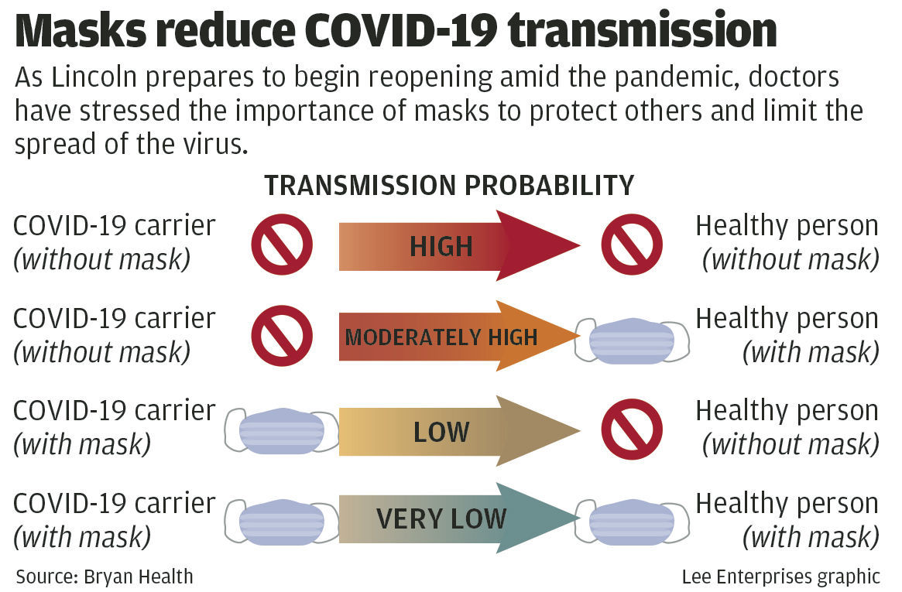
].pull-right[
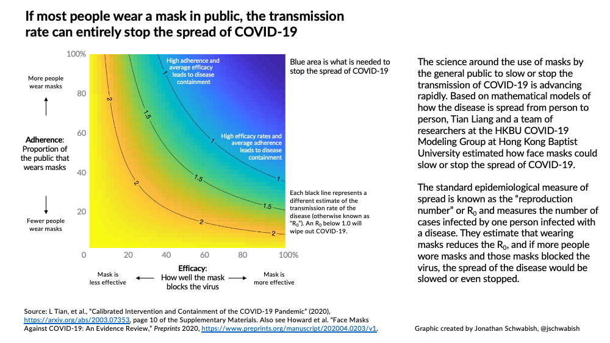
]

---
class:
## Searching Covid

Check out this [Searching Covid Dashboard](https://searchingcovid19.com/) showing Google Trends search data related to the Covid-19 pandemic.


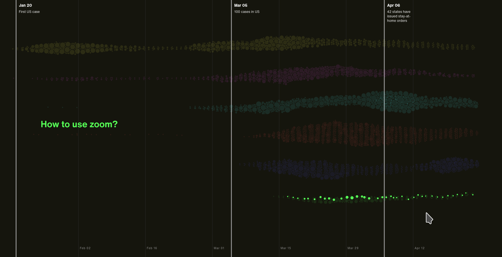

---
class:primary
## Environmental Factors

.center[
```{r results='asis', echo = F, include = T, cache = F, eval = TRUE}
i1 <- img_modal(src = "images/China-Environment-Pink.png", alt = " ", other=list(width="45%"))
i2 <- img_modal(src = "images/China-Environment-Blue.png", alt = " ", other=list(width="45%"))

c(str_split(i1, "\\n", simplify = T)[1:2],
  str_split(i2, "\\n", simplify = T)[1:2],
  str_split(i1, "\\n", simplify = T)[3:9],
  str_split(i2, "\\n", simplify = T)[3:9]
  ) %>% paste(collapse = "\n") %>% cat()
```
]

---
class:primary
## Related Blog Posts

- [Thirteen Things to Visualize abou Covid-19 besides case loads](https://medium.com/nightingale/thirteen-things-to-visualize-about-covid-19-besides-case-loads-581fa90348dd)
- [Ten Considerations Before You Create Another Chart About COVID-19](https://medium.com/nightingale/ten-considerations-before-you-create-another-chart-about-covid-19-27d3bd691be8)
- [Communication Themes from Coronavirus Outbreak](https://www.visualisingdata.com/2020/03/communication-themes-from-coronavirus-outbreak/)
- [COVID-19 Data Literacy is for Everyone](https://medium.com/nightingale/covid-19-data-literacy-is-for-everyone-46120b58cec9)

---
class:primary middle, center
.center[
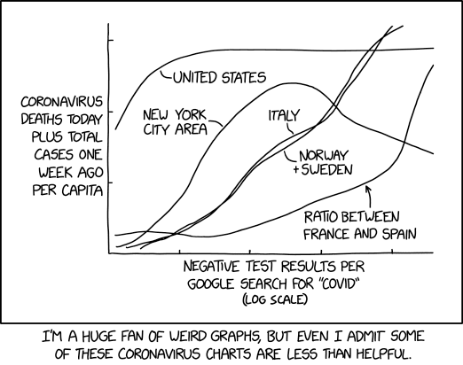
]

---
class:primary
## References
<font size="1">
.small[
- 
]
</font>
