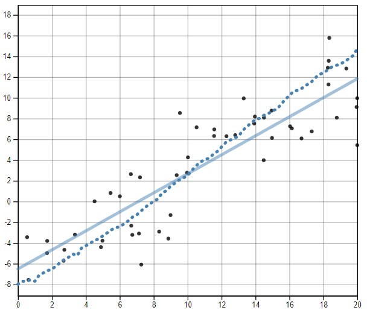
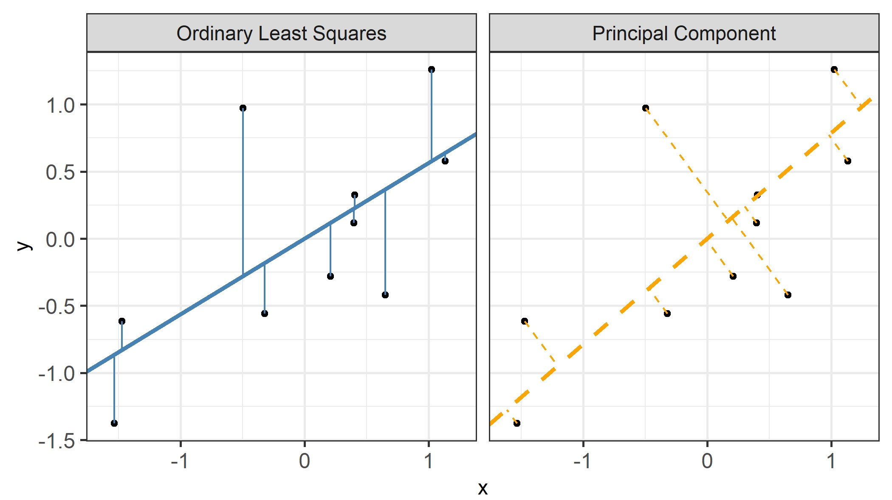
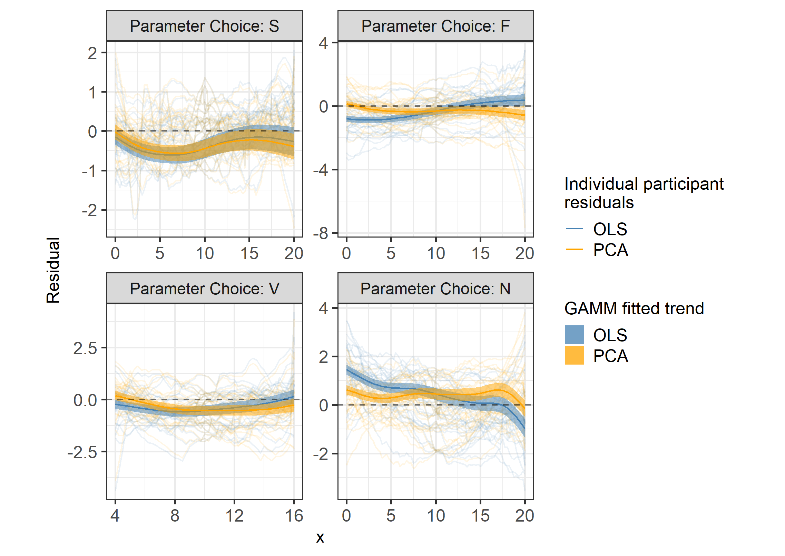
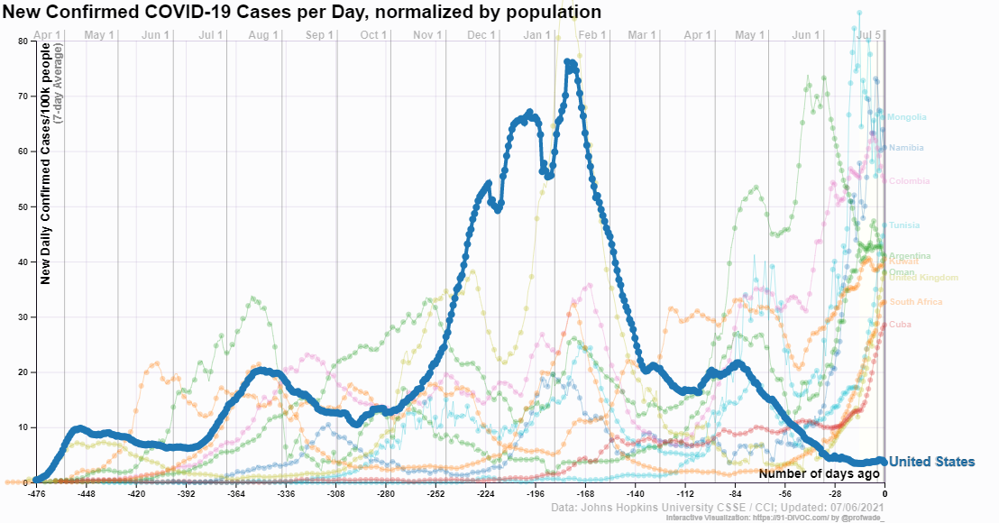
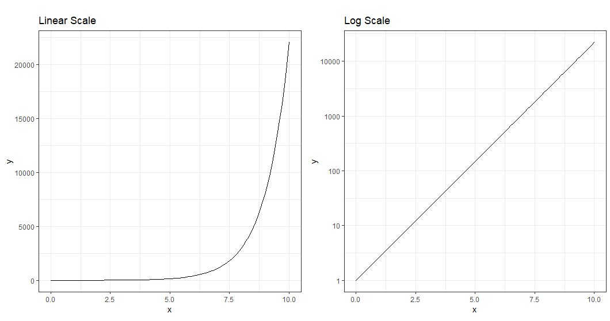
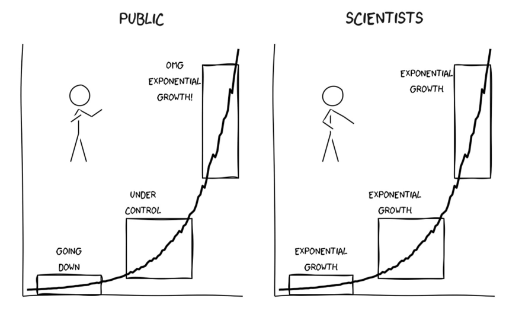
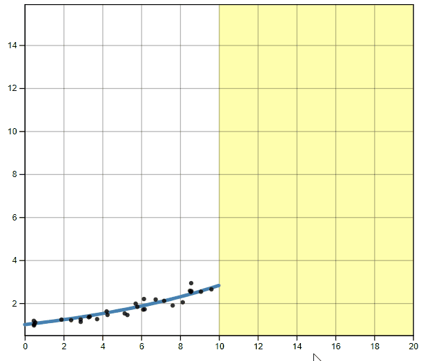
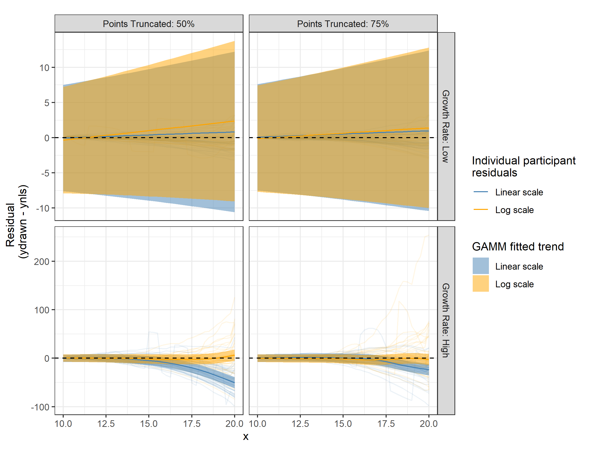
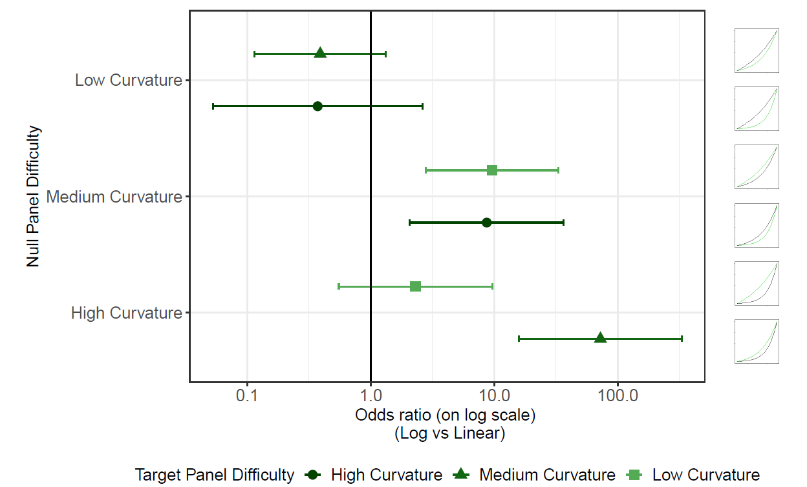
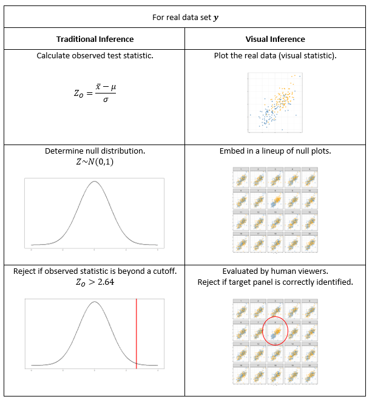

class:title-slide-custom

```{r, child = "style.Rmd"}
```


```{r setup, echo = FALSE, message = FALSE, warning = FALSE}

# Packages
library(emo)
library(purrr)
library(tidyverse)
library(gridExtra)
library(nullabor)
library(scales)
library(knitr)
library(kableExtra)
library(RefManageR)
library(iconr)
library(fontawesome)
# download_fontawesome()

# References
library(RefManageR)
bib <- ReadBib("bib/thesis.bib", check = FALSE)
ui <- "- "

# R markdown options
knitr::opts_chunk$set(echo = FALSE, 
                      message = FALSE, 
                      warning = FALSE, 
                      cache = FALSE,
                      dpi = 300)
options(htmltools.dir.version = FALSE)
options(knitr.kable.NA = '')
```

```{r, include = F, eval = T, cache = F}
clean_file_name <- function(x) {
  basename(x) %>% str_remove("\\..*?$") %>% str_remove_all("[^[A-z0-9_]]")
}
img_modal <- function(src, alt = "", id = clean_file_name(src), other = "") {
  
  other_arg <- paste0("'", as.character(other), "'") %>%
    paste(names(other), ., sep = "=") %>%
    paste(collapse = " ")
  
  js <- glue::glue("<script>
        /* Get the modal*/
          var modal{id} = document.getElementById('modal{id}');
        /* Get the image and insert it inside the modal - use its 'alt' text as a caption*/
          var img{id} = document.getElementById('img{id}');
          var modalImg{id} = document.getElementById('imgmodal{id}');
          var captionText{id} = document.getElementById('caption{id}');
          img{id}.onclick = function(){{
            modal{id}.style.display = 'block';
            modalImg{id}.src = this.src;
            captionText{id}.innerHTML = this.alt;
          }}
          /* When the user clicks on the modalImg, close it*/
          modalImg{id}.onclick = function() {{
            modal{id}.style.display = 'none';
          }}
</script>")
  
  html <- glue::glue(
     " <!-- Trigger the Modal -->

<!-- The Modal -->
<div id='modal{id}' class='modal'>
  <!-- Modal Content (The Image) -->
  
  <!-- Modal Caption (Image Text) -->
  <div id='caption{id}' class='modal-caption'></div>
</div>
"
  )
  write(js, file = "js-addins.html", append = T)
  return(html)
}
# Clean the file out at the start of the compilation
write("", file = "js-addins.html")
```

<br><br>
# Can 'You Draw It'?
## Bucknell University
### November 12, 2021
#### Emily Robinson 
#### Department of Statistics, University of Nebraska - Lincoln 
##### `r fa("envelope", fill = "black")` [emily.robinson@huskers.unl.edu](emily.robinson@huskers.unl.edu) 
##### `r fa("home", fill = "black")` [www.emilyarobinson.com](https://www.emilyarobinson.com/) 
##### `r fa("github", fill = "black")` [earobinson95](https://github.com/earobinson95)

???
Thank you for inviting me for a visit today and for attending my talk.

---
class:primary
# About Me

**Education**
+ B.S. from Winona State University in 2017
+ M.S. from University of Nebraska - Lincoln in 2019
+ Ph.D. Candidate at University of Nebraska - Lincoln
  + Expected graduation August 2022
+ 5-12 Mathematics Minnesota Teaching License

**Experience**
+ Teaching at UNL
  + Simulation-based introductory statistics
  + Calculus-based introductory statistics
+ Statistical consultant at SC3L on UNL Campus
+ Research Areas: Visualization, Experimental Design, and Statistical Consulting and Collaboration
+ Industry: Summer internships at John Deere and Berkley Human Services

???
To start, I wanted to share a little bit about myself, I completed my undergraduate at Winona State University up in Minnesota with a double major in Statistics and Secondary Math Education. From there, I have been in Lincoln for the last 5 years working on my my PhD in statistics. If any of the students have questions about graduate school or UNL, feel free to reach out and I'd be happy to share my experience with you.

During graduate school, I gained experience teaching both simulation based and calculus based introductory statistics courses. For the last three years, I have been working as a statistical consultant at UNL where I work one-on-one with graduate students and faculty from a variety of departments. My research interests involve data visualization, experimental design, and best statistical consulting practices. 

---
class:primary
# Publications
.medium[
+ [In Preparation] **Robinson, E. A.**, VanderPlas, S., Howard, R., (2021) Eye Fitting Straight Lines in the Modern Era. Target journal: *Journal of Computational and Graphical Statistics*. [Access on GitHub.](https://earobinson95.github.io/Eye-Fitting-Straight-Lines-in-the-Modern-Era/Eye-Fitting-Straight-Lines-in-the-Modern-Era.pdf)

+ [In Preparation] Ortez, O. A., McMechan, A. J., Hoegemeyer, T., **Robinson, E. A.**, Howard, R. & Elmore, R. W. (2021) Abnormal ear development in corn: does hybrid, environment, and seeding rate matter? Target journal: *Field Crops Research*.

+ [Under Review] Carmona G. I., **Robinson, E. A.**, Rosa, A. T., Proctor C. A. & McMechan
A. J. (2021) Cover crop planting and termination dates influence arthropod activity in the following corn. Submitted to *Journal of Economic Entomology*.

+ [Under Review] Reinders, J. D., Reinders, E. E., French, B. W., **Robinson, E. A.** & Meinke, L. J. (2021) Evidence of western corn rootworm resistance to Cry3Bb1 + Cry34/35Ab1 maize in Nebraska. Submitted to *Journal of Economic Entomology*.

+ [Under Review] Ongaratto, S., Baldin, E. L., Hunt, T. E., Montezano, D. G., **Robinson, E. A.**, Heier, K., & Santos, M. C. (2021) Larval movement of Anticarsia gemmatalis (Lepidoptera: Erebidae) on vegetative and reproductive stage non-Bt soybean. Submitted to *Journal of Pest Science*.

+ Krueger, A. J., **Robinson, E. A.**, Weissling, T. J., Velez, A. M., & Anderson, T. D. (2021) Chemical combinations reduce growth and survival of monarch butterflies. *Journal of Economic Entomology*. [DOI:10.1093/jee/toab169](https://academic.oup.com/jee/advance-article/doi/10.1093/jee/toab169/6371730)

+ Reinders, J. D., Wangila, D. S., **Robinson, E. A.**, French, B. W., & Meinke, L. J. (2021) Characterizing the relationship between western corn rootworm (Coleoptera: Chrysomelidae) larval survival on Cry3Bb1-expressing corn and larval developmental factors. *Journal of Economic Entomology*. [DOI:10.1093/jee/toab151](https://academic.oup.com/jee/article/114/5/2096/6330605)

+ Ongaratto, S., Baldin, E. L., Hunt, T. E., Montezano, D. G., **Robinson, E. A.**, & Santos, M. C. (2021). Effects of intraguild interactions on Anticarsia gemmatalis and Chrysodeixis includens larval fitness and behavior in soybean. *Pest Management Science*. [DOI:10.1002/ps.6330](https://doi.org/10.1002/ps.6330)

]

???
I am currently working on a graphics publication to be submitted for review to the Journal of Computing and Graphical Statistics (JCGS) by the end of the year and have been involved in many collaborations that have resulted in peer reviewed publications. I am currently collaborating on a series of publications evaluating the effects of genetics, management, and environment interactions on abnormal ear development in corn to be published in *Field Crops Research*. I have worked closely with the entomology department, publishing in the *Journal of Economic Entomology* and *Pest Management Science*.

---
class:primary
# Outline

+ Introduction to Graphical Testing

+ Let's see your drawing skills!

+ Eye Fitting Straight Lines in the Modern Era

+ Logarithmic Perception

+ Prediction of Exponential Growth

+ Future Work

???
In my talk today I am going to introduce graphical testing and give you a chance to participate in a graphical testing task. I will then provide validation for a modern method of fitting visual regression lines. My dissertation work specifically addresses the perception of logarithmic scales and exponential growth. I will then conclude with my future work.

---
class:primary
# Introduction to Graphics

Data visualization is defined as the art of drawing **graphical charts** in order to display data `r Citep(bib[[c("unwin2020data")]])`.

**What are graphics useful for?** `r Citep(bib[[c("lewandowsky1989perception")]])`

`r emo::ji("graph")` Data cleaning.

`r emo::ji("magnifying")` Exploring data structure. 

`r emo::ji("bubble")` Communicating information.

**Who uses graphics?**
+ Governments `r Citep(bib[[c("harms1991august", "playfair1801statistical", "walker2013statistical")]])`.
+ Companies `r Citep(bib[[c("chandar2012graph", "yates1985graphs")]])`.
+ News sources and mass media `r Citep(bib[[c("Aisch_NYTimes_presidential_forecast")]])`.
+ Scientific publications `r Citep(bib[[c("gouretski2007much")]])`.

???
To get started, we are first going to lay the foundation of graphics. Data visualization has become central tool in modern data science and statistics. Unwin 2020 defines data visualization as the art of drawing graphical charts in order to display data.

Graphics are useful for data cleaning, exploring data structure, and communicating information.

In the 18th and 19th century, governments began using graphics to understand population and economic interests. In the 20th century, we saw companies using graphics to understand the inner workings of their business and support their business decision. We often see news source displaying graphics of weather forecasts such as hurricane trajectories. Today, we see graphics everywhere from scientific journals to mass media in the newspapers, TV, and internet.

Despite the popularity of graphics, we are too accepting of them as default without asking critical questions about the graphics we create or view (Unwin, 2020). We must begin asking ourselves **How effective is this graph at communicating useful information?**

Higher quality of technology has influenced the creation, replication, and complexity of graphics. We now have an infinitely many number design choices:
+ variables displayed, type of graphic, size of graphic, aspect ratio, colors, symbols, scales, limits, ordering of categorical variables

There is a need for an established set of concepts and terminology to build their graphics from so they can actively choose which of many possible graphics to draw in order to ensure their charts are effective at communicating the intended result.

---
class:primary
# Testing Statistical Graphics

Evaluate design choices and understand cognitive biases through the use of **visual tests**. 

Could ask participants to:

`r emo::ji("graph")` identify differences in graphs.

`r emo::ji("book")` read information off of a chart accurately. 

`r emo::ji("international")` use data to make correct real-world decisions.

`r emo::ji("pencil2")` predict the next few observations.

???

How do we know graphics work and are effective? 

One way we can evaluate these design choices through the use of graphical tests. 

Could ask participants to:

- identify differences in graphs.
- read information off of a chart accurately.
- use data to make correct real-world decisions.
- predict the next few observations.

All of these types of tests require different levels of use and manipulation of the information presented in the chart.

There are different ways of engaging in graphics and how effective the graphic is depends on how you engage with the chart. 

---
class:primary
# Lineup Protocol (Buja et. al, 2009)

Embed a **target plot** (actual data) in a lineup of **null plots** (randomly permuted data sets).

```{r, echo = F, fig.width = 8, fig.height = 6, out.width = "75%", fig.align='center'}
library(nullabor)
data(banknote, package = "mclust")
lineup(null_permute("Status"), banknote, pos = 8) %>%
ggplot() + 
  geom_jitter(aes(x = Left, y = Right, color = Status), shape = 1) + 
  facet_wrap(~.sample) + 
  coord_fixed() + 
  theme_bw() +
  theme(axis.text = element_blank()) +
  scale_color_manual(values = c("orange", "steelblue"))
```

???

Efforts in the field of graphics have developed graphical testing tools and methods such as the lineup protocol to provide a framework for inferential testing.

Here we see what is called a lineup. The idea is to embed the true data plot (called target plot) into a set of randomly permuted data sets (called null plots).

This is similar to the law-enforcement procedure to line up a suspect among a set of innocents to check if a victim can identify the suspect as the perpetrator of the crime.

Here, visual evaluation of the lineup is conducted by a person. If the viewers detect the target plot, we can conclude the plots are distinguishable.

The lineup protocol is one such example of the development of tools designed for statistical graphical testing. The advancement of graphing software provides the tools necessary to develop new methods of testing graphics.

---
class:inverse
<br>
<br>
<br>
<br>
<br>
<br>
<br>
.center[
# Eye Fitting Straight Lines in the Modern Era
]

---
class:primary
# Linear Regression 

The principle of simple linear regression is to find the line (i.e., determine its equation) which passes as close as possible to the observations, that is, the set of points.

```{r linear-regression, echo = F, fig.width = 6, fig.height = 9/2, out.width = "70%", fig.align='center'}
library(ggplot2)
library(magrittr)
library(plyr)

set.seed(2)
corrCoef = 0.5 # sample from a multivariate normal, 10 datapoints
dat = MASS::mvrnorm(10,c(0,0),Sigma = matrix(c(1,corrCoef,2,corrCoef),2,2))
dat[,1] = dat[,1] - mean(dat[,1]) # it makes life easier for the princomp
dat[,2] = dat[,2] - mean(dat[,2])

dat = data.frame(x1 = dat[,1],x2 = dat[,2])

dat %>%
ggplot(aes(x1,x2))+
  geom_point()+
  coord_equal()+
  scale_x_continuous("x") +
  scale_y_continuous("y") +
  theme_bw(base_size = 14) +
  theme(aspect.ratio = 1,
        legend.position = "none",
        axis.text    = element_text(size = 12),
        axis.title   = element_text(size = 12),
        legend.title = element_blank(),
        legend.key.size = unit(1, "line")
        )
```

???
Linear regression is a statistical approach that allows to assess the linear relationship between two quantitative variables. 

---
class:primary
# Linear Regression

The principle of simple linear regression is to **find the line** (i.e., determine its equation) which passes as close as possible to the observations, that is, the set of points.

```{r linear-regression2, echo=F, fig.align='center', fig.height=9/2, fig.width=6, message=FALSE, warning=FALSE, out.width="70%"}
dat %>%
ggplot(aes(x1,x2))+
  geom_point()+
  geom_abline(intercept = -0.1, slope = 0.8, color = "black", linetype = "solid") +
  geom_abline(intercept = 0, slope = 0.4, color = "black", linetype = "solid") +
  geom_abline(intercept = -0.2, slope = 1.1, color = "black", linetype = "solid") +
  coord_equal()+
  scale_x_continuous("x") +
  scale_y_continuous("y") +
  theme_bw(base_size = 14) +
  theme(aspect.ratio = 1,
        legend.position = "none",
        axis.text    = element_text(size = 12),
        axis.title   = element_text(size = 12),
        legend.title = element_blank(),
        legend.key.size = unit(1, "line")
        )
```

???

The principle of simple linear regression is to **find the line** (i.e., determine its equation) which passes as close as possible to the observations, that is, the set of points.

---
class:primary
# Let's see your drawing skills!

.pull-left[
.center[

]
].pull-right[
.center[

<font size="6">
**SCAN ME**

OR VISIT [bit.ly/3BF56Zj](https://bit.ly/3BF56Zj)
</font>
]
<!-- <a rel='nofollow' href='https://www.qr-code-generator.com' border='0' style='cursor:default'></a> -->
]

---
class:primary
# Did it looks something like this?
.center[

]

---
class:primary
# Linear Regression

The principle of simple linear regression is to **find the line** (i.e., determine its equation) **which passes as close as possible to the observations**, that is, the set of points.

.center[

]

--

**Big Idea:** How do statistical regression results compare to intuitive, visually fitted results?

???
We are going to focus on two regression lines determined by ordinary least squares regression and regression based on the principal axis. The figure illustrates the difference between an OLS regression line which minimizes the vertical distance of points from the line and a regression line based on the principal axis (Principal Component) which minimizes the Euclidean distance of points (orthogonal) from the line. This is what we refer to as “ensemble perception” indicating the visual system can compute averages of various features in parallel across the items in a set (in this case, over the x and y-axes).

**Big Idea:** How do statistical regression results compare to intuitive, visually fitted results?

---
class:primary
# Eye Fitting Straight Lines
## `r Citet(bib[[c("mosteller1981eye")]])`
.pull-left[
+ **Big Idea:** Students fitted lines by eye to four sets of points.
+ **Method:** 8.5 x 11 inch transparency with a straight line etched across the middle.
+ **Sample:** 153 graduate students and post docs in Introductory Biostatistics.
+ **Experimental Design:** Latin square.
+ **Findings:** Students tended to fit the slope of the first principal component.
].pull-right[

]

???

I want to introduce a study conducted in 1981 called Eye Fitting Straight Lines by Mosteller et al. In this study:

+ Students fitted lines by eye to four sets of points.
+ 8.5 x 11 inch transparency with a straight line etched across the middle.
+ 153 graduate students and post docs in Introductory Biostatistics.
+ Latin square.
+ Students tended to fit the slope of the first principal component or major axis (the line that minimizes the sum of squares of perpendicular rather than vertical distances).

In the past -> draw on paper

---
class:primary
# 'You Draw It' Feature 
## (New York Times, 2015)
.pull-left[

.center[
`r Citep(bib[[c("katz_2017")]])`
]
].pull-right[

Readers are asked to input their own assumptions about various metrics and compare how these assumptions relate to reality.

+ [Family Income affects college chances](https://www.nytimes.com/interactive/2015/05/28/upshot/you-draw-it-how-family-income-affects-childrens-college-chances.html) `r Citep(bib[[c("aisch_cox_quealy_2015")]])`
+ [Just How Bad Is the Drug Overdose Epidemic?](https://www.nytimes.com/interactive/2017/04/14/upshot/drug-overdose-epidemic-you-draw-it.html) `r Citep(bib[[c("katz_2017")]])`
+ [What Got Better or Worse During Obama’s Presidency](https://www.nytimes.com/interactive/2017/01/15/us/politics/you-draw-obama-legacy.html?_r=0) `r Citep(bib[[c("buchanan_park_pearce_2017")]])`
]

???

In 2015, the New York Times developed a You Draw it feature where readers are asked to input their own assumptions about various metrics and compare how these assumptions relate to reality.

The New York Times team utilizes **Data Driven Documents (D3)** that allows readers to predict these metrics through the use of drawing a line on their computer screen with their mouse.

---
class:primary
# Research Objectives 

1. Validate ‘You Draw It’ as a method for graphical testing, comparing results to the less technological method utilized in Mosteller et al. (1981). 

2. Extend the study with formal statistical analysis methods in order to better understand the perception of linear regression.

???

The two objectives of my current research are to:

1. Validate ‘You Draw It’ as a method for graphical testing, comparing results to the less technological method utilized in Mosteller et al. (1981). 

2. Extend the study with formal statistical analysis methods in order to better understand the perception of linear regression.

---
class:primary
# 'You Draw It' Task

Study Participant Prompt: *Use your mouse to fill in the trend in the yellow box region.*

.center[

]

???

Here we see an example of a "You Draw It" task plot used in the study. Participants are prompted to "Use your mouse to fill in the trend in the yellow box region. The yellow box region moves along as the participant draws their trend-line until the yellow region disappears." 

Task plots were created using Data Driven Documents (D3), a JavaScript-based graphing framework that facilitates user interaction. We then integrate this into RShiny using the r2d3 package.

---
class:primary
# Data Generation

.pull-left[

$N = 30$ points $(x_i, y_i), i = 1,...N$ were generated for $x_i \in [x_{min}, x_{max}]$.

Data were simulated based on linear model with additive errors:
\begin{equation}
y_i = \beta_0 + \beta_1 x_i + e_i
\end{equation}

where $e_i \sim N(0, \sigma^2).$

Parameters $\beta_0$ and $\beta_1$ were selected to reflect the four data sets used in `r Citet(bib[[c("mosteller1981eye")]])`.

].pull-right[
```{r results='asis', echo = F, include = T, cache = F, eval = TRUE}
i1 <- img_modal(src = "images/eyefitting-example-simplot.png", alt = " ", other=list(width="100%"))

c(str_split(i1, "\\n", simplify = T)[1:2],
  str_split(i1, "\\n", simplify = T)[3:9]
  ) %>% paste(collapse = "\n") %>% cat()
```
]

???

Data were generated following a linear model with additive errors. 

Model equation parameters, $\beta_0$ and $\beta_1$, were selected to reflect the four data sets (F, N, S, and V) used in Mosteller et al. (1981). 

+ **S:** positive slope; small variance; $x \in [0, 20]$. 
+ **F:** positive slope; a large variance; $x \in [0, 20]$.  
+ **V:** steep positive slope; small variance; $x \in [4, 16]$. 
+ **N:** negative slope; large variance; $x \in [0, 20]$. 

---
class:primary
# Study Design

+ Participants recruited through Twitter, Reddit, and direct email in May 2021.

+ A total of 35 individuals completed 119 unique you draw it task plots.

+ Data sets were generated randomly, independently for each participant at the start of the experiment. 

+ Participants shown 2 practice plots followed by 4 task plots randomly assigned for each individual in a completely randomized design.

+ Experiment conducted and distributed through an RShiny application found [**here**](https://emily-robinson.shinyapps.io/you-draw-it-pilot-app/).

???
Participants were recruited through through Twitter, Reddit, and direct email in May 2021. The experiment was conducted and distributed through an RShiny application. Participants were first shown 2 practice plots followed by the 4 You Draw It task plots randomly assigned for each individual in a completely randomized design.

---
class:primary
# Model Data
 
.pull-left[
For each participant, the final data set used for analysis contains:
+ $x_{ijk}$, $y_{ijk,drawn}$, $\hat y_{ijk,OLS}$, $\hat y_{ijk,PCA}$

for 
+ parameter choice $i = 1,2,3,4$, 
+ participant j = $1,...N_{participant}$ 
+ $x_{ijk}$ value corresponding to increment $k = 1, ...,4 x_{max} + 1$.

**Vertical residuals** between the drawn and fitted values were calculated as: 
+ $e_{ijk,OLS} = y_{ijk,drawn} - \hat y_{ijk,OLS}$
+ $e_{ijk,PCA} = y_{ijk,drawn} - \hat y_{ijk,PCA}$.

].pull-right[ 

```{r results='asis', echo = F, include = T, cache = F, eval = TRUE}
i1 <- img_modal(src = "images/eyefitting-trial-plot.png", alt = " ", other=list(width="100%"))

c(str_split(i1, "\\n", simplify = T)[1:2],
  str_split(i1, "\\n", simplify = T)[3:9]
  ) %>% paste(collapse = "\n") %>% cat()
```
]

???
We compare the participant drawn line to two regression lines determined by ordinary least squares regression and regression based on the principal axis. The figure illustrates the difference between an OLS regression line which minimizes the vertical distance of points from the line and a regression line based on the principal axis (Principal Component) which minimizes the Euclidean distance of points (orthogonal) from the line.

Here we see an example of the feedback data from one you draw it plot. For 0.25 increments across the domain, we have the participant drawn values, the fitted values from the ordinary least squares regression, and the fitted values from the regression based on the principal axis. 

We are mainly interested in the deviation of the participant drawn line from the fitted regression lines. So while it seems counter-intuitive, the residual actually becomes our response in this case.

---
class:primary
# Linear Trend Constraint
The **Linear Mixed Model** equation for each fit (OLS and PCA) residuals is given by:
\begin{equation}
e_{ijk,fit} = \left[\gamma_0 + \alpha_i\right] + \left[\gamma_{1} x_{ijk} + \gamma_{2i} x_{ijk}\right] + p_{j} + \epsilon_{ijk}
\end{equation}
where

+ $e_{ijk,fit}$ is the residual between the drawn and fitted y-values for the $i^{th}$ parameter choice, $j^{th}$ participant, and $k^{th}$ increment of x-value corresponding to either the OLS or PCA fit
+ $\gamma_0$ is the overall intercept
+ $\alpha_i$ is the effect of the $i^{th}$ parameter choice (F, S, V, N) on the intercept
+ $\gamma_1$ is the overall slope for $x$
+ $\gamma_{2i}$ is the effect of the parameter choice on the slope
+ $x_{ijk}$ is the x-value for the $i^{th}$ parameter choice, $j^{th}$ participant, and $k^{th}$ increment
+ $p_{j} \sim N(0, \sigma^2_{participant})$ is the random error due to the $j^{th}$ participant's characteristics
+ $\epsilon_{ijk} \sim N(0, \sigma^2)$ is the residual error.

???

Using the `lmer` function in the lme4 package, a linear mixed model (LMM) is fit separately to the OLS and PCA residuals, constraining the fit to a linear trend. 

---
class:primary
# Linear Trend Constraint

.center[

]

???
Results indicate the estimated trends of PCA residuals (orange) appear to align closer to the y = 0 horizontal (dashed) line than the OLS residuals (blue). In particular, this trend is more prominent in parameter choices with large variances (F and N). These results are consistent to those found in Mosteller
et al. (1981) indicating participants fit a trend-line closer to the estimated regression line with the slope of based on the first principal axis than the estimated OLS regression line.

---
class:primary
# Smoothing Spline Trend
The **Generalized Additive Mixed Model** equation for each fit (OLS and PCA) residuals is given by: 
\begin{equation}
e_{ijk,fit} = \alpha_i + s_{i}(x_{ijk}) + p_{j} + s_{j}(x_{ijk})
\end{equation}
where 

+ $e_{ijk,fit}$ is the residual between the drawn and fitted y-values for the $i^{th}$ parameter choice, $j^{th}$ participant, and $k^{th}$ increment of x-value corresponding to either the OLS or PCA fit
+ $\alpha_i$ is the intercept for the parameter choice $i$
+ $s_{i}$ is the smoothing spline for the $i^{th}$ parameter choice
+ $x_{ijk}$ is the x-value for the $i^{th}$ parameter choice, $j^{th}$ participant, and $k^{th}$ increment
+ $p_{j} \sim N(0, \sigma^2_{participant})$ is the error due to participant variation
+ $s_{j}$ is the random smoothing spline for each participant.

???

Eliminating the linear trend constraint, the `bam` function in the mgcv package is used to fit a generalized additive mixed model (GAMM) separately to the OLS and PCA residuals to allow for estimation of smoothing splines.

---
class:primary
# Smoothing Spline Trend

.center[

]

???
The results of the GAMM align with those in the linear constraint trend providing support that for scatter-plots with more noise (F and N), estimated trends of PCA residuals (orange) appear to align closer to the y = 0 horizontal (dashed) line than the OLS residuals (blue). However, By fitting smoothing splines, we can determine whether participants naturally fit a straight trend-line to the set of points or whether they deviate throughout the domain providing us with further insight into the curvature humans perceive in a set of points.

---
class:primary
# Conclusion

**Research Objectives:** 

1. Validate ‘You Draw It’ as a method for graphical testing, comparing results to the less technological method utilized in Mosteller et al. (1981). 

2. Extend the study found in Mosteller et al. (1981) with formal statistical analysis methods for understanding the perception of linear regression.

**Results:**
+ Estimated drawn trend-lines followed closer to the regression line based on the principal axes than the OLS regression line.

+ Most prominent in data simulated with large variances.

+ Humans perform “ensemble perception” in a statistical graphic setting.

**The reproducibility of these results serve as validation of the 'You Draw It' tool and method.**

???


1. Validate ‘You Draw It’ as a method for graphical testing, comparing results to the less technological method utilized in Mosteller et al. (1981). 

2. Extend the study found in Mosteller et al. (1981) with formal statistical analysis methods for understanding the perception of linear regression.

**Results:**
+ Estimated drawn trend-lines followed closer to the principal axes than the OLS regression line.
+ Most prominent in data simulated with large variances.
+ Humans perform “ensemble perception” in a statistical graphic setting as participants minimized the distance from the their regression line over both the x and y axis simultaneously

This study reinforces the differences between intuitive visual model fitting and statistical model fitting, providing information about human perception as it relates to the use of statistical graphics.

**The reproducibility of these results serve as validation of the 'You Draw It' tool and method.**

---
class:inverse
<br>
<br>
<br>
<br>
<br>
<br>
<br>
.center[
# Logarithmic Perception
]

---
class:primary
# Motivation

Data visualizations played an important role in during the **COVID-19 pandemic**.
.center[


`r Citep(bib[[c("fagen-ulmschneider_2020")]])` 
]

???

Data visualizations played an important role in during the COVID-19 pandemic in displaying case counts, transmission rates, and outbreak regions.

+ Mass media routinely showed charts to share information with the public about the progression of the pandemic.
+ Graphics helped guide decision makers to implement policies such as shut-downs or mandated mask wearing.
+ Facilitated communication with the public to increase compliance.  

One of the many dashboards was called 91-DIVOC (COVID-19 backwards!). Gives the viewer choices of what to show: case count, mortality, hospitalizations, standardized to population, geographic regions, scales (log/linear).

Other dashboards showed outbreak regions in the form of maps. 

---
class:primary
# Logarithmic Scales

.center[

]

???

+ **Problem:** Data which sapns several orders of magnitude shown on its original scale compresses the smaller magnitudes into relatively little area.
+ **Solution:** Use of a log scale transformation; alters the contextual appearance of the data.

---
class:primary
# Logarithmic Mapping

Our perception is **logarithmic at first**, but transitions to a **linear scale later** in development.

.center[

]

**Assumption:** If we perceive logarithmically by default, it is a natural way to display information and should be easy to read and understand/use.

???

When we first learn to count, we begin counting by ones, then by tens, and advancing to hundreds, following the base10 order of magnitude system.

Our perception and mapping of numbers to a number line is **logarithmic at first**, but transitions to a **linear scale later** in development, with formal mathematics education.
+ For example: A kindergartner asked to place numbers one through ten along a number line would place three close to the middle, following the logarithmic perspective.

Assuming there is a direct relationship between perceptual and cognitive processes, it is reasonable to assume numerical representations should also be displayed on a nonlinear, compressed number scale. Therefore, if we perceive
logarithmically by default, it is a natural (and presumably low effort) way to display information and should be easy to read and understand/use.

---
class:primary
# Benefits and Pitfalls of Log Scales

.pull-left[

**Benefits** were seen in spring 2020, during the early stages of the COVID-19 pandemic.
.center[
```{r results='asis', echo = F, include = T, cache = F, eval = TRUE}
i1 <- img_modal(src = "images/covid19-FT-03.23.2020-log.png", alt = Citep(bib[[c("burnmurdoch_2020")]]), other=list(width="100%"))

c(str_split(i1, "\\n", simplify = T)[1:2],
  str_split(i1, "\\n", simplify = T)[3:9]
  ) %>% paste(collapse = "\n") %>% cat()
```
]

].pull-right[

**Pitfalls** were exposed as the pandemic evolved, and the case counts were no longer spreading exponentially.

.center[
```{r results='asis', echo = F, include = T, cache = F, eval = TRUE}
i1 <- img_modal(src = "images/covid19-FT-linear.png", alt = Citep(bib[[c("burnmurdoch_2020")]]), other=list(width="80%"))

c(str_split(i1, "\\n", simplify = T)[1:2],
  str_split(i1, "\\n", simplify = T)[3:9]
  ) %>% paste(collapse = "\n") %>% cat()
```

```{r results='asis', echo = F, include = T, cache = F, eval = TRUE}
i1 <- img_modal(src = "images/covid19-FT-log.png", alt = Citep(bib[[c("burnmurdoch_2020")]]), other=list(width="80%"))

c(str_split(i1, "\\n", simplify = T)[1:2],
  str_split(i1, "\\n", simplify = T)[3:9]
  ) %>% paste(collapse = "\n") %>% cat()
```
]
]

???

**Benefits** were seen in spring 2020, during the early stages of the COVID-19 pandemic.

+ Large magnitude discrepancies in case counts at a given time point between different geographic regions.
+ Log scale transformations were usefulness for showing case count curves for areas with few cases and areas with many cases within one chart. 

**Pitfalls** were exposed as the pandemic evolved, and the case counts were no longer spreading exponentially.

+ Graphs with linear scales seemed more effective at spotting early increases in case counts that signaled more localized outbreaks.
+ The effect of the linear scale appears to evoke a stronger reaction from the public than the log scale.

---
class:primary
# Research Objectives

**Big Idea:** Are there benefits to displaying exponentially increasing data on a log scale rather than a linear scale?

1. [Perception of Exponential Growth](https://shiny.srvanderplas.com/log-study/) `r emo::ji("chart increasing")` `r emo::ji("chart increasing")` `r emo::ji("chart increasing")`

    - Test an individuals ability to perceptually differentiate exponentially increasing data with differing rates of change on both the linear and log scale.
    
2. [Prediction of Exponential Trends](https://shiny.srvanderplas.com/you-draw-it/) `r emo::ji("pencil2")`
    
    - Tests an individuals ability to make predictions for exponentially increasing data.
        
3. Estimation by Numerical Translation `r emo::ji("straight_ruler")`

    - Tests an individuals ability to translate a graph of exponentially increasing data into real value quantities.

???

When designing graphical tests, you must consider that how effective the graphic is depends on how viewers engage with the chart. There are different ways of knowing if your chart is effective and your tests need to align with this and show these. This is similar to the way you customize your teaching material to your audience.

The main goal of this research is to use graphical tests to determine if there are benefits to displaying exponentially increasing data on a log scale rather than a linear scale. We have developed three graphical tests which address different levels of graphical engagement and cognitive involvement which evaluate the perception of exponential growth, prediction of exponential growth, and translation from graphical to numerical estimation. 

---
class:primary
# Research Objectives

**Big Idea:** Are there benefits to displaying exponentially increasing data on a log scale rather than a linear scale?

1. [Perception of Exponential Growth](https://shiny.srvanderplas.com/log-study/) `r emo::ji("chart increasing")` `r emo::ji("chart increasing")` `r emo::ji("chart increasing")`

    - Test an individuals ability to perceptually differentiate exponentially increasing data with differing rates of change on both the linear and log scale.
    
2. [**Prediction of Exponential Trends**](https://shiny.srvanderplas.com/you-draw-it/) `r emo::ji("pencil2")`
    
    - **Tests an individuals ability to make predictions for exponentially increasing data.**
        
3. Estimation by Numerical Translation `r emo::ji("straight_ruler")`

    - Tests an individuals ability to translate a graph of exponentially increasing data into real value quantities.

???

In the rest of this presentation, I will focus on the second study which tests an individuals ability to make predictions for exponentially increasing data by utilizing the 'You Draw It' method previously introduced.

---
class:inverse
<br>
<br>
<br>
<br>
<br>
<br>
<br>
.center[
# Prediction of Exponential Growth
]

---
class:primary
# Stages of Exponential Growth
Estimation and prediction of **exponential growth is underestimated** when presented both numerically and graphically `r Citep(bib[[c("jones1979generalized",       "mackinnon1991feedback", "wagenaar1975misperception")]])`.

.center[


`r Citep(bib[[c("vonbergmann_2021")]])`
]

???
Exponential growth is often misjudged:
+ **early stage** appears to have a small growth rate.
+ **middle stage** appears to be growing, but not at an astounding rate, appearing more quadratic.
+ **late stages** exponential growth when it is quite apparent.

This misinterpretation can lead to decisions made under inaccurate understanding causing future consequences.

---
class:primary
# Data Generation

.pull-left[
$N = 30$ points $(x_i, y_i), i = 1,...N$ were generated for $x_i \in [x_{min}, x_{max}]$.

Data were simulated based on a one parameter exponential model with multiplicative errors:
\begin{equation}
y_i = e^{\beta x_i + e_i}
\end{equation}

for growth rate $\beta$ and $e_i \sim N(0, \sigma^2)$ generated by rejection sampling.

].pull-right[

]

A **nonlinear least squares regression** is then fit to the simulated points:
\begin{equation}
\hat y_{m,NLS} = e^{\hat \beta_{NLS} x_m}
\end{equation}
to obtain fitted values $(x_m, \hat y_{m,NLS})$.

???

$N = 30$ points $(x_i, y_i), i = 1,...N$ were generated for $x_i \in [x_{min}, x_{max}]$.

Data were simulated based on a one parameter exponential model with multiplicative errors:
\begin{equation}
y_i = e^{\beta x_i + e_i}
\end{equation}

for growth rate $\beta$ and $e_i \sim N(0, \sigma^2)$ generated by rejection sampling.

A **nonlinear least squares regression** is then fit to the simulated points:
\begin{equation}
\hat y_{m,NLS} = e^{\hat \beta_{NLS} x_m}
\end{equation}
to obtain fitted values $(x_m, \hat y_{m,NLS})$.

---
class:primary 
# Treatment Design

.pull-left[
2 x 2 x 2 factorial:
+ **growth rate:** low and high.
+ **points truncated:** $50\%$ and $75\%$ of the domain.
+ **scale:** log and linear.

Consistent aesthetic design choices:
+ y-axis extended $50\%$ below and $200\%$ above the simulated data range.
+ participants begin drawing at $50\%$ of the domain.

].pull-right[
.center[
```{r results='asis', echo = F, include = T, cache = F, eval = TRUE}
i1 <- img_modal(src = "images/low-10-linear.png", alt = "Low Growth Rate, 50% Truncation, Linear Scale", other=list(width="30%"))
i2 <- img_modal(src = "images/low-10-log.png", alt = "Low Growth Rate, 50% Truncation, Log Scale", other=list(width="30%"))

c(str_split(i1, "\\n", simplify = T)[1:2],
  str_split(i2, "\\n", simplify = T)[1:2],
  str_split(i1, "\\n", simplify = T)[3:9],
  str_split(i2, "\\n", simplify = T)[3:9]
  ) %>% paste(collapse = "\n") %>% cat()
```

```{r results='asis', echo = F, include = T, cache = F, eval = TRUE}
i1 <- img_modal(src = "images/low-15-linear.png", alt = "Low Growth Rate, 75% Truncation, Linear Scale", other=list(width="30%"))
i2 <- img_modal(src = "images/low-15-log.png", alt = "Low Growth Rate, 75% Truncation, Log Scale", other=list(width="30%"))

c(str_split(i1, "\\n", simplify = T)[1:2],
  str_split(i2, "\\n", simplify = T)[1:2],
  str_split(i1, "\\n", simplify = T)[3:9],
  str_split(i2, "\\n", simplify = T)[3:9]
  ) %>% paste(collapse = "\n") %>% cat()
```

```{r results='asis', echo = F, include = T, cache = F, eval = TRUE}
i1 <- img_modal(src = "images/high-10-linear.png", alt = "High Growth Rate, 50% Truncation, Linear Scale", other=list(width="30%"))
i2 <- img_modal(src = "images/high-10-log.png", alt = "High Growth Rate, 50% Truncation, Log Scale", other=list(width="30%"))

c(str_split(i1, "\\n", simplify = T)[1:2],
  str_split(i2, "\\n", simplify = T)[1:2],
  str_split(i1, "\\n", simplify = T)[3:9],
  str_split(i2, "\\n", simplify = T)[3:9]
  ) %>% paste(collapse = "\n") %>% cat()
```

```{r results='asis', echo = F, include = T, cache = F, eval = TRUE}
i1 <- img_modal(src = "images/high-15-linear.png", alt = "High Growth Rate, 75% Truncation, Linear Scale", other=list(width="30%"))
i2 <- img_modal(src = "images/high-15-log.png", alt = "High Growth Rate, 75% Truncation, Log Scale", other=list(width="30%"))

c(str_split(i1, "\\n", simplify = T)[1:2],
  str_split(i2, "\\n", simplify = T)[1:2],
  str_split(i1, "\\n", simplify = T)[3:9],
  str_split(i2, "\\n", simplify = T)[3:9]
  ) %>% paste(collapse = "\n") %>% cat()
```
]]

---
class:primary
# Study Design

+ Participants recruited through Twitter, Reddit, and direct email in May 2021.

+ A total of 35 individuals completed 280 unique you draw it task plots.

+ Data sets were generated randomly, independently for each participant at the start of the experiment. 

+ Participants shown 2 practice plots followed by 8 task plots randomly assigned for each individual in a completely randomized design.

+ Experiment conducted and distributed through an RShiny application found [**here**](https://emily-robinson.shinyapps.io/you-draw-it-pilot-app/).

???
Participants were recruited through through Twitter, Reddit, and direct email in May 2021. The experiment was conducted and distributed through an RShiny application. Participants were first shown 2 practice plots followed by the 8 You Draw It task plots randomly assigned for each individual in a completely randomized design.

---
class:primary 
# Feedback Data

.pull-left[
For each participant, the final data set used for analysis contains:
+ $x_{ijklm}$, $y_{ijklm,drawn}$, and $\hat y_{ijklm,NLS}$  

for:
+ growth rate $i = 1,2$,
+ point truncation $j = 1,2$,
+ scale $k = 1,2$,
+ participant  $l = 1,...N_{participant}$, and 
+ $x_{ijklm}$ value $m = 1, ...,4 x_{max} + 1$.

Vertical residuals between the drawn and fitted values were calculated as: 
+ $e_{ijklm,NLS} = y_{ijklm,drawn} - \hat y_{ijklm,NLS}$.

].pull-right[
```{r results='asis', echo = F, include = T, cache = F, eval = TRUE}
i1 <- img_modal(src = "images/exp-spaghetti-plot.png", alt = " ", other=list(width="100%"))

c(str_split(i1, "\\n", simplify = T)[1:2],
  str_split(i1, "\\n", simplify = T)[3:9]
  ) %>% paste(collapse = "\n") %>% cat()
```
]

---
class:primary 
# Generalized Additive Mixed Model

The GAMM equation for residuals is given by:
\begin{equation}
e_{ijklm,nls} = \tau_{ijk} + s_{ijk}(x_{ijklm}) + p_{l} + s_{l}(x_{ijklm})
\end{equation}

where

+ $e_{ijklm,NLS}$ is the residual between the drawn y-value and fitted y-value for the $l^{th}$ participant, $m^{th}$ increment, and $ijk^{th}$ treatment combination 
+ $\tau_{ijk}$ is the intercept for the $i^{th}$ growth rate, $j^{th}$ point truncation, and $k^{th}$ scale treatment combination
+ $s_{ijk}$ is the smoothing spline for the $ijk^{th}$ treatment combination
+ $x_{ijklm}$ is the x-value for the $l^{th}$ participant, $m^{th}$ increment, and $ijk^{th}$ treatment combination 
+ $p_{l} \sim N(0, \sigma^2_{participant})$ is the error due to the $l^{th}$ participant's characteristics 
+ $s_{l}$ is the random smoothing spline for the $l^{th}$ participant.

???

Allowing for flexibility, the bam function in the mgcv package is used to fit a GAMM to estimate trends of vertical residuals from the participant drawn line in relation to the NLS fitted values.

---
class:primary 
# GAMM Residual Trend Results
.center[

]

???
Predictions made on the **linear scale** (blue) deviate from the  $y=0$ horizontal (dashed) line $\implies$ **underestimation** of exponential growth.

Predictions made on the **log scale** (orange) follow closely to the $y=0$ horizontal (dashed) line $\implies$ **more accurate** than trends predicted on the linear scale.

More prominent in high exponential growth rates.

Underestimation begins after the aid of points is removed.

???
Indicated by the discrepancy in results for treatments with points truncated at $50\%$ compared to $75\%$ of the domain. 

---
class:primary 
# Conclusion

**Goal:** Test an individual's ability to make predictions for exponentially increasing data.

**Results:**
+ Predictions made on the log scale were more accurate than those made on the linear scale. 

+ Strongly supported for high exponential growth rates.

+ Points shown along the trend improve predictions.

**The results of this study suggest that there are cognitive advantages to log scales when making predictions of exponential trends.**

---
class:inverse
<br>
<br>
<br>
<br>
<br>
<br>
<br>
.center[
# Future Work
]

---
class:primary
# What's Next?

**Data Collection**

+ Pilot study for estimation by numerical translation task.

+ Final data collection on Prolific.

**Software Development**
+ R package designed for easy implementation of ‘You Draw It’ task plots.

**Publications**
+ [In Preparation] **Robinson, E. A.**, VanderPlas, S., Howard, R., (2021) Eye Fitting Straight Lines in the Modern Era. Target journal: *Journal of Computational and Graphical Statistics*. [Access on GitHub.](https://earobinson95.github.io/Eye-Fitting-Straight-Lines-in-the-Modern-Era/Eye-Fitting-Straight-Lines-in-the-Modern-Era.pdf)

+ Series of logarithmic perception studies to be published in *Journal of Computational and Graphical Statistics*.

---
class:primary
# Future Plans

+ Implement the use of visual inference as a teaching technique in introductory statistics.

+ Conduct visual testing in the consulting setting.

+ Apply 'You Draw It' to other fields in order to evaluate science communication using graphics.

+ Evaluate human's ability to visually perform change point detection in time series.

---
class:primary
# References
<font size="1.5">
```{r, print_refs1, results='asis', echo=FALSE, warning=FALSE, message=FALSE}
print(bib[[c("unwin2020data",
             "lewandowsky1989perception",
             # "harms1991august", 
             # "playfair1801statistical", 
             # "walker2013statistical",
             # "chandar2012graph", 
             # "yates1985graphs",
             # "Aisch_NYTimes_presidential_forecast",
             # "gouretski2007much",
             "buja2009statistical",
             "mosteller1981eye",
             "katz_2017",
             "aisch_cox_quealy_2015",
             "buchanan_park_pearce_2017",
             "fagen-ulmschneider_2020",
             "burnmurdoch_2020",
             "vonbergmann_2021",
             "dehaene2008log", 
             "siegler2017numerical", 
             "varshney2013",
             "jones1979generalized", 
             "mackinnon1991feedback", 
             "wagenaar1975misperception")]], 
      .opts = list(check.entries = FALSE, style = "html", bib.style = "authoryear")
      )
```
</font>

---
class:primary
# Tools

**R Packages and Toolkits:**

+ Modeling: `lme4`, `mgcv`

+ Data Wrangling: `dplyr`, `tidyr`, `purrr`, `dbplyr`

+ Visualization: `ggplot2`, `r2d3`, `nullabor`

+ Slides/Documentation: `rmarkdown`, `xaringang`, `knitr`

+ User interface: `Rshiny`

**Other Software:** Data Driven Documents (D3.js), GitHub

---
class:inverse
<br>
<br>
<br>
<br>
<br>
<br>
.center[
# Thank you!
<br
<br>
`r fa("envelope", fill = "white")` **emily.robinson@huskers.unl.edu**
`r fa("home", fill = "white")` **www.emilyarobinson.com**
`r fa("github", fill = "white")` **earobinson95**
]

---
class:inverse
<br>
<br>
<br>
<br>
<br>
<br>
<br>
<br>
.center[
# Perception through lineups
]

---
class:primary
# Lineup Experimental Task 

Study Participant Prompt: *Which plot is most different?*

.center[
```{r results='asis', echo = F, include = T, cache = F, eval = TRUE}
i1 <- img_modal(src = "images/linear-lineup-example.png", alt = " ", other=list(width="45%"))
i2 <- img_modal(src = "images/log-lineup-example.png", alt = " ", other=list(width="45%"))

c(str_split(i1, "\\n", simplify = T)[1:2],
  str_split(i2, "\\n", simplify = T)[1:2],
  str_split(i1, "\\n", simplify = T)[3:9],
  str_split(i2, "\\n", simplify = T)[3:9]
  ) %>% paste(collapse = "\n") %>% cat()
```
]

---
class:primary
# Data Generation

.pull-left[
**Three Parameter Exponential:** $y_i=\alpha e^{\beta x_i + \epsilon_i} + \theta$ with $\epsilon_i \sim N(0, \sigma^2)$

**Heuristic Simulation Approach**
- Set 3 points (Min, Max, Midpoint) 
- Select starting values
  - Obtain linear model coefficients for $\log(y_i) = a+bx_i$
	- $\alpha_0 = e^a ;\beta_0 = b; \theta_0 = \frac{\min(y)}{2}$
	
].pull-right[
```{r results='asis', echo = F, include = T, cache = F, eval = TRUE}
i1 <- img_modal(src = "images/heuristic-simulation.png", alt = " ", other=list(width="100%"))
c(str_split(i1, "\\n", simplify = T)[1:2],
  str_split(i1, "\\n", simplify = T)[3:9]
  ) %>% paste(collapse = "\n") %>% cat()
```
]

- Using `nls()`, fit selected model to the points and obtain parameter estimates $y_i = \hat\alpha e^{\hat\beta x_i} + \hat\theta$.
- Using the parameter estimates, assume $\epsilon_i \sim N(0, \sigma^2)$ and set $\tilde \alpha = \frac{\hat\alpha}{e^{\sigma^2/2}}$. Simulate data based on $y_i = \tilde\alpha e^{\hat\beta x_i + \epsilon_i}+\hat\theta.$

???

The final model we selected to simulate an exponentially increasing trend was the three parameter exponential model with multiplicative errors leading to nonconstant variance. 

By doing this, we could implement constraints of the same starting and ending values so that comparisons across models with differing parameters compared. However, this results in some curvature on the log scale as well in comparison to the linear trend we would typically experience from log transforming exponetial data.

The simulation approach we selected to use was what we are calling a heuristic simulation. By this, what I mean is we selected a minimum and maximum value and then a midpoint that falls on a given line.

From there, we obtained starting values and fit a nonlinear model to obtain our final parameter estimates. 

When using the multiplicative error, we will have some nonconstant variance so to gaurantee that the expected value is equal for different error variances, we then scale our final alpha.

Using the final parameters estimates, we simulate data along that increasing exponential curve and deviate it from the curve by including our error in the exponent.

---
class:primary
# The 'Goldilocks Zone'

The **Lack of Fit** test statistic calculated by the deviation of the data from a linear regression line was used to determine the curvature and variability combination values.

.pull-left[
- **Curvature** is controled by the `Midpoint` in the heuristic simulation and in turn affects $\hat\beta.$ Three difficulty levels were selected:
    - Easy (Obvious curvature)
    - Medium  (Noticable curvature) 
    - Hard (Almost linear)
    
- $\hat\alpha$ and $\hat\theta$ are adjusted within the heutistic simulation to ensure our range and domain constraints are met.

- A sensible value for $\sigma$ was selected for each curvature difficulty.

].pull-right[
```{r results='asis', echo = F, include = T, cache = F, eval = TRUE}
i1 <- img_modal(src = "images/lof-curvature.png", alt = " ", other=list(width="100%"))

c(str_split(i1, "\\n", simplify = T)[1:2],
  str_split(i1, "\\n", simplify = T)[3:9]
  ) %>% paste(collapse = "\n") %>% cat()
```

```{r parameter-data}
parameter_data <- read.csv(file = "data/parameter_data.csv")
parameter_data %>%
  mutate(difficulty = ifelse(difficulty == "Obvious Curvature", "Easy",
                             ifelse(difficulty == "Noticable Curvature", "Medium", "Hard"))
         ) %>%
  select(difficulty, xMid, alphahat, alphatilde, betahat, thetahat, sigma_vals) %>%
  kable("html", digits = 2, escape = F, booktabs = T, linesep = "", align = "c", label = "parameter-data",
        col.names = c("",   "$x_{mid}$", "$\\hat\\alpha$", "$\\tilde\\alpha$", "$\\hat\\beta$", "$\\hat\\theta$", "$\\hat\\sigma$")) %>%
  kable_styling(font_size = 14)
```
]

???
After running an initial study where we manipulated both curvature and variability, we decided to design the study to focus on low variability only and manipulate the curvature. Recall, a previous study examined whether discrimination between curvature types is possible and found that accuracy was higher when nonlinear trends were presented and that accuracy was higher with low variability.

We decided to select 3 levels of curvature. Curvature is controled by that midpoint and in turn the beta parameter. Alpha and Theta are calculated as a result in order to maintain our range and domain constraints. A sensible choice for sigma was then selected. 

In order to determine whether the levels of curvature differ, we calculated the lack of fit statistic as the deviation of the simulated data from a linear regression line. From here, we simulated 1000 datasets and calculated the lack of fit statistic and look for separation in the density plots.

The goal is to hit that sweet spot of it not being too easy to pick out the target plot but also not too difficult. 

---
class:primary
# Study Design

**Curvature:**
+ High Curvature
+ Medium  Curvature
+  Low Curvature

**Treatment Design:** Target Panel gets model A and Null Panels get model B

$3!\cdot 2!= 6$ curvature combinations

$\times 2$ lineup data sets per combination $=$ **12 test data sets**

$\times 2$ scales (log & linear) $=$ **24 different lineup plots**

**Experimental Design:** 13 lineup plots per participant

$6$ test parameter combinations per participant $\times 2$ scales $= 12$ test lineups

$1$ rorschach parameter combination per participant

---
class:primary
# Generalized Linear Mixed Model

Define $Y_{ijkl}$ to be the event that participant $l$ correctly identifies the target plot for data set $k$ with curvature $j$ plotted on scale $i$.

$$\text{logit }P(Y_{ijk}) = \eta + \delta_i + \gamma_j + \delta \gamma_{ij} + s_l + d_k$$
where
- $\eta$ is the beaseline average probability of selecting the target plot. 
- $\delta_i$ is the effect of the log/linear scale.
- $\gamma_j$ is the effect of the curvature combination.
- $\delta\gamma_{ij}$is the two-way interaction effect of the scale and curvature.
- $s_l \sim N(0,\sigma^2_\text{participant})$, random effect for participant characteristics.
- $d_k \sim N(0,\sigma^2_{\text{data}})$, random effect for data specific characteristics. 

We assume that random effects for data set and participant are independent.

???
Each lineup plot evaluated was assigned a value based on the participant response (correct = 1, not correct = 0). The binary response was analyzed using generalized linear mixed model following a binomial distribution with a logit link function.

---
class:primary
# Results

.center[

]

???
+ The choice of scale has no impact if curvature differences are
large. 

+ Presenting data on the log scale makes us more sensitive to the the changes when there are only slight changes in curvature.

+ An exception occurs when identifying a plot with more curvature than the surrounding plots, indicating that it is is more difficult to say something has less curvature, but easy to say that something has more curvature.

---
class:inverse
<br>
<br>
<br>
<br>
<br>
<br>
<br>
.center[
# Lineup Protocol
<font size="6">
(Buja et. al, 2009)
</font>
]
???
Efforts in the field of graphics have developed graphical testing tools and methods such as the lineup protocol to provide a framework for inferential testing.

---
class:primary
# Introduction to Visual Inference
When doing exploratory data analysis, how do we know if what we see is actually there?

```{r, echo = F, fig.width = 6, fig.height = 9/2, out.width = "75%", fig.align='center'}
data(banknote, package = "mclust")
ggplot(banknote) + 
  geom_jitter(aes(x = Left, y = Right, color = Status)) + 
  coord_fixed() + 
  theme_bw() +
  theme(axis.text = element_blank()) +
  scale_color_manual(values = c("orange", "steelblue"))
```

???

When inspecting a plot, how do we know if what we are seeing is actually there?

---
class:primary
# Lineup Protocol (Buja et. al, 2009)

Embed a **target plot** (actual data) in a lineup of **null plots** (randomly permuted data sets).

```{r, echo = F, fig.width = 8, fig.height = 6, out.width = "75%", fig.align='center'}
library(nullabor)
lineup(null_permute("Status"), banknote, pos = 8) %>%
ggplot() + 
  geom_jitter(aes(x = Left, y = Right, color = Status), shape = 1) + 
  facet_wrap(~.sample) + 
  coord_fixed() + 
  theme_bw() +
  theme(axis.text = element_blank()) +
  scale_color_manual(values = c("orange", "steelblue"))
```

???

One way of answering this question is to embed the true data plot (called target plot) into a set of randomly permuted data sets (called null plots). This is what we call a lineup.

This is similar to the law-enforcement procedure to line up a suspect among a set of innocents to check if a victim can identify the suspect as the perpetrator of the crime.

Here, visual evaluation of the lineup is conducted by a person. If the viewers detect the target plot, we can conclude the plots are distinguishable.

The lineup protocol is one such example of the development of tools designed for statistical graphical testing. The advancement of graphing software provides the tools necessary to develop new methods of testing graphics.

---
class:primary
# Introduction to Visual Inference

.center[
 
]

???
The main idea behind visual inference is that graphs are visual statistics or summaries of the data sets generated by mathematical functions. In a standard statistical analysis, a test statistic is generated from the data set and compared to the null distribution of that test statistic. Similarly, the visual statistic (target plot) is compared by a human viewer to other plots generated under the assumption of the null.

The main benefit of using visual inference is that visual tests tend to be more comprehensive. Since individuals are being asked to select one or more plots from a the lineup which are different but the difference is left unspecified the individual eye is actually spotting many differences at once. An equivalent numerical assessment may involved multiple tests using different test statistics. 

---
class:primary
# Lineup Studies `r emo::ji("graph")` `r emo::ji("graph")` `r emo::ji("graph")`

+ [Statistical inference for exploratory data analysis and model diagnostics](https://scholar.google.com/scholar_url?url=https://royalsocietypublishing.org/doi/pdf/10.1098/rsta.2009.0120%3Fcasa_token%3DebiI2xSnDhwAAAAA:kWGCok2CLw5KQZ4_cYh_ymZwPpiJcXUc5TImyvwzBBn6C0jYtFgnYEOc0dR0kPvlajIvsuOULZpTia64&hl=en&sa=T&oi=gsb-gga&ct=res&cd=0&d=10347521957724374176&ei=W11jYaXsKYWM6rQPo_eDyAg&scisig=AAGBfm2AEQHjQU5lNQB4Lc4o81tg3SeWkQ) `r Citep(bib[[c("buja2009statistical")]])`
+ [Validation of Visual Statistical Inference, Applied to Linear Models](https://scholar.google.com/scholar_url?url=https://www.tandfonline.com/doi/pdf/10.1080/01621459.2013.808157%3Fcasa_token%3DGwA4wLBPDpsAAAAA:acfwFasv03i-MlmZ7cUcD9NYkjsk2hFroGKp4SbK1ZljNN6wVBUzJyhicqplDmhMmD4LURWeqS5qm_g&hl=en&sa=T&oi=gsb-gga&ct=res&cd=0&d=3201506009084463478&ei=a11jYe6GFJ2N6rQPrdWZ4A0&scisig=AAGBfm2pYvdJa0OVNuzPLcU7ceZxogmE8w) `r Citep(bib[[c("majumder2013validation")]])`
+ [Human Factors Influencing Visual Statistical Inference](https://scholar.google.com/scholar_url?url=https://www.tandfonline.com/doi/pdf/10.1080/01621459.2013.808157%3Fcasa_token%3Dy-x3yREurLYAAAAA:n2T18c7npd7rwui0SHzcmu2aa-zbeM66G7RWuPUgXG88nKzkqstOACzexskq0QhJ19yg8F2qky5w5NU&hl=en&sa=T&oi=gsb-gga&ct=res&cd=0&d=3201506009084463478&ei=gV1jYYt-gtDJBMHbsVg&scisig=AAGBfm2ZxHiHoOvYZQOJLkY9boUVKKUNvQ) `r Citep(bib[[c("majumder2014human")]])`
+ [Variations of *Q*–*Q* Plots: The Power of Our Eyes!](https://scholar.google.com/scholar_url?url=https://www.tandfonline.com/doi/pdf/10.1080/00031305.2015.1077728%3Fcasa_token%3DzQIJhjnFyLkAAAAA:tKCYURplVofdEuwasvxeS3UEVUMrTYsNKDhCQ2pBkkAhyXSI-Rv9vF00OqfRi5qPYwmqZBuTKjcSdO0&hl=en&sa=T&oi=gsb-gga&ct=res&cd=0&d=10678752834182219121&ei=kF1jYdL3L4i5yQTj8oqgCg&scisig=AAGBfm0_2MwYhtf65JQetFCfaf8pTBN_1Q) `r Citep(bib[[c("loy2016variations")]])`
+ [Spatial Reasoning and Data Displays](https://scholar.google.com/scholar_url?url=https://ieeexplore.ieee.org/iel7/2945/4359476/07217849.pdf%3Fcasa_token%3DXZQihG8m_RkAAAAA:twbOtOXzriTbFGFvUvrXE8dOirkb-g8boUHl-_BqoRvAfoh4pOFNPaTpWw4N-ILRlaJG8njCPf9u&hl=en&sa=T&oi=gsb-gga&ct=res&cd=0&d=1511166849179793238&ei=oF1jYY7gA5LSyQT4lJigBw&scisig=AAGBfm2lpsX7rCa8i1nFQqaMCQKkWxIqhg) `r Citep(bib[[c("vanderplas2015spatial")]])`
+ [Clusters beat trend!? testing feature hierarchy in statistical graphics](https://www.tandfonline.com/doi/full/10.1080/10618600.2016.1209116?casa_token=ZTotcyTpAekAAAAA:0ZJcegDldgPo53zNw5581EKGYr5b2mtUj393V7v4OjIjhiOPN9MuiRjPdVrBvYzAoCGX3fbSpAMt5Bw) `r Citep(bib[[c("vanderplas2017clusters")]])`
+ [Statistical Significance Calculations for Scenarios in Visual Inference](https://scholar.google.com/scholar_url?url=https://onlinelibrary.wiley.com/doi/pdf/10.1002/sta4.337%3Fcasa_token%3Dl3liRM4W_tcAAAAA:RM0pP8pMkbSvUvKjtCA3aQ3IBS1PfKUKyDrp62dikvMnSWdnVvWZkjqbUKVKt-uFaeZ4CLXhCnIisLhK&hl=en&sa=T&oi=gsb-gga&ct=res&cd=0&d=18231836572357450482&ei=v11jYaauD4i5yQTj8oqgCg&scisig=AAGBfm30K-gRzHdAIegMH0DH2gyiL4DfcA) `r Citep(bib[[c("vanderplas2021statistical")]])`

.pull-left[
+ **Dissertation work:** Perception of log scales
].pull-right[
```{r results='asis', echo = F, include = T, cache = F, eval = TRUE}
i1 <- img_modal(src = "images/linear-lineup-example.png", alt = "Linear Scale", other=list(width="40%"))
i2 <- img_modal(src = "images/log-lineup-example.png", alt = "Log Scale", other=list(width="40%"))

c(str_split(i1, "\\n", simplify = T)[1:2],
  str_split(i2, "\\n", simplify = T)[1:2],
  str_split(i1, "\\n", simplify = T)[3:9],
  str_split(i2, "\\n", simplify = T)[3:9]
  ) %>% paste(collapse = "\n") %>% cat()
```
]

???
**Clusters beat trend!? testing feature hierarchy in statistical graphics** `r Citep(bib[[c("vanderplas2017clusters")]])`
+ Introduces perceptual principles such as preattentive features and gestalt heuristics
+ Discusses the design and results of a factorial experiment examining the effect of plot aesthetics such as color and trend lines on participants’ assessment of ambiguous data displays.
+ Strongly suggests that plot aesthetics have a significant impact on the perception of important features in data displays.

As part of my dissertation work, I have conducted a study examining human perception of logarithmic scales. Here we see an example of the first part of the study utilizing lineups to test our ability to perceptually differentiate between two exponentially increasing trends shown on both the linear and log scale. Notice how it is much easier to pick out panel 13 as being most different when displayed on the log scale than on the linear scale.


---
class:inverse
<br>
<br>
<br>
<br>
<br>
<br>
<br>
<br>
.center[
# Data Driven Documents (D3.js)
]

---
class:primary
# Background of D3

**Who?** [Mike Bostock](https://observablehq.com/@mbostock) created D3 during his time working on graphics at the New York Times.
  
**What?** Open-source JavaScript based graphing framework
+ D3 = "Data Driven Documents"
+ `D3` is to JavaScript as `ggplot2` is to R
+ Framework for binding objects and layers to plotting area
  + framework for movement and user interaction

**When?** D3 v1.0 released in 2011, D3.js recently celebrated it's 10th anniversary!

**Where?** The internet!

**Why?** Advantages of using D3 include animation and allowing for movement and user interaction.

**How?** `r2d3`!

???

+ Used by major news and research organizations such as the New York Times, FiveThirtyEight, Washington Post, and the Pew Research Center create and customize graphics.
+ `D3` is to JavaScript as `ggplot2` is to R
+ Advantages include animation and allowing for movement and user interaction.

---
class:primary
# Relationship between D3 and R 

.pull-left[
The `r2d3` package in R provides an efficient integration of D3 visuals and R by displaying them in familiar formats:
+ RMarkdown with HTML output
+ Shiny applications (amazing!)

].pull-right[
.center[ 
 
]
]

`r2d3` makes it easy to do your data processing in R, then apply D3.js code to visualize that data!

--
.pull-left[
**How?**
+ Converts data in R to JSON that can be interpreted by JavaScript
+ Sources D3 code library
+ Creates plot container (svg)
+ Renders plot using source code
].right-plot[
```{r r2d3-example, echo = T, eval = F}
r2d3(data = data,
     script = "d3-source-code.js",
     d3_version= "5")
```
]

???

A challenge of working with D3 is the environment necessary to display the graphics and images. 

The `r2d3` package in R provides an efficient integration of D3 visuals and R by displaying them in familiar formats:
+ RMarkdown with HTML output
+ Shiny applications (amazing!)

`r2d3` makes it easy to do your data processing in R, then apply D3.js code to visualize that data!

The example R code illustrates the structure of the r2d3 function which includes specification of a data frame in R (converted to a JSON file), the D3.js source code file, and the D3 version that accompanies the source code.
A default SVG (scalable vector graphic) container for layering elements is then generated by the r2d3 function which renders the plot using the source code.

---
class:primary
# Getting Started with D3

`D3.js` is to JavaScript as `ggplot2` is to R

.pull-left[
`r fa_i("js")` [Codecademy: Introduction to JavaScript](https://www.codecademy.com/learn/introduction-to-javascript)

`r fa_i("image")` Understand [SVG](http://tutorials.jenkov.com/svg/g-element.html) elements: inspect elements in web browser!

`r fa_i("book-open")` Amelia Wattenberger's [Full Stack D3 and Data Visualization Book](https://www.newline.co/fullstack-d3)

`r fa_i("chart-bar")` Build a basic graphic using [r2d3](https://rstudio.github.io/r2d3/articles/introduction.html)

`r fa_i("grimace")` Modify `D3.js` code until it does what you want!
]
.pull-right[
**Additional Resources**

`r fa_i("code")` [How to learn D3 with no coding experience](https://www.heshameissa.com/blog/learn-d3)

`r fa_i("twitter")` Amelia Wattenberger on [Twitter](https://twitter.com/Wattenberger)
]

---
class:primary
# r2d3 `r emo::ji("plus")` R Shiny

.center[

]
???
To distinguish between code that runs at initialization-time only and code that runs when data changes, organize your code so that the code which responds to data changes is contained within the r2d3.onRender()

An explicit resize handler redraws plot as you resize your browser window 

---
class:primary
# r2d3 `r emo::ji("plus")` R Shiny

```{r data_to_json, include = T, echo = T, eval = F}
data_to_json <- function(data) {
    jsonlite::toJSON(data, 
                     dataframe = "rows", 
                     auto_unbox = FALSE, 
                     rownames = TRUE)
} 
```

```{r r2d3, include = T, echo = T, eval = F}
data <- list(line_data, point_data) # Create a list of simulated point and line data
message_loc <- session$ns("drawr_message") # Create storage for data from d3.js
  r2d3(
    data = data_to_json(data), # Convert data list to a JSON file
    script = "shinydrawr-d3v5.js", # Provide the D3.js code file
    dependencies = c("d3-jetpack"),
    d3_version= "5", # Specify D3 version
    options = list(message_loc,
                   ...) # Communciate parameters from R Shiny to D3.js
  )
```

---
class:primary
# r2d3 `r emo::ji("plus")` R Shiny

```{r r2d3-draw-true-line, include = T, echo = T, eval = F}
function draw_true_line({svg, line_data, draw_start}, scales){
  var df = line_data.filter(function(d){ return d.x <= draw_start})
  state.svg.selectAppend("path.shown_line")
  .datum(df)
  .at(default_line_attrs)
  .attr("d", scales.line_drawer);
}
```

```{r r2d3-draw-points, include = T, echo = T, eval = F}
function draw_points({svg, point_data, points_end, points}, scales){
  const dots = state.svg.selectAll("circle").data(df)
  dots
    .enter().append("circle")
    .merge(dots)
    .attr("cx", d => scales.x(d.x))
    .attr("cy", d => scales.y(d.y))
    .attr("r", 2)
    .style("fill", "black")
    .style("opacity", 0.8)
    .style("stroke", "black")
}
```

---
class:primary
# r2d3 `r emo::ji("plus")` R Shiny

```{r r2d3-on-drag, include = T, echo = T, eval = F}
  const on_drag = function(){
    const drag_x = scales.x.invert(d3.event.x);
    const drag_y = scales.y.invert(d3.event.y);
    fill_in_closest_point(state, drag_x, drag_y);
    draw_user_line(state, scales);
    draw_rectangle(state, scales);
  };
```

```{r r2d3-on-end, include = T, echo = T, eval = F}
const on_end = function(){
    const line_status = get_user_line_status(state);
    if(line_status === 'done'){ # User has completed line drawing
      ...
      if(state.shiny_message_loc){ # Make sure shiny is available
        if(typeof Shiny !== 'undefined'){
          Shiny.onInputChange( # Send drawn points off to server
            state.shiny_message_loc,
            state.drawable_points.map(d => d.y)
          );
        ...
  };
```

---
class:primary
# r2d3 `r emo::ji("plus")` R Shiny

```{r r2d3-draw-watcher, include = T, echo = T, eval = F}
function setup_draw_watcher(svg, scales, on_drag, on_end){
  ...
  .call(
    d3.drag()
    .on("drag", on_drag)
    .on("end", on_end)
  );
}
```

