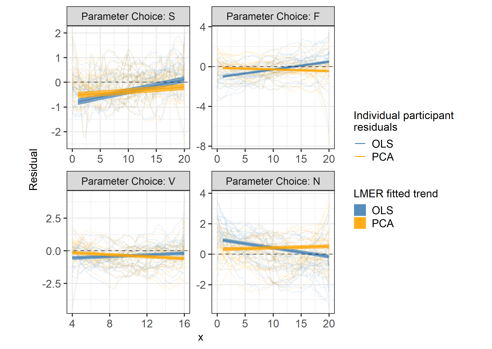

class:title-slide-custom

```{r, child = "style.Rmd"}
```


```{r setup, echo = FALSE, message = FALSE, warning = FALSE}

# Packages
library(emo)
library(purrr)
library(tidyverse)
library(gridExtra)
library(nullabor)
library(scales)
library(knitr)
library(kableExtra)
library(RefManageR)
library(iconr)
library(fontawesome)
# download_fontawesome()

# References
bib <- ReadBib("bib/bibliography.bib", check = FALSE)
ui <- "- "

# R markdown options
knitr::opts_chunk$set(echo = FALSE, 
                      message = FALSE, 
                      warning = FALSE, 
                      cache = FALSE,
                      dpi = 300)
options(htmltools.dir.version = FALSE)
options(knitr.kable.NA = '')
```

```{r, include = F, eval = T, cache = F}
clean_file_name <- function(x) {
  basename(x) %>% str_remove("\\..*?$") %>% str_remove_all("[^[A-z0-9_]]")
}
img_modal <- function(src, alt = "", id = clean_file_name(src), other = "") {
  
  other_arg <- paste0("'", as.character(other), "'") %>%
    paste(names(other), ., sep = "=") %>%
    paste(collapse = " ")
  
  js <- glue::glue("<script>
        /* Get the modal*/
          var modal{id} = document.getElementById('modal{id}');
        /* Get the image and insert it inside the modal - use its 'alt' text as a caption*/
          var img{id} = document.getElementById('img{id}');
          var modalImg{id} = document.getElementById('imgmodal{id}');
          var captionText{id} = document.getElementById('caption{id}');
          img{id}.onclick = function(){{
            modal{id}.style.display = 'block';
            modalImg{id}.src = this.src;
            captionText{id}.innerHTML = this.alt;
          }}
          /* When the user clicks on the modalImg, close it*/
          modalImg{id}.onclick = function() {{
            modal{id}.style.display = 'none';
          }}
</script>")
  
  html <- glue::glue(
     " <!-- Trigger the Modal -->

<!-- The Modal -->
<div id='modal{id}' class='modal'>
  <!-- Modal Content (The Image) -->
  
  <!-- Modal Caption (Image Text) -->
  <div id='caption{id}' class='modal-caption'></div>
</div>
"
  )
  write(js, file = "js-addins.html", append = T)
  return(html)
}
# Clean the file out at the start of the compilation
write("", file = "js-addins.html")
```

<br><br>
# Can 'You Draw It'? Eye Fitting Straight Lines in the Modern Era
## UNL Ph.D. Seminar
### October 15, 2021
#### Emily Robinson 
<!-- #### Department of Statistics, University of Nebraska - Lincoln -->
<!-- ##### `r fa("envelope", fill = "black")` [emily.robinson@huskers.unl.edu](emily.robinson@huskers.unl.edu) -->
<!-- ##### `r fa("home", fill = "black")` [www.emilyarobinson.com](https://www.emilyarobinson.com/) -->
<!-- ##### `r fa("github", fill = "black")` [earobinson95](https://github.com/earobinson95) -->


???

Thank you, everyone for coming! I am a PhD candidate in the Department of Statistics at the University of Nebraska - Lincoln. I will be presenting on human perception of statistical charts and giving an overview of current graphical testing methods then introduce the current research I am conducting in graphical testing. 

---
class:primary
# Introduction to Graphics

Data visualization is defined as the art of drawing **graphical charts** in order to display data `r Citep(bib[[c("unwin2020data")]])`.

**What are graphics useful for?** `r Citep(bib[[c("lewandowsky1989perception")]])`

`r emo::ji("graph")` Data cleaning.

`r emo::ji("magnifying")` Exploring data structure. 

`r emo::ji("bubble")` Communicating information.

**Who uses graphics?**
+ Governments `r Citep(bib[[c("harms1991august", "playfair1801statistical", "walker2013statistical")]])`.
+ Companies `r Citep(bib[[c("chandar2012graph", "yates1985graphs")]])`.
+ News sources and mass media `r Citep(bib[[c("Aisch_NYTimes_presidential_forecast")]])`.
+ Scientific publications `r Citep(bib[[c("gouretski2007much")]])`.

???
To get started, we are first going to lay the foundation of graphics. Data visualization has become central tool in modern data science and statistics. Unwin 2020 defines data visualization as the art of drawing graphical charts in order to display data.

Graphics are useful for data cleaning, exploring data structure, and communicating information.

In the 18th and 19th century, governments began using graphics to understand population and economic interests. In the 20th century, we saw companies using graphics to understand the inner workings of their business and support their business decision. We often see news source displaying graphics of weather forecasts such as hurricane trajectories. Today, we see graphics everywhere from scientific journals to mass media in the newspapers, TV, and internet.

Despite the popularity of graphics, we are too accepting of them as default without asking critical questions about the graphics we create or view (Unwin, 2020). We must begin asking ourselves **How effective is this graph at communicating useful information?**

Higher quality of technology has influenced the creation, replication, and complexity of graphics. We now have an infinitely many number design choices:
+ variables displayed, type of graphic, size of graphic, aspect ratio, colors, symbols, scales, limits, ordering of categorical variables

There is a need for an established set of concepts and terminology to build their graphics from so they can actively choose which of many possible graphics to draw in order to ensure their charts are effective at communicating the intended result.

---
class:primary
# Grammar of Graphics `r Citep(bib[[c("wilkinson2013grammar")]])`

Graphics are viewed as a mapping **from variables** in the data set **to visual attributes** on the chart.

.center[


Building a masterpiece, by Allison Horst
]

???

Graphics are viewed as a mapping **from variables** in the data set **to visual attributes** on the chart.

+ **aesthetics:** links between data variables and graphical features (position, color, shape, size)
+ **layers:** geometric elements (points, lines, rectangles, text, …)
+ **transformations:** transformations specify a functional link between the data and the displayed information (identity, count, bins, density, regression). Transformations act on the variables.
+ **scales:** scales map values in data space to values in the aesthetic space. Scales change the coordinate space of an aesthetic, but don’t change the underlying value (so the change is at the visual level, not the mathematical level).
+ **coordinate system:** e.g.polar or Cartesian
+ **faceting:** facets allow you to split plots by other variables to produce many sub-plots.
+ **theme:** formatting items, such as background color, fonts, margins…

Software, such as Hadley Wickham’s ggplot2, aims to implement the framework of creating charts and graphics as the grammar of graphics recommends.

---
class:primary
# Testing Statistical Graphics

Evaluate design choices and understand cognitive biases through the use of **visual tests**. 

Could ask participants to:

`r emo::ji("graph")` identify differences in graphs.

`r emo::ji("book")` read information off of a chart accurately. 

`r emo::ji("international")` use data to make correct real-world decisions.

`r emo::ji("pencil2")` predict the next few observations.

???
One way we can evaluate these design choices through the use of graphical tests. 

Could ask participants to:

- identify differences in graphs.
- read information off of a chart accurately.
- use data to make correct real-world decisions.
- predict the next few observations.

All of these types of tests require different levels of use and manipulation of the information presented in the chart.

---
class:inverse
<br>
<br>
<br>
<br>
<br>
<br>
<br>
.center[
# Lineup Protocol
<font size="6">
(Buja et. al, 2009)
</font>
]
???
Efforts in the field of graphics have developed graphical testing tools and methods such as the lineup protocol to provide a framework for inferential testing.

---
class:primary
# Introduction to Visual Inference
When doing exploratory data analysis, how do we know if what we see is actually there?

```{r, echo = F, fig.width = 6, fig.height = 9/2, out.width = "75%", fig.align='center'}
data(banknote, package = "mclust")
ggplot(banknote) + 
  geom_jitter(aes(x = Left, y = Right, color = Status)) + 
  coord_fixed() + 
  theme_bw() +
  theme(axis.text = element_blank()) +
  scale_color_manual(values = c("orange", "steelblue"))
```

???

When inspecting a plot, how do we know if what we are seeing is actually there?

---
class:primary
# Lineup Protocol (Buja et. al, 2009)

Embed a **target plot** (actual data) in a lineup of **null plots** (randomly permuted data sets).

```{r, echo = F, fig.width = 8, fig.height = 6, out.width = "75%", fig.align='center'}
library(nullabor)
lineup(null_permute("Status"), banknote, pos = 8) %>%
ggplot() + 
  geom_jitter(aes(x = Left, y = Right, color = Status), shape = 1) + 
  facet_wrap(~.sample) + 
  coord_fixed() + 
  theme_bw() +
  theme(axis.text = element_blank()) +
  scale_color_manual(values = c("orange", "steelblue"))
```

???

One way of answering this question is to embed the true data plot (called target plot) into a set of randomly permuted data sets (called null plots). This is what we call a lineup.

This is similar to the law-enforcement procedure to line up a suspect among a set of innocents to check if a victim can identify the suspect as the perpetrator of the crime.

Here, visual evaluation of the lineup is conducted by a person. If the viewers detect the target plot, we can conclude the plots are distinguishable.

The lineup protocol is one such example of the development of tools designed for statistical graphical testing. The advancement of graphing software provides the tools necessary to develop new methods of testing graphics.

---
class:primary
# Introduction to Visual Inference

.center[
 
]

???
The main idea behind visual inference is that graphs are visual statistics or summaries of the data sets generated by mathematical functions. In a standard statistical analysis, a test statistic is generated from the data set and compared to the null distribution of that test statistic. Similarly, the visual statistic (target plot) is compared by a human viewer to other plots generated under the assumption of the null.

The main benefit of using visual inference is that visual tests tend to be more comprehensive. Since individuals are being asked to select one or more plots from a the lineup which are different but the difference is left unspecified the individual eye is actually spotting many differences at once. An equivalent numerical assessment may involved multiple tests using different test statistics. 

---
class:primary
# Lineup Studies `r emo::ji("graph")` `r emo::ji("graph")` `r emo::ji("graph")`

+ [Statistical inference for exploratory data analysis and model diagnostics](https://scholar.google.com/scholar_url?url=https://royalsocietypublishing.org/doi/pdf/10.1098/rsta.2009.0120%3Fcasa_token%3DebiI2xSnDhwAAAAA:kWGCok2CLw5KQZ4_cYh_ymZwPpiJcXUc5TImyvwzBBn6C0jYtFgnYEOc0dR0kPvlajIvsuOULZpTia64&hl=en&sa=T&oi=gsb-gga&ct=res&cd=0&d=10347521957724374176&ei=W11jYaXsKYWM6rQPo_eDyAg&scisig=AAGBfm2AEQHjQU5lNQB4Lc4o81tg3SeWkQ) `r Citep(bib[[c("buja2009statistical")]])`
+ [Validation of Visual Statistical Inference, Applied to Linear Models](https://scholar.google.com/scholar_url?url=https://www.tandfonline.com/doi/pdf/10.1080/01621459.2013.808157%3Fcasa_token%3DGwA4wLBPDpsAAAAA:acfwFasv03i-MlmZ7cUcD9NYkjsk2hFroGKp4SbK1ZljNN6wVBUzJyhicqplDmhMmD4LURWeqS5qm_g&hl=en&sa=T&oi=gsb-gga&ct=res&cd=0&d=3201506009084463478&ei=a11jYe6GFJ2N6rQPrdWZ4A0&scisig=AAGBfm2pYvdJa0OVNuzPLcU7ceZxogmE8w) `r Citep(bib[[c("majumder2013validation")]])`
+ [Human Factors Influencing Visual Statistical Inference](https://scholar.google.com/scholar_url?url=https://www.tandfonline.com/doi/pdf/10.1080/01621459.2013.808157%3Fcasa_token%3Dy-x3yREurLYAAAAA:n2T18c7npd7rwui0SHzcmu2aa-zbeM66G7RWuPUgXG88nKzkqstOACzexskq0QhJ19yg8F2qky5w5NU&hl=en&sa=T&oi=gsb-gga&ct=res&cd=0&d=3201506009084463478&ei=gV1jYYt-gtDJBMHbsVg&scisig=AAGBfm2ZxHiHoOvYZQOJLkY9boUVKKUNvQ) `r Citep(bib[[c("majumder2014human")]])`
+ [Variations of *Q*–*Q* Plots: The Power of Our Eyes!](https://scholar.google.com/scholar_url?url=https://www.tandfonline.com/doi/pdf/10.1080/00031305.2015.1077728%3Fcasa_token%3DzQIJhjnFyLkAAAAA:tKCYURplVofdEuwasvxeS3UEVUMrTYsNKDhCQ2pBkkAhyXSI-Rv9vF00OqfRi5qPYwmqZBuTKjcSdO0&hl=en&sa=T&oi=gsb-gga&ct=res&cd=0&d=10678752834182219121&ei=kF1jYdL3L4i5yQTj8oqgCg&scisig=AAGBfm0_2MwYhtf65JQetFCfaf8pTBN_1Q) `r Citep(bib[[c("loy2016variations")]])`
+ [Spatial Reasoning and Data Displays](https://scholar.google.com/scholar_url?url=https://ieeexplore.ieee.org/iel7/2945/4359476/07217849.pdf%3Fcasa_token%3DXZQihG8m_RkAAAAA:twbOtOXzriTbFGFvUvrXE8dOirkb-g8boUHl-_BqoRvAfoh4pOFNPaTpWw4N-ILRlaJG8njCPf9u&hl=en&sa=T&oi=gsb-gga&ct=res&cd=0&d=1511166849179793238&ei=oF1jYY7gA5LSyQT4lJigBw&scisig=AAGBfm2lpsX7rCa8i1nFQqaMCQKkWxIqhg) `r Citep(bib[[c("vanderplas2015spatial")]])`
+ [Clusters beat trend!? testing feature hierarchy in statistical graphics](https://www.tandfonline.com/doi/full/10.1080/10618600.2016.1209116?casa_token=ZTotcyTpAekAAAAA:0ZJcegDldgPo53zNw5581EKGYr5b2mtUj393V7v4OjIjhiOPN9MuiRjPdVrBvYzAoCGX3fbSpAMt5Bw) `r Citep(bib[[c("vanderplas2017clusters")]])`
+ [Statistical Significance Calculations for Scenarios in Visual Inference](https://scholar.google.com/scholar_url?url=https://onlinelibrary.wiley.com/doi/pdf/10.1002/sta4.337%3Fcasa_token%3Dl3liRM4W_tcAAAAA:RM0pP8pMkbSvUvKjtCA3aQ3IBS1PfKUKyDrp62dikvMnSWdnVvWZkjqbUKVKt-uFaeZ4CLXhCnIisLhK&hl=en&sa=T&oi=gsb-gga&ct=res&cd=0&d=18231836572357450482&ei=v11jYaauD4i5yQTj8oqgCg&scisig=AAGBfm30K-gRzHdAIegMH0DH2gyiL4DfcA) `r Citep(bib[[c("vanderplas2021statistical")]])`

.pull-left[
+ **Dissertation work:** Perception of log scales
].pull-right[
```{r results='asis', echo = F, include = T, cache = F, eval = TRUE}
i1 <- img_modal(src = "images/linear-lineup-example.png", alt = "Linear Scale", other=list(width="40%"))
i2 <- img_modal(src = "images/log-lineup-example.png", alt = "Log Scale", other=list(width="40%"))

c(str_split(i1, "\\n", simplify = T)[1:2],
  str_split(i2, "\\n", simplify = T)[1:2],
  str_split(i1, "\\n", simplify = T)[3:9],
  str_split(i2, "\\n", simplify = T)[3:9]
  ) %>% paste(collapse = "\n") %>% cat()
```
]

???
**Clusters beat trend!? testing feature hierarchy in statistical graphics** `r Citep(bib[[c("vanderplas2017clusters")]])`
+ Introduces perceptual principles such as preattentive features and gestalt heuristics
+ Discusses the design and results of a factorial experiment examining the effect of plot aesthetics such as color and trend lines on participants’ assessment of ambiguous data displays.
+ Strongly suggests that plot aesthetics have a significant impact on the perception of important features in data displays.

As part of my dissertation work, I have conducted a study examining human perception of logarithmic scales. Here we see an example of the first part of the study utilizing lineups to test our ability to perceptually differentiate between two exponentially increasing trends shown on both the linear and log scale. Notice how it is much easier to pick out panel 13 as being most different when displayed on the log scale than on the linear scale.

---
class:inverse
<br>
<br>
<br>
<br>
<br>
<br>
<br>
.center[
# 'You Draw It'
]

---
class:primary
# Linear Regression 

The principle of simple linear regression is to find the line (i.e., determine its equation) which passes as close as possible to the observations, that is, the set of points.

```{r linear-regression, echo = F, fig.width = 6, fig.height = 9/2, out.width = "70%", fig.align='center'}
library(ggplot2)
library(magrittr)
library(plyr)

set.seed(2)
corrCoef = 0.5 # sample from a multivariate normal, 10 datapoints
dat = MASS::mvrnorm(10,c(0,0),Sigma = matrix(c(1,corrCoef,2,corrCoef),2,2))
dat[,1] = dat[,1] - mean(dat[,1]) # it makes life easier for the princomp
dat[,2] = dat[,2] - mean(dat[,2])

dat = data.frame(x1 = dat[,1],x2 = dat[,2])

dat %>%
ggplot(aes(x1,x2))+
  geom_point()+
  coord_equal()+
  scale_x_continuous("x") +
  scale_y_continuous("y") +
  theme_bw(base_size = 14) +
  theme(aspect.ratio = 1,
        legend.position = "none",
        axis.text    = element_text(size = 12),
        axis.title   = element_text(size = 12),
        legend.title = element_blank(),
        legend.key.size = unit(1, "line")
        )
```

???
Linear regression is a statistical approach that allows to assess the linear relationship between two quantitative variables. 

---
class:primary
# Linear Regression

The principle of simple linear regression is to **find the line** (i.e., determine its equation) which passes as close as possible to the observations, that is, the set of points.

```{r linear-regression2, echo=F, fig.align='center', fig.height=9/2, fig.width=6, message=FALSE, warning=FALSE, out.width="70%"}
dat %>%
ggplot(aes(x1,x2))+
  geom_point()+
  geom_abline(intercept = -0.1, slope = 0.8, color = "black", linetype = "solid") +
  geom_abline(intercept = 0, slope = 0.4, color = "black", linetype = "solid") +
  geom_abline(intercept = -0.2, slope = 1.1, color = "black", linetype = "solid") +
  coord_equal()+
  scale_x_continuous("x") +
  scale_y_continuous("y") +
  theme_bw(base_size = 14) +
  theme(aspect.ratio = 1,
        legend.position = "none",
        axis.text    = element_text(size = 12),
        axis.title   = element_text(size = 12),
        legend.title = element_blank(),
        legend.key.size = unit(1, "line")
        )
```

???

The principle of simple linear regression is to **find the line** (i.e., determine its equation) which passes as close as possible to the observations, that is, the set of points.

---
class:primary
# Let's see your drawing skills!

.pull-left[
.center[

]
].pull-right[
.center[

<font size="6">
**SCAN ME**

OR VISIT [bit.ly/3BF56Zj](https://bit.ly/3BF56Zj)
</font>
]
<!-- <a rel='nofollow' href='https://www.qr-code-generator.com' border='0' style='cursor:default'></a> -->
]

---
class:primary
# Did it looks something like this?
.center[

]

---
class:primary
# Linear Regression

The principle of simple linear regression is to **find the line** (i.e., determine its equation) **which passes as close as possible to the observations**, that is, the set of points.

.center[

]

--

**Big Idea:** How do statistical regression results compare to intuitive, visually fitted results?

???
We are going to focus on two regression lines determined by ordinary least squares regression and regression based on the principal axis. The figure illustrates the difference between an OLS regression line which minimizes the vertical distance of points from the line and a regression line based on the principal axis (Principal Component) which minimizes the Euclidean distance of points (orthogonal) from the line. This is what we refer to as “ensemble perception” indicating the visual system can compute averages of various features in parallel across the items in a set (in this case, over the x and y-axes).

**Big Idea:** How do statistical regression results compare to intuitive, visually fitted results?

---
class:primary
# Eye Fitting Straight Lines
## `r Citet(bib[[c("mosteller1981eye")]])`
.pull-left[
+ **Big Idea:** Students fitted lines by eye to four sets of points.
+ **Method:** 8.5 x 11 inch transparency with a straight line etched across the middle.
+ **Sample:** 153 graduate students and post docs in Introductory Biostatistics.
+ **Experimental Design:** Latin square.
+ **Findings:** Students tended to fit the slope of the first principal component.
].pull-right[

]

???

I want to introduce a study conducted in 1981 called Eye Fitting Straight Lines by Mosteller et al. In this study:

+ Students fitted lines by eye to four sets of points.
+ 8.5 x 11 inch transparency with a straight line etched across the middle.
+ 153 graduate students and post docs in Introductory Biostatistics.
+ Latin square.
+ Students tended to fit the slope of the first principal component or major axis (the line that minimizes the sum of squares of perpendicular rather than vertical distances).

---
class:primary
# 'You Draw It' Feature 
## (New York Times, 2015)
.pull-left[

.center[
`r Citep(bib[[c("katz_2017")]])`
]
].pull-right[

Readers are asked to input their own assumptions about various metrics and compare how these assumptions relate to reality.

+ [Family Income affects college chances](https://www.nytimes.com/interactive/2015/05/28/upshot/you-draw-it-how-family-income-affects-childrens-college-chances.html) `r Citep(bib[[c("aisch_cox_quealy_2015")]])`
+ [Just How Bad Is the Drug Overdose Epidemic?](https://www.nytimes.com/interactive/2017/04/14/upshot/drug-overdose-epidemic-you-draw-it.html) `r Citep(bib[[c("katz_2017")]])`
+ [What Got Better or Worse During Obama’s Presidency](https://www.nytimes.com/interactive/2017/01/15/us/politics/you-draw-obama-legacy.html?_r=0) `r Citep(bib[[c("buchanan_park_pearce_2017")]])`
]

???

In 2015, the New York Times developed a You Draw it feature where readers are asked to input their own assumptions about various metrics and compare how these assumptions relate to reality.

The New York Times team utilizes **Data Driven Documents (D3)** that allows readers to predict these metrics through the use of drawing a line on their computer screen with their mouse.

---
class:primary
# Research Objectives 

1. Validate ‘You Draw It’ as a method for graphical testing, comparing results to the less technological method utilized in Mosteller et al. (1981). 

2. Extend the study with formal statistical analysis methods in order to better understand the perception of linear regression.

???

The two objectives of my current research are to:

1. Validate ‘You Draw It’ as a method for graphical testing, comparing results to the less technological method utilized in Mosteller et al. (1981). 

2. Extend the study with formal statistical analysis methods in order to better understand the perception of linear regression.

---
class:primary
# 'You Draw It' Task

Study Participant Prompt: *Use your mouse to fill in the trend in the yellow box region.*

.center[

]

???

Here we see an example of a "You Draw It" task plot used in the study. Participants are prompted to "Use your mouse to fill in the trend in the yellow box region. The yellow box region moves along as the participant draws their trend-line until the yellow region disappears." 

Task plots were created using Data Driven Documents (D3), a JavaScript-based graphing framework that facilitates user interaction. We then integrate this into RShiny using the r2d3 package.

---
class:primary
# Data Generation

.pull-left[

$N = 30$ points $(x_i, y_i), i = 1,...N$ were generated for $x_i \in [x_{min}, x_{max}]$.

Data were simulated based on linear model with additive errors:
\begin{equation}
y_i = \beta_0 + \beta_1 x_i + e_i
\end{equation}

where $e_i \sim N(0, \sigma^2).$

Parameters $\beta_0$ and $\beta_1$ were selected to reflect the four data sets used in `r Citet(bib[[c("mosteller1981eye")]])`.

].pull-right[
```{r results='asis', echo = F, include = T, cache = F, eval = TRUE}
i1 <- img_modal(src = "images/eyefitting-example-simplot.png", alt = " ", other=list(width="100%"))

c(str_split(i1, "\\n", simplify = T)[1:2],
  str_split(i1, "\\n", simplify = T)[3:9]
  ) %>% paste(collapse = "\n") %>% cat()
```
]

???

Data were generated following a linear model with additive errors. 

Model equation parameters, $\beta_0$ and $\beta_1$, were selected to reflect the four data sets (F, N, S, and V) used in Mosteller et al. (1981). 

+ **S:** positive slope; small variance; $x \in [0, 20]$. 
+ **F:** positive slope; a large variance; $x \in [0, 20]$.  
+ **V:** steep positive slope; small variance; $x \in [4, 16]$. 
+ **N:** negative slope; large variance; $x \in [0, 20]$. 

---
class:primary
# Study Design

+ Participants recruited through Twitter, Reddit, and direct email in May 2021.

+ A total of 35 individuals completed 119 unique you draw it task plots.

+ Data sets were generated randomly, independently for each participant at the start of the experiment. 

+ Participants shown 2 practice plots followed by 4 task plots randomly assigned for each individual in a completely randomized design.

+ Experiment conducted and distributed through an RShiny application found [**here**](https://emily-robinson.shinyapps.io/you-draw-it-pilot-app/).

???
Participants were recruited through through Twitter, Reddit, and direct email in May 2021. The experiment was conducted and distributed through an RShiny application. Participants were first shown 2 practice plots followed by the 4 You Draw It task plots randomly assigned for each individual in a completely randomized design.

---
class:primary
# Model Data
 
.pull-left[
For each participant, the final data set used for analysis contains:
+ $x_{ijk}$, $y_{ijk,drawn}$, $\hat y_{ijk,OLS}$, $\hat y_{ijk,PCA}$

for 
+ parameter choice $i = 1,2,3,4$, 
+ participant j = $1,...N_{participant}$ 
+ $x_{ijk}$ value corresponding to increment $k = 1, ...,4 x_{max} + 1$.

**Vertical residuals** between the drawn and fitted values were calculated as: 
+ $e_{ijk,OLS} = y_{ijk,drawn} - \hat y_{ijk,OLS}$
+ $e_{ijk,PCA} = y_{ijk,drawn} - \hat y_{ijk,PCA}$.

].pull-right[ 

```{r results='asis', echo = F, include = T, cache = F, eval = TRUE}
i1 <- img_modal(src = "images/eyefitting-trial-plot.png", alt = " ", other=list(width="100%"))

c(str_split(i1, "\\n", simplify = T)[1:2],
  str_split(i1, "\\n", simplify = T)[3:9]
  ) %>% paste(collapse = "\n") %>% cat()
```
]

???
We compare the participant drawn line to two regression lines determined by ordinary least squares regression and regression based on the principal axis. The figure illustrates the difference between an OLS regression line which minimizes the vertical distance of points from the line and a regression line based on the principal axis (Principal Component) which minimizes the Euclidean distance of points (orthogonal) from the line.

Here we see an example of the feedback data from one you draw it plot. For 0.25 increments across the domain, we have the participant drawn values, the fitted values from the ordinary least squares regression, and the fitted values from the regression based on the principal axis. 

We are mainly interested in the deviation of the participant drawn line from the fitted regression lines. So while it seems counter-intuitive, the residual actually becomes our response in this case.

---
class:primary
# Linear Trend Constraint
The **Linear Mixed Model** equation for each fit (OLS and PCA) residuals is given by:
\begin{equation}
e_{ijk,fit} = \left[\gamma_0 + \alpha_i\right] + \left[\gamma_{1} x_{ijk} + \gamma_{2i} x_{ijk}\right] + p_{j} + \epsilon_{ijk}
\end{equation}
where

+ $e_{ijk,fit}$ is the residual between the drawn and fitted y-values for the $i^{th}$ parameter choice, $j^{th}$ participant, and $k^{th}$ increment of x-value corresponding to either the OLS or PCA fit
+ $\gamma_0$ is the overall intercept
+ $\alpha_i$ is the effect of the $i^{th}$ parameter choice (F, S, V, N) on the intercept
+ $\gamma_1$ is the overall slope for $x$
+ $\gamma_{2i}$ is the effect of the parameter choice on the slope
+ $x_{ijk}$ is the x-value for the $i^{th}$ parameter choice, $j^{th}$ participant, and $k^{th}$ increment
+ $p_{j} \sim N(0, \sigma^2_{participant})$ is the random error due to the $j^{th}$ participant's characteristics
+ $\epsilon_{ijk} \sim N(0, \sigma^2)$ is the residual error.

???

Using the `lmer` function in the lme4 package, a linear mixed model (LMM) is fit separately to the OLS and PCA residuals, constraining the fit to a linear trend. 

---
class:primary
# Linear Trend Constraint

.center[

]

???
Results indicate the estimated trends of PCA residuals (orange) appear to align closer to the y = 0 horizontal (dashed) line than the OLS residuals (blue). In particular, this trend is more prominent in parameter choices with large variances (F and N). These results are consistent to those found in Mosteller
et al. (1981) indicating participants fit a trend-line closer to the estimated regression line with the slope of based on the first principal axis than the estimated OLS regression line.

---
class:primary
# Smoothing Spline Trend
The **Generalized Additive Mixed Model** equation for each fit (OLS and PCA) residuals is given by: 
\begin{equation}
e_{ijk,fit} = \alpha_i + s_{i}(x_{ijk}) + p_{j} + s_{j}(x_{ijk})
\end{equation}
where 

+ $e_{ijk,fit}$ is the residual between the drawn and fitted y-values for the $i^{th}$ parameter choice, $j^{th}$ participant, and $k^{th}$ increment of x-value corresponding to either the OLS or PCA fit
+ $\alpha_i$ is the intercept for the parameter choice $i$
+ $s_{i}$ is the smoothing spline for the $i^{th}$ parameter choice
+ $x_{ijk}$ is the x-value for the $i^{th}$ parameter choice, $j^{th}$ participant, and $k^{th}$ increment
+ $p_{j} \sim N(0, \sigma^2_{participant})$ is the error due to participant variation
+ $s_{j}$ is the random smoothing spline for each participant.

???

Eliminating the linear trend constraint, the `bam` function in the mgcv package is used to fit a generalized additive mixed model (GAMM) separately to the OLS and PCA residuals to allow for estimation of smoothing splines.

---
class:primary
# Smoothing Spline Trend

.center[

]

???
The results of the GAMM align with those in the linear constraint trend providing support that for scatter-plots with more noise (F and N), estimated trends of PCA residuals (orange) appear to align closer to the y = 0 horizontal (dashed) line than the OLS residuals (blue). However, By fitting smoothing splines, we can determine whether participants naturally fit a straight trend-line to the set of points or whether they deviate throughout the domain providing us with further insight into the curvature humans perceive in a set of points.

---
class:primary
# Conclusion

**Research Objectives:** 

1. Validate ‘You Draw It’ as a method for graphical testing, comparing results to the less technological method utilized in Mosteller et al. (1981). 
2. Extend the study found in Mosteller et al. (1981) with formal statistical analysis methods for understanding the perception of linear regression.

**Results:**
+ Estimated drawn trend-lines followed closer to the regression line based on the principal axes than the OLS regression line.
+ Most prominent in data simulated with large variances.
+ Humans perform “ensemble perception” in a statistical graphic setting.

**The reproducibility of these results serve as validation of the 'You Draw It' tool and method.**

???


1. Validate ‘You Draw It’ as a method for graphical testing, comparing results to the less technological method utilized in Mosteller et al. (1981). 

2. Extend the study found in Mosteller et al. (1981) with formal statistical analysis methods for understanding the perception of linear regression.

**Results:**
+ Estimated drawn trend-lines followed closer to the principal axes than the OLS regression line.
+ Most prominent in data simulated with large variances.
+ Humans perform “ensemble perception” in a statistical graphic setting as participants minimized the distance from the their regression line over both the x and y axis simultaneously

This study reinforces the differences between intuitive visual model fitting and statistical model fitting, providing information about human perception as it relates to the use of statistical graphics.

**The reproducibility of these results serve as validation of the 'You Draw It' tool and method.**


---
class:primary
# Future Work

.center[

]

`r emo::ji("pencil2")` Implement the 'You Draw It' method in non-linear settings.

`r emo::ji("chart increasing")` Evaluate human ability to extrapolate data from trends.

`r fa("cloud-showers-heavy", fill = "gray")` Use the tool to understand beliefs of real data such as climate change trends. 

`r fa("r-project", fill = "steelblue")` Develop an R package designed for easy implementation of ‘You Draw It’ task plots.

<br>

.right-col[
Gif Source: [photobucket.com](http://s280.photobucket.com/user/ariffisariff/media/animated-loading.gif.html)
]

???
`r emo::ji("pencil2")` Implement the 'You Draw It' method in non-linear settings.

`r emo::ji("chart increasing")` Evaluate human ability to extrapolate data from trends.

`r fa("cloud-showers-heavy", fill = "gray")` Use the tool to understand beliefs of real data such as climate change trends. 

`r fa("r-project", fill = "steelblue")` Develop an R package designed for easy implementation of ‘You Draw It’ task plots.

---
class:primary
# Future Work

.center[

]

`r emo::ji("pencil2")` **Implement the 'You Draw It' method in non-linear settings.**

`r emo::ji("chart increasing")` **Evaluate human ability to extrapolate data from trends.**

`r fa("cloud-showers-heavy", fill = "gray")` Use the tool to understand beliefs of real data such as climate change trends. 

`r fa("r-project", fill = "steelblue")` Develop an R package designed for easy implementation of ‘You Draw It’ task plots.

<br>

.right-col[
Gif Source: [photobucket.com](http://s280.photobucket.com/user/ariffisariff/media/animated-loading.gif.html)
]

???
`r emo::ji("pencil2")` **Implement the 'You Draw It' method in non-linear settings.**

`r emo::ji("chart increasing")` **Evaluate human ability to extrapolate data from trends.**

`r fa("cloud-showers-heavy", fill = "gray")` Use the tool to understand beliefs of real data such as climate change trends. 

`r fa("r-project", fill = "steelblue")` Develop an R package designed for easy implementation of ‘You Draw It’ task plots.

---
class:inverse
<br>
<br>
<br>
<br>
<br>
<br>
<br>
.center[
# Prediction of exponential growth with 'You Draw It'.
]

---
class:primary
# Logarithmic Scales

.center[
```{r results='asis', echo = F, include = T, cache = F, eval = TRUE}
i1 <- img_modal(src = "images/log-scale-example.jpg", alt = " ", other=list(width="60%"))

c(str_split(i1, "\\n", simplify = T)[1:2],
  str_split(i1, "\\n", simplify = T)[3:9]
  ) %>% paste(collapse = "\n") %>% cat()
```
]

Our perception is **logarithmic at first**, but transitions to a **linear scale later** in development.

.center[

]

???

One problem we face is when data spans several orders of magnitude shown on its original scale compresses the smaller magnitudes into relatively little area. We can address this problem through the use of a log scale transformation; however, this alters the contextual appearance of the data.

In fact, past research has found that our perception is **logarithmic at first**, but transitions to a **linear scale later** in development. For example, a kindergartner asked to place numbers one through ten along a number line would place three close to the middle, following the logarithmic perspective. We have all experienced this when making a poster where we misjudged the space needed and end up compressing the last few letters onto the poster board.

Therefore, if we perceive logarithmically by default, it is a natural (and presumably low effort) way to display information and should be easy to read and understand/use.

---
class:primary
# Research Objectives

**Big Idea:** Are there benefits to displaying exponentially increasing data on a log scale rather than a linear scale?

1. [Perception of Exponential Growth](https://shiny.srvanderplas.com/log-study/) `r emo::ji("chart increasing")` `r emo::ji("chart increasing")` `r emo::ji("chart increasing")`

    - Test an individuals ability to perceptually differentiate exponentially increasing data with differing rates of change on both the linear and log scale.
    
2. [**Prediction of Exponential Trends**](https://shiny.srvanderplas.com/you-draw-it/) `r emo::ji("pencil2")`
    
    - **Tests an individuals ability to make predictions for exponentially increasing data.**
        
3. Estimation by Numerical Translation `r emo::ji("straight_ruler")`

    - Tests an individuals ability to translate a graph of exponentially increasing data into real value quantities.

???

One way to evaluate design choices is through the use of graphical tests. We could ask participants to identify differences in graphs, read information off of a chart accurately, use data to make correct real-world decisions, or predict the next few observations. All of these types of tests require different levels of use and manipulation of the information presented in the chart.

The main goal of this research is to use graphical tests to determine if there are benefits to displaying exponentially increasing data on a log scale rather than a linear scale. We have developed three graphical tests which address the perception of exponential growth, prediction of exponential growth, and translation from graphical to numerical estimation. 
    

---
class:primary 
# Data Simulation

**Point data:** $N = 30$ points $(x_i, y_i), i = 1,...N$ were generated for $x_i \in [x_{min}, x_{max}]$.

Data were simulated based on a one parameter exponential model with multiplicative errors:
\begin{equation}
y_i = e^{\beta x_i + e_i}
\end{equation}

for 

+ growth rate $\beta$
+ $e_i \sim N(0, \sigma^2)$ generated by rejection sampling.

**Line data:** $m = 1,....4x_{max} + 1$ fitted values in 0.25 increments across the domain, $(x_m, \hat y_{m,NLS})$

A nonlinear least squares regression is then fit to the simulated points:
\begin{equation}
\hat y_{m,NLS} = e^{\hat \beta_{NLS} x_m}
\end{equation}

???

+ $e_i \sim N(0, \sigma^2)$ are generated by rejection sampling in order to guarantee the points shown align with that of the fitted line displayed in the initial plot frame.

Outputs a list of point data and line data both indicating the parameter identification, x-value, and corresponding simulated or fitted y value.

---
class:primary 
# Treatment Design

.pull-left[
2 x 2 x 2 factorial:
+ **growth rate:** low and high.
+ **points truncated:** $50\%$ and $75\%$ of the domain.
+ **scale:** log and linear.

Consistent aesthetic design choices:
+ y-axis extended $50\%$ below and $200\%$ above the simulated data range.
+ participants begin drawing at $50\%$ of the domain.

].pull-right[
.center[
```{r results='asis', echo = F, include = T, cache = F, eval = TRUE}
i1 <- img_modal(src = "images/low-10-linear.png", alt = "Low Growth Rate, 50% Truncation, Linear Scale", other=list(width="30%"))
i2 <- img_modal(src = "images/low-10-log.png", alt = "Low Growth Rate, 50% Truncation, Log Scale", other=list(width="30%"))

c(str_split(i1, "\\n", simplify = T)[1:2],
  str_split(i2, "\\n", simplify = T)[1:2],
  str_split(i1, "\\n", simplify = T)[3:9],
  str_split(i2, "\\n", simplify = T)[3:9]
  ) %>% paste(collapse = "\n") %>% cat()
```

```{r results='asis', echo = F, include = T, cache = F, eval = TRUE}
i1 <- img_modal(src = "images/low-15-linear.png", alt = "Low Growth Rate, 75% Truncation, Linear Scale", other=list(width="30%"))
i2 <- img_modal(src = "images/low-15-log.png", alt = "Low Growth Rate, 75% Truncation, Log Scale", other=list(width="30%"))

c(str_split(i1, "\\n", simplify = T)[1:2],
  str_split(i2, "\\n", simplify = T)[1:2],
  str_split(i1, "\\n", simplify = T)[3:9],
  str_split(i2, "\\n", simplify = T)[3:9]
  ) %>% paste(collapse = "\n") %>% cat()
```

```{r results='asis', echo = F, include = T, cache = F, eval = TRUE}
i1 <- img_modal(src = "images/high-10-linear.png", alt = "High Growth Rate, 50% Truncation, Linear Scale", other=list(width="30%"))
i2 <- img_modal(src = "images/high-10-log.png", alt = "High Growth Rate, 50% Truncation, Log Scale", other=list(width="30%"))

c(str_split(i1, "\\n", simplify = T)[1:2],
  str_split(i2, "\\n", simplify = T)[1:2],
  str_split(i1, "\\n", simplify = T)[3:9],
  str_split(i2, "\\n", simplify = T)[3:9]
  ) %>% paste(collapse = "\n") %>% cat()
```

```{r results='asis', echo = F, include = T, cache = F, eval = TRUE}
i1 <- img_modal(src = "images/high-15-linear.png", alt = "High Growth Rate, 75% Truncation, Linear Scale", other=list(width="30%"))
i2 <- img_modal(src = "images/high-15-log.png", alt = "High Growth Rate, 75% Truncation, Log Scale", other=list(width="30%"))

c(str_split(i1, "\\n", simplify = T)[1:2],
  str_split(i2, "\\n", simplify = T)[1:2],
  str_split(i1, "\\n", simplify = T)[3:9],
  str_split(i2, "\\n", simplify = T)[3:9]
  ) %>% paste(collapse = "\n") %>% cat()
```
]]

---
class:primary 
# Feedback Data

.pull-left[
For each participant, the final data set used for analysis contains:
+ $x_{ijklm}$, $y_{ijklm,drawn}$, and $\hat y_{ijklm,NLS}$  

for:
+ growth rate $i = 1,2$,
+ point truncation $j = 1,2$,
+ scale $k = 1,2$,
+ participant  $l = 1,...N_{participant}$, and 
+ $x_{ijklm}$ value $m = 1, ...,4 x_{max} + 1$.

Vertical residuals between the drawn and fitted values were calculated as: 
+ $e_{ijklm,NLS} = y_{ijklm,drawn} - \hat y_{ijklm,NLS}$.

].pull-right[
```{r results='asis', echo = F, include = T, cache = F, eval = TRUE}
i1 <- img_modal(src = "images/exp-spaghetti-plot.png", alt = " ", other=list(width="100%"))

c(str_split(i1, "\\n", simplify = T)[1:2],
  str_split(i1, "\\n", simplify = T)[3:9]
  ) %>% paste(collapse = "\n") %>% cat()
```
]

---
class:primary 
# Generalized Additive Mixed Model

The GAMM equation for residuals is given by:
\begin{equation}
e_{ijklm,nls} = \tau_{ijk} + s_{ijk}(x_{ijklm}) + p_{l} + s_{l}(x_{ijklm})
\end{equation}

where

+ $e_{ijklm,NLS}$ is the residual between the drawn y-value and fitted y-value for the $l^{th}$ participant, $m^{th}$ increment, and $ijk^{th}$ treatment combination 
+ $\tau_{ijk}$ is the intercept for the $i^{th}$ growth rate, $j^{th}$ point truncation, and $k^{th}$ scale treatment combination
+ $s_{ijk}$ is the smoothing spline for the $ijk^{th}$ treatment combination
+ $x_{ijklm}$ is the x-value for the $l^{th}$ participant, $m^{th}$ increment, and $ijk^{th}$ treatment combination 
+ $p_{l} \sim N(0, \sigma^2_{participant})$ is the error due to the $l^{th}$ participant's characteristics 
+ $s_{l}$ is the random smoothing spline for the $l^{th}$ participant.

???

Allowing for flexibility, the bam function in the mgcv package is used to fit a GAMM to estimate trends of vertical residuals from the participant drawn line in relation to the NLS fitted values.

---
class:primary 
# GAMM Residual Trend Results
.center[

]

???
Predictions made on the **linear scale** (blue) deviate from the  $y=0$ horizontal (dashed) line $\implies$ **underestimation** of exponential growth.

Predictions made on the **log scale** (orange) follow closely to the $y=0$ horizontal (dashed) line $\implies$ **more accurate** than trends predicted on the linear scale.

More prominent in high exponential growth rates.

Underestimation begins after the aid of points is removed.

???
Indicated by the discrepancy in results for treatments with points truncated at $50\%$ compared to $75\%$ of the domain. 

---
class:primary 
# Conclusion

**Goal:** Test an individual's ability to make predictions for exponentially increasing data.

**Results:**
+ Predictions made on the log scale were more accurate than those made on the linear scale. 
+ Strongly supported for high exponential growth rates.
+ Points shown along the trend improve predictions.

**The results of this study suggest that there are cognitive advantages to log scales when making predictions of exponential trends.**

---
class:primary
# References
<font size="2">
```{r, print_refs1, results='asis', echo=FALSE, warning=FALSE, message=FALSE}
print(bib[[c("aisch_cox_quealy_2015",
"Aisch_NYTimes_presidential_forecast",
"buchanan_park_pearce_2017",
"buja2009statistical",
"carpenter1998model",
"chandar2012graph",
"chong2003representation",
"chong2005statistical",
"ciccione2021can",
"cleveland1984graphical")]], 
      .opts = list(check.entries = FALSE, style = "html", bib.style = "authoryear")
      )
```
</font>

---
class:primary
# References
<font size="2">
```{r, print_refs2, results='asis', echo=FALSE, warning=FALSE, message=FALSE}
print(bib[[c("cleveland1985graphical",
"finney1951subjective",
"gouretski2007much",
"green2009personal",
"harms1991august",
"hofmann2012graphical",
"katz_2017",
"lewandowsky1989perception",
"mosteller1981eye",
"playfair1801statistical")]], 
      .opts = list(check.entries = FALSE, style = "html", bib.style = "authoryear")
      )
```
</font>

---
class:primary
# References
<font size="2">
```{r, print_refs3, results='asis', echo=FALSE, warning=FALSE, message=FALSE}
print(bib[[c("spence1990visual",
"unwin2020data",
"van2011rapid",
"vanderplas2015spatial",
"vanderplas2017clusters",
"vanderplas2020testing",
"walker2013statistical",
"wickham2011ggplot2",
"wilkinson2013grammar",
"yates1985graphs")]], 
      .opts = list(check.entries = FALSE, style = "html", bib.style = "authoryear")
      )
```
</font>


---
class:inverse
<br>
<br>
<br>
<br>
<br>
<br>
.center[
# Thank you!
<br
<br>
<!-- `r fa("envelope", fill = "white")` **emily.robinson@huskers.unl.edu** -->
<!-- `r fa("home", fill = "white")` **www.emilyarobinson.com** -->
`r fa("github", fill = "white")` **earobinson95**
]
